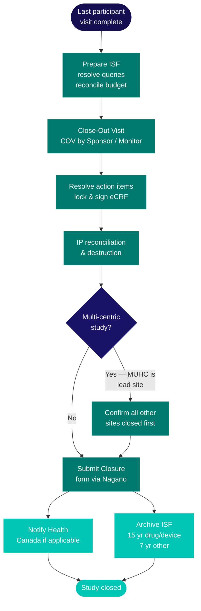
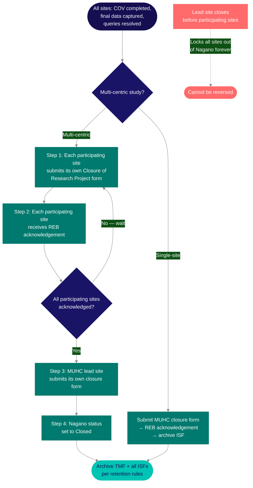

Close-out is not the end of a study's regulatory life — it is the beginning of a 15-year accountability phase. A study is not closed until a defined set of conditions are all met, and a <Tooltip tip="The RI-MUHC's electronic study submission and management platform. All studies requiring MUHC Authorization are submitted through Nagano." headline="Nagano (RI-MUHC)" cta="Full definition" href="/kb/glossary#nagano">Nagano</Tooltip> submission reflects that fact.

## Preparing for the close-out visit

Close-out is a sequence, not a single event. Starting preparation early — well before the last participant visit — means close-out happens smoothly rather than becoming a months-long reconciliation exercise.

Before the Sponsor or Monitor conducts the **<Tooltip tip="Final monitoring visit to verify all study closure requirements have been addressed before database lock." headline="Close-Out Visit (COV)" cta="Full definition" href="/kb/glossary#cov">Close-Out Visit</Tooltip> (COV)**, your site must be ready on all of the following:

- **<Tooltip tip="The QI's collection of documentation demonstrating compliance, study integrity, and participant safety." headline="Investigator Site File (ISF)" cta="Full definition" href="/kb/glossary#isf">ISF</Tooltip> completeness** — review the ISF and resolve or document any outstanding items
- **<Tooltip tip="Document designed to record all protocol-required information to be reported to the sponsor for each participant." headline="Case Report Form (CRF)" cta="Full definition" href="/kb/glossary#crf">CRF</Tooltip> and source data consistency** — all CRFs must be complete and consistent with source documents
- **Monitoring correspondence** — all monitoring follow-up letters must be on file, initialled and dated by the <Tooltip tip="The physician responsible to the sponsor for the conduct of a clinical trial at the site. One QI per study per Canadian site." headline="Qualified Investigator (QI)" cta="Full definition" href="/kb/glossary#qi">QI</Tooltip>/PI
- **Outstanding queries** — data queries from previous monitoring visits must be resolved
- **Budget** — the study budget must be reconciled and any outstanding participant payments made
- **Departmental notification** — pharmacy, laboratory, diagnostic imaging, and any other units involved in study procedures must be notified that close-out is approaching so they can prepare their own reconciliation steps

<Warning>
The <Tooltip tip="Lists each team member, their qualifications, and specific trial tasks authorized by the QI." headline="Task Delegation Log (TDL)" cta="Full definition" href="/kb/glossary#tdl">Task Delegation Log</Tooltip> must be updated with end dates for all team members except the QI/PI and the <Tooltip tip="The team member who handles day-to-day administration and coordination of the clinical trial." headline="Clinical Research Coordinator (CRC)" cta="Full definition" href="/kb/glossary#crc">CRC</Tooltip> who will remain available for post-closure queries. The QI/PI signs the TDL to formally undelegate team members. The TDL must be complete before the Nagano Closure of Research Project form can be submitted.
</Warning>

## The close-out visit

The COV is conducted by the Sponsor, Sponsor-Investigator, or Monitor. During the visit, the monitor verifies:

- All AEs and SAEs are documented and reported correctly
- CRFs are consistent with source data
- All corrections to source documents and CRFs are properly dated and initialled
- <Tooltip tip="A drug, medical device, or natural health product being tested or used as a reference in a clinical trial." headline="Investigational Product (IP)" cta="Full definition" href="/kb/glossary#ip">IP</Tooltip> accountability is complete
- All documents requiring QI/PI oversight are signed and dated

Any final data queries are resolved during or immediately after the visit. Once all queries are resolved and finalized, the eCRF is locked and signed by the QI/PI — this is the formal data freeze.

After the COV, the Monitor sends a COV Notification and COV Report to your site. You review these, initial any required acknowledgements, file them in the ISF, and respond to any remaining action items. A copy of the COV report is retained in the site ISF, and the original goes to the Sponsor for the <Tooltip tip="The sponsor's collection of documentation demonstrating compliance across all study sites." headline="Trial Master File (TMF)" cta="Full definition" href="/kb/glossary#tmf">TMF</Tooltip>.

<Note>
For Sponsor-Investigator studies, refer to the COV Monitoring Report template in [SOP-CR-013](/sops/cr-013) Appendix 7. The COV Notification to Sites template is also in [SOP-CR-013](/sops/cr-013).
</Note>

## Supply reconciliation and archiving

After the COV, all study-related supplies are returned or destroyed. Every unit of investigational product — received, dispensed, returned, quarantined, and destroyed — must be fully accounted for in the accountability log. The MUHC Research Pharmacy handles IP destruction and provides documentation. Randomization codes, unused CRFs, equipment, and biological specimens are returned to the Sponsor or Sponsor-Investigator per the protocol or written instructions.

The ISF is then prepared for archiving. Archiving typically occurs after database lock. Before transferring to the archiving service, review the ISF one final time for completeness and confirm the archive location — typically Iron Mountain for long-term retention.

Inform the archiving service of the required retention period at the time of transfer:

| Study type | Retention period | Starts from |
|---|---|---|
| Health Canada-regulated (drug, device, NHP) | 15 years | Date of study closure |
| Non-regulated studies | 7 years | Date of publication of results |

The Sponsor or Sponsor-Investigator must be informed of the archive location. Maintain an archiving log recording the archive location, box contents, barcodes, retention period, and retrieval process. See [SOP-CR-015](/sops/cr-015) for the complete ISF/TMF structure and archiving process.

## Notifying the REB and Health Canada

Study completion — and early termination — is a reportable event to the <Tooltip tip="The ethics committee that reviews and approves research involving human participants. Also called CER at French-language institutions." headline="Research Ethics Board (REB)" cta="Full definition" href="/kb/glossary#reb">REB</Tooltip>. Submit the Closure of Research Project form via Nagano, ideally within 30 days of the COV. The form can only be submitted once all five conditions are genuinely met:

<Steps>
  <Step title="No further participant involvement">
    No participants remain involved at the site.
  </Step>
  <Step title="Risk exposure ended">
    Participants are no longer exposed to immediate research risks.
  </Step>
  <Step title="Data collection complete">
    All data collection is complete.
  </Step>
  <Step title="IP accounted for">
    All investigational product has been returned or destroyed on site (if applicable).
  </Step>
  <Step title="COV activities resolved">
    All Close-Out Visit activities are complete and all action items are resolved.
  </Step>
</Steps>

<Warning>
Once the Nagano study status is changed to "Closed", no further forms can be submitted. If additional documents need to be acknowledged by the REB after closure — such as a Clinical Study Report — they can only be submitted through the Nagano Discussion feature. Do not submit the closure form until all conditions are genuinely met.
</Warning>

For drug and device studies where a <Tooltip tip="Application to Health Canada for authorization to conduct a drug trial under Division 5 of the Food and Drug Regulations." headline="Clinical Trial Application (CTA)" cta="Full definition" href="/kb/glossary#cta">CTA</Tooltip> or <Tooltip tip="Health Canada authorization to conduct a clinical investigation of a medical device. The device equivalent of a CTA." headline="Investigational Testing Authorization (ITA)" cta="Full definition" href="/kb/glossary#ita">ITA</Tooltip> was submitted to Health Canada, the Sponsor or Sponsor-Investigator must also notify Health Canada that the study has ended.

## Multi-centric close-out sequence

For multi-centric studies where the MUHC REB is the reviewing REB and the MUHC is the lead site, the closure sequence is strictly ordered.

Each participating <Tooltip tip="Quebec's public health and social services network (Réseau de la santé et des services sociaux), including the RI-MUHC." headline="RSSS" cta="Full definition" href="/kb/glossary#rsss">RSSS</Tooltip> site in Quebec must submit their own Closure of Research Project form and receive REB acknowledgement **before** the MUHC lead site submits its own closure form.

Once the lead site's Nagano study status is set to "Closed", no further forms of any kind can be created by any site in the study. This means you must actively coordinate closure across all participating sites and confirm that each has submitted and received acknowledgement before proceeding with your own submission.

<Warning>
A lead site that closes prematurely locks out all remaining sites from submitting anything further through Nagano. The sequence cannot be reversed.
</Warning>

## Obligations that continue after close-out

Two categories of obligation survive the COV and the Nagano closure form.

**Post-study safety reporting.** Unexpected SAEs or medical device incidents reasonably associated with the investigational product must still be reported to the Sponsor, the REB, and regulatory authorities even after the study is formally closed. The protocol and <Tooltip tip="The written document providing the participant with information essential to making an informed decision. Both parties must sign." headline="Informed Consent Form (ICF)" cta="Full definition" href="/kb/glossary#icf">ICF</Tooltip> define the follow-up period during which this obligation continues. Post-study <Tooltip tip="An adverse event meeting seriousness criteria: death, life-threatening, hospitalization, disability, or congenital anomaly." headline="Serious Adverse Event (SAE)" cta="Full definition" href="/kb/glossary#sae">SAE</Tooltip> reporting is not extinguished by the closure form.

**Document retention.** The essential study documents in the ISF must remain preserved, organized, and accessible for inspection for the full retention period. Even a study that closed years ago can be selected for a Health Canada inspection — the ISF must be retrievable and inspection-ready throughout. Maintain a documented plan for how an auditor or inspector can access study data and essential documents after archiving, including a clear contact point and retrieval process.

## Publications and authorship obligations

TCPS2 establishes an ethical obligation to inform participants of study results and publications once they are available. Once the Sponsor confirms that all sites are closed and all data analyzed, inform the research team and participants about study results and publications. This is an ethical obligation rooted in respect for persons and the trust relationship that participants extended when they enrolled — not a regulatory filing requirement.

For studies terminated early, participants must be notified promptly. If termination affects their ongoing care or follow-up — particularly for studies involving investigational products — arrangements for continuity of care must be in place before the last participant contact concludes.

For a full discussion of authorship criteria, sponsor publication rights, and trial registration requirements, see [Publications, Authorship, and Results Disclosure](/kb/publications).

---

## Related resources

- [Study Conduct Overview](/kb/conduct-overview) — lifecycle stages and regulatory context
- [Monitoring, Audits, and Inspections](/kb/monitoring-audits) — monitoring expectations during and after close-out
- [Reportable Events and Protocol Deviations](/kb/reportable-events) — resolving open deviations before closure
- [Multi-Centric Studies in Quebec](/kb/multi-centric) — multi-site closure sequencing requirements
- [SOP-CR-015 — Essential Documentation](/sops/cr-015) — ISF/TMF filing structure, retention timelines, archiving
- [SOP-CR-016 — Study Close-Out](/sops/cr-016) — close-out procedures for lead and participating sites
