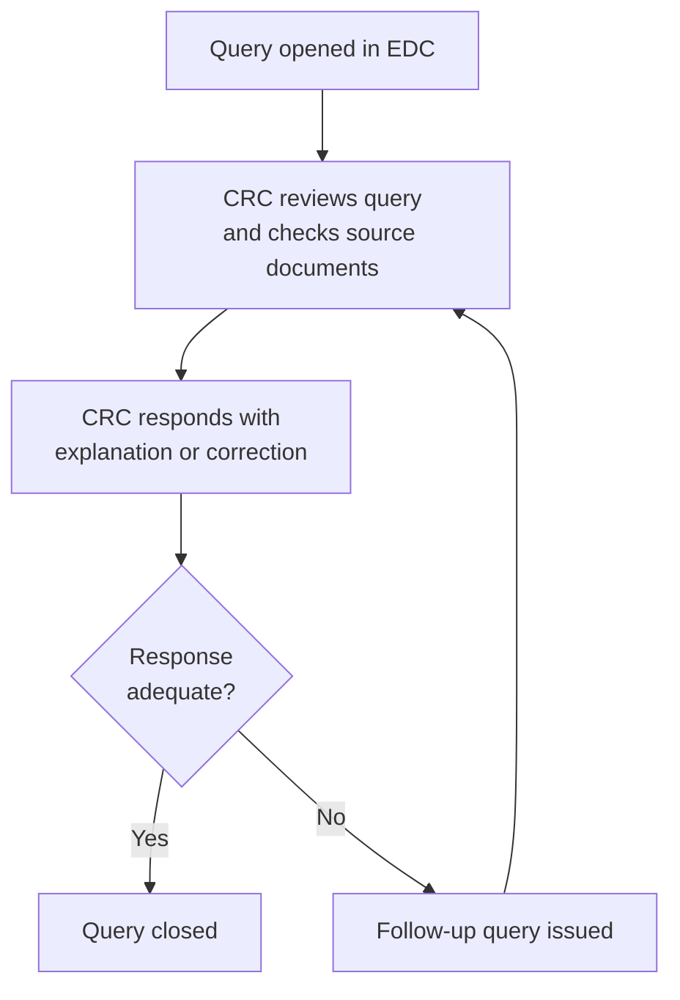

In industry-sponsored studies, the sponsor provides an electronic data capture (EDC) system for collecting and managing clinical data. For <Tooltip tip="The team member who handles day-to-day administration and coordination of the clinical trial." headline="Clinical Research Coordinator (CRC)" cta="Full definition" href="/kb/foundations/glossary#crc">CRCs</Tooltip>, the EDC is where a significant portion of daily study work happens — entering data, responding to queries, and maintaining the audit trail. This page covers the practical aspects of working with EDC systems.

For RI-MUHC-led studies using REDCap as the data management platform, see the [Capture and Optimization of Research Data (CORD)](/kb/design-support/cord) page.

## Common EDC platforms

Most industry sponsors use one of a small number of platforms. Each has a different interface, but the underlying workflow is the same: enter data, respond to queries, maintain the trail.

| Platform | Common in | Notes |
|---|---|---|
| Medidata Rave | Large pharma, Phase II–IV | Widely used globally; browser-based |
| Oracle Clinical One / InForm | Large pharma, complex protocols | Often paired with Oracle's randomization system |
| Veeva Vault CDMS | Growing adoption across pharma | Newer platform; cloud-based |
| Medrio | Smaller sponsors, biotech | Simpler interface; common in early-phase studies |
| REDCap | Investigator-initiated, academic | Used at RI-MUHC via [CORD](/kb/design-support/cord); validated per 21 CFR Part 11 |

Access to the sponsor's EDC is granted per-study, typically at or shortly after the <Tooltip tip="Monitoring visit to train the site team on the protocol and confirm site readiness, after REB approval and MUHC Authorization." headline="Site Initiation Visit (SIV)" cta="Full definition" href="/kb/foundations/glossary#siv">SIV</Tooltip>. You will receive individual credentials — do not share login information. The system logs every action tied to your account, so someone else entering data under your credentials creates an audit trail problem.

## Data entry

### When to enter data

Enter data as close to the time of the event as possible. Protocol-required data that sits in paper source documents for weeks before being transcribed into the EDC is a risk: it delays query resolution, increases the chance of transcription errors, and creates a gap between the source record and the CRF that monitors will flag.

Realistic targets depend on the study, but a general guideline:

- **Visit data** — within 2–3 business days of the visit (or per the sponsor's Data Management Plan)
- **<Tooltip tip="An adverse event meeting seriousness criteria: death, life-threatening, hospitalization, disability, or congenital anomaly." headline="Serious Adverse Event (SAE)" cta="Full definition" href="/kb/foundations/glossary#sae">SAE</Tooltip> data** — immediately after the initial SAE report to the sponsor
- **Lab and vitals** — when results are available, not batched at the end of the week

### Reducing downstream queries

Most queries are generated because the EDC's built-in validation checks (edit checks) flag data inconsistencies. Understanding what triggers queries helps avoid them:

- **Range checks** — values outside expected ranges (e.g., heart rate of 350). Double-check source values before entry; if the source value is genuinely out of range, add a comment explaining why.
- **Consistency checks** — contradictions between fields (e.g., "no concomitant medications" checked but a medication name entered). Review related fields together, not in isolation.
- **Missing data** — blank required fields. If data is genuinely unavailable, use the "not done" or "not applicable" option if provided rather than leaving fields empty.
- **Date logic** — end dates before start dates, events before consent, procedures outside visit windows. Check date fields carefully.

## The query lifecycle

A query is a formal request from the sponsor, data manager, or monitor to clarify or correct a data entry. Queries are generated automatically by edit checks or manually by the data management team or CRA during review.

<Steps>
  <Step title="Query is opened">
    The query appears in the EDC with a description of the issue and the affected field. Most systems highlight open queries with a flag or icon.
  </Step>
  <Step title="CRC reviews and responds">
    Read the query carefully. The response should answer the specific question asked. If the data was entered correctly and the source supports it, confirm this and reference the source. If the data was entered in error, correct it and explain the correction.
  </Step>
  <Step title="Query is closed or re-queried">
    The data manager or monitor reviews the response. If adequate, the query is closed. If the response does not resolve the issue, a follow-up query is issued. Avoid vague responses ("will check and update") — they generate follow-up queries.
  </Step>
</Steps>

### Writing effective query responses

| Instead of | Write |
|---|---|
| "Confirmed" | "Value confirmed per source document dated 15-Mar-2026. Heart rate of 45 bpm is consistent with participant's baseline bradycardia documented at screening." |
| "Updated" | "Value corrected from 15-Mar-2026 to 15-Apr-2026. Transcription error — source document confirms visit date was 15-Apr-2026." |
| "Will check" | Don't submit until you've checked. Verify against the source and provide the complete response. |
| "N/A" | "Assessment not performed — participant declined the optional MRI per protocol section 6.3, which permits this." |

<Note>
Query response timelines are specified in the study's Data Management Plan (DMP). Typical expectations are 5–10 business days. Aged open queries — those unresolved for weeks — are flagged during monitoring visits and can trigger increased monitoring frequency under the risk-based model.
</Note>

## Audit trails

Every change made in the EDC is logged: who made it, when, what the original value was, what it was changed to, and the reason. This audit trail is the electronic equivalent of the single-line-through correction on paper.

Key points:

- **Every correction needs a reason.** The system will prompt you. Use the reason field to explain the correction, not just acknowledge it.
- **You cannot delete entries.** You can only correct them, and the original value is preserved in the audit trail.
- **The audit trail is inspectable.** Health Canada inspectors and sponsor auditors review audit trails for patterns — frequent corrections to the same field, corrections made long after the event, corrections without adequate reasons.

## SAE reconciliation

In most studies, <Tooltip tip="An adverse event meeting seriousness criteria: death, life-threatening, hospitalization, disability, or congenital anomaly." headline="Serious Adverse Event (SAE)" cta="Full definition" href="/kb/foundations/glossary#sae">SAE</Tooltip> data is entered in two places: the sponsor's safety database (via the SAE report form) and the EDC (via the adverse event CRF pages). The data in both systems must match — this is SAE reconciliation.

The sponsor's data management team periodically compares the two databases and issues reconciliation queries when discrepancies are found. Common discrepancies include:

- SAE reported in the safety database but not yet entered in the EDC
- Onset date, resolution date, or outcome coded differently between the two systems
- Causality assessment in the EDC that does not match the SAE form

Address reconciliation queries promptly. Unresolved SAE reconciliation is a pre-database-lock requirement — the database cannot be locked until all SAE data is reconciled. See [SOP-CR-105](/sops/cr-105) for database lock criteria.

---

## Related resources

- [Data Integrity](/kb/conduct/data-documentation/data-integrity) — ALCOA+ principles, source documents, eSource
- [Capture and Optimization of Research Data (CORD)](/kb/design-support/cord) — REDCap and data management support for RI-MUHC-led studies
- [Reportable Events and Protocol Deviations](/kb/conduct/safety-reporting/reportable-events) — SAE reporting timelines
- [SOP-CR-014](/sops/cr-014) — Clinical Data Management
- [SOP-CR-105](/sops/cr-105) — Database Maintenance and Management (query management, pre-lock criteria)
