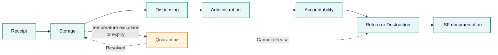

Quebec law requires that any medication administered to a patient — including experimental drugs in clinical trials — be dispensed by a pharmacist. This shapes how <Tooltip tip="A drug, medical device, or natural health product being tested or used as a reference in a clinical trial." headline="Investigational Product (IP)" cta="Full definition" href="/kb/glossary#ip">investigational product</Tooltip> management works at the MUHC in ways that differ from other provinces and from generic <Tooltip tip="International standard for design, conduct, monitoring, recording, and reporting of clinical studies." headline="Good Clinical Practice (GCP)" cta="Full definition" href="/kb/glossary#gcp">GCP</Tooltip> guidance.

## The Quebec pharmacy rule

Under the _Act Respecting Health Services and Social Services_ (RSQ, c. S-4.2) and the regulations of the Ordre des pharmaciens du Québec (OPQ), any medication administered to a patient must be dispensed by a pharmacist. This applies equally to investigational drugs in clinical trials. There is no equivalent requirement in most other Canadian provinces.

At the MUHC, this means the **MUHC Research Pharmacy** is the central point for all investigational drug management. Once a study is initiated, the IP is shipped directly to the MUHC Research Pharmacy, where it is stored and dispensed by pharmacy staff. The <Tooltip tip="The physician responsible to the sponsor for the conduct of a clinical trial at the site. One QI per study per Canadian site." headline="Qualified Investigator (QI)" cta="Full definition" href="/kb/glossary#qi">QI</Tooltip> delegates the operational tasks of IP management to the pharmacy — but the QI retains ultimate responsibility for the IP and for ensuring it is used in accordance with the approved protocol.

<Note>
Only the QI and Sub-Investigators who are MDs can prescribe investigational medication. Delegation of dispensing to pharmacy does not transfer prescribing authority.
</Note>

## QI and pharmacy responsibilities

The division of responsibility between the QI/PI and the MUHC Research Pharmacy is defined in [SOP-CR-010](/sops/cr-010) and its RI-MUHC Addendum. The QI delegates specific tasks to pharmacy but cannot delegate accountability.

<CardGroup cols={2}>

<Card title="QI / PI responsibilities" icon="user-doctor">
- Inform and invite the MUHC Pharmacy to the <Tooltip tip="Monitoring visit to train the site team on the protocol and confirm site readiness, after REB approval and MUHC Authorization." headline="Site Initiation Visit (SIV)" cta="Full definition" href="/kb/glossary#siv">Site Initiation Visit</Tooltip> (SIV) for protocol training
- Prescribe the investigational medication (MDs only)
- Ensure pharmacy holds valid <Tooltip tip="Lists each team member, their qualifications, and specific trial tasks authorized by the QI." headline="Task Delegation Log (TDL)" cta="Full definition" href="/kb/glossary#tdl">Task Delegation Log</Tooltip> entries for IP tasks
- Provide pharmacy with the IP Receipt Log and IP Dispensing Log and ensure they are completed
- Ensure IP is used only in accordance with the approved protocol and <Tooltip tip="Compilation of clinical and nonclinical data on the investigational product relevant to the study." headline="Investigator's Brochure (IB)" cta="Full definition" href="/kb/glossary#ib">Investigator's Brochure</Tooltip> or Product Monograph
- Retain overall responsibility for the IP at the study site
</Card>

<Card title="MUHC Research Pharmacy responsibilities (delegated)" icon="flask">
- Receive and verify incoming IP shipments
- Store IP under appropriate, temperature-controlled conditions
- Maintain accountability logs (receipt, inventory, dispensing)
- Label IP per Health Canada and Quebec requirements
- Dispense IP to research participants
- Manage return and destruction of unused IP
- Manage randomization (where applicable)
</Card>

</CardGroup>

## IP lifecycle at the MUHC

From the moment an investigational product arrives at the MUHC to its final destruction or return, every step requires documentation. The pharmacy leads operational management; the QI maintains oversight.

<Steps>

<Step title="Receipt">
Pharmacy receives and verifies incoming IP shipments against the shipping documentation.
</Step>

<Step title="Storage">
IP is stored under temperature-controlled conditions appropriate to the product specifications.
</Step>

<Step title="Dispensing">
Pharmacy dispenses IP to research participants upon receipt of a valid prescription from the QI or Sub-Investigator MD.
</Step>

<Step title="Accountability">
Pharmacy maintains accountability logs throughout the study. The QI ensures logs are completed and accessible for monitoring visits.
</Step>

<Step title="Return">
Unused IP is returned to the Sponsor or held for destruction per pharmacy procedures.
</Step>

<Step title="Destruction">
Destruction is conducted by the pharmacy per applicable procedures. Documentation is provided to the Sponsor and a copy is filed in the <Tooltip tip="The QI's collection of documentation demonstrating compliance, study integrity, and participant safety." headline="Investigator Site File (ISF)" cta="Full definition" href="/kb/glossary#isf">ISF</Tooltip>.
</Step>

</Steps>

## Labelling requirements

Under Health Canada's Food and Drug Regulations, C.05.011, the Sponsor must ensure that the investigational drug label appears in **both official languages** (English and French). This is a federal requirement that applies to all clinical trials conducted in Canada, not only in Quebec.

When the IP is dispensed by a trained staff member under an approved nurse dispensing exception (see below), the pharmacy provides an identical label to the IP label, which is applied to the appropriate source document form.

## Storage and temperature monitoring

IP must be stored in conditions that are secure, segregated from non-study medications, and temperature-controlled. The QI is responsible for ensuring storage equipment meets these requirements, regardless of whether storage is managed by the pharmacy or at another approved location.

Storage equipment requirements under [SOP-CR-025](/sops/cr-025):

- Regular maintenance and a calibrated Min/Max thermometer or centralized monitoring system
- Backup power in case of power outage
- An alarm system allowing quick detection of malfunction or temperature excursion
- RI-MUHC or MUHC Biomed must be notified of any equipment malfunction

Any temperature excursion must be documented. If the IP is moved from the main pharmacy to a research storage location, a control and traceability record must be maintained. All shipping records must confirm the IP was maintained at the recommended temperature range while in transit.

## Accountability and documentation

100% IP accountability is required at all times. This is verified during monitoring visits and is a key focus of Health Canada inspections. The QI is responsible for ensuring pharmacy holds and completes the required logs.

- **IP Receipt Log** — documents all incoming shipments
- **IP Dispensing Log** — records each dispensing event per participant
- **Temperature logs** — maintained by pharmacy for the duration of the study; obtained from pharmacy and archived with the ISF at close-out
- **Accountability log** — reconciles all IP received, dispensed, and remaining at study close-out

IP accountability records must be retained for **15 years** for Health Canada-regulated studies, and 7 years for non-regulated studies, in line with [SOP-CR-015](/sops/cr-015).

<Note>
During monitoring visits, the monitor will typically perform a pharmacy visit and verify IP dispensing forms and 100% IP accountability. Ensure pharmacy records are accessible and up to date before each monitoring visit.
</Note>

## Nurse dispensing exception

In specific circumstances, an RI-MUHC Research Nurse or MUHC Nurse may be approved to dispense IP directly to research participants without pharmacy intermediation. This is an exception to the standard Quebec rule and requires explicit approval.

<Steps>

<Step title="Request the exception">
The Investigator requests the exception at the time of study submission in <Tooltip tip="The RI-MUHC's electronic study submission and management platform. All studies requiring MUHC Authorization are submitted through Nagano." headline="Nagano (RI-MUHC)" cta="Full definition" href="/kb/glossary#nagano">Nagano</Tooltip>.
</Step>

<Step title="Pharmacy review">
The MUHC Research Pharmacy reviews the request and verifies compliance with Quebec's _Pharmacy Act_.
</Step>

<Step title="Waiver issuance">
If approved, the pharmacy issues a waiver.
</Step>

<Step title="File the waiver">
The waiver must be kept in the essential study documents.
</Step>

</Steps>

<Warning>
**Do not assume the exception applies.** Approval must be obtained through Nagano at submission. If your protocol anticipates nurse-administered IP, plan for this review early — the waiver is required before the study can begin.
</Warning>

## Medical devices, NHPs, and biologics

The Quebec pharmacy rule and the MUHC Research Pharmacy's central role apply primarily to investigational **drugs and biologics**. Other IP types follow different regulatory pathways:

<AccordionGroup>

<Accordion title="Medical devices">
Regulated under Health Canada's <Tooltip tip="Health Canada authorization to conduct a clinical investigation of a medical device. The device equivalent of a CTA." headline="Investigational Testing Authorization (ITA)" cta="Full definition" href="/kb/glossary#ita">Investigational Testing Authorization</Tooltip> (ITA) process. Device handling, storage, and accountability follow device-specific procedures. See [SOP-CR-024](/sops/cr-024) for the RI-MUHC framework.
</Accordion>

<Accordion title="Natural health products (NHPs)">
Regulated under Health Canada's Natural Health Products Regulations, Part 4. NHP trials not involving reserved medical acts may not require the same pharmacy dispensing structure as drug trials, but accountability and storage requirements still apply.
</Accordion>

<Accordion title="Radiopharmaceuticals">
Handled under specific radiation safety and pharmacy protocols. Contact the MUHC Research Pharmacy early in study planning — radiopharmaceutical studies require specialized handling arrangements before submission.
</Accordion>

</AccordionGroup>

If your study involves any of these IP types, contact the MUHC Research Pharmacy and your <Tooltip tip="All planned and systematic actions to ensure trial data are generated, documented, and reported in compliance with GCP and SOPs." headline="Quality Assurance (QA)" cta="Full definition" href="/kb/glossary#qa">QA</Tooltip> contact at QAClinicalResearch@muhc.mcgill.ca early in the planning process.

---

**Related resources**

- [SOP-CR-010](/sops/cr-010) — Management of Investigational Products
- [SOP-CR-015](/sops/cr-015) — Investigator Site Files and Essential Documents
- [SOP-CR-024](/sops/cr-024) — Investigational Testing Authorization (Medical Devices)
- [SOP-CR-025](/sops/cr-025) — Equipment Calibration and Maintenance
- [SOP-CR-016](/sops/cr-016) — Study Close-Out
- [Data Integrity](/kb/conduct/data-integrity)
- [Monitoring, Audits and Inspections](/kb/conduct/monitoring-audits)
