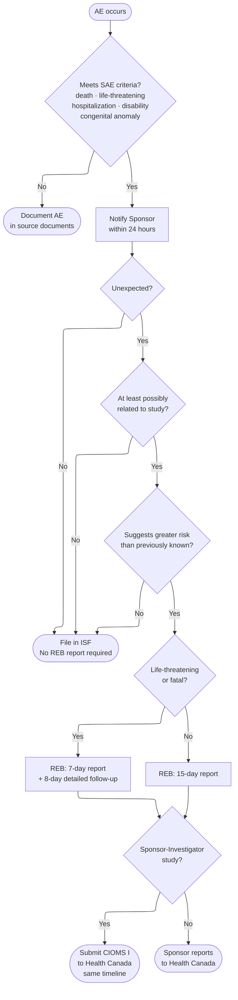

During a study, certain events must be reported to the Sponsor, the <Tooltip tip="The ethics committee that reviews and approves research involving human participants. Also called CER at French-language institutions." headline="Research Ethics Board (REB)" cta="Full definition" href="/kb/glossary#reb">REB</Tooltip>, and where applicable, Health Canada — within defined timeframes. Missing a reporting deadline is itself a protocol deviation. This page covers adverse events, SAEs, SUSARs, protocol deviations, and ongoing REB submissions.

<View title="All Roles">

## Participant safety and ethical concerns

**Report without delay.** Concerns about participant safety, informed consent, or undue risk should be reported to the MUHC REB immediately — even if no formal protocol deviation has occurred. Do not wait for the next reporting cycle. Refer to MUHC REB SOP 405.

## Adverse events and SAEs

All adverse events (AEs) must be assessed and documented throughout the study. When an <Tooltip tip="Any untoward medical occurrence in a participant, whether or not related to the investigational product." headline="Adverse Event (AE)" cta="Full definition" href="/kb/glossary#ae">AE</Tooltip> meets seriousness criteria, it triggers a reporting chain to the Sponsor, the REB, and for regulated trials, Health Canada.

An <Tooltip tip="An adverse event meeting seriousness criteria: death, life-threatening, hospitalization, disability, or congenital anomaly." headline="Serious Adverse Event (SAE)" cta="Full definition" href="/kb/glossary#sae">SAE</Tooltip> is defined as any event that results in death, is life-threatening, requires hospitalization or prolongation of existing hospitalization, results in persistent or significant disability, or causes a congenital anomaly. Not every SAE requires a report to the REB — only those that are unexpected, at least possibly related to study participation, and suggest participants are at greater risk than previously known.

<Steps>
  <Step title="Identify and assess the AE">
    Assess whether the event meets SAE criteria: death, life-threatening, hospitalization, disability, or congenital anomaly. Document the assessment in the source documents.
  </Step>
  <Step title="Notify the Sponsor within 24 hours">
    All SAEs must be reported to the Sponsor within 24 hours of becoming aware.
  </Step>
  <Step title="Assess whether REB reporting is required">
    REB reporting is triggered only when the SAE is: (1) unexpected, (2) at least possibly related to study participation, and (3) suggests participants are at greater risk than previously known.
  </Step>
  <Step title="Submit to REB via Nagano if criteria are met">
    Use form F3H. Life-threatening events: report within 7 calendar days, then submit a detailed analysis report within 8 days of that first report. All other reportable SAEs: report within 15 calendar days.
  </Step>
  <Step title="Sponsor-Investigator studies: report to Health Canada">
    For Sponsor-Investigator studies, a CIOMS I report must be submitted to Health Canada on the same 7-day or 15-day timeline. This obligation applies only to Sponsor-Investigators — industry sponsors handle their own Health Canada reporting.
  </Step>
</Steps>

### External SUSARs from the Sponsor

External <Tooltip tip="Suspected Unexpected Serious Adverse Reaction — unexpected in nature, severity, or frequency; must be reported to Health Canada and the REB." headline="SUSAR" cta="Full definition" href="/kb/glossary#susar">SUSAR</Tooltip> reports received from the Sponsor require a fourth criterion before reporting to the REB: they must also necessitate an amendment to the protocol, <Tooltip tip="Compilation of clinical and nonclinical data on the investigational product relevant to the study." headline="Investigator's Brochure (IB)" cta="Full definition" href="/kb/glossary#ib">Investigator's Brochure</Tooltip>, or <Tooltip tip="The written document providing the participant with information essential to making an informed decision. Both parties must sign." headline="Informed Consent Form (ICF)" cta="Full definition" href="/kb/glossary#icf">informed consent form</Tooltip> — or require immediate notification to participants for safety reasons.

When you receive an external SUSAR from the Sponsor, initial and date the document to confirm medical oversight, then assess whether all four reporting criteria are met. File all external SUSARs in the <Tooltip tip="The QI's collection of documentation demonstrating compliance, study integrity, and participant safety." headline="Investigator Site File (ISF)" cta="Full definition" href="/kb/glossary#isf">ISF</Tooltip> regardless of whether REB reporting is required.

## Key reporting timelines

| Event | Sponsor | REB | Health Canada |
|---|---|---|---|
| Critical deviation or life-threatening SAE | As soon as possible; SAEs within 24 hours | **7 days** + 8-day detailed follow-up report | 7 days + 8-day follow-up (Sponsor-Investigator studies only) |
| Major deviation or other reportable SAE/SUSAR | As soon as possible; SAEs within 24 hours | **15 days** | 15 days (Sponsor-Investigator studies only) |
| Medical device incident | 72 hours to manufacturer and importer | 7 or 15 days | 10 days (life-threatening) or 30 days from awareness |
| Minor deviation | As soon as possible | Annual renewal | Not applicable |

REB submissions via Nagano — use form **F3H** for SAE/SUSAR reporting.

## Protocol deviations

A protocol deviation is any departure from the REB-approved study documents, RI-MUHC SOPs, ICH <Tooltip tip="International standard for design, conduct, monitoring, recording, and reporting of clinical studies." headline="Good Clinical Practice (GCP)" cta="Full definition" href="/kb/glossary#gcp">GCP</Tooltip>, or ISO GCP that was not pre-approved. Every deviation — minor, major, or critical — must be documented on the Protocol/GCP/SOP Deviation Log. The Deviation Log is an essential document in the ISF and is reviewed at every monitoring visit.

### The three-tier classification

Every deviation identified at the RI-MUHC is classified as minor, major, or critical. Classification is a judgment call — made by the <Tooltip tip="The physician responsible to the sponsor for the conduct of a clinical trial at the site. One QI per study per Canadian site." headline="Qualified Investigator (QI)" cta="Full definition" href="/kb/glossary#qi">QI</Tooltip>/PI with input from the <Tooltip tip="The team member who handles day-to-day administration and coordination of the clinical trial." headline="Clinical Research Coordinator (CRC)" cta="Full definition" href="/kb/glossary#crc">CRC</Tooltip>, and documented on the Deviation Log at the time the deviation is identified.

<CardGroup cols={3}>
  <Card title="Minor" icon="circle-info">
    A deficiency that does not pose a health risk to participants and does not affect data integrity.

    **Examples:** Visit window missed by one day; minor transcription error; non-critical document filed late.

    **Action:** Log deviation and notify Sponsor. Report to REB at annual Continuing Review. No <Tooltip tip="Actions taken to resolve a compliance issue and prevent recurrence: identify, correct, prevent." headline="Corrective and Preventive Action (CAPA)" cta="Full definition" href="/kb/glossary#capa">CAPA</Tooltip> required — document and review for trends.
  </Card>
  <Card title="Major" icon="triangle-exclamation">
    A marked departure that may result in undue health risk to participants, or that could invalidate study data.

    **Examples:** Participant enrolled outside eligibility criteria; consent obtained with outdated ICF; required safety assessment missed; dosing error outside tolerances.

    **Action:** CAPA required. Report to REB within **15 days** (or **7 days** if life-threatening). Copy CAPA to <Tooltip tip="All planned and systematic actions to ensure trial data are generated, documented, and reported in compliance with GCP and SOPs." headline="Quality Assurance (QA)" cta="Full definition" href="/kb/glossary#qa">QA</Tooltip> and notify Sponsor.
  </Card>
  <Card title="Critical" icon="circle-exclamation">
    A departure resulting in fatal, life-threatening, or unsafe conditions; or involving falsification, adulteration, or misrepresentation of records.

    **Examples:** Unapproved <Tooltip tip="A drug, medical device, or natural health product being tested or used as a reference in a clinical trial." headline="Investigational Product (IP)" cta="Full definition" href="/kb/glossary#ip">IP</Tooltip> administered; safety event concealed from the REB; data fabricated or altered to conceal a violation.

    **Action:** CAPA required immediately. Report to REB within **7 days**. Copy CAPA to QA and notify Sponsor immediately. May trigger study suspension.
  </Card>
</CardGroup>

<Tip>
When in doubt, use the conservative classification. It is better to over-report and have the REB downgrade a finding than to under-report and have an inspector identify an unaddressed major deviation. Contact QA before classifying an ambiguous deviation.
</Tip>

### Deviation vs. amendment

A deviation and an amendment are often confused, and the distinction matters.

- **A deviation** is an unplanned departure from the approved protocol that has already occurred. It applies to a single event or participant. The question with a deviation is how to document what happened, assess its impact, and prevent recurrence.
- **An amendment** is a planned, pre-approved change to the protocol that applies going forward. It must be approved by the REB **before** implementation — it cannot be applied retroactively.

If the same situation has arisen repeatedly, or if the site anticipates it will arise again, the correct response is to submit an amendment — not to document repeated deviations.

### Intentional deviations

Intentional deviations are only permissible in two circumstances:
1. If the deviation is necessary to eliminate an immediate hazard to a participant's safety — taken first and reported retrospectively.
2. If the change is purely administrative or logistical and involves no risk to participants or effect on scientific validity.

In all other cases, an intentional deviation requires prior Sponsor agreement and, in most cases, prior REB approval. A site that proceeds with a planned change to the protocol without this approval has not committed a minor deviation — it has conducted part of the study under conditions that were never ethically reviewed.

## The CAPA process

For major and critical deviations, a Corrective and Preventive Action (CAPA) form is required. A well-constructed CAPA has three parts:

1. **Corrective action** — what was done immediately to address the specific deviation and its impact
2. **Root cause analysis** — why the deviation occurred (training gap, process failure, unclear protocol requirement, system limitation)
3. **Preventive action** — what was changed so the same deviation cannot happen again

<Warning>
A CAPA that simply restates the deviation and says "staff were retrained" without identifying the root cause is unlikely to satisfy an auditor or inspector. The root cause must be genuinely analyzed.
</Warning>

The CAPA form is sent to QAClinicalResearch@muhc.mcgill.ca and filed in the ISF alongside the Deviation Log entry. The CAPA number is cross-referenced on the Deviation Log. Templates are in [SOP-CR-026](/sops/cr-026) (Appendices 1 and 2).

## Ongoing REB submissions

REB approval at the start of a study is not a one-time event. Throughout an active study, the REB must be kept informed of changes, safety information, and the study's continued operation.

### Annual renewal

Every active study requires at least annual REB review. Continuing review must occur before the previous approval expires — it does not happen automatically, and it is the QI/PI's responsibility to track the expiry date and submit in time. Submit at least one month before expiry.

<Warning>
A lapse in REB approval is not a paperwork problem — it is a major protocol violation. If approval expires before the renewal is granted, all study activities must be suspended for as long as there is no risk to current participants. New enrolment stops immediately. The renewal, once granted, is not retroactive: there is no REB approval for the lapse period. Health Canada inspectors classify a lapse as a major observation.
</Warning>

### Amendments

Any change to an approved study must be submitted to and approved by the REB before it is implemented. This applies to changes of any kind: the protocol, the ICF, participant-facing materials, the Investigator's Brochure or Product Monograph, the QI/PI, or the Sponsor.

There are two narrow exceptions to the pre-implementation requirement:
- **Emergency deviations:** taken first to protect a participant's safety, reported retrospectively.
- **Minor administrative changes:** purely editorial changes that do not affect participant risk or scientific validity. Must still be documented and reported at the next annual renewal.

### Version control for amended documents

Every amended document — protocol, ICF, recruitment materials, IB — must carry an updated version number and date before it is submitted to the REB. The version number and date must appear in the document footer, and the file name must be updated to reflect them. The REB approval letter lists exactly the document versions approved — if the version number in the footer does not match, the document is not covered by that approval.

### When a deviation triggers re-consent

Not every deviation requires participants to be re-consented. The trigger is not the severity of the deviation — it is whether the deviation introduces information that a reasonable participant would want to know before deciding to continue in the study. The REB makes the final determination on whether re-consent is required. Do not re-consent participants unilaterally before receiving REB direction, except where immediate participant safety requires it.

</View>

<View title="PI / QI">

## Your responsibilities

As the <Tooltip tip="The physician responsible to the sponsor for the conduct of a clinical trial at the site. One QI per study per Canadian site." headline="Qualified Investigator (QI)" cta="Full definition" href="/kb/glossary#qi">QI</Tooltip>/PI, you bear personal accountability for medical assessment, causality determination, and the authorization of all reportable event submissions. You cannot delegate the medical judgment — only the administrative steps.

## SAEs: your checklist

<Steps>
  <Step title="Conduct the medical assessment">
    Determine whether the event meets SAE criteria (death, life-threatening, hospitalization, disability, congenital anomaly) and document your clinical assessment in the source documents. This step cannot be delegated.
  </Step>
  <Step title="Determine causality">
    Assess whether the event is at least possibly related to study participation. Your causality judgment drives whether REB reporting is triggered. Document your reasoning.
  </Step>
  <Step title="Authorize Sponsor notification">
    Confirm the Sponsor is notified within 24 hours. The CRC handles the administrative submission, but you must authorize it.
  </Step>
  <Step title="Assess REB reporting criteria">
    All three criteria must be met: (1) unexpected, (2) at least possibly related, (3) suggests participants are at greater risk than previously known. If all three are met, a report to the REB is required.
  </Step>
  <Step title="Sign and submit form F3H in Nagano">
    Life-threatening events: 7-day initial report + 8-day detailed follow-up. All other reportable SAEs: 15-day report. You must authorize the submission — the CRC prepares it.
  </Step>
  <Step title="Sponsor-Investigator studies only: report to Health Canada">
    Submit a CIOMS I report on the same 7-day or 15-day timeline. This obligation is yours alone — it does not apply when an industry sponsor is running the trial.
  </Step>
</Steps>

## External SUSARs: your personal obligation

When you receive an external <Tooltip tip="Suspected Unexpected Serious Adverse Reaction — unexpected in nature, severity, or frequency; must be reported to Health Canada and the REB." headline="SUSAR" cta="Full definition" href="/kb/glossary#susar">SUSAR</Tooltip> report from the Sponsor, you must initial and date the document to confirm medical oversight. This is a non-delegable act. Then assess whether all four criteria are met before determining whether REB reporting is required. File all external SUSARs in the <Tooltip tip="The QI's collection of documentation demonstrating compliance, study integrity, and participant safety." headline="Investigator Site File (ISF)" cta="Full definition" href="/kb/glossary#isf">ISF</Tooltip> regardless of the outcome of that assessment.

The fourth criterion for external SUSARs: the event must also necessitate a protocol amendment, an update to the Investigator's Brochure or informed consent form, or require immediate notification of participants for safety reasons.

## Key reporting timelines

| Event | Sponsor | REB | Health Canada |
|---|---|---|---|
| Life-threatening SAE or critical deviation | Within 24 hours | **7 days** + 8-day detailed follow-up | 7 days + 8-day follow-up (Sponsor-Investigator only) |
| Other reportable SAE/SUSAR or major deviation | Within 24 hours | **15 days** | 15 days (Sponsor-Investigator only) |
| Minor deviation | As soon as possible | Annual renewal | — |

## Protocol deviations: your judgment call

You classify every deviation. The three-tier classification — minor, major, or critical — is a medical-legal judgment call made by you, documented at the time the deviation is identified. When in doubt, go conservative. Contact <Tooltip tip="All planned and systematic actions to ensure trial data are generated, documented, and reported in compliance with GCP and SOPs." headline="Quality Assurance (QA)" cta="Full definition" href="/kb/glossary#qa">QA</Tooltip> before classifying an ambiguous deviation.

For major and critical deviations, you must review and approve the CAPA before it is submitted. A CAPA requires genuine root cause analysis — restating the deviation and noting "staff were retrained" will not satisfy an auditor or inspector. The CAPA is sent to QAClinicalResearch@muhc.mcgill.ca and cross-referenced in the Deviation Log.

## REB approval: your personal accountability

You are personally responsible for tracking REB approval expiry dates. Submit the annual Continuing Review at least one month before expiry. A lapse is a major protocol violation — all study activities stop, new enrolment stops, and the renewal once granted is not retroactive. Health Canada classifies a lapse as a major observation.

Any protocol change requires your authorization, prior REB approval, and version-controlled documentation before implementation. Emergency deviations — taken first to protect a participant's safety — must be reported to the REB retrospectively without delay.

</View>

<View title="CRC">

## Your responsibilities

As the <Tooltip tip="The team member who handles day-to-day administration and coordination of the clinical trial." headline="Clinical Research Coordinator (CRC)" cta="Full definition" href="/kb/glossary#crc">CRC</Tooltip>, you are typically the first person to detect and document an adverse event, and you carry the administrative burden of every reporting deadline — tracking clocks, preparing submissions, and maintaining the <Tooltip tip="The QI's collection of documentation demonstrating compliance, study integrity, and participant safety." headline="Investigator Site File (ISF)" cta="Full definition" href="/kb/glossary#isf">ISF</Tooltip>.

## When an adverse event occurs

<Steps>
  <Step title="Document in source documents immediately">
    Record the event, date of onset, severity, and relevant observations in the participant's source record. Do not wait — timestamp matters.
  </Step>
  <Step title="Notify the QI/PI without delay">
    Medical assessment and causality determination belong to the QI/PI. Get them involved immediately. You need their assessment before you can determine whether REB reporting is triggered.
  </Step>
  <Step title="Start the 24-hour Sponsor clock">
    SAEs must be reported to the Sponsor within 24 hours of the site becoming aware. You own the administrative side of that notification. Do not let it slip.
  </Step>
  <Step title="Track whether REB criteria are met">
    Work with the QI/PI to assess whether all three criteria are triggered: unexpected, possibly related, suggests greater risk. If yes, set the 7-day or 15-day deadline and track it actively.
  </Step>
  <Step title="Prepare and submit form F3H in Nagano">
    Life-threatening events: 7-day initial report + 8-day detailed follow-up. All others: 15-day report. The QI/PI must authorize the submission — your job is to prepare it and ensure it goes in on time. A missed deadline is itself a protocol deviation.
  </Step>
</Steps>

## External SUSARs

When external SUSAR reports arrive from the Sponsor, route them to the QI/PI immediately for initialing and dating. Then work with the QI/PI to assess whether all four REB criteria are met. File every external SUSAR in the ISF — regardless of whether REB reporting is required. The fourth criterion for external SUSARs: the event must also necessitate a protocol amendment, IB update, ICF change, or immediate participant notification.

## Reporting deadlines at a glance

| Event | Sponsor | REB |
|---|---|---|
| Life-threatening SAE or critical deviation | Within 24 hours | **7 days** + 8-day detailed follow-up |
| Other reportable SAE/SUSAR or major deviation | Within 24 hours | **15 days** |
| Medical device incident | 72 hours to manufacturer and importer | 7 or 15 days |
| Minor deviation | As soon as possible | Annual renewal |

## Protocol deviations: you own the log

Every deviation — minor, major, or critical — goes on the Protocol/GCP/SOP Deviation Log at the time it is identified, not retroactively. The log is an essential document in the ISF and is reviewed at every monitoring visit.

**When a major or critical deviation occurs:**
1. Log it immediately — date identified, deviation type, description.
2. Flag to the QI/PI for classification and CAPA authorization.
3. Prepare the CAPA. A complete CAPA has three parts: corrective action, root cause analysis, and preventive action. "Staff were retrained" is not a root cause.
4. Send the completed CAPA to QAClinicalResearch@muhc.mcgill.ca and file it in the ISF, cross-referenced on the Deviation Log by CAPA number.

**Pattern recognition:** If the same deviation is recurring, the correct fix is an amendment — not repeated log entries. Flag the pattern to the QI/PI so an amendment can be submitted before the next monitoring visit.

## REB renewals and version control

Track all REB approval expiry dates and flag them to the QI/PI at least six weeks before they expire. Submit Continuing Review forms at least one month before expiry. A lapse in approval stops all study activity — this is entirely preventable through administrative tracking.

For every amended document submitted to the REB, verify that an updated version number and date appear in the document footer and filename before submission. After approval, check that version numbers match the REB approval letter before distributing any amended document to the team. Mismatched versions mean the document is not covered by the approval.

</View>

<View title="Study Nurse">

## Your responsibilities

As a licensed nurse on the study team, your primary reporting responsibilities are at the point of care: immediate recognition and documentation, rapid notification to the QI/PI and CRC, and accurate follow-up data collection. You do not submit REB reports — but the data you collect and the timeliness of your notifications directly determine whether reporting deadlines are met.

## When an adverse event occurs

<Steps>
  <Step title="Document immediately in the participant's chart">
    Record the event, date and time of onset, your clinical observations, any interventions taken, and the participant's current status. Accurate, timestamped source documentation is the foundation of every SAE report.
  </Step>
  <Step title="Notify the QI/PI without delay">
    Medical assessment and causality determination belong to the QI/PI. Do not wait until the end of a shift or the following morning for potentially serious events. Call immediately.
  </Step>
  <Step title="Notify the CRC">
    The CRC manages the 24-hour Sponsor notification clock and the REB submission process. They need to know as soon as you do.
  </Step>
  <Step title="Collect follow-up data as directed">
    For reportable SAEs, the QI/PI may need additional clinical detail for the 8-day detailed follow-up report. Document your observations at each participant contact until the event resolves or stabilizes.
  </Step>
</Steps>

## What to document

For any adverse event, your source documentation should capture:

- Date and time of onset (or date first observed)
- Signs, symptoms, and clinical findings at the time of assessment
- Severity (mild / moderate / severe)
- Any action taken — dose modified, study drug held, treatment given, referral made
- Outcome and resolution date, if known at the time of documentation
- Your name, professional designation, and the date of the entry

**Do not characterize causality in your notes.** That judgment belongs to the QI/PI. Record what you observed and what you did — not whether you believe the event is related to the study drug or intervention.

## Protocol deviations

If you identify a deviation — a missed visit window, a consent issue, an out-of-range lab value that was not actioned, a dose administered outside protocol tolerances — report it to the CRC immediately. Do not attempt to classify the deviation or address it on your own. Timely reporting to the CRC ensures the Deviation Log is updated and the QI/PI is informed before the next monitoring visit.

</View>
