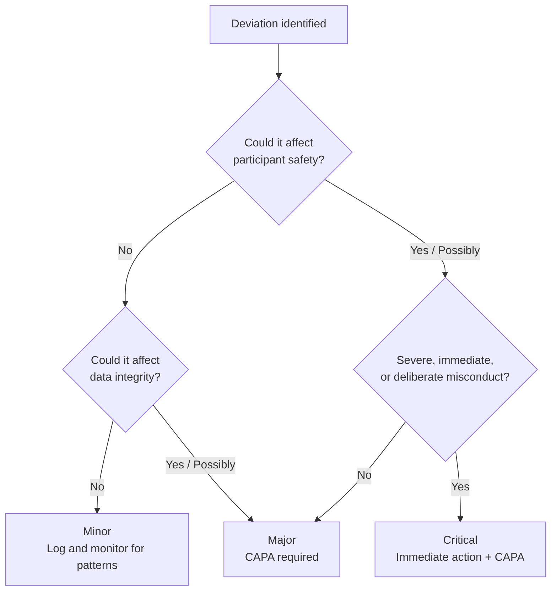

Reporting obligations for deviations — the classification thresholds, REB timelines, and Deviation Log requirements — are covered in [Reportable Events and Protocol Deviations](/kb/conduct/safety-reporting/reportable-events). This page covers the operational side: how to classify ambiguous cases, how to work through a <Tooltip tip="Actions taken to resolve a compliance issue and prevent recurrence: identify, correct, prevent." headline="Corrective and Preventive Action (CAPA)" cta="Full definition" href="/kb/foundations/glossary#capa">CAPA</Tooltip>, and how to prevent the most common deviations from occurring in the first place.

## Classification in practice

[SOP-CR-026](/sops/cr-026) defines three tiers: minor, major, and critical. This is the RI-MUHC's operational classification — ICH E6(R3) uses a two-tier distinction between "important" and "non-important" deviations, while many institutions and sponsors use three tiers for more granular tracking. The definitions are clear at the extremes — a missed non-critical document filing deadline is minor; fabricated data is critical. The difficulty is in the middle, where most real deviations fall.

### The classification decision

Classification is a judgment made by the <Tooltip tip="The physician responsible to the sponsor for the conduct of a clinical trial at the site. One QI per study per Canadian site." headline="Qualified Investigator (QI)" cta="Full definition" href="/kb/foundations/glossary#qi">QI</Tooltip>/PI with input from the <Tooltip tip="The team member who handles day-to-day administration and coordination of the clinical trial." headline="Clinical Research Coordinator (CRC)" cta="Full definition" href="/kb/foundations/glossary#crc">CRC</Tooltip>. Two questions drive the classification:

1. **Did this affect — or could it have affected — participant safety?**
2. **Did this affect — or could it have affected — data integrity?**

If the answer to both is no, the deviation is likely minor. If the answer to either is yes or possibly, it is likely major. If the effect was severe, immediate, or involved deliberate misconduct, it is critical.

### Common ambiguous scenarios

| Scenario | Considerations | Likely classification |
|---|---|---|
| Visit window missed by 1 day; no safety assessments due | Protocol specifies the window as a guideline, not a safety requirement. No data was lost. | Minor — log and monitor for patterns |
| Visit window missed by 1 week; safety labs were due | Safety assessment was delayed. Participant may have continued with undetected lab abnormalities. | Major — CAPA required |
| Consent obtained with a superseded ICF version, discovered after procedures were performed | Participant did not receive current risk information before procedures. The consent was not fully informed. | Major — assess whether re-consent is needed |
| A non-fasting blood draw was taken when the protocol required fasting | Data point may be invalid. Assess whether the sample can be repeated or whether the data is unrecoverable. | Major if the data point is a primary endpoint; minor if secondary and repeatable |
| CRC performed a delegated task before being added to the <Tooltip tip="Lists each team member, their qualifications, and specific trial tasks authorized by the QI." headline="Task Delegation Log (TDL)" cta="Full definition" href="/kb/foundations/glossary#tdl">Task Delegation Log</Tooltip> | Data collected by an unauthorized person. Even if the CRC was qualified, the delegation documentation was not in place. | Major — the data integrity concern is the lack of documented authorization |

<Note>
When in doubt, classify up rather than down. A major deviation that turns out to be minor after investigation is a non-issue. A minor deviation that should have been major is a compliance gap.
</Note>

## Working through a CAPA

A CAPA is required for all major and critical deviations. The CAPA Form template is in [SOP-CR-026](/sops/cr-026) Appendix 2. A completed CAPA must be sent to <Tooltip tip="All planned and systematic actions to ensure trial data are generated, documented, and reported in compliance with GCP and SOPs." headline="Quality Assurance (QA)" cta="Full definition" href="/kb/foundations/glossary#qa">QA</Tooltip> at QAClinicalResearch@muhc.mcgill.ca for institutional trend tracking.

A CAPA has four parts:

<Steps>
  <Step title="Describe what happened">
    State the deviation factually: what occurred, when it was identified, who was involved, which participants were affected, and what the immediate impact was. Reference the Deviation Log entry number.
  </Step>
  <Step title="Identify the root cause">
    Determine *why* the deviation occurred — not just what happened. The most common method is the **5 Whys**: ask "why" iteratively until you reach the underlying cause rather than the surface symptom.

    **Example:**
    - Deviation: Participant received the wrong IP dose.
    - Why? The CRC-N read the wrong line on the dosing chart.
    - Why? The dosing chart had multiple participants listed on one page.
    - Why? The site used a shared dosing log instead of individual participant worksheets.
    - Why? No standard template existed for individual dosing worksheets.
    - **Root cause:** Absence of a standardized individual dosing worksheet.

    The root cause is rarely "human error." If a person made a mistake, something in the system allowed the mistake to happen — and that system issue is the root cause.

    The 5 Whys is one approach. For more complex deviations, a **Fishbone (Ishikawa) diagram** maps contributing factors across categories to identify multiple root causes that a linear analysis might miss. **Failure Mode and Effects Analysis (FMEA)** is a proactive tool — it identifies where processes are most vulnerable to failure before a deviation occurs, and is more commonly used for process design than for post-deviation investigation.

    **Fishbone diagram — same dosing error, by category:**

    <Frame caption="Example: Fishbone (Ishikawa) diagram — the same dosing error mapped across four contributing-factor categories.">
      
    </Frame>

    The Fishbone surfaces contributing factors the 5 Whys might miss — the busy clinic day and shared dosing area didn't cause the error on their own, but they made it more likely. A CAPA that addresses only the worksheet (the 5 Whys root cause) might miss the verification gap or the environmental factors.
  </Step>
  <Step title="Define corrective actions">
    Corrective actions address the specific deviation that occurred. What was done to fix the immediate problem?

    - Was the participant re-assessed?
    - Was the data corrected or annotated?
    - Was the Sponsor and/or REB notified?
    - Was the participant re-consented if necessary?
  </Step>
  <Step title="Define preventive actions">
    Preventive actions address the root cause to prevent recurrence — not just for this participant or this study, but for similar situations in the future.

    - Was a process or template changed?
    - Was additional training provided?
    - Was a verification step added?
    - Was a system or tool modified?

    Preventive actions should be specific and implementable. "Staff will be more careful" is not a preventive action. "Individual dosing worksheets will be used for all participants, verified by a second person before administration" is.
  </Step>
  <Step title="Verify effectiveness">
    After the corrective and preventive actions are implemented, confirm they worked. Did the same type of deviation recur? If the CAPA involved a new process or template, is the team actually using it? Effectiveness verification closes the loop — without it, the CAPA is a plan, not a solution.
  </Step>
</Steps>

## Trend awareness

QA reviews CAPA forms submitted across the institution for patterns. At the study level, the QI/PI and CRC should review the Deviation Log periodically for trends.

A pattern of minor deviations in the same category — repeated visit window misses, recurring data entry errors, multiple consent version issues — may signal a systemic problem even if no single deviation is major. When a pattern is identified:

- Assess whether the underlying cause is the same across events
- Consider whether the cumulative effect changes the classification (a pattern of minor deviations in a safety-relevant area may warrant a major classification for the overall trend)
- Document the trend assessment and any resulting actions on the Deviation Log or in a Note-to-File

## Preventing common deviations

Most deviations at research sites fall into a small number of recurring categories. Targeted systems can prevent them.

<AccordionGroup>
  <Accordion title="Visit window misses">
    **Why it happens:** Visit windows are tracked manually or in spreadsheets that are not updated in real time. Staff turnover means the person who scheduled the visit is not the person confirming it.

    **Prevention:** Maintain a centralized visit tracking system (spreadsheet, calendar, or CTMS) with automated reminders. Flag visits approaching window boundaries at least one week in advance. Assign a single person per study to own the visit schedule.
  </Accordion>
  <Accordion title="Consent version errors">
    **Why it happens:** A new ICF version is approved by the REB, but the site continues using the previous version because copies were pre-printed or the old version was not physically removed from the consent area.

    **Prevention:** When a new ICF version is approved, immediately remove all copies of the superseded version from circulation. Mark them "SUPERSEDED" and file them. Confirm the correct version is in use before every consent encounter — check the version number and date on the form, not just the stack it came from.
  </Accordion>
  <Accordion title="Delegation log gaps">
    **Why it happens:** A new team member starts performing tasks before the QI/PI formally adds them to the Task Delegation Log. Or a team member's role changes and the log is not updated.

    **Prevention:** Make delegation log updates part of the onboarding checklist for new team members. No study tasks should be performed until the delegation entry is signed. Review the delegation log monthly to confirm it reflects current team composition and task assignments.
  </Accordion>
  <Accordion title="IP accountability errors">
    **Why it happens:** IP dispensing, storage temperature, or return/destruction logs fall behind during busy enrollment periods.

    **Prevention:** Complete IP accountability records at the time of each transaction — not in batches. Temperature logs should be reviewed daily during active enrollment. Assign IP accountability as a specific delegation to one team member per study.
  </Accordion>
  <Accordion title="Late or missed safety assessments">
    **Why it happens:** Safety assessments (labs, vitals, ECGs) are missed because they were not clearly flagged in the visit schedule, or because the participant arrived late and procedures were rushed.

    **Prevention:** Use protocol-specific visit checklists that list every required procedure per visit. Review the checklist before the participant arrives and again before they leave. If a required assessment cannot be completed, document the reason and assess whether it constitutes a deviation.
  </Accordion>
</AccordionGroup>

---

## Related resources

- [Reportable Events and Protocol Deviations](/kb/conduct/safety-reporting/reportable-events) — classification definitions, reporting timelines, Deviation Log
- [SOP-CR-026](/sops/cr-026) — Ongoing REB Review (deviation categorization, CAPA form template)
- [SOP-CR-017](/sops/cr-017) — Audits and Inspections (CAPA in the inspection context)
- [SOP-CR-013](/sops/cr-013) — Study Monitoring and Communication (monitor role in deviation detection)
- [Data Integrity](/kb/conduct/data-documentation/data-integrity) — ALCOA+ principles and documentation requirements

  
  

    
<strong>Looking to go deeper?</strong> Canada's national clinical trials training platform offers free, self-paced courses for RI-MUHC investigators, staff, and trainees. You might be interested in these courses:

    <ul>
      <li><em>Quality Management and Risk Mitigation</em></li>
      <li><em>Good Documentation Practices</em></li>
    </ul>
  

