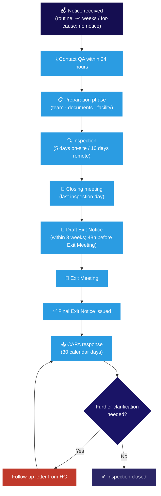

This guide prepares <Tooltip tip="The physician responsible to the sponsor for the conduct of a clinical trial at the site. One QI per study per Canadian site." headline="Qualified Investigator (QI)" cta="Full definition" href="/kb/foundations/glossary#qi">Qualified Investigators</Tooltip> and research teams at the RI-MUHC for Health Canada clinical trial inspections. It covers the inspection framework, roles, preparation checklists, conduct during the visit, and post-inspection follow-up. It is adapted from the RI-MUHC inspection guidance and is Appendix 1 of [SOP-CR-017](/sops/cr-017).

After completing this guide you will be able to describe the purpose and regulatory framework of Health Canada inspections; identify key roles and responsibilities; apply procedures for document preparation, facility readiness, and team coordination; and understand post-inspection CAPA requirements.

<Warning>
Contact <Tooltip tip="All planned and systematic actions to ensure trial data are generated, documented, and reported in compliance with GCP and SOPs." headline="Quality Assurance (QA)" cta="Full definition" href="/kb/foundations/glossary#qa">QA</Tooltip> at **QAClinicalResearch@muhc.mcgill.ca within 24 hours** of receiving an inspection notice. Four weeks is not as much time as it seems.
</Warning>

## How Health Canada conducts inspections

### The Regulatory Operations and Enforcement Branch (ROEB)

Health Canada inspections of clinical trials are conducted by the **Clinical Trial Compliance Program (CTCP)** of the **Regulatory Operations and Enforcement Branch (ROEB)**. The ROEB's responsibilities span three compliance areas: Medical Devices and Clinical Compliance; Clinical Compliance, Border Operations, and Canada Vigilance; and Clinical Trial and Biological Product Compliance.

Health Canada may inspect sponsors, clinical trial sites, Contract Research Organizations (CROs), and Site Management Organizations (SMOs) — during an active trial or after its completion. Remote Compliance Readiness Inspections (CRIs) may also be conducted with new Sponsors or Sponsor-Investigators.

### Regulatory framework

Inspections assess compliance with the following key standards. Reviewing them before an inspection — and knowing where to find them — is good preparation.

| Document | What it covers |
|---|---|
| [Food and Drug Regulations, Part C, Division 5](https://laws-lois.justice.gc.ca/eng/regulations/C.R.C.,_c._870/page-134.html) | Primary Canadian regulation governing drugs for human clinical trials |
| [GUI-0100 — Guidance for Clinical Trials](https://www.canada.ca/en/health-canada/services/drugs-health-products/compliance-enforcement/good-clinical-practices/guidance-documents/guidance-clinical-trials-phases-i-iv-human.html) | Division 5 compliance expectations and inspection procedures |
| [ICH GCP E6(R3)](https://www.canada.ca/en/health-canada/services/drugs-health-products/drug-products/announcements/implementation-ich-e6r3-guideline-notice.html) | International GCP standards for clinical trials — in effect in Canada April 1, 2026 |
| ISO 14155 | GCP for clinical investigations of medical devices (requires purchase) |
| [GUI-0043 — Risk Classification Guide](https://www.canada.ca/en/health-canada/services/drugs-health-products/compliance-enforcement/good-clinical-practices/guidance-documents/risk-classification-guide-observations-inspections-clinical-trials-human-drugs-0043.html) | Criteria for Minor, Major, and Critical inspection observations |
| [POL-0001 — Compliance and Enforcement Policy](https://www.canada.ca/en/health-canada/services/drugs-health-products/compliance-enforcement/good-clinical-practices/policies-procedures/compliance-enforcement-policy-health-products.html) | Health Canada's approach to compliance and enforcement |
| [Drug and Health Product Inspections Database (DHPID)](https://health-products.canada.ca/dhpid-bdipsa/index-eng.jsp) | Database of clinical trial site inspections conducted in Canada |

<Note>
Where Canadian regulations conflict with international GCP standards, Canadian regulations take precedence.
</Note>

### Types of inspections

**Announced inspections** are the most common. Health Canada provides at least 5 business days' notice — typically up to 4 weeks for routine inspections. The <Tooltip tip="The physician responsible to the sponsor for the conduct of a clinical trial at the site. One QI per study per Canadian site." headline="Qualified Investigator (QI)" cta="Full definition" href="/kb/foundations/glossary#qi">QI</Tooltip> receives initial contact by phone or email, followed by a formal **Notice of Inspection Letter** sent to both the QI and the Sponsor. The notice outlines the inspection's purpose, scheduling details, and documents to review.

**Unannounced (for-cause) inspections** occur without advance notice. They are triggered by suspected protocol non-compliance, participant complaints, safety concerns, or data integrity issues.

Inspections are also categorized by modality: **on-site** (minimum 5 business days) or **remote** (up to 10 business days, to accommodate virtual meeting logistics and digital document handling).

### Risk-based site selection

Health Canada uses a risk-based approach when selecting sites. Sites may be chosen based on any of the following factors:

- **Phase of development / device class** — Early-phase trials or high-risk devices are more likely to be selected
- **Trial design and complexity** — Multi-site, double-blind, or otherwise complex designs receive closer scrutiny
- **Participant population / novel therapies** — Vulnerable populations (pediatric, elderly) or therapies with limited safety data are prioritized
- **Drug type and dosage form** — Injectable drugs, high-dose regimens, or invasive investigational devices carry a higher risk profile
- **Adverse events and protocol deviations** — Frequent or severe SAEs, SUSARs, or multiple deviations attract attention
- **Past compliance history** — Sites or investigators with prior inspection findings may be targeted for follow-up

The specific location and size of the site, and the number of trials conducted there, are additional factors.

### What inspectors request before arriving

To support risk-based selection, Health Canada's Inspectorate may request specific information from Sponsors prior to the inspection, including: location and QI name for each site; study status (enrolling, dosing, follow-up, or closed); number of participants enrolled, active, or withdrawn; number and type of serious adverse events or medical device incidents; and the identity of all involved parties (Sponsors, CROs, SMOs). See Appendix 2 — Clinical Trial Information Request Form in SOP-CR-017.

### Key inspection activities

During the visit, inspectors typically conduct: **interviews** with the QI, <Tooltip tip="The team member who handles day-to-day administration and coordination of the clinical trial." headline="Clinical Research Coordinator (CRC)" cta="Full definition" href="/kb/foundations/glossary#crc">CRCs</Tooltip>, and key departments (pharmacy, imaging, biomedical); **documentation review** of all documents in the <Tooltip tip="The QI's collection of documentation demonstrating compliance, study integrity, and participant safety." headline="Investigator Site File (ISF)" cta="Full definition" href="/kb/foundations/glossary#isf">ISF</Tooltip> and source documents; and **facility tours** of relevant areas. Upon completion, the inspector issues a draft **Inspection Exit Notice** summarizing findings and classifying each observation as Critical, Major, or Minor.

### Addressing issues identified during an inspection

Findings are handled by Health Canada's Health Products and Food Branch (HPFB) through a graduated process:

- **Compliance promotion** — For minor issues, the HPFB may provide guidance and support for voluntary corrections
- **Formal enforcement** — For more serious findings, a follow-up inspection or formal CAPA plan may be required
- **Coordination with other branches** — Significant non-compliance may involve the Therapeutic Products Directorate (TPD) or Biologics and Radiopharmaceutical Drugs Directorate (BRDD), which can recommend suspending study authorization or reassessing data validity
- **Criminal investigation** — If non-compliance is deemed criminal in nature (e.g., fraud), Health Canada may initiate an investigation under the Criminal Code of Canada. Note that inspectors have limited authority in criminal cases; such investigations fall under separate legal oversight.

---

## Roles during an inspection

<CardGroup cols={2}>
  <Card title="Qualified Investigator / Sponsor-Investigator" icon="user-doctor">
    Ultimate responsibility for site readiness and team preparation. Attends Opening, Closing, and Exit meetings. Reviews and signs off on all CAPA responses. Cannot delegate medical oversight or accountability for the conduct of the trial.
  </Card>
  <Card title="Clinical Research Coordinator" icon="clipboard-user">
    Primary on-the-ground resource for the inspector — retrieving documents, answering questions, following up on requests. Responsible for ensuring all study documents are organized and accessible throughout the inspection week.
  </Card>
  <Card title="Quality Assurance" icon="shield-check">
    Inspection Facilitator where possible. Supports documentation review prior to inspection, attends Opening and Closing meetings, facilitates CAPA development and tracking after. Contact: QAClinicalResearch@muhc.mcgill.ca
  </Card>
  <Card title="Document Controller" icon="copy">
    Retrieves, copies, redacts, and tracks all documents provided to the inspector. Every copy released must be stamped "certified copy" and "confidential," initialled and dated, and logged on the Document Release Log (SOP-CR-017, Appendix 7).
  </Card>
  <Card title="Site Manager / CIM Manager" icon="building">
    Attends Opening and Closing meetings. Coordinates logistics, notifies the Sponsor and RI-MUHC QA, and schedules the inspection date if allowed. In CIM studies, assigns roles in conjunction with the CIM Compliance Specialist.
  </Card>
  <Card title="Scribe" icon="pen-to-square">
    Takes detailed minutes during the Opening and Closing meetings, the Exit meeting, and any staff interviews. Minutes are circulated after each meeting.
  </Card>
</CardGroup>

| Role | Key responsibilities |
|---|---|
| Qualified Investigator / Sponsor-Investigator | Ensure team training; oversee documentation; accountable for inspection readiness |
| Site Manager / Clinical Research Manager | Schedule meetings; communicate with inspectors and stakeholders; ensure transparent responses |
| Quality Assurance | Train team on SOPs; facilitate documentation; oversee CAPA and compliance |
| Clinical Research Coordinator | Primary inspector liaison; manage documentation; assist with corrective actions |
| Document Controller | Retrieve, copy, redact, and certify documents; maintain log of all documents released |
| Scribe | Record inspection meetings and interviews; document observations and follow-up actions |

---

## Before the inspection

### When you receive the notice

Most routine inspections provide approximately 4 weeks' notice (minimum 5 business days). The Health Canada Inspector contacts the QI by phone or email, then sends a formal **Notice of Inspection Letter** to the QI and the Sponsor. The letter outlines the inspection's purpose, scheduling details, documents to review, and (for participating sites, Sponsors, or other facility types) may include an inspection plan. Further communication is typically by email.

<Steps>
  <Step title="Contact QA within 24 hours">
    Email QAClinicalResearch@muhc.mcgill.ca. QA becomes the Inspection Facilitator and will help organize preparation, coordinate with the Sponsor, and support CAPA development.
  </Step>
  <Step title="Confirm inspection details with the inspector">
    Confirm: inspector name and contact info, study title and protocol number, purpose (routine or for-cause), inspection plan areas, tentative start/end dates, and whether the inspection is on-site or virtual.
  </Step>
  <Step title="Notify key parties">
    Notify: Sponsor/CRO representative(s), <Tooltip tip="The ethics committee that reviews and approves research involving human participants. Also called CER at French-language institutions." headline="Research Ethics Board (REB)" cta="Full definition" href="/kb/foundations/glossary#reb">REB</Tooltip>, institutional authorities, Research Pharmacy, relevant hospital departments (lab, radiology, health records), and all sub-investigators and study coordinators.
  </Step>
  <Step title="Arrange logistics">
    Secure a private, lockable room for the duration of the inspection. Arrange visitor ID and system access for the inspector. Prepare a Document Release Log, a Study Contact List, and Attendance Records. Locate a photocopier and obtain a certified copy stamp and china marker (for redaction).
  </Step>
  <Step title="Schedule a pre-inspection readiness review with QA">
    Request a pre-inspection readiness review from QA (in person or virtual). If time permits, conduct a joint review with the Sponsor representative. Allow at least 2 days for a meaningful review.
  </Step>
</Steps>

### Preparing your team

- Inform all relevant internal and external stakeholders (QA, REB, Sponsor/CRO) about the upcoming inspection. Schedule a pre-inspection readiness meeting to clarify roles and expectations
- Review the study protocol and all study-specific procedures; ensure all team members understand the main study goals, processes, and protocol-specific SOPs
- Schedule a pre-inspection meeting with core team members (QI, Site Manager, CRC) to identify unresolved documentation issues, confirm roles, and review what to expect
- Conduct **mock interviews** — prepare staff for questions covering who, what, when, where, and why. Review Do's and Don'ts (below) before mock sessions
- If the QI is a Sponsor-Investigator: review the monitoring plan, confirm all risk-based items are addressed, and verify all CAPAs are closed, initialled, and dated
- Ensure all relevant departments are informed and available for the inspection week

### Preparing your documents

Organize documents in a format that facilitates the inspection type (on-site or virtual). Review all study documents for content, accuracy, legibility, version dates, attribution, timeliness, and completeness.

<AccordionGroup>

<Accordion title="Regulatory and study authorization documents">
- <Tooltip tip="The QI's collection of documentation demonstrating compliance, study integrity, and participant safety." headline="Investigator Site File (ISF)" cta="Full definition" href="/kb/foundations/glossary#isf">ISF</Tooltip> and/or Trial Master File — review against expected document list; obtain any missing documents
- Health Canada authorization(s) — NOL, ITA, and all correspondence with Health Canada
- REB approvals — initial submission, all annual renewals, all amendments, and ongoing review approvals (SAEs, deviations)
- All REB correspondence; REB composition documentation if required
- MUHC Authorization letter
- All protocol versions and amendments — signed by QI/PI
- <Tooltip tip="Compilation of clinical and nonclinical data on the investigational product relevant to the study." headline="Investigator's Brochure (IB)" cta="Full definition" href="/kb/foundations/glossary#ib">Investigator's Brochure</Tooltip> — all versions, QI acknowledgement pages initialled and dated
- <Tooltip tip="The written document providing the participant with information essential to making an informed decision. Both parties must sign." headline="Informed Consent Form (ICF)" cta="Full definition" href="/kb/foundations/glossary#icf">Informed Consent Forms</Tooltip> — all versions, all language versions
- Clinical trial agreements and contracts — QI responsibilities, data transfer, material transfer, and service agreements
</Accordion>

<Accordion title="Team credentials and training">
- CVs of all site investigators — initialled and dated (required every 2 years)
- CVs/resumes of all key research team members on the <Tooltip tip="Lists each team member, their qualifications, and specific trial tasks authorized by the QI." headline="Task Delegation Log (TDL)" cta="Full definition" href="/kb/foundations/glossary#tdl">Task Delegation Log</Tooltip>
- Current licences for all regulated health professionals on the team (MD, RN, pharmacy, RT, etc.)
- GCP training records — ICH E6 and Division 5 for drug studies
- RI-MUHC SOP Reader and Assessment records (the All-in-One Human Research SOP is available for download from TalentLMS)
- Study-specific protocol training records (SIV slides, sign-off sheets, training logs for all amendments)
- Task Delegation Log — up to date, no undated entries; have the QI correct any discrepancies by initialling and dating
</Accordion>

<Accordion title="Source documents and participant records">
- All source documents: health records, visit notes, lab results, questionnaires, telephone logs
- All signed and dated ICFs — one per participant; confirm correct version was used for each enrolment
- All participant logs — screening log, enrolment log, participant ID log, screen failure log
- Any <Tooltip tip="Document designed to record all protocol-required information to be reported to the sponsor for each participant." headline="Case Report Form (CRF)" cta="Full definition" href="/kb/foundations/glossary#crf">CRF</Tooltip>s and Data Clarification Forms (DCFs) — verify all CRF entries and resolve any queries. After study closure, CRFs should be signed by the QI
- Inclusion/exclusion checklists, study drug orders, medical examination notes, and clinic notes
- Participant recruitment and consent procedures — documented to confirm participants received consistent, accurate information
- Ensure EMR access is arranged — past inspectors have required a CRC to be present when accessing the EMR rather than granting inspectors personal access
</Accordion>

<Accordion title="Safety, deviations, and monitoring records">
- <Tooltip tip="An adverse event meeting seriousness criteria: death, life-threatening, hospitalization, disability, or congenital anomaly." headline="Serious Adverse Event (SAE)" cta="Full definition" href="/kb/foundations/glossary#sae">SAE</Tooltip> reports — all local SAEs, all external SUSARs received from Sponsor; all initialled and dated by QI
- Adverse event assessments by QI — accurately documented, initialled, and dated
- Protocol deviation log and all corresponding CAPA documentation, including REB notifications and acknowledgements
- All monitoring visit logs, Monitoring Letters, and site responses — confirmed initialled and dated by QI
- Sponsor's safety management plan for adverse event management
- DSMB reports (if applicable) — initialled and dated by QI
</Accordion>

<Accordion title="Investigational product and equipment">
- Research Pharmacy copies: all protocol versions, IB(s), pharmacy manual, randomization/emergency un-blinding procedures, copy of NOL
- <Tooltip tip="A drug, medical device, or natural health product being tested or used as a reference in a clinical trial." headline="Investigational Product (IP)" cta="Full definition" href="/kb/foundations/glossary#ip">IP</Tooltip> accountability log, shipping and receipt records, temperature logs, and documentation of any temperature excursions
- Study equipment inventory with maintenance and calibration certificates — one binder per piece of equipment (manufacturer, model, serial number, operating instructions, all calibration and maintenance reports, service repairs)
- All study-specific electronic system validation records (e.g., REDCap validation)
- Laboratory certifications, lab normal ranges, lab staff training records
</Accordion>

</AccordionGroup>

#### Final review for completeness

Before the inspection, conduct a comprehensive review of all documentation against Health Canada's standards. Address discrepancies, missing information, or errors before the inspector arrives.

- **Completeness and accuracy** — confirm all documents are accurate, legible, traceable (with version dates), and complete
- **ISF/TMF compliance** — ensure the ISF or TMF is organized per SOP-CR-015 and ICH GCP E6(R3) Appendix C for drug studies, or ISO 14155 GCP Annexe E for medical device studies
- **Participant logs** — verify that screening, enrolment, and participant ID logs are complete and up to date
- **Consent forms** — confirm all versions are signed, dated, and stored appropriately
- **Task Delegation Log** — confirm accuracy; ensure all corrections are initialled and dated by the QI
- **Agreements and contracts** — confirm all are current, signed, and accessible

<Tip>
A study-specific equipment inventory list with corresponding calibration certificates is preferable to directing an inspector to the general RI-MUHC inventory. Inspectors should not need to search through institution-wide records for study-specific items.
</Tip>

---

## Preparing the facility

Refer to Appendix 1 — Prior to Inspection Visit in SOP-CR-017 for the complete pre-inspection checklist.

<AccordionGroup>

<Accordion title="In the weeks leading up to the inspection">
- **Arrange the inspection room** — Reserve a private, lockable room for the full inspection period. Ensure access to nearby photocopier, reliable WiFi, and computers or devices for document review
- **Coordinate supplies** — Gather certified copy stamps, redaction markers, document release logs, and other stationery (see Appendix 7 — Document Release Log template)
- **Arrange security and access** — Notify security or administration to arrange visitor passes or badges for inspectors. Confirm inspector access to relevant areas (storage, labs); inform personnel about inspection timing
- **Notify surrounding teams** — Ensure all teams in the surrounding work area are aware of the upcoming inspection and instructed to maintain confidentiality of their respective studies at all times
</Accordion>

<Accordion title="In the days leading up to the inspection">
- **Document accessibility and privacy** — Confirm all required documents are accessible; ensure unrelated materials are securely stored out of view
- **System access** — Confirm computers or tablets are configured for document access with necessary software. Verify REDCap or other electronic system access is arranged per institutional approvals
- **Coordinate equipment and supplies** — Confirm photocopier function, paper supply, and all supplies are in the inspection room
</Accordion>

<Accordion title="Morning of the inspection">
- **Room signage** — Place "Health Canada Inspection in Progress" signage on the inspection room door to restrict access (see Appendix 5 — Room Sign template)
- **Final equipment check** — Verify WiFi, photocopiers, and computers are functioning
- **Supplies** — Arrange document release log, certified copy stamps, and redaction tools in the inspection room
- **Secure the corridor** — Ensure the inspector will be escorted through clear corridors directly to the meeting room, not past other sponsors' proprietary information
</Accordion>

</AccordionGroup>

---

## During the inspection

### Day 1 — first contact

- Designate a team member to welcome the inspector upon arrival and escort them directly to the inspection room; ensure any unrelated materials are secured out of view
- Provide visitor identification and any required system access (EMR, database) per institutional approvals; remove all access at end of the last inspection day
- Lock the inspection room whenever the inspector is not present; cover any windows with a view to adjacent rooms

### Opening meeting

The inspection begins with an Opening Meeting conducted by the Health Canada Inspector. All team members on the Task Delegation Log and all relevant departments should make themselves available for the inspection week.

Ask the inspector to present their Health Canada badge and business card. Document the badge number. Key attendees: QI/PI, CRC, QA, Sponsor/CRO representative (at minimum available as needed), Research Pharmacy, lab, and health records. Confirm the inspection schedule and logistics at the end of this meeting.

The inspector may request a facility tour of specific areas (IP storage, laboratories). Designate knowledgeable staff to accompany the inspector during walkthroughs. Tours may also be conducted virtually, with confidentiality maintained at all times.

Bring an Attendance Record (SOP-CR-017, Appendix 9) to this meeting.

### Adapting to the inspector's routine

Each day's activities are directed by the inspector, who may establish a sequence of document reviews, facility tours, and interviews. **The inspector should never be left alone** — ensure someone is available to accompany them at all times throughout the inspection.

### Document handling

- Make **two copies** of every requested document: one for the inspector, one retained by the QI
- Stamp each copy "certified copy" and "confidential," and initial and date
- **Redact all identifiable personal information** — replace participant names with their individual study enrolment number before providing copies to the inspector or Sponsor. If the inspector requests documents containing personal health information, review the ICF and consult with the REB before releasing
- Log every document released on the Document Release Log (SOP-CR-017, Appendix 7), noting whether shared as hard copy or electronically
- For virtual inspections: ensure all files are securely uploaded with password protection; retain a copy of each shared document in institutional records to provide a clear audit trail
- Industry Sponsors requesting copies of released documents: compile their package at the end of the inspection. Personal health information must not be provided to the Sponsor

<Warning>
Only provide documents specifically requested by the inspector. Do not volunteer documents, information, or context beyond what has been asked.
</Warning>

### Inspector communication guidelines

- **Stick to the facts** — answer questions directly, staying focused on relevant details without adding extra or unrelated information
- **Provide timely follow-up** — if a requested document is unavailable, give a clear timeline for when it will be provided; document all follow-up commitments
- **Demonstrate courtesy and confidence** — maintain a professional, positive tone; you are the expert in your study

### End-of-day debriefs

Request a debrief from the inspector at the end of each day. Use it to:
- Receive a verbal summary of observations identified so far
- Provide clarifications and additional requested documents
- Ask questions about observations (but do not debate their merits)
- Take detailed notes (SOP-CR-017, Appendix 10 — Daily Report template)

Hold a separate **internal team debrief** after the inspector's debrief to review outstanding requests, discuss emerging themes, assign responsibilities, and confirm staff availability for the following day.

### What inspectors focus on

<AccordionGroup>

<Accordion title="Regulatory and REB documentation">
Health Canada authorizations and all correspondence with Health Canada (especially for Sponsor-Investigators). REB approvals — initial, all annual renewals, all amendment approvals, and ongoing review approvals (SAEs, deviations, etc.). All REB correspondence. REB composition. Qualified Investigator Undertaking Form. Clinical Trial Site Information Forms (for Sponsor-Investigators).
</Accordion>

<Accordion title="Team credentials and delegation">
Up-to-date CVs (initialled and dated every 2 years) for all investigators and key research team members. Current professional licences for all regulated health professionals. Up-to-date GCP and Division 5 training. Task Delegation Log — completeness, no undated entries, training completed before delegation. Protocol-specific training evidence: SIV slides, meeting sign-offs, training logs for all amendments.
</Accordion>

<Accordion title="Protocol adherence and medical oversight">
Assessment of whether the study was conducted per the approved protocol. QI documentation of all study-related medical decisions. Inclusion/exclusion checklists, study drug orders, clinic notes, medical examinations, QI sign-off on all lab results. Safety management plan. Recruitment and consent procedures.
</Accordion>

<Accordion title="Informed consent">
Consent obtained with the correct ICF version for each participant, in the appropriate language, signed and dated before enrolment by the participant (or legally authorized representative), witness (if applicable), and person obtaining consent. Consent procedures documented in source.
</Accordion>

<Accordion title="Safety reporting — SAEs and deviations">
All SAEs and SUSARs: assessment by QI, timeliness of reporting to Sponsor, REB, and Health Canada (for Sponsor-Investigators). Protocol deviations: documentation, reporting timelines, CAPAs. DSMB reports if applicable. All monitoring follow-up letters reviewed, initialled, and dated by QI.
</Accordion>

<Accordion title="Record handling and data integrity">
Source data accuracy, legibility, and contemporaneity. Traceability between source documents and CRFs. Data source guide (where data are located and in what format). Timelines for reporting data to Sponsor. All records kept securely and accessible. Confirmed 15-year retention provision.
</Accordion>

<Accordion title="Investigational product handling">
Review of the Research Pharmacy area. IP accountability records (receipt, dispensing, returns, destruction). Shipping and temperature records. IP labelling compliance with Division 5 C.05.011. Storage conditions (secure, segregated, temperature-controlled). Documentation of any temperature excursions. Randomization and emergency un-blinding procedures.
</Accordion>

<Accordion title="Study equipment and biological specimens">
Maintenance and calibration records for all study-specific equipment (one file per device: manufacturer, model, serial number, operating instructions, all calibration and maintenance reports, service repairs). For studies with biological specimens: laboratory staff training records, lab certification/accreditation, collection/processing/shipping documentation per protocol, temperature records for specimen storage.
</Accordion>

<Accordion title="Study monitoring">
Sponsor's Monitoring Plan in the TMF. Site Initiation Visit report, SIV slides, and SIV attendance log. Monitoring visit log and all monitoring follow-up letters on file. Evidence of QI/PI initials and date on all monitoring letters. For Sponsor-Investigators: TMF monitoring documentation across all sites.
</Accordion>

</AccordionGroup>

### QI/PI interview

The inspector may request a separate interview with the QI/PI to assess their oversight and knowledge of the trial. Topics typically include: investigator qualifications and experience, overall impression of trial conduct, training received (SIV, IB, protocol, amendments), confirmation that site SOPs were in place, source documentation practices, deviation and SAE handling, and delegation overview.

### Closing meeting

The inspector presents a verbal summary of observations — typically already discussed in daily debriefs. The inspector will briefly review the scope of the inspection, summarize activities conducted, and provide an overview of Health Canada's risk ratings for observations. Clarifications and last supporting documents can be offered here.

The inspector outlines next steps and the tentative timeline for the draft Inspection Exit Notice. Begin thinking about CAPA responses before the written draft arrives.

Bring an Attendance Record (SOP-CR-017, Appendix 9). The QI, key CRCs, and QA must attend. Sponsor representatives and key department contacts attend depending on the nature of findings.

---

## After the inspection

### Inspection Exit Notice

The draft Exit Notice is provided to the QI **48 hours before** the Exit Meeting, which must be scheduled within **3 weeks** of the last inspection day. The notice includes: site profile; key personnel; protocol title and number; investigational product; and all observations classified by risk level.

Each observation is classified as Critical (Risk 1), Major (Risk 2), or Minor (Risk 3). See [Monitoring, Audits, and Inspections](/kb/conduct/safety-reporting/monitoring-audits) for the finding classification definitions.

The overall compliance rating is either **Compliant** (minor and major observations only) or **Non-Compliant** (one or more critical findings, or multiple systematic major observations). A "Non-Compliant with conditions" rating may also be issued.

### Exit meeting

Attend with the QI, CRCs, and QA. The inspector reviews the draft Exit Notice with the QI — corrections, clarifications, and revisions to the draft may be proposed at this meeting. The inspector confirms the timeline for issuing the Final Exit Notice and the deadline for the QI's and Sponsor's formal response — usually **30 calendar days**.

Bring an Attendance Record (SOP-CR-017, Appendix 9).

### CAPA response

Prepare a formal written response to all open observations in the Final Exit Notice. For each observation:

<Steps>
  <Step title="Develop a formal response">
    Outline specific corrective actions taken and preventive measures implemented. Include supporting documents as evidence of compliance. Use SOP-CR-017 Appendix 2 — Health Canada Inspection Response Form if one was not provided by your Sponsor.
  </Step>
  <Step title="Submit within the deadline">
    Health Canada specifies a submission deadline (typically 30 calendar days from issuance of the Final Exit Notice). Ensure all documentation is complete and submitted promptly.
  </Step>
  <Step title="Additional follow-up if required">
    If Health Canada requires further clarification, the inspector will issue a follow-up letter. Provide a timely response addressing any remaining observations and include supplementary evidence as necessary.
  </Step>
  <Step title="Inspection closure">
    When Health Canada reviews and accepts all responses and no further actions are required, the inspector issues a written acknowledgement to the QI and Sponsor — the inspection cycle is formally closed.
  </Step>
</Steps>

File all inspection documents — the final report, all correspondence, and the final CAPA response — **confidentially and separately** from study trial files. Send a copy of the final report and final CAPA response to RI-MUHC QA.

<Note>
Medical devices and Natural Health Products inspections are currently in the pilot phase. The Health Canada inspector will provide guidance and support throughout the process.
</Note>

---

## Do's and Don'ts

<CardGroup cols={2}>
  <Card title="Do" icon="circle-check">
    - Be honest, polite, and cooperative
    - Be direct, factual, brief, and precise
    - Be professional and confident — you are the expert in your study
    - Ask for clarification if you don't understand a question
    - Only answer within your area of expertise — find an expert if needed
    - Say "I don't know — I'll get back to you" when you don't know
    - Provide a realistic time estimate when retrieving documents
    - Follow through on every commitment made to the inspector
    - Document everything
    - Ask for clarification of findings if needed — but don't debate them
  </Card>
  <Card title="Don't / Never" icon="circle-xmark">
    - Guess at answers — defer until you have the correct information
    - Offer unsolicited information or context beyond what was asked
    - Become defensive or take findings personally
    - Express personal opinions on trial conduct or findings
    - Reply on behalf of someone else
    - Argue with the inspector
    - Promise anything on the spot
    - Mislead the inspector or provide incorrect information
    - Say "never" (it is almost never accurate)
    - Give the inspector more than they asked for
  </Card>
</CardGroup>

---

## Questions inspectors may ask

Use these to prepare for mock interviews. Inspectors tend to probe any area in depth — these represent common lines of questioning, not an exhaustive list.

<AccordionGroup>

<Accordion title="Study overview, team, and training">
- How many trials is the QI/PI currently working on? Describe each.
- How many sub-investigators and coordinators are involved?
- How was training delivered? Was there an investigator meeting?
- How was the protocol reviewed with sub-investigators?
- Who monitored the study? How often? Was there a pre-study feasibility visit and SIV?
- Was the Sponsor/CRO accessible during the study?
- What is your process for documenting protocol-specific training?
</Accordion>

<Accordion title="Consent and enrollment">
- Who is responsible for obtaining informed consent?
- Who assesses inclusion/exclusion criteria?
- What is the date of first participant IC and first dosing?
- Were there any screen failures or withdrawals?
- Do you have an ICF SOP?
- Do you inform participants' GPs of their participation? Is consent obtained for this?
- Were any participants who regained consciousness re-consented?
</Accordion>

<Accordion title="Safety reporting">
- Were there any SAEs? SUSARs?
- Who assessed causality of adverse events? Is there an SOP for this?
- What is your process for reporting SAEs to the REB, Sponsor, and Health Canada?
- Were there any protocol deviations? Were they reported to the Sponsor?
- Were there any safety reports from the DSMB?
</Accordion>

<Accordion title="Data and records">
- Who enters eCRF data? Who has access? Who can alter data?
- Has the database been validated, backed up, and is there an audit trail?
- How is source data documented?
- What data requires sign-off from the QI/PI?
- Where is source data stored? Is the office locked?
- Do you have a record retention SOP? Are provisions confirmed for 15-year retention?
- Is there a disaster recovery plan (generators, backup equipment)?
</Accordion>

<Accordion title="Investigational product">
- Where is the medication stored? Who is the importer?
- What is the flow of the study drug from receipt to dispensing?
- Is a drug accountability log maintained?
- Is the drug temperature recorded? Is there an alarm for temperature deviations?
- What temperature excursion period and tolerance applies to this drug?
- Is IP temperature monitored while in transit?
- Where can stability information for the drug be found?
</Accordion>

</AccordionGroup>

---

## Common inspection findings — self-audit matrix

Health Canada does not publish an aggregated public summary of recurring inspection findings, but the [Drug and Health Product Inspections Database (DHPID)](https://health-products.canada.ca/dhpid-bdipsa/index-eng.jsp) is searchable and patterns are consistent across years. The table below maps the most frequently observed finding categories to the applicable RI-MUHC SOP and a primary mitigation step. Use it as a self-audit checklist before an inspection notice arrives — not only after one does.

| Finding category | What inspectors flag | Applicable SOP | Primary mitigation |
|---|---|---|---|
| **Task Delegation Log** | Missing entries for team members performing delegated tasks; undated or unsigned entries; TDL not updated after amendments or personnel changes | [SOP-CR-002](/sops/cr-002) | Audit the TDL against the current team roster and all protocol versions at least quarterly. Any correction must be initialled and dated by the QI — white-out is never acceptable. |
| **PI / QI medical oversight** | No contemporaneous evidence the QI reviewed SAE assessments, eligibility decisions, or deviation corrections; QI signature applied in bulk after the fact | [SOP-CR-002](/sops/cr-002), [SOP-CR-012](/sops/cr-012) | QI must initial and date SAE reports, eligibility checklists, and deviation logs at the time of review — not at the end of the month. Reviewers can verify this from the source document timestamps. |
| **Source documentation** | Source not clearly defined (no source document plan); data in CRF not traceable to a source; clinic notes not contemporaneous; "source" changed without explanation | [SOP-CR-011](/sops/cr-011) | Define source for every protocol data point in the monitoring plan or a source document plan before activation. Any retrospective correction requires a single strikethrough, initial, date, and reason. |
| **Informed consent process** | Wrong ICF version used after an amendment; pre-consent screening activities documented in the source; re-consent not obtained when required; consent witness absent or not documented | [SOP-CR-006](/sops/cr-006), [SOP-CR-008](/sops/cr-008) | Maintain a version-control log for all ICF versions with effective dates. After each amendment, audit existing participants to confirm re-consent where required. Consent must be documented before any protocol procedure. |
| **Investigational product accountability** | Dispense and return quantities do not reconcile; temperature excursion not documented or acted on; shipping receipt not confirmed and dated; label discrepancies | [SOP-CR-010](/sops/cr-010) | Reconcile IP accountability at every visit and confirm the reconciliation in writing. Any temperature excursion — even within tolerance — must be documented and sponsor notified; do not assume it is acceptable without written confirmation. |
| **Protocol training records** | No documentation of amendment-specific training; SIV training sign-off sheets missing; GCP certificates expired or predating the study; training for new team members not documented before first delegation | [SOP-CR-003](/sops/cr-003), [SOP-CR-005](/sops/cr-005) | Every protocol amendment must produce a new training record for all relevant team members before they act on the amendment. GCP training must be current (within the period specified by the sponsor or within 2 years per RI-MUHC policy) at activation and throughout the study. |

<Tip>
  Request a QA readiness review at least once per active study year — not only in response to an inspection notice. QA can identify TDL gaps, ICF version mismatches, and IP reconciliation errors before they appear on an Exit Notice.
</Tip>

---

## Related resources

- [Monitoring, Audits, and Inspections](/kb/conduct/safety-reporting/monitoring-audits) — inspection types, finding classifications, and how inspections are triggered
- [SOP-CR-017](/sops/cr-017) — Audits and Inspections (includes all appendix forms: Pre-Inspection Checklist, Document Checklist, Inspection Plan Checklist, Document Release Log, Room Sign, Do's and Don'ts, Attendance Records, Daily Report, Contact List)
- [The Investigator Site File](/kb/site-activation/isf) — ISF organization and maintenance
- [GUI-0100 — Guidance for Clinical Trials](https://www.canada.ca/en/health-canada/services/drugs-health-products/compliance-enforcement/good-clinical-practices/guidance-documents/guidance-clinical-trials-phases-i-iv-human.html)
- [GUI-0043 — Risk Classification Guide for Inspection Observations](https://www.canada.ca/en/health-canada/services/drugs-health-products/compliance-enforcement/good-clinical-practices/guidance-documents/risk-classification-guide-observations-inspections-clinical-trials-human-drugs-0043.html)
- [POL-0001 — Compliance and Enforcement Policy](https://www.canada.ca/en/health-canada/services/drugs-health-products/compliance-enforcement/good-clinical-practices/policies-procedures/compliance-enforcement-policy-health-products.html)
- [Drug and Health Product Inspections Database (DHPID)](https://health-products.canada.ca/dhpid-bdipsa/index-eng.jsp)

  
  

    
<strong>Looking to go deeper?</strong> Canada's national clinical trials training platform offers free, self-paced courses for RI-MUHC investigators, staff, and trainees. You might be interested in this course:

    <ul>
      <li><em>Health Canada Inspections</em></li>
    </ul>
  

