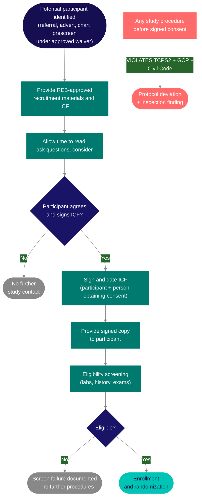
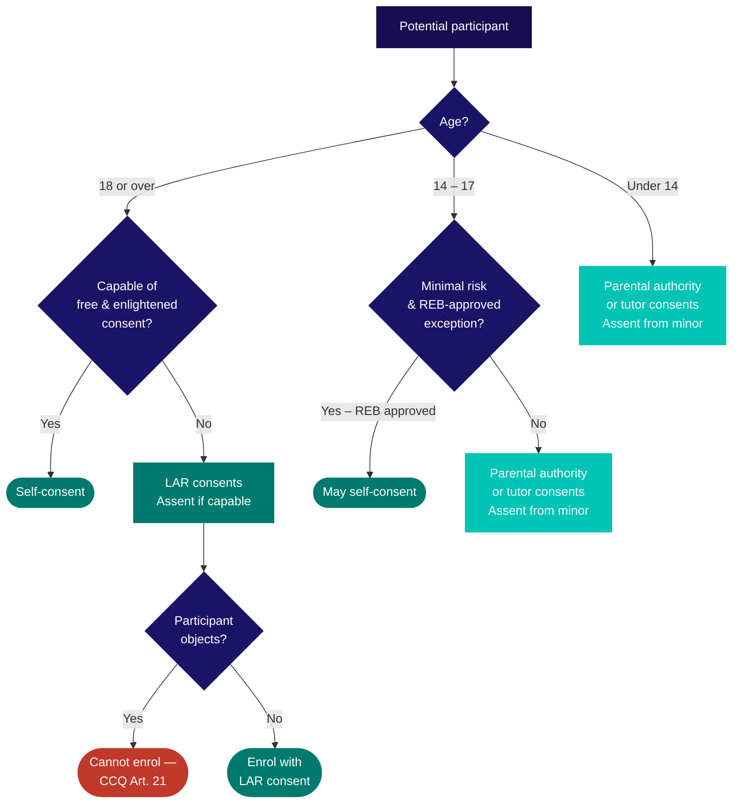

In Quebec, the right to consent to research participation flows from the Civil Code — provincial law — not common law. Who can consent, who can consent on someone else's behalf, and what the consent form must contain are all shaped by rules that apply specifically here and differ in important ways from the rest of Canada. The consent process is governed by [SOP-CR-006](/sops/cr-006) (Informed Consent Forms) and [SOP-CR-008](/sops/cr-008) (Informed Consent Process).

## Consent must precede every study procedure

No study procedure — including screening blood draws, eligibility chart reviews, or questionnaires — may be performed before written informed consent is obtained. The diagram below shows the required sequence:

The most common deviation is drawing screening labs or recording history into the eCRF before the ICF is signed — even by minutes. If a study-specific procedure is needed before formal screening (e.g., a chart review to confirm potential eligibility), it requires either signed consent or an REB-approved consent waiver under TCPS2 Article 5.5A.

## The legal basis: the Civil Code

Consent to research in Quebec is governed by the *Civil Code of Québec* (CCQ). The practical consequence is that the rules for who can give consent, who can give substitute consent, and under what conditions consent can be waived are all defined by the CCQ and interpreted by Quebec courts — not by the general <Tooltip tip="International standard for design, conduct, monitoring, recording, and reporting of clinical studies." headline="Good Clinical Practice (GCP)" cta="Full definition" href="/kb/glossary#gcp">GCP</Tooltip> framework.

Three articles of the CCQ are directly relevant to research consent:

<AccordionGroup>
  <Accordion title="CCQ Art. 20 — proportionality of risk">
    Research affecting personal integrity may only proceed when the risk is not disproportionate to the expected benefit and the project has <Tooltip tip="The ethics committee that reviews and approves research involving human participants. Also called CER at French-language institutions." headline="Research Ethics Board (REB)" cta="Full definition" href="/kb/glossary#reb">REB</Tooltip> approval. The threshold is proportionality, not zero risk.
  </Accordion>
  <Accordion title="CCQ Art. 21 — minors and incapable adults">
    Governs research with minors and adults who cannot consent. A minor aged 14 or older, or an incapacitated adult who understands and objects, cannot be enrolled regardless of what a substitute decision-maker has authorized. Only MSSS-designated REBs may review Article 21 research. The MUHC REB holds this designation. For detailed guidance on pediatric consent, assent, and parental authority, see [Pediatric Research Considerations](/kb/pediatric-research). For broader vulnerability protections, see [Vulnerable Populations](/kb/vulnerable-populations).
  </Accordion>
  <Accordion title="CCQ Art. 25 — compensation limits">
    Prohibits financial compensation beyond actual loss reimbursement. This is stricter than both TCPS2 and ICH GCP, which permit payment to healthy Phase I volunteers. In Quebec, compensation must not constitute undue inducement — it must be calibrated to what a person actually lost by participating, not as an incentive to participate.
  </Accordion>
</AccordionGroup>

## Age of consent in Quebec

**The age of majority for research consent in Quebec is 18, not 16.** This is a common source of confusion for teams who have worked in other provinces. A 17-year-old patient can consent to their own medical care in Quebec but cannot independently consent to research participation unless the minimal-risk exception expressly applies and the REB has approved it.

| Situation | Rule |
|---|---|
| Adult (18 and over) | Provides their own consent. No substitute consent is permitted simply because a physician or family member prefers it. The person must be capable of giving free and enlightened consent. |
| Minor (under 18) — general rule | Consent must be given by the person holding parental authority or the tutor (CCQ Art. 21). The minor must be involved in the discussion to the extent they are able to understand, and should sign an assent document if capable. |
| Minor aged 14 to 17 — minimal risk research | May consent independently, but only if the REB has expressly confirmed the research presents minimal risk and has approved this arrangement. This exception requires explicit REB authorization — it is not assumed. |
| Incompetent adult | Consent given by a legally appointed representative (LAR) — a person formally authorized under Quebec civil law. The LAR's name and relationship must be documented. The participant signs an assent portion of the <Tooltip tip="The written document providing the participant with information essential to making an informed decision. Both parties must sign." headline="Informed Consent Form (ICF)" cta="Full definition" href="/kb/glossary#icf">ICF</Tooltip> if they are capable of doing so. |
| Emergency — adult suddenly incapacitated, no time to designate an LAR | The person authorized to consent to care for that individual may give consent, but only if the REB has determined in advance that this emergency provision applies to the study. The protocol must describe the measures that apply. |
| Minor reaches 18 or incompetent adult recovers capacity during study | Obtain legally effective signed consent from the participant directly as soon as possible after reaching majority or recovering capacity. |

## The treating physician restriction

[SOP-CR-008](/sops/cr-008) §5.1.1 states that the person obtaining consent should not be the participant's treating physician or another person with a long-standing relationship with the participant. The reason is undue influence: a patient who trusts and depends on their physician may feel unable to refuse, even if refusal would be entirely reasonable.

In practice, the <Tooltip tip="The team member who handles day-to-day administration and coordination of the clinical trial." headline="Clinical Research Coordinator (CRC)" cta="Full definition" href="/kb/glossary#crc">CRC</Tooltip> or a research team member who is not the participant's own physician should conduct the consent discussion. The <Tooltip tip="The physician responsible to the sponsor for the conduct of a clinical trial at the site. One QI per study per Canadian site." headline="Qualified Investigator (QI)" cta="Full definition" href="/kb/glossary#qi">QI</Tooltip>/PI may be present and available for questions, but the person with the primary patient relationship should not be the one asking for consent.

<Note>
If the treating physician is genuinely the best-qualified person to explain the study, explain to the REB why this is necessary. If the REB approves it, the physician must disclose their dual role to the participant at the time of consent. The same principle applies to treating nurses and other clinicians with established relationships with the participant.
</Note>

## MSSS paragraph requirements

Because Quebec law grants specific rights to research participants, those rights must be reflected explicitly in the ICF. The Ministère de la Santé et des Services Sociaux (MSSS) mandates five specific paragraphs in all ICFs submitted to Quebec REBs. These are not optional additions — they are provincial requirements. An ICF without them will be rejected.

The five required sections cover:

1. Voluntary participation and the right to withdraw without consequence
2. Confidentiality and data protection
3. What will happen if you suffer any harm during the study
4. Contact information for questions
5. Signatures

<Warning>
Always start from the CAE templates available at muhc.ca/cae. These already contain the mandatory provincial wording, shown in red text, required by Quebec law. If a sponsor provides their own ICF template, that wording must be inserted before submitting to the REB. Use the [Verification of ICF Document](https://portal.rimuhc.ca/pls/apex/MUHC2.download_my_file?p_file=249038753110964987) ([SOP-CR-006](/sops/cr-006#appendices), Appendix 1) as the checklist to confirm everything required is present before submission.
</Warning>

For studies involving an <Tooltip tip="A drug, medical device, or natural health product being tested or used as a reference in a clinical trial." headline="Investigational Product (IP)" cta="Full definition" href="/kb/glossary#ip">investigational product</Tooltip> — drug, natural health product, or medical device — the ICF must be printed on MUHC hospital letterhead and include the MUHC Medical Records barcode **FMU-9997**. This barcode ensures the research ICF is filed in the Alert section of the participant's OACIS electronic medical record, making it visible to treating clinicians in an emergency.

All participant-facing materials, including the ICF, must be available in both English and French. Submit participant materials to the REB in editable Word format — not PDF. A [Translation Certificate](https://portal.rimuhc.ca/pls/apex/MUHC2.download_my_file?p_file=249039073901978848) ([SOP-CR-006](/sops/cr-006#appendices), Appendix 2) must be completed for translated versions.

## Exceptional situations

| Situation | What applies |
|---|---|
| Participant cannot read | An impartial witness must be present for the entire consent discussion. The ICF is read aloud and explained. The witness signs the ICF, attesting that the information was accurately explained, understood, and consent was freely given. Verbal consent is documented ([SOP-CR-008](/sops/cr-008) §5.9). |
| Participant does not speak English or French | Consent discussion must take place in the participant's preferred language using an impartial qualified interpreter. A certified translation of the ICF must be provided if possible; the interpreter signs the ICF. Non-English/French-speaking participants cannot be excluded solely on language grounds (TCPS2). A Translation Certificate must be completed ([SOP-CR-008](/sops/cr-008) §5.10). |
| Remote or electronic consent (eICF) | A written remote consent procedure must be submitted to the REB alongside the ICF. The eICF platform must be validated and compliant with Health Canada GUI-0100 and 21 CFR Part 11. Electronic signatures are acceptable if compliant with provincial, regulatory, and REB requirements ([SOP-CR-008](/sops/cr-008) §5.2). |
| Consent waiver — records-based research | The REB may grant a waiver of consent for retrospective or records-based research. When health records are accessed without consent, an EFVP must be submitted. See [Privacy and Confidentiality in Quebec](/kb/privacy) for the EFVP framework. |

## Ongoing consent and re-consent

Consent is not a one-time event at enrolment. Three situations require re-consent:

- **Amended ICF:** if the ICF is amended — because of new safety information, a protocol change, or any other reason — participants must be re-consented at their earliest visit after the REB approves the amended ICF. Do not re-consent before written REB approval is in hand.
- **Important new information:** if information becomes available during the study that may be relevant to a participant's decision to continue, they must be informed and this must be documented.
- **Capacity restored:** if a participant who was initially enrolled through an LAR recovers capacity during the study, their legally effective signed consent must be obtained as soon as possible.

Re-consent is documented on the [Informed Consent Process Checklist](https://portal.rimuhc.ca/pls/apex/MUHC2.download_my_file?p_file=249391094414134256) ([SOP-CR-008](/sops/cr-008#appendices), Appendix 3). Each re-consented participant receives a copy of the signed amended ICF. The original signed amended ICF and the checklist are filed with the study source documents.

## Other populations requiring consideration

TCPS2 Chapter 4 identifies additional populations whose circumstances may require specific ethical consideration. These are not automatic exclusions — the principle is that people should neither be unfairly excluded from research nor be inappropriately included because of a vulnerability.

<AccordionGroup>
  <Accordion title="Pregnant participants">
    Research involving pregnant participants requires careful consideration of risks to both the participant and the fetus. Where a study involves an investigational product with unknown effects in pregnancy, the protocol must address how pregnancies occurring during the study will be handled, including Exposure in Utero (EIU) reporting obligations ([SOP-CR-012](/sops/cr-012)). Pregnant participants are not automatically excluded — exclusion must be scientifically justified and approved by the REB.
  </Accordion>
  <Accordion title="Participants in dependent relationships">
    TCPS2 identifies a heightened risk of undue influence in situations of dependency — prisoners, institutionalized persons, employees in studies conducted by their employer, students in studies conducted by their instructor. The concern is not that these people cannot consent, but that the power relationship may compromise the voluntariness of their decision. The REB will assess what measures are in place to ensure participation is genuinely free.
  </Accordion>
  <Accordion title="Participants at the margins of capacity">
    Cognitive impairment exists on a continuum. A person may have reduced capacity without losing it entirely, and capacity may fluctuate over time. The standard is whether the person sufficiently understands the nature of the study and the risks and potential benefits at the time consent is sought. Where capacity is uncertain, consult the REB on how to assess and document it and whether an LAR is required.
  </Accordion>
</AccordionGroup>

---

## Related resources

- [Study Conduct Overview](/kb/conduct-overview) — lifecycle stages and regulatory context
- [Recruitment, Screening, and Enrollment](/kb/recruitment-enrollment) — pre-screening, EFVP authorization, enrollment procedures
- [Privacy and Confidentiality](/kb/privacy) — confidentiality agreements, data access controls
- [Reportable Events and Protocol Deviations](/kb/reportable-events) — when a consent deviation triggers re-consent
- [SOP-CR-006 — Informed Consent Documents](/sops/cr-006) — ICF preparation, verification, and tracking
- [SOP-CR-008 — Obtaining Informed Consent](/sops/cr-008) — consent process, wallet cards, checklists

  
  

    
<strong>Looking to go deeper?</strong> Canada's national clinical trials training platform offers free, self-paced courses for RI-MUHC investigators, staff, and trainees. You might be interested in these courses:

    <ul>
      <li><em>Ethics and Informed Consent</em></li>
      <li><em>Informed Consent Process</em></li>
    </ul>
  

