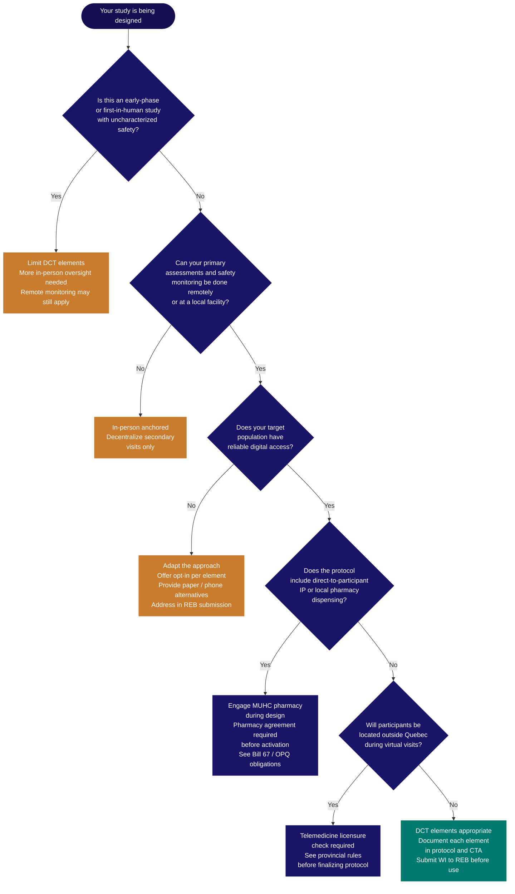

Decentralized elements — virtual visits, home visits, remote monitoring, electronic consent — are design decisions made before the protocol is written. They must be described in the protocol, justified in the <Tooltip tip="Application to Health Canada for authorization to conduct a drug trial under Division 5 of the Food and Drug Regulations." headline="Clinical Trial Application (CTA)" cta="Full definition" href="/kb/glossary#cta">CTA</Tooltip>, and approved by the <Tooltip tip="The ethics committee that reviews and approves research involving human participants. Also called CER at French-language institutions." headline="Research Ethics Board (REB)" cta="Full definition" href="/kb/glossary#reb">REB</Tooltip>. This page covers what to consider, what to document, and how the regulatory landscape is evolving. For running a decentralized trial once the protocol is approved, see Conducting a Decentralized Trial.

## What decentralization means

A decentralized clinical trial conducts some or all trial activities at locations other than the main clinical site — at participants' homes, community health settings, or through digital platforms. Any level of decentralization is possible: a single element such as remote follow-up visits added to a conventional trial is as valid as a fully decentralized design.

The **single-site principle** is fundamental. A decentralized MUHC trial has one main location — the MUHC site associated with the <Tooltip tip="The physician responsible to the sponsor for the conduct of a clinical trial at the site. One QI per study per Canadian site." headline="Qualified Investigator (QI)" cta="Full definition" href="/kb/glossary#qi">QI</Tooltip>/PI, listed on the Clinical Trial Site Information (CTSI) form submitted to Health Canada, and the site for which REB approval is held. All other locations where trial activities occur under the QI/PI's supervision are considered part of that single clinical trial site. Health Canada does not require separate CTSI forms or REB approvals for delegated locations, provided they are overseen by the QI/PI and follow the approved protocol.

All locations operate under the QI/PI's supervision and within the scope of a single REB approval.

The compliance standard does not change with decentralization. Health Canada's draft guidance (December 2025) makes this explicit: the regulatory requirements are the same as for any other clinical trial. Discuss any planned decentralized elements with <Tooltip tip="All planned and systematic actions to ensure trial data are generated, documented, and reported in compliance with GCP and SOPs." headline="Quality Assurance (QA)" cta="Full definition" href="/kb/glossary#qa">QA</Tooltip> before writing the protocol.

<Warning>
Health Canada's December 2025 draft guidance on decentralized trials will be updated once the proposed new Clinical Trials Regulations come into force. Treat it as current best practice, but confirm with QA before submission. See the Regulatory horizon section below.
</Warning>

## Why it matters: access, equity, and the direction of travel

Decentralized trials reduce the travel burden on participants and expand who can realistically participate in research. For studies targeting rare diseases, elderly participants, or geographically dispersed populations, decentralization may be the difference between achieving representative enrolment and failing to. Health Canada's draft guidance specifically identifies decentralized methods as a tool for connecting researchers in remote areas to pan-Canadian research, broadening diversity in participant populations, and reducing drop-out caused by visit burden.

This is also the direction the entire regulatory framework is moving. ICH E6(R3) — finalized January 2025 and effective in Canada April 1, 2026 — formally integrates decentralized trial design, remote monitoring, and electronic consent into the <Tooltip tip="International standard for design, conduct, monitoring, recording, and reporting of clinical studies." headline="Good Clinical Practice (GCP)" cta="Full definition" href="/kb/glossary#gcp">GCP</Tooltip> framework. The proposed new Canadian Clinical Trials Regulations explicitly accommodate decentralized elements. Teams who understand decentralized design will have a meaningful advantage as this becomes the expected norm rather than the exception.

## Suitability assessment

Not all trials are equally suited to decentralization. The core design principle from Health Canada is proportionality: the level of decentralization should be proportionate to participant risk, operationally feasible, and implemented with appropriate safeguards. Where possible, participants should have flexible opt-in or opt-out options for each decentralized element.

Assess the following during study design:

**<Tooltip tip="A drug, medical device, or natural health product being tested or used as a reference in a clinical trial." headline="Investigational Product (IP)" cta="Full definition" href="/kb/glossary#ip">IP</Tooltip> safety profile** — Established safety profiles support more decentralization; first-in-human or early-phase studies require more intensive in-person oversight.

**Specialized procedures** — Some assessments cannot be conducted remotely (certain imaging, complex pharmacy procedures); these anchor in-person requirements.

**Participant population** — Elderly participants, those with limited digital access, or populations where consent complexity is high may need adapted approaches to eICF or virtual visits; this must be addressed in the WI and REB submission.

**Interprovincial considerations** — Decentralized elements crossing provincial borders introduce additional privacy and professional licensing considerations that must be addressed in the protocol.

**Data integrity** — Remote data capture platforms must be validated; source data must be clearly defined when originating from wearables or ePRO tools; audit trail requirements apply from day one.

**IP logistics** — If direct-to-participant IP is planned, cold-chain requirements, chain-of-custody, and Quebec pharmacy obligations must be addressed before the pharmacy agreement is drafted.

## Is your study suitable for DCT elements?

Work through the questions below before deciding which elements to include in the protocol. Each "limit" outcome does not mean DCT is off the table — it means the element in question needs additional safeguards, adaptation, or should be scoped back.

For element-by-element requirements once suitability is confirmed, see the table in [Decentralized elements at a glance](#decentralized-elements-at-a-glance) below.

## Single-site with decentralized elements vs. multi-site

When a study will reach participants across a wide geographic area, there is a structural decision to make: run it as a single MUHC site with decentralized elements, or as a multi-site trial with separate QIs at each site. These have meaningfully different administrative, regulatory, and operational implications. This decision shapes the protocol and the CTA.

| Consideration | Single-site with decentralized elements | Multi-site trial |
|--------------|----------------------------------------|-----------------|
| Trial suitability | Complex initial assessments at MUHC; follow-ups delegated remotely | Large cohorts, or studies requiring in-person site-specific interactions at multiple locations |
| QI oversight | Single QI/PI at MUHC responsible for all locations | Separate QI responsible for each site |
| REB approval | One MUHC REB approval; no additional approvals for delegated locations within QI scope | REB approval required per site; CATALIS or CanReview streamlined review applicable for Quebec or multi-provincial studies |
| Health Canada | One CTSI form; one CTA | Separate CTSI per site; same CTA protocol; each site listed |
| Interprovincial | Cross-provincial delegated activities introduce provincial privacy and licensing considerations for the single QI to manage | Each site adapts to local provincial laws; adds coordination complexity but provides clearer local accountability |
| <Tooltip tip="Lists each team member, their qualifications, and specific trial tasks authorized by the QI." headline="Task Delegation Log (TDL)" cta="Full definition" href="/kb/glossary#tdl">Delegation log</Tooltip> | Single TDL at MUHC covers all delegated personnel including those at other locations | Each QI maintains their own TDL for their site |

For multi-site studies within Quebec's <Tooltip tip="Quebec's public health and social services network (Réseau de la santé et des services sociaux), including the RI-MUHC." headline="RSSS" cta="Full definition" href="/kb/glossary#rsss">RSSS</Tooltip> network, see [Multi-Centric Studies in Quebec](/kb/multi-centric).

## What must be in the protocol

Every decentralized element must be described in the protocol before submission. The REB will review them as part of ethics review, and any addition of decentralized elements after approval requires an amendment. The protocol must document:

- Which activities will be conducted at the main MUHC location and which will be decentralized
- Which location types (home, satellite, virtual) each decentralized element involves
- The eICF procedure, if applicable — platform, WI reference, how understanding will be assessed remotely
- All third parties involved in delivering care or collecting data away from the main site, and how they will be contracted and overseen
- How data will be transmitted and protected in transit and at each location
- Decentralization-related risks identified by the sponsor and how they will be managed
- How participants can opt in or out of specific decentralized elements

## CTA requirements for decentralized elements

As part of the CTA, sponsors must document how trial visits and activities will be conducted — whether in person, by telephone, or by telehealth platform — and how the decentralized approach is proportionate to the risk the trial poses to participants. Sponsors must also attest that:

- Participants will be informed of the risks and benefits of the decentralized elements
- Participant risk is minimized and safety will be appropriately monitored throughout
- The decentralized approach does not work against the best interest of participants
- The study objectives can be achieved with the proposed decentralized design

For the full submission checklist, see Preparing Your Submission.

## Decentralized elements at a glance

The table below summarizes the decentralized elements that may be incorporated into an MUHC trial and their key requirements. For conduct-phase guidance on each element, see Conducting a Decentralized Trial.

| Element | Description | Key protocol and design requirement |
|---------|-------------|-------------------------------------|
| Virtual participant visits | Video or telephone visits in place of in-person clinic visits | Described in protocol; REB-approved before use; consent process adapted if applicable |
| Home visits | Delegated research personnel or community health care providers at participant's home | Third-party contract required; roles documented in protocol; delegation on TDL |
| Wearables and ePRO | Wearable sensors, apps, or patient-reported outcome platforms | Platform validated per ICH E6(R3) and 21 CFR Part 11; source data definition documented in protocol; audit trail required from activation |
| Remote monitoring | Monitor conducts SDV and <Tooltip tip="The QI's collection of documentation demonstrating compliance, study integrity, and participant safety." headline="Investigator Site File (ISF)" cta="Full definition" href="/kb/glossary#isf">ISF</Tooltip> review off-site using de-identified source documents | Monitoring plan must describe remote approach and risk-based rationale; data de-identification procedure defined in advance |
| Electronic informed consent (eICF) | Consent obtained remotely via validated electronic platform | Platform validated; written WI drafted before protocol submission; WI submitted to REB alongside <Tooltip tip="The written document providing the participant with information essential to making an informed decision. Both parties must sign." headline="Informed Consent Form (ICF)" cta="Full definition" href="/kb/glossary#icf">ICF</Tooltip> |
| Direct-to-participant IP | IP shipped to participant's home or dispensed at a local pharmacy | Quebec pharmacy obligations addressed in protocol; MUHC pharmacy engaged during study design; pharmacy agreement required before activation |
| Local laboratory or imaging | Assessments at a local facility near the participant | Facility named in protocol; data transfer method and security defined; local staff on TDL if applicable |

## Regulatory horizon

Decentralized trial regulation is one of the most actively evolving areas in clinical research. The following timeline captures the key developments affecting MUHC studies.

<AccordionGroup>
  <Accordion title="January 2025 — ICH E6(R3) finalized">
    The updated GCP guideline formally integrates decentralized trials, remote monitoring, electronic consent, and risk-based quality management. Annex 2 — additional guidance specifically for pragmatic and decentralized trials — was in development as of early 2025 and will be finalized separately.
  </Accordion>
  <Accordion title="July 2025 — ICH E6(R3) effective in the EU">
    European Medicines Agency implementation. Global sponsors conducting trials in Canada and the EU should plan for compliance under both timelines.
  </Accordion>
  <Accordion title="December 2025 — Health Canada draft DCT guidance published">
    Draft guidance published for consultation. Simultaneously, Health Canada published proposed new Clinical Trials Regulations in Canada Gazette Part I — the most significant overhaul of the Canadian CT framework in over two decades. The proposed CT Regulations formally accommodate decentralized elements, flexible investigator definitions, and risk-based oversight.
  </Accordion>
  <Accordion title="April 1, 2026 — ICH E6(R3) effective in Canada">
    Updated GUI-0100 aligned with E6(R3). All studies initiated after this date are expected to comply. RI-MUHC SOP updates will follow — check the SOP Hub and updates feed.
  </Accordion>
  <Accordion title="TBD — New CT Regulations in force">
    Once the proposed regulations are finalized and proclaimed, the interim DCT guidance will be updated. Monitor Health Canada and RI-MUHC QA communications. This page will be updated accordingly.
  </Accordion>
</AccordionGroup>

<Note>
This is a fast-moving area. Health Canada's final DCT guidance, the new CT Regulations, and ICH E6(R3) Annex 2 will all require updates to this page when finalized. Confirm with QA that you are working from the most current guidance before submission.
</Note>

---

## Related resources

- [Study Planning Overview](/kb/planning-overview) — planning timeline, study types, activation targets
- [Multi-Centric Studies in Quebec](/kb/multi-centric) — RSSS framework, rREB model, multi-site coordination
- [Recruitment, Screening, and Enrollment](/kb/recruitment-enrollment) — recruitment planning, pre-screening EFVP requirements
- [Informed Consent in Quebec](/kb/consent) — ICF requirements, e-consent considerations, vulnerable populations
