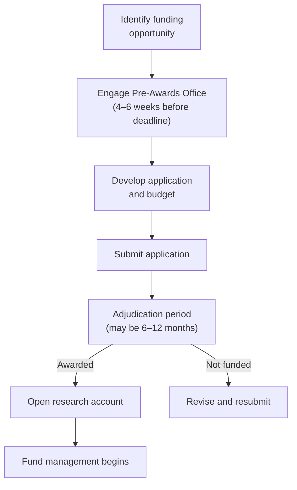

The RI-MUHC's Knowledge Base covers [managing research funds](/kb/research-grants) after a grant is awarded and [negotiating budgets](/kb/budget-negotiation) for industry-sponsored trials. This page covers the earlier step: preparing and submitting applications for research funding.

## Major Canadian funding bodies

| Funder | Focus | Typical programs |
|---|---|---|
| [**CIHR**](https://cihr-irsc.gc.ca) (Canadian Institutes of Health Research) | Health research across all disciplines | Project Grant, Team Grant, SPOR grants |
| [**FRQ**](https://frq.gouv.qc.ca) (Fonds de recherche du Québec) | Quebec researchers across sectors — the three former funds (FRQS, FRQSC, FRQNT) merged into FRQ in June 2024 | Chercheur-boursier career awards (FRQS sector), Clinical Research Scholars, Research Support for New Academics (FRQSC sector) |
| [**NSERC**](https://www.nserc-crsng.gc.ca) | Natural sciences and engineering; relevant for biomedical engineering, devices | Discovery Grants, Alliance Grants |
| **Tri-Agency (CIHR + NSERC + SSHRC)** | Cross-disciplinary | New Frontiers in Research Fund (NFRF), Canada Research Chairs |
| **Charitable foundations** | Disease-specific | Cancer Research Society, Heart & Stroke Foundation, MS Society, JDRF, etc. |

Each funder has its own application portal, review criteria, and timelines. Competition calendars are published annually — check the funder's website for current deadlines.

## Institutional support

### Pre-Awards Office

The Pre-Awards Office supports investigators through the grant application process. Services include:

- **Funding strategy** — identifying appropriate competitions and aligning applications with funder priorities
- **Budget development** — preparing grant budgets that reflect institutional cost structures (overhead rates, salary scales, equipment)
- **Application review** — reviewing draft applications for completeness and compliance with funder requirements
- **Submission coordination** — managing institutional signatures and portal submissions that require institutional authorization

Engage the Pre-Awards Office early — ideally as soon as you identify a funding opportunity, and no later than 4–6 weeks before the deadline. Last-minute requests limit the support they can provide.

### Biostatistics Consulting Unit (BCU)

The [BCU](/kb/bcu) provides methodological support for grant applications, including:

- Study design consultation
- Sample size calculations and power analysis
- Statistical analysis plan development
- Letters of support for methodology sections

BCU consultation is free for Early Career Researchers. For others, fees apply but are modest relative to the impact on application quality. A well-justified sample size calculation and statistical plan can make the difference in a competitive review.

### CORD (Capture and Optimization of Research Data)

[CORD](/kb/cord) can review data management plans in grant applications and provide letters of support confirming REDCap availability and data management infrastructure.

## Grant timelines and study planning

Grant application deadlines and study planning timelines do not align neatly. A CIHR Project Grant submitted in September will not be adjudicated until March or April, and funds may not be available until July — nearly a year after the application was prepared. This has practical implications:

- **Protocol development may need to proceed in parallel.** For studies requiring REB approval, consider preparing the protocol while the grant is under review, rather than waiting for the funding decision.
- **Budget validity.** Salary rates, equipment costs, and service fees quoted in the application may change by the time funds are released. Build reasonable inflation assumptions into multi-year budgets.
- **Team availability.** Co-investigators and key personnel committed in the application may not be available a year later. Confirm commitments as the start date approaches.
- **Institutional overhead.** All RI-MUHC research accounts are subject to overhead. Verify the applicable rate for your funding source — it varies (see [Managing Study Funds](/kb/research-grants) for the current schedule). Ensure overhead is included in the grant budget.

## Budget preparation for grants

Grant budgets differ from industry-sponsored budgets in structure and expectations. Funders expect a detailed justification for every line item.

**Common budget categories:**

- **Personnel** — salary and benefits for research staff. Use current RI-MUHC salary scales. Include benefits (approximately 19% of salary) and annual cost-of-living adjustments where permitted.
- **Equipment** — major equipment purchases are often restricted or capped. Check the funder's policies — some exclude equipment entirely; others allow it only in Year 1.
- **Supplies and consumables** — laboratory supplies, reagents, specimen collection materials, printing
- **Services** — BCU consultation, CORD data management fees, pharmacy services, imaging
- **Participant costs** — compensation, travel reimbursement, parking
- **Knowledge translation** — publication fees, conference presentations, patient engagement activities
- **Overhead** — confirm whether the funder covers overhead or whether it is charged against the grant total

<Note>
CIHR and FRQS have specific requirements for equity, diversity, and inclusion (EDI) in applications, including GBA+ (Gender-Based Analysis Plus) considerations in study design and team composition. See [Equity, Diversity and Inclusion](/kb/edi) for details.
</Note>

## After the award

Once a grant is awarded, the process shifts to fund management:

1. Request a new research account through the MyAccounts Application
2. Finance opens the account and manages fund flow
3. Expenditures and reporting are managed per the funder's terms — see [Managing Study Funds](/kb/research-grants)

---

**Related resources**

- [Managing Study Funds](/kb/research-grants) — post-award account management, overhead rates, reporting
- [Contracts, Budgets, and Agreements](/kb/budgets-contracts) — institutional overhead schedule, REB fees
- [Biostatistics Consulting Unit](/kb/bcu) — methodological support for applications
- [CORD — Research Data Management](/kb/cord) — data management plans and REDCap support
- [Equity, Diversity and Inclusion](/kb/edi) — GBA+ and EDI requirements for funding applications
- [Design Stage Support](/kb/study-design) — study design consultation and Pre-Awards Office engagement
