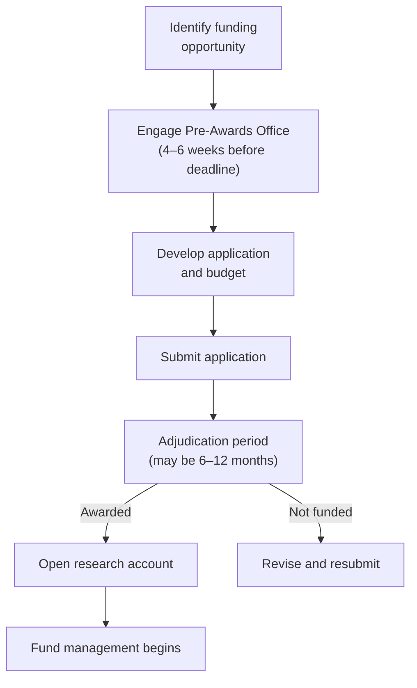

The RI-MUHC's Knowledge Base covers [managing research funds](/kb/funding/research-grants) after a grant is awarded and [negotiating budgets](/kb/funding/budget-negotiation) for industry-sponsored trials. This page covers the earlier step: preparing and submitting applications for research funding.

## Major Canadian funding bodies

| Funder | Focus | Typical programs |
|---|---|---|
| [**CIHR**](https://cihr-irsc.gc.ca) (Canadian Institutes of Health Research) | Health research across all disciplines | Project Grant, Team Grant, SPOR grants |
| [**FRQ**](https://frq.gouv.qc.ca) (Fonds de recherche du Québec) | Quebec researchers across sectors — the three former funds (FRQS, FRQSC, FRQNT) merged into FRQ in June 2024 | Chercheur-boursier career awards (FRQS sector), Clinical Research Scholars, Research Support for New Academics (FRQSC sector) |
| [**NSERC**](https://www.nserc-crsng.gc.ca) | Natural sciences and engineering; relevant for biomedical engineering, devices | Discovery Grants, Alliance Grants |
| **Tri-Agency (CIHR + NSERC + SSHRC)** | Cross-disciplinary | New Frontiers in Research Fund (NFRF), Canada Research Chairs |
| **Charitable foundations** | Disease-specific | Cancer Research Society, Heart & Stroke Foundation, MS Society, JDRF, etc. |

Each funder has its own application portal, review criteria, and timelines. Competition calendars are published annually — check the funder's website for current deadlines.

## Institutional support

### Pre-Awards Office

The Pre-Awards Office supports investigators through the grant application process. Services include:

- **Funding strategy** — identifying appropriate competitions and aligning applications with funder priorities
- **Budget development** — preparing grant budgets that reflect institutional cost structures (overhead rates, salary scales, equipment)
- **Application review** — reviewing draft applications for completeness and compliance with funder requirements
- **Submission coordination** — managing institutional signatures and portal submissions that require institutional authorization

Engage the Pre-Awards Office early — ideally as soon as you identify a funding opportunity, and no later than 4–6 weeks before the deadline. Last-minute requests limit the support they can provide.

### Biostatistics Consulting Unit (BCU)

The [BCU](/kb/design-support/bcu) provides methodological support for grant applications, including:

- Study design consultation
- Sample size calculations and power analysis
- Statistical analysis plan development
- Letters of support for methodology sections

BCU consultation is free for Early Career Researchers. For others, fees apply but are modest relative to the impact on application quality. A well-justified sample size calculation and statistical plan can make the difference in a competitive review.

### CORD (Capture and Optimization of Research Data)

[CORD](/kb/design-support/cord) can review data management plans in grant applications and provide letters of support confirming REDCap availability and data management infrastructure.

## Grant timelines and study planning

Grant application deadlines and study planning timelines do not align neatly. A CIHR Project Grant submitted in September will not be adjudicated until March or April, and funds may not be available until July — nearly a year after the application was prepared. This has practical implications:

- **Protocol development may need to proceed in parallel.** For studies requiring REB approval, consider preparing the protocol while the grant is under review, rather than waiting for the funding decision.
- **Budget validity.** Salary rates, equipment costs, and service fees quoted in the application may change by the time funds are released. Build reasonable inflation assumptions into multi-year budgets.
- **Team availability.** Co-investigators and key personnel committed in the application may not be available a year later. Confirm commitments as the start date approaches.
- **Institutional overhead.** All RI-MUHC research accounts are subject to overhead. Verify the applicable rate for your funding source — it varies (see [Managing Study Funds](/kb/funding/research-grants) for the current schedule). Ensure overhead is included in the grant budget.

## Budget preparation for grants

Grant budgets differ from industry-sponsored budgets in structure and expectations. Funders expect a detailed justification for every line item.

**Common budget categories:**

- **Personnel** — salary and benefits for research staff. Use current RI-MUHC salary scales. Include benefits (approximately 19% of salary) and annual cost-of-living adjustments where permitted.
- **Equipment** — major equipment purchases are often restricted or capped. Check the funder's policies — some exclude equipment entirely; others allow it only in Year 1.
- **Supplies and consumables** — laboratory supplies, reagents, specimen collection materials, printing
- **Services** — BCU consultation, CORD data management fees, pharmacy services, imaging
- **Participant costs** — compensation, travel reimbursement, parking
- **Knowledge translation** — publication fees, conference presentations, patient engagement activities
- **Overhead** — confirm whether the funder covers overhead or whether it is charged against the grant total

<Note>
CIHR and FRQS have specific requirements for equity, diversity, and inclusion (EDI) in applications, including GBA+ (Gender-Based Analysis Plus) considerations in study design and team composition. See [Equity, Diversity and Inclusion](/kb/team/edi) for details.
</Note>

## Career and salary support programs

Project and team grants fund studies. Career awards fund the investigator — protecting dedicated research time and providing a salary supplement or replacement that allows clinician-scientists to sustain a research program alongside clinical duties. The two categories have different application processes, different review criteria, and different timelines, but they are often applied for in parallel with or just before a project grant.

### FRQ career awards (Quebec researchers)

FRQ (Fonds de recherche du Québec) — formerly FRQS for health sciences, now unified under FRQ since June 2024 — runs the primary career award stream for Quebec clinician-scientists in health research.

| Award | Stage | What it funds | Key notes |
|---|---|---|---|
| **Chercheur-boursier Junior 1** | Early career (typically within 7 years of first faculty appointment) | Salary support (partial or full, depending on track) | Two tracks: clinical (M.D.-based) and fundamental. Renewal possible to Junior 2. |
| **Chercheur-boursier Junior 2** | Established early career | Salary support at higher level | Strong productivity record required; competitive national and international publications expected |
| **Chercheur-boursier Senior** | Mid to late career | Salary support for sustained research leadership | Requires documented mentorship of trainees and significant funding record |
| **Research Professionals Excellence** | Research professionals (non-MD/PhD) with research leadership roles | Salary support | Less common but available for senior CRCs, research coordinators, and data scientists in leadership positions |

FRQ career awards are renewable and can be held concurrently with CIHR funding. Consult the [FRQ website](https://frq.gouv.qc.ca) and the Pre-Awards Office for current competition calendars — FRQ competitions typically open in the fall.

### CIHR career and salary support programs

| Program | Who it's for | Notes |
|---|---|---|
| **Vanier Canada Graduate Scholarship (CGS)** | Doctoral students | Tri-agency; \$50,000/year for 3 years; requires institutional nomination; highly competitive |
| **Banting Postdoctoral Fellowship** | Postdoctoral researchers | \$70,000/year for 2 years; requires institutional nomination; aligned with Canadian research priorities |
| **Health Systems Impact Fellowship** | PhD/postdoc in health systems research | Embedded in health system organizations; 12–24 months; co-funded with partner organizations |
| **CIHR Project Grant (clinician-scientist salary component)** | Clinician-scientists | Salary buyout from clinical duties can be included as a budget item in CIHR Project Grants when it directly supports dedicated research time — confirm with your department and the Pre-Awards Office |
| **Canada Research Chairs (Tier 1 and Tier 2)** | Mid-career (Tier 2) and senior (Tier 1) faculty | Institutional nomination required; allocated to institutions by NSERC; \$100,000–\$200,000/year for 5–7 years |

<Note>
  CIHR does not have a dedicated clinician-scientist salary award equivalent to FRQ's Chercheur-boursier stream. The primary mechanism for protecting research time at the CIHR level is through salary buyout in Project or Team Grant budgets, or through the Canada Research Chair program. Discuss your career stage and funding strategy with the Pre-Awards Office.
</Note>

### Bridge funding

When a grant is not renewed or a competition is missed, bridge funding prevents research program interruption. Sources at the RI-MUHC include:

- **MUHC Foundation** — internal competitions open to RI-MUHC investigators; contact the Pre-Awards Office for current cycles
- **Departmental bridge funding** — some clinical departments maintain discretionary research funds; discuss with your department chief
- **CIHR Priority Announcements** — targeted, shorter-cycle competitions that can be submitted between major grant cycles; check CIHR's funding opportunities portal for open calls
- **Disease-specific foundations** — Heart & Stroke, Cancer Research Society, JDRF, MS Society, and others run competitions independently of the Tri-Agency calendar and often have faster adjudication

## After the award

Once a grant is awarded, the process shifts to fund management:

1. Request a new research account through the MyAccounts Application
2. Finance opens the account and manages fund flow
3. Expenditures and reporting are managed per the funder's terms — see [Managing Study Funds](/kb/funding/research-grants)

## Knowledge mobilization plans

Funders increasingly require a knowledge mobilization (KMb) plan as part of grant applications — a description of how research findings will be translated into practice, policy, or public understanding beyond publication.

### Integrated KT versus end-of-grant KT

CIHR distinguishes between two KT approaches, and the terminology matters for grant applications:

- **Integrated KT (iKT)** involves meaningful collaboration with knowledge users — clinicians, patients, policy-makers, health system decision-makers — throughout the research process, from question formulation through to interpretation and dissemination. iKT is embedded in the study design, not added after data collection. For CIHR Team Grants and SPOR grants, iKT is often a requirement or a rated criterion.

- **End-of-grant KT** describes activities that occur after the research is complete: publications, conference presentations, stakeholder briefings, policy briefs. This is the baseline expectation for all CIHR grants.

For Project Grants, applicants are expected to describe end-of-grant KT activities at minimum; iKT is a differentiator where the research question and knowledge-user relationships support it.

### The knowledge-to-action (KTA) cycle

The KTA framework (Graham et al.) describes a cyclical process by which research knowledge is synthesized and adapted, then applied — followed by monitoring, evaluation, and sustained implementation. Understanding this framework helps frame your KMb plan in terms familiar to grant reviewers:

- **Knowledge creation phase:** Systematic review, synthesis, knowledge tool development
- **Action cycle:** Problem identification, knowledge adaptation, barriers and facilitators assessment, implementation, evaluation, sustained use

For most clinical trials, the KMb section of the application will describe where in the KTA cycle your study sits and which action-cycle elements your planned KMb activities will address.

### What a CIHR KMb plan should include

<Steps>
  <Step title="Identify your knowledge users">
    Who needs to act on this research? Clinicians, patients, health system leaders, policy-makers, professional associations? Name them specifically — not "healthcare providers generally" but the clinical specialty, health authority, or body that will use the findings.
  </Step>
  <Step title="Describe the KMb activities">
    Concrete activities, not aspirations. Publications, practice guidelines, policy briefs, patient summaries, conference presentations, stakeholder meetings, media engagement — specify what you will do, not what you "hope to" do.
  </Step>
  <Step title="Show knowledge user involvement">
    If you have iKT partners — patient partners, clinical champions, policy advisors — name them and describe their role. Letters of support strengthen the application.
  </Step>
  <Step title="Describe the dissemination timeline">
    When will findings be ready for dissemination? How does this align with relevant policy windows or practice guideline update cycles?
  </Step>
  <Step title="Budget KMb activities explicitly">
    KMb costs are eligible under CIHR and should be budgeted: conference travel, knowledge translation materials, patient partner time, open access publication fees. Reviewers expect to see KMb reflected in the budget.
  </Step>
</Steps>

<Note>
  The [Research Facilitator](mailto:Research.facilitator@muhc.mcgill.ca) and the Pre-Awards Office can review your KMb plan before submission. For patient-oriented research, see [Patient Engagement in Research](/kb/design/patient-engagement) for guidance on structuring iKT partnerships.
</Note>

---

## Related resources

- [Managing Study Funds](/kb/funding/research-grants) — post-award account management, overhead rates, reporting
- [Study Budgets and Agreements](/kb/funding/budgets-contracts) — institutional overhead schedule, REB fees
- [Biostatistics Consulting Unit (BCU)](/kb/design-support/bcu) — methodological support for applications
- [Capture and Optimization of Research Data (CORD)](/kb/design-support/cord) — data management plans and REDCap support
- [Equity, Diversity and Inclusion](/kb/team/edi) — GBA+ and EDI requirements for funding applications
- [Design Stage Support](/kb/design-support/study-design) — study design consultation and Pre-Awards Office engagement
- [Patient Engagement in Research](/kb/design/patient-engagement) — iKT partnerships and patient partner involvement
