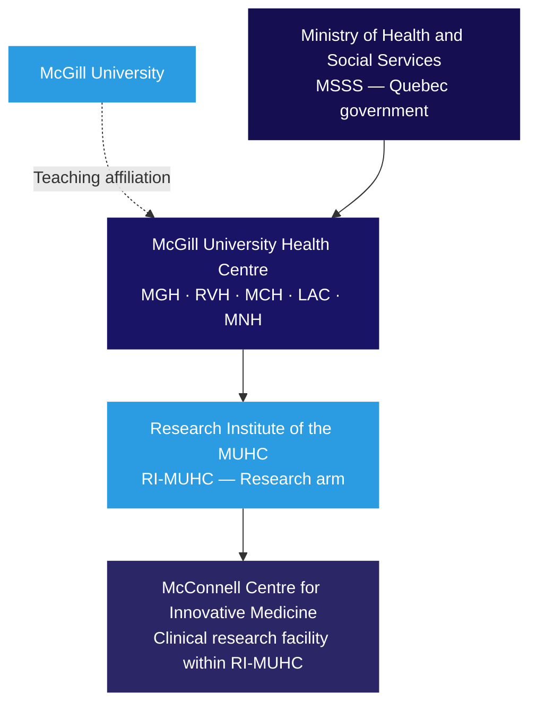
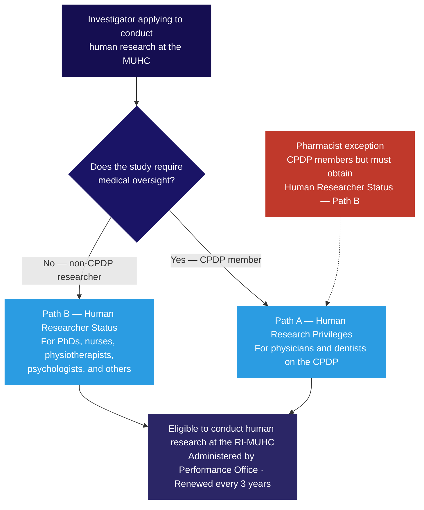

Clinical research at the RI-MUHC requires two independent approvals before a single participant can be enrolled: ethics and scientific review by the <Tooltip tip="The ethics committee that reviews and approves research involving human participants. Also called CER at French-language institutions." headline="Research Ethics Board (REB)" cta="Full definition" href="/kb/foundations/glossary#reb">REB</Tooltip>, and institutional authorization by the <Tooltip tip="Individual formally authorized to issue the final written authorization for each research project at a Quebec RSSS institution." headline="Personne mandatée (PFM)" cta="Full definition" href="/kb/foundations/glossary#personne-mandatee">Personne mandatée</Tooltip>. Understanding who is involved, what each review covers, and how they connect is the foundation for navigating the research process at the MUHC.

## The RI-MUHC and the MUHC

The **Research Institute of the McGill University Health Centre (RI-MUHC)** is the research arm of the McGill University Health Centre. The MUHC is the host institution — a university-affiliated hospital network operating under the Quebec Ministry of Health and Social Services (MSSS). The RI-MUHC operates within the MUHC but has its own governance, administration, and mandate focused on research.

Clinical research conducted at the MUHC is governed by this dual structure:

- The **RI-MUHC** sets the research policies, maintains the SOPs, manages investigator credentials (Privileges and Researcher Status), and provides <Tooltip tip="All planned and systematic actions to ensure trial data are generated, documented, and reported in compliance with GCP and SOPs." headline="Quality Assurance (QA)" cta="Full definition" href="/kb/foundations/glossary#qa">Quality Assurance</Tooltip> oversight.
- The **MUHC**, through its Research Ethics Board and Personne mandatée, provides the institutional authorization without which no study can proceed.

The MUHC is a McGill University-affiliated teaching hospital. Most investigators at the RI-MUHC hold McGill faculty appointments alongside their MUHC affiliation. For research governance purposes, however, McGill and the RI-MUHC are treated as separate institutions — a researcher who holds a McGill appointment is considered external to the RI-MUHC for contract purposes, and any collaboration involving McGill University researchers requires a formal agreement reviewed by the Research Agreements Office.

<Note>
The Montreal Neurological Institute (MNI), while part of the MUHC, follows McGill and MNI SOPs for research conducted at the MNI. MNI investigators must follow RI-MUHC SOPs only when conducting research at other MUHC sites.
</Note>

**Dr. Angela Genge, M.D., FRCP(c)** is Director of Clinical Research and the Centre for Innovative Medicine (CIM) at the RI-MUHC. As Director, she is ultimately responsible at the institutional level for ensuring that the requirements of ICH <Tooltip tip="International standard for design, conduct, monitoring, recording, and reporting of clinical studies." headline="Good Clinical Practice (GCP)" cta="Full definition" href="/kb/foundations/glossary#gcp">GCP</Tooltip>, ISO 14155, the RI-MUHC SOPs, and federal and provincial regulatory authorities are met.

## The triple review

Before a single participant can be enrolled, you must have two independent approvals in hand: REB approval and the <Tooltip tip="Institutional authorization allowing a study to proceed at the RI-MUHC. Issued after ethics approval and feasibility review." headline="MUHC Authorization" cta="Full definition" href="/kb/foundations/glossary#muhc-auth">MUHC Authorization</Tooltip> letter from the Personne mandatée. The Personne mandatée will not issue Authorization until a set of institutional feasibility reviews are also complete. Together these are known as the **triple review** — ethics and science review, institutional feasibility review, and the authorization that confirms both are done.

<Warning>
Starting a study with only REB approval is a liability risk. If something happens to a participant in a study that lacks MUHC Authorization, the study has no institutional insurance coverage. Do not begin any study activity — including screening or consent — before the MUHC Authorization letter is in hand.
</Warning>

The Authorization letter is the single document that permits a study to begin.

## The bodies that review your study

### MUHC Research Ethics Board (REB)

The REB reviews the scientific merit and ethical acceptability of research involving human participants. It assesses the protocol, <Tooltip tip="The written document providing the participant with information essential to making an informed decision. Both parties must sign." headline="Informed Consent Form (ICF)" cta="Full definition" href="/kb/foundations/glossary#icf">informed consent form</Tooltip>, recruitment materials, and all participant-facing documents.

The MUHC REB operates as a single board with **six specialized panels**, each conducting both scientific and ethics review for its domain. Minimal-risk studies go to delegated review; higher-risk studies go to the full board. The REB also reviews amendments, annual renewals, and reportable events throughout the study lifecycle.

The REB operates under the **Centre for Applied Ethics (CAE)**, the MUHC's integrated ethics unit. The CAE also provides EFVP guidance (privacy impact assessments for studies involving personal health information) and clinical ethics services.

- REB submissions: [reb@muhc.mcgill.ca](mailto:reb@muhc.mcgill.ca)
- EFVP questions: [efvp@muhc.mcgill.ca](mailto:efvp@muhc.mcgill.ca)

### Personne mandatée

The Personne mandatée issues the MUHC Authorization letter after confirming that all components of the institutional review are complete — REB approval, QA feasibility, department reviews, and contract execution. The Personne mandatée does not conduct the reviews themselves; they confirm that all required parties have signed off.

The Personne mandatée role is a provincial governance requirement established by the MSSS Cadre de référence, not an MUHC administrative choice. No study begins — not even participant identification — without the Authorization letter.

### Quality Assurance Department

QA performs the institutional feasibility check when a new study is submitted in <Tooltip tip="The RI-MUHC's electronic study submission and management platform. All studies requiring MUHC Authorization are submitted through Nagano." headline="Nagano (RI-MUHC)" cta="Full definition" href="/kb/foundations/glossary#nagano">Nagano</Tooltip>. This check confirms three things before the study can proceed to MUHC Authorization:

- The <Tooltip tip="The physician responsible to the sponsor for the conduct of a clinical trial at the site. One QI per study per Canadian site." headline="Qualified Investigator (QI)" cta="Full definition" href="/kb/foundations/glossary#qi">QI</Tooltip>/PI or Sponsor-Investigator holds valid Human Research Privileges or Researcher Status
- The Sponsor-Investigator has a <Tooltip tip="The sponsor's collection of documentation demonstrating compliance across all study sites." headline="Trial Master File (TMF)" cta="Full definition" href="/kb/foundations/glossary#tmf">Trial Master File</Tooltip> (TMF) appropriate for study start
- All required institutional training based on study type has been completed

Beyond feasibility, QA owns the RI-MUHC SOP framework, manages the SOP Reader and Competency Assessment in TalentLMS, conducts audits and mock inspections, and assists research teams during Health Canada inspections. Contact QA at [QAClinicalResearch@muhc.mcgill.ca](mailto:QAClinicalResearch@muhc.mcgill.ca).

For more detail, see [Quality Assurance](/kb/governance/quality-assurance).

### Performance Office

The Performance Office administers Human Research Privileges and Researcher Status — the institutional credentials that authorize a researcher to conduct human research at the MUHC. Both are renewed every three years and are a prerequisite for any REB submission. See the investigator credentials section below.

### Research Agreements Office

The Research Agreements Office reviews and executes all research-related agreements — Clinical Study Agreements, CDAs, inter-institutional agreements, and services agreements. All agreements must be fully executed via My Contracts and submitted in Nagano before MUHC Authorization can be issued. The investigator may not sign agreements directly.

### Department reviews

The Director of Professional Services (DPS), Nursing Resources, Laboratory Services, and Pharmacy Services each conduct their own review where applicable. Pharmacy review is triggered by studies involving investigational products handled by the MUHC pharmacy. Nursing and laboratory reviews apply when MUHC staff or services are engaged. These reviews are initiated via Nagano.

## Investigator credentials

Before submitting a study to the REB, every QI/PI must hold either Human Research Privileges or Researcher Status. The path depends on professional background. Both are administered by the Performance Office and renewed every three years.

<Tabs>
  <Tab title="Human Research Privileges (Path A)">
    For physicians and dentists. Required when the study involves acts reserved to physicians under Quebec's *Loi médicale*, or when federal law requires a physician as QI (for example, drug and biologic trials under Health Canada).
  </Tab>
  <Tab title="Human Researcher Status (Path B)">
    For PhDs, nurses, physiotherapists, psychologists, radiotherapists, and other professionals without medical prescribing authority. For studies that do not require medical oversight.

    **Pharmacist exception:** Although pharmacists are CPDP members, they are not eligible for Human Research Privileges under MSSS and MUHC frameworks. Pharmacists acting as <Tooltip tip="US equivalent of the Canadian Qualified Investigator (QI)." headline="Principal Investigator (PI)" cta="Full definition" href="/kb/foundations/glossary#pi">PI</Tooltip> or Sub-Investigator backup must obtain Human Researcher Status (Path B).
  </Tab>
</Tabs>

<Warning>
Fellows, residents, and medical students are not eligible for Privileges or Researcher Status and cannot serve as QI/PI or QI/PI backup.
</Warning>

## Ethics governance structure

Quebec hospital law requires each MUHC-network institution to maintain a dedicated ethics function. The MUHC fulfils this through its **Department of Quality, Evaluation, Performance and Ethics (DQEPE)**. The CAE sits within the DQEPE and is its operational ethics unit, integrating research ethics, clinical ethics, and organizational ethics in a single structure.

The REB operates as a single board with six specialized panels. The REAC is an internal coordination body — members from all panels meet to address cross-cutting issues and harmonize practices. As a researcher, you interact with the REB and the CAE directly; the DQEPE and REAC are administrative and coordination layers you do not engage with directly.

## The Centre for Innovative Medicine

The **McConnell Centre for Innovative Medicine (CIM)** is the RI-MUHC's dedicated clinical research facility, providing infrastructure, staffing, and platform services for Phase I–IV trials and complex interventional studies. Dr. Angela Genge directs both the CIM and the broader Clinical Research directorate at the RI-MUHC.

The CIM operates across two sites — the Glen site and the Montreal General Hospital — and offers:

<Columns cols={2}>
  <Card title="Services and expertise" icon="flask-conical">
    Clinical trial management (Phase I–IV), quality control and monitoring, data management (REDCap), biostatistics, project management for multicentre trials, ethics coordination, and budget services.
  </Card>
  <Card title="Facilities and platforms" icon="building">
    Exam and interview rooms, negative pressure overnight pods, infusion unit, cardiopulmonary functional testing, medical imaging, biobanking, and an experimental operating room.
  </Card>
</Columns>

Studies conducted through the CIM are subject to exactly the same triple review process as any other study at the RI-MUHC. If your study requires CIM facilities or staff, contact the CIM team early in the planning process — resource availability is assessed as part of the institutional feasibility review.

CIM first point of contact: [clinical.research@muhc.mcgill.ca](mailto:clinical.research@muhc.mcgill.ca)
