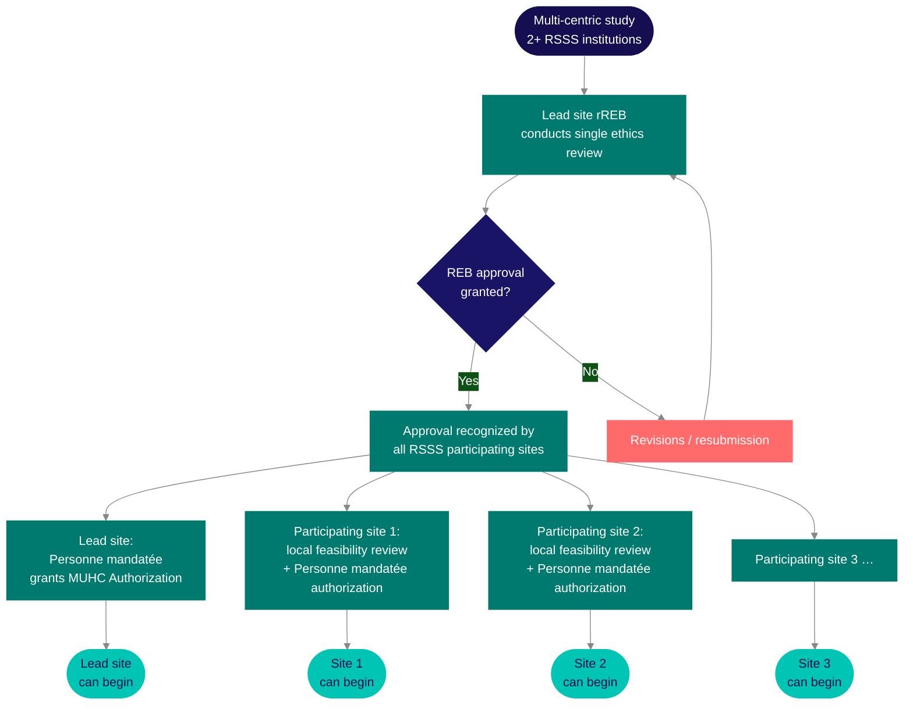

When a study involves more than one Quebec public institution, a specific provincial framework applies — one that changes how ethics review, institutional authorization, and ongoing submissions work across all sites.

## The MSSS Framework

Since February 1, 2015, any research project conducted at more than one public institution within Quebec's réseau de la santé et des services sociaux (<Tooltip tip="Quebec's public health and social services network (Réseau de la santé et des services sociaux), including the RI-MUHC." headline="RSSS" cta="Full definition" href="/kb/glossary#rsss">RSSS</Tooltip>) is subject to a single ethics review by one designated reviewing <Tooltip tip="The ethics committee that reviews and approves research involving human participants. Also called CER at French-language institutions." headline="Research Ethics Board (REB)" cta="Full definition" href="/kb/glossary#reb">REB</Tooltip>. This arrangement is established under the MSSS *Cadre de référence* (the Framework), developed jointly by the Ministère de la Santé et des Services sociaux, the Fonds de recherche du Québec – Santé (FRQS), and the four integrated university health networks (RUIS). The MUHC falls within the RUIS McGill network.

The purpose of the Framework is straightforward: instead of each Quebec RSSS institution conducting its own independent ethics review of the same study, one REB reviews on behalf of all participating institutions. Its approval is recognized by every participating RSSS site. The Framework was designed to reduce duplication, accelerate study activation, and improve the quality of ethics review by concentrating expertise — without reducing participant protections.

<Note>
The Framework replaced earlier mechanisms (the 2008 Mécanisme) as of February 2015. It applies to all research involving human participants at two or more RSSS public institutions. The MUHC REB is designated by the Minister of Health and Social Services and is authorized to act as reviewing REB (rREB) for multi-centric projects.
</Note>

## Lead site and participating sites

In a multi-centric study, one RSSS institution is designated as the **lead site**. The lead site's REB becomes the **reviewing REB (rREB)** — it conducts the single ethics review that covers all participating RSSS institutions. To determine which institution's REB should act as rREB, the MSSS Framework provides a decision procedure based primarily on where the <Tooltip tip="The physician responsible to the sponsor for the conduct of a clinical trial at the site. One QI per study per Canadian site." headline="Qualified Investigator (QI)" cta="Full definition" href="/kb/glossary#qi">QI</Tooltip>/PI who is the main researcher is based.

All other RSSS institutions where the study will be conducted are **participating sites**. They are required to carry out a local **site-specific assessment** (*examen de convenance*) — an institutional feasibility review — and obtain authorization from their own <Tooltip tip="Individual formally authorized to issue the final written authorization for each research project at a Quebec RSSS institution." headline="Personne mandatée (PFM)" cta="Full definition" href="/kb/glossary#personne-mandatee">Personne mandatée</Tooltip> before any research procedures can begin locally. The single ethics review does not replace this local authorization step. Every site must independently receive a green light from its own Personne mandatée before it can open.

<Warning>
Ethics approval from the lead site's REB covers all RSSS sites ethically, but each site must still complete its own institutional feasibility review and receive its own Authorization from its Personne mandatée. A participating site cannot begin any research activity — including screening and consent — until that local authorization is in hand.
</Warning>

The diagram captures the core principle: **one ethics review, multiple authorizations**. Each site goes through its own institutional feasibility review and receives its own Authorization from its own Personne mandatée before opening.

## What this does not cover

The MSSS Framework applies exclusively to studies with two or more RSSS public institutions within Quebec. It does not apply when a study involves one Quebec site and sites in other provinces or countries. In that scenario, each site submits to its own institution's REB independently. There is no pan-Canadian single-REB mechanism for multi-site studies that cross provincial borders in the same way.

This distinction matters in practice. If the MUHC is participating in a study that also has sites at the Toronto General Hospital and Massachusetts General Hospital, the MUHC submits to the MUHC REB independently — there is no lead-site arrangement under Quebec law. The multi-centric structure only arises when two or more of the sites are RSSS public institutions within Quebec.

Private institutions and university faculties are also outside the Framework's scope unless they have a formal agreement with an RSSS institution. The McGill University IRB, for instance, has inter-institutional agreements with the MUHC and other affiliated hospital REBs, but McGill itself is not an RSSS institution — if a study involves McGill University resources in addition to an affiliated hospital, a separate McGill feasibility and authorization letter is required.

## Practical implications

The multi-centric structure changes the operational reality of several routine submission tasks. The table below summarizes the key differences compared to a single-site study.

| Task | How it works in a multi-centric study |
|------|--------------------------------------|
| Initial ethics submission | The lead site submits one F11 to its REB covering all RSSS participating sites. Participating sites do not submit their own separate ethics packages — their institutional feasibility review runs in parallel locally. |
| Amendments | The lead site submits amendments to the rREB. Once approved, the amended documents apply to all RSSS participating sites. Participating sites do not resubmit the amendment independently; they implement it once the lead has confirmed rREB approval. |
| EFVP | For studies requiring an EFVP (access to identifiable data without participant consent), the lead site submits one EFVP covering the entire project. Participating sites do not submit separate EFVPs. See [SOP-CR-007](/sops/cr-007) and Submitting via <Tooltip tip="The RI-MUHC's electronic study submission and management platform. All studies requiring MUHC Authorization are submitted through Nagano." headline="Nagano (RI-MUHC)" cta="Full definition" href="/kb/glossary#nagano">Nagano</Tooltip> for the applicable Nagano form. |
| Annual renewal | Participating sites that have access to Nagano submit their own renewal directly. Those without Nagano access complete the PDF equivalent (F9) and send it to the lead site <Tooltip tip="The team member who handles day-to-day administration and coordination of the clinical trial." headline="Clinical Research Coordinator (CRC)" cta="Full definition" href="/kb/glossary#crc">CRC</Tooltip>, who submits on their behalf. All sites should renew at the same time to keep the project's ethics approval synchronized. |
| Reportable events | Each site logs events on its own log (<Tooltip tip="An adverse event meeting seriousness criteria: death, life-threatening, hospitalization, disability, or congenital anomaly." headline="Serious Adverse Event (SAE)" cta="Full definition" href="/kb/glossary#sae">SAE</Tooltip> log, deviation log). Sites with Nagano access report directly to the MUHC rREB if MUHC is the lead. Sites without Nagano access complete the relevant PDF form (F3a for serious unexpected events, F3b for other events) and send to the lead site CRC for submission. The lead site must report external events to the rREB within 7 days if life-threatening, 15 days otherwise. |
| Adding a site | Converting a single-site study to multi-centric, or adding a new site to an existing multi-centric study, requires a specific Nagano form. This is not handled through an amendment — it is a separate request type. |

## When the MUHC is the lead site

When the MUHC is the lead site, the QI/PI at the MUHC is the **REB Lead**. The Nagano submission covers all RSSS participating institutions — the initial F11 includes the full study documentation for all sites, and subsequent amendments and renewals are coordinated from the MUHC.

In practical terms, the MUHC CRC typically becomes the coordination hub for the Quebec sites. This involves tracking authorization status at each site, ensuring participating sites receive amended documents in a timely way, coordinating annual renewal timing across sites, and routing reportable events from sites without Nagano access. The complexity scales with the number of participating sites and their varying levels of Nagano access.

<Note>
As lead site, the MUHC QI/PI is responsible for initial submission, all amendments, and all reportable events that originate from or affect RSSS participating sites under [SOP-CR-007](/sops/cr-007) and [SOP-CR-026](/sops/cr-026). External sites without Nagano access submit PDF forms to the MUHC CRC, who enters them into Nagano. See [SOP-CR-007](/sops/cr-007) (Section 5.6) and [SOP-CR-026](/sops/cr-026) (Section 5.4) for the full procedural requirements.
</Note>

## When the MUHC is a participating site

When another Quebec RSSS institution is the lead and the MUHC is a participating site, the MUHC submission in Nagano is a **MEO (Milieu d'exécution other)** file — a participating-site submission rather than a full ethics submission. The rREB is the lead institution's REB; the MUHC does not conduct its own ethics review for this study.

The MUHC still conducts its own institutional feasibility review and must receive <Tooltip tip="Institutional authorization allowing a study to proceed at the RI-MUHC. Issued after ethics approval and feasibility review." headline="MUHC Authorization" cta="Full definition" href="/kb/glossary#muhc-auth">MUHC Authorization</Tooltip> from the Personne mandatée before any research procedures can begin at the MUHC site. This is not shortened by the fact that ethics review has already been completed elsewhere. The MUHC's feasibility review covers <Tooltip tip="All planned and systematic actions to ensure trial data are generated, documented, and reported in compliance with GCP and SOPs." headline="Quality Assurance (QA)" cta="Full definition" href="/kb/glossary#qa">QA</Tooltip> (training and privileges), contracts, the Director of Professional Services, nursing, laboratory, and pharmacy as applicable — all the same streams as a single-site study.

If you are a CRC at the MUHC on a study where another institution is the lead, contact the Research Facilitator early. The MEO Nagano workflow is different from a standard F11 submission, and the coordination expectations with the lead site (document exchange, renewal timing, event reporting) need to be established at study activation, not discovered mid-study.

## CATALIS FAST TRACK

For industry-sponsored multi-site clinical trials in Quebec, CATALIS — a public-private network mandated by the Quebec government — operates the **FAST TRACK Evaluation Service**, which targets authorization of clinical trials in eight weeks or fewer. Based on data from over 90 authorizations across 20 Quebec RSSS institutions, the service has achieved a median authorization time of approximately nine weeks, against a standard authorization timeline roughly four times longer. Several Quebec institutions have been activated first in Canada or first in the world for studies run through FAST TRACK.

FAST TRACK is currently available to pharmaceutical companies and CROs that are members of the CATALIS Network. The RI-MUHC participates in the FAST TRACK network. If a sponsor is asking about FAST TRACK timelines, confirm with the Research Facilitator whether the specific study and site configuration qualify — the service is not automatic and requires the sponsor to be a CATALIS member and the institution to be enrolled in the service for that study.

<Note>
FAST TRACK does not bypass any review requirement. The accelerated timeline is achieved through parallelized workflows and standardized document packages — not by reducing the scope of ethics, feasibility, or Health Canada review. Each stream still occurs; they run concurrently and to tighter deadlines.
</Note>

## Study closure sequence

Study closure in a multi-centric study must follow a specific sequence, and the order is not optional. All RSSS participating sites must submit their own Closure of Research Project notification to the rREB before the lead site submits its closure. Once the lead site submits its closure and the study is closed by the rREB, no further submissions of any kind — amendments, renewals, reportable events — can be made from any site.

This sequencing requirement has a practical consequence: if a participating site has pending items (an open deviation, an unresolved safety report, a renewal that was missed), those must be resolved before the site can submit its closure, which in turn delays the lead site's closure. Multi-centric closure should be coordinated deliberately, not assumed to close automatically when the lead site wraps up. [SOP-CR-016](/sops/cr-016) covers the close-out requirements for both lead and participating sites.

---

## Related resources

- [Study Planning Overview](/kb/planning-overview) — planning timeline, study types, activation targets
- [Designing a Decentralized Trial](/kb/dct-design) — remote participation, e-consent, Health Canada DCT guidance
- [Sponsored Trials at the RI-MUHC](/kb/sponsored-trials) — how industry-sponsored studies arrive at the site
- [Study Close-Out](/kb/close-out) — close-out procedures, document retention, post-study obligations
- [SOP-CR-016 — Study Close-Out](/sops/cr-016) — close-out procedures for lead and participating sites

  
  

    
<strong>Looking to go deeper?</strong> Canada's national clinical trials training platform offers free, self-paced courses for RI-MUHC investigators, staff, and trainees. You might be interested in this course:

    <ul>
      <li><em>Conducting Clinical Trials in Canada, Leading Multi-Site IITs</em></li>
    </ul>
  

