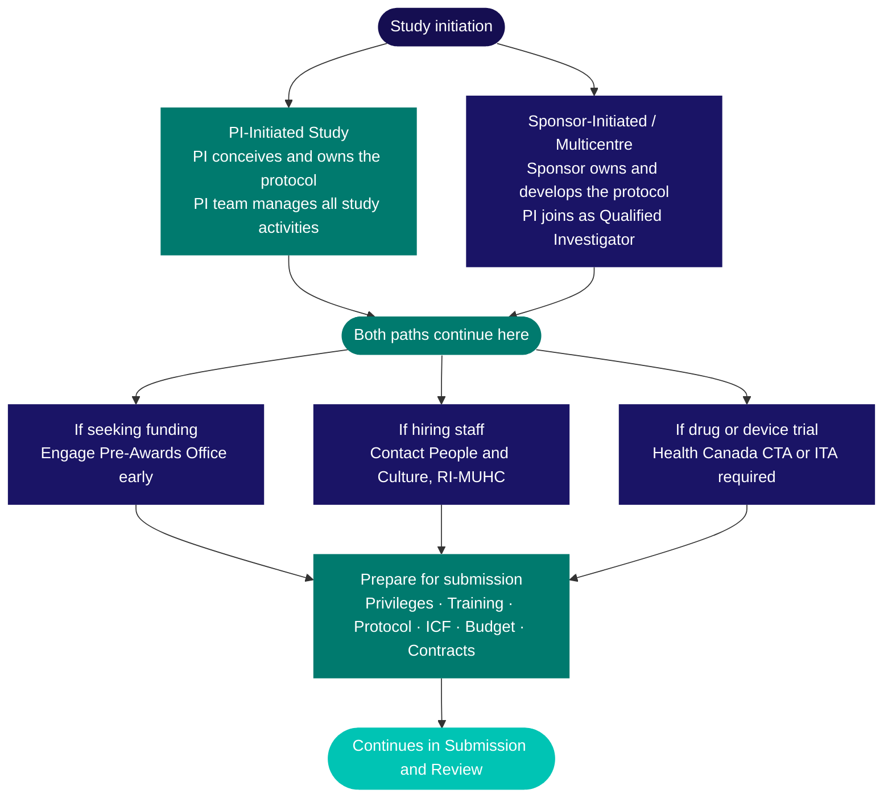

Planning is the most consequential phase of a clinical study. Decisions made here — about design, team, data, regulatory pathway, and funding — determine whether a study can be submitted, approved, and successfully conducted at The Institute. This section covers everything you need to work through before submitting via <Tooltip tip="The RI-MUHC's electronic study submission and management platform. All studies requiring MUHC Authorization are submitted through Nagano." headline="Nagano (RI-MUHC)" cta="Full definition" href="/kb/glossary#nagano">Nagano</Tooltip>.

## Planning pathway

All studies at the MUHC follow the same broad arc: the research question and design are established, the team and operational elements are put in place, and the study is prepared for submission. The two most common starting points — <Tooltip tip="US equivalent of the Canadian Qualified Investigator (QI)." headline="Principal Investigator (PI)" cta="Full definition" href="/kb/glossary#pi">PI</Tooltip>-initiated and sponsor-initiated — converge before submission.

How a study originates determines who owns the protocol and what your responsibilities are. In a **PI-initiated study**, you conceive the research question and lead all aspects of development. In a **sponsor-initiated** study, the sponsor owns the protocol and you take on the role of <Tooltip tip="The physician responsible to the sponsor for the conduct of a clinical trial at the site. One QI per study per Canadian site." headline="Qualified Investigator (QI)" cta="Full definition" href="/kb/glossary#qi">Qualified Investigator</Tooltip> (QI) for the MUHC site. Engaging the McConnell Centre for Innovative Medicine (CIM) is optional in both cases — the CIM provides research staff, <Tooltip tip="All planned and systematic actions to ensure trial data are generated, documented, and reported in compliance with GCP and SOPs." headline="Quality Assurance (QA)" cta="Full definition" href="/kb/glossary#qa">QA</Tooltip>, data management, and infrastructure at the Glen site and the Montreal General Hospital.

<Tabs>
  <Tab title="PI-initiated study">
    - You conceive and develop the study
    - You develop the protocol, endpoints, and statistical plan
    - You lead regulatory and funding strategy
    - Your own team manages all study activities
    - CIM support is optional: research staff, QA, data management, infrastructure
  </Tab>
  <Tab title="Sponsor-initiated or multicentre">
    - The sponsor owns and develops the protocol
    - You join as site investigator (Qualified Investigator)
    - Site feasibility assessment is completed before the Clinical Trial Agreement
    - Your own team manages local site activities
    - CIM support is optional: CIM liaises directly with the sponsor monitoring team
  </Tab>
</Tabs>

Both paths converge at submission preparation. Before submitting, you must have privileges and training in place, finalize all documents and contracts, complete funding and regulatory steps, and prepare EFVP materials if applicable.

<Note>
  The F11 form in Nagano is the entry point for all review processes — <Tooltip tip="The ethics committee that reviews and approves research involving human participants. Also called CER at French-language institutions." headline="Research Ethics Board (REB)" cta="Full definition" href="/kb/glossary#reb">REB</Tooltip> review and institutional feasibility are initiated simultaneously when F11 is submitted. Missing any one prerequisite delays all review tracks at once.
</Note>

## Study feasibility

Before committing to a full protocol, it is worth confirming that the study is feasible at the MUHC. Feasibility covers both scientific and operational dimensions: Is the target population available in the required numbers? Does the site have the pharmacy capacity, equipment, specialist staff, and physical space the protocol demands? Can enrolment realistically be completed within the study timeline?

These questions are cheapest to answer at the design stage, before the protocol is finalized and before contracts or budgets are negotiated. A study that passes ethics review but cannot enrol participants, or requires equipment the site does not have, will stall at activation. For industry-sponsored studies, the sponsor typically conducts a formal site feasibility assessment as part of site selection — but for PI-initiated studies, this assessment is your responsibility.

See [Study Feasibility](/kb/feasibility) for the key questions to answer and how to approach each one.

## Protocol and study design

Writing a protocol without methodological support is one of the most common sources of downstream problems — underpowered studies, ambiguous endpoints, or statistical analysis plans that don't match the research question. The Institute has dedicated resources available at the design stage, and engaging them early is much lower-cost than revising a protocol after REB submission.

The **ACT-CTU (Accelerating Clinical Trials)** offers protocol review sessions, access to a clinical trial methodologist, and connections to seed funding mechanisms. The **Biostatistics Consulting Unit (BCU)** advises on sample size, power calculations, and statistical analysis plans — this is ideally done before data collection begins, not after.

See [Design Stage Support](/kb/study-design) for the full list of planning specialists and who to contact at each stage.

## Research ethics principles

Research ethics are not a submission checklist item — they shape the design of a study from the outset. The three core principles of **TCPS2** provide the framework: **respect for persons** (autonomy, informed consent, special protections for vulnerable populations), **concern for welfare** (risk-benefit assessment, physical and psychological safety, privacy), and **justice** (fair distribution of research burdens and benefits, equitable participant selection).

These principles have practical design implications. The consent process should be designed around participant understanding, not administrative convenience. Eligibility criteria should not exclude populations without scientific justification. Studies involving vulnerable populations — minors, individuals incapable of consenting, pregnant women, or prisoners — require specific provisions under Quebec's Civil Code.

Building these considerations into your protocol early avoids substantive REB review questions later. For the full regulatory framework including Quebec-specific requirements, see [Regulations and Guidelines](/kb/regulations).

## Multicentre studies

Multicentre studies involving multiple Quebec <Tooltip tip="Quebec's public health and social services network (Réseau de la santé et des services sociaux), including the RI-MUHC." headline="RSSS" cta="Full definition" href="/kb/glossary#rsss">RSSS</Tooltip> institutions operate under a streamlined ethics review mechanism: a single designated **reviewing REB (rREB)** conducts ethics review on behalf of all participating Quebec sites. This can be the MUHC REB acting as rREB, or another institution's REB serving in that role. Each participating site still conducts its own institutional feasibility review and requires its own <Tooltip tip="Individual formally authorized to issue the final written authorization for each research project at a Quebec RSSS institution." headline="Personne mandatée (PFM)" cta="Full definition" href="/kb/glossary#personne-mandatee">Personne mandatée</Tooltip> authorization before research can begin locally.

Planning a multicentre study at the design stage requires early clarity on which institution will serve as the coordinating centre, who will act as rREB, and what the site activation sequence will be. Contact the [Research Facilitator](mailto:Research.facilitator@muhc.mcgill.ca) for guidance specific to your study.

## Team, funding, and regulatory readiness

Alongside study design, three operational tracks deserve early attention — their timelines often outpace the rest of the process. For detailed guidance on each, see the pages under **Building Your Team** and **Funding and Agreements** in the sidebar:

- [Building Your Research Team](/kb/building-your-team) — team structure, delegation rules, and role requirements
- [Study Budgets and Agreements](/kb/budgets-contracts) — clinical trial agreements, budget templates, and the Research Agreements Office
- [Managing Study Funds](/kb/research-grants) — research accounts, overhead rates, and financial reporting
- [Regulations and Guidelines](/kb/regulations) — Health Canada CTA/ITA requirements and the full regulatory framework

For the complete pre-submission checklist — privileges, training, documents, contracts, and privacy requirements — see [Preparing Your Submission](/kb/preparing).

## How long does planning take?

Planning timelines vary considerably by study type. First-time investigators consistently underestimate the time required.

| Study type | Typical timeline | Main drivers |
|---|---|---|
| Retrospective chart review | 4–8 weeks | EFVP if applicable, data access agreement, team training |
| Prospective observational | 3–4 months | Protocol, ICF, team privileges and training |
| Investigator-initiated interventional | 6–12 months | Protocol development, BCU consultation, grant timing, hiring |
| Industry-sponsored (site joining) | 3–9 months | Contract negotiation, <Tooltip tip="Monitoring visit to train the site team on the protocol and confirm site readiness, after REB approval and MUHC Authorization." headline="Site Initiation Visit (SIV)" cta="Full definition" href="/kb/glossary#siv">SIV</Tooltip> scheduling, Sponsor go-letter |
| Drug or device trial requiring CTA or ITA | 9–18 months | Health Canada 30-day clock, regulatory engagement, CTA preparation |

<Warning>
  **Plan for the slowest component.** If your study requires Health Canada approval, the CTA or ITA review clock runs independently of the REB. Budget for both tracks when setting your activation target date.
</Warning>

The most common sources of delay are: training or privileges not in place for team members; contract negotiations with an industry sponsor taking longer than anticipated; the EFVP process requiring revisions; and protocol changes arising from REB scientific review that require the study to be substantially redesigned. Most of these can be anticipated and managed if planning starts early enough.

---

## Related resources

- [Study Conduct Overview](/kb/conduct-overview) — what happens after activation: consent, visits, oversight, close-out
- [Investigator Orientation](/kb/roles/pi-pathway) — prerequisites, training, and what only you sign
- [CRC Orientation](/kb/roles/crc-pathway) — onboarding, training, and competency domains
- [Study Intake Form](/kb/study-intake) — start here to register a new study at the RI-MUHC
- [Building Your Research Team](/kb/building-your-team) — delegation, training, and team composition
