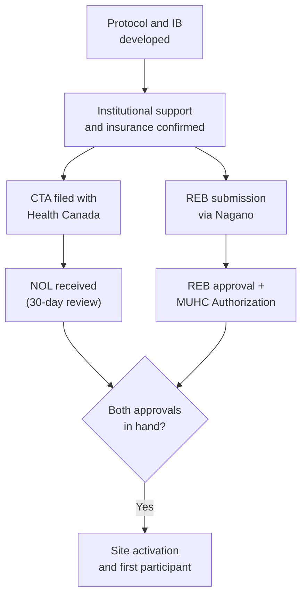

When an investigator is also the sponsor of a clinical trial, Health Canada does not differentiate between a commercial sponsor and a non-commercial one — the regulatory obligations are identical. This page provides a practical startup checklist for investigator-initiated trials (IITs) regulated under Part C, Division 5 of the Food and Drug Regulations. For the broader context of the sponsor-investigator role, see [Sponsor-Investigator Studies](/kb/planning/sponsor-investigator).

<Warning>
The regulatory burden for IITs is the same as for industry-sponsored trials. The investigator assumes all sponsor obligations: CTA filing, safety reporting to Health Canada, monitoring of all study sites, record retention for 15 years, and annual reporting. Ensure your team and institution have the infrastructure to support these obligations before filing the CTA.
</Warning>

## Startup checklist

<Steps>
  <Step title="Protocol and IB development">
    Develop the study protocol and Investigator's Brochure (or a summary of preclinical and clinical data if an IB is not applicable). The CTA submission to Health Canada requires a protocol summary, the IB, and supporting preclinical data — though the CTA requirements for preclinical data are less extensive than the US IND.
  </Step>
  <Step title="Institutional support and insurance">
    Confirm with the RI-MUHC that institutional insurance covers the sponsor-investigator role. The CMPA (Canadian Medical Protective Association) covers clinical practice aspects but does not cover administrative or non-medical sponsor obligations. Identify any gaps and arrange supplementary clinical trial insurance if needed.

    This is a common gap for IITs. Industry sponsors carry their own insurance; when you are the sponsor, the institution's insurance must cover sponsor liability — confirm this explicitly with the Research Agreements Office and risk management.
  </Step>
  <Step title="Health Canada CTA submission">
    File the Clinical Trial Application with Health Canada. Health Canada reviews the CTA and issues a No Objection Letter (NOL) within 30 calendar days — or identifies deficiencies that must be resolved before the trial may proceed.

    <Tooltip tip="The ethics committee that reviews and approves research involving human participants. Also called CER at French-language institutions." headline="Research Ethics Board (REB)" cta="Full definition" href="/kb/foundations/glossary#reb">REB</Tooltip> review can proceed in parallel with Health Canada review, but the study cannot begin until both the NOL and REB approval are in hand.
  </Step>
  <Step title="REB submission via Nagano">
    Submit the study through <Tooltip tip="The RI-MUHC's electronic study submission and management platform. All studies requiring MUHC Authorization are submitted through Nagano." headline="Nagano (RI-MUHC)" cta="Full definition" href="/kb/foundations/glossary#nagano">Nagano</Tooltip> for REB review. The submission must include the safety monitoring plan (see DSMB section below). MUHC Authorization follows REB approval and institutional feasibility review.
  </Step>
  <Step title="Safety reporting infrastructure">
    Before the first participant is enrolled, establish systems for:

    - **SUSAR reporting to Health Canada:** Fatal or life-threatening SUSARs must be reported within **7 calendar days**. All other SUSARs within **15 calendar days**. Reports are filed using the CIOMS I form.
    - **SAE tracking:** Maintain a safety database or structured tracking system for all adverse events across all study sites.
    - **External SUSAR distribution:** If you have multiple sites, you are responsible for distributing external SUSAR reports to all sites — and for ensuring each site's QI reviews and documents them.
  </Step>
  <Step title="Monitoring plan">
    The sponsor-investigator must ensure monitoring of all study sites. Under ICH E6(R3), monitoring should be risk-proportionate — but it must exist. Options:

    - Contract a CRO for monitoring services
    - Designate a qualified individual at the institution as a monitor (this person cannot be involved in the conduct of the trial at the sites they monitor)
    - Use a risk-based monitoring approach appropriate to the trial's complexity

    The monitoring plan must be documented before the trial begins. See [SOP-CR-013](/sops/cr-013) for monitoring requirements.
  </Step>
  <Step title="Data management">
    Establish the data management system (REDCap, or another validated platform). Develop the Data Management Plan (DMP), CRF design, and data validation checks. For RI-MUHC-led studies, [CORD](/kb/design-support/cord) provides data management support.

    See the [Sponsor-Investigator SOP series](/sops/cr-100) (CR-100 through CR-107) for RI-MUHC procedural requirements covering CRF design, database management, query management, and database lock.
  </Step>
  <Step title="Site initiation and activation">
    Complete the standard activation sequence: MUHC Authorization, Site Initiation Visit, Task Delegation Log signed, Go Letter (which in an IIT you issue yourself or may not require separately). See [Site Activation and Study Setup](/kb/site-activation/site-setup) for the full sequence.
  </Step>
</Steps>

## Data Safety Monitoring Board (DSMB)

Health Canada does not have a standalone guidance document mandating DSMBs for all trials. The requirement is proportionate to risk:

- **Generally expected:** Randomized controlled trials with blinded interim analyses, trials involving serious or life-threatening conditions, trials with significant safety signals or novel investigational products
- **May use lighter monitoring:** Low-risk pragmatic trials, open-label studies with well-characterized interventions

The REB will assess whether the proposed safety monitoring plan is adequate for the trial's risk profile. Under TCPS2 Chapter 11, all clinical trials must have a plan for monitoring safety that includes clear stopping rules.

A DSMB should have:
- Independent members (not involved in the trial's conduct)
- At least one biostatistician and one clinician with relevant expertise
- A charter defining the DSMB's mandate, meeting schedule, access to data, and authority to recommend stopping or modifying the trial
- Access to unblinded data (if the trial is blinded)

## Ongoing sponsor obligations

Once the trial is active, the sponsor-investigator is responsible for:

| Obligation | Requirement | Reference |
|---|---|---|
| **SUSAR reporting** | 7 days (fatal/life-threatening) or 15 days (all others) to Health Canada via CIOMS I form | C.05.014 |
| **Annual reporting** | Updated IB with all safety information and global trial status | C.05.014 |
| **CTA amendments** | Changes endangering participants may be implemented immediately; CTA amendment filed within 15 days. All other amendments require HC review. | C.05.010 |
| **Trial discontinuation** | Notify Health Canada within 15 calendar days of discontinuing the trial (fully or at a specific site) | C.05.010 |
| **Monitoring** | Ensure ongoing monitoring of all sites for protocol compliance, data integrity, and participant safety | ICH E6(R3) |
| **Record retention** | Maintain all trial records for **15 years** after study completion | C.05.012 |

## Funding considerations

CIHR requires that all funded clinical trials be:
- Registered in a WHO-compliant registry before the first participant is enrolled
- Published with open access
- Results publicly available within 12 months of the last participant's last visit

Non-compliance with these requirements affects eligibility for future CIHR funding.

---

## Related resources

- [Sponsor-Investigator Studies](/kb/planning/sponsor-investigator) — overview of the sponsor-investigator role and regulatory framework
- [Sponsor-Investigator SOP series](/sops/cr-100) (CR-100 through CR-107) — procedural requirements for IITs
- [Site Activation and Study Setup](/kb/site-activation/site-setup) — activation sequence
- [Capture and Optimization of Research Data (CORD)](/kb/design-support/cord) — REDCap and data management support
- [Preparing Funding Applications](/kb/funding/funding-applications) — CIHR and FRQ funding requirements
- [Regulations and Guidelines](/kb/planning/regulations) — Health Canada Division 5 framework
