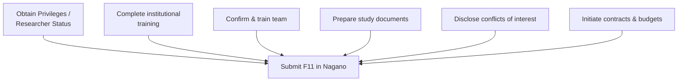

Submitting to the MUHC <Tooltip tip="The ethics committee that reviews and approves research involving human participants. Also called CER at French-language institutions." headline="Research Ethics Board (REB)" cta="Full definition" href="/kb/glossary#reb">REB</Tooltip> is the endpoint of a preparation process, not the beginning of one. By the time you upload to <Tooltip tip="The RI-MUHC's electronic study submission and management platform. All studies requiring MUHC Authorization are submitted through Nagano." headline="Nagano (RI-MUHC)" cta="Full definition" href="/kb/glossary#nagano">Nagano</Tooltip>, a series of prerequisites must already be in place. Missing any one of them means the submission cannot proceed, or that feasibility review will be delayed.

## What happens at submission

Submitting a study initiates parallel reviews that go beyond ethics. The Nagano submission routes information to multiple departments, each of which conducts its own feasibility assessment. <Tooltip tip="Institutional authorization allowing a study to proceed at the RI-MUHC. Issued after ethics approval and feasibility review." headline="MUHC Authorization" cta="Full definition" href="/kb/glossary#muhc-auth">MUHC Authorization</Tooltip> is not granted until all reviews are complete and satisfactory.

| Review stream | What it covers |
|---|---|
| REB ethics and scientific review | Ethical and scientific merit, adequacy of participant protections, <Tooltip tip="The written document providing the participant with information essential to making an informed decision. Both parties must sign." headline="Informed Consent Form (ICF)" cta="Full definition" href="/kb/glossary#icf">ICF</Tooltip>, consent procedures, and recruitment materials. |
| <Tooltip tip="All planned and systematic actions to ensure trial data are generated, documented, and reported in compliance with GCP and SOPs." headline="Quality Assurance (QA)" cta="Full definition" href="/kb/glossary#qa">QA</Tooltip> feasibility | Confirms the <Tooltip tip="The physician responsible to the sponsor for the conduct of a clinical trial at the site. One QI per study per Canadian site." headline="Qualified Investigator (QI)" cta="Full definition" href="/kb/glossary#qi">QI</Tooltip>/PI holds current Research Privileges or Researcher Status and has completed required institutional training. |
| Research Agreements Office | Contract review — ensures the rights and interests of the RI-MUHC, investigator, and research team are protected in any Sponsor or third-party agreements. |
| Director of Professional Services (DPS) | Resource utilization — approves use of MUHC resources (beds, operating rooms, imaging, medical records) required by the study. |
| Pharmacy (if applicable) | For studies involving a drug or NHP: pharmacy feasibility assessment. A pharmacy agreement is issued and must be signed before the study begins. |
| Nursing services (if applicable) | If MUHC nursing resources are required: nursing feasibility review, signed by the nurse manager and uploaded to Nagano. |
| Laboratory (if applicable) | If OPTILAB-MUHC laboratory services are required: laboratory feasibility review and laboratory agreement. |

<Note>
  Not all reviews apply to every study — the F11 form questions are designed to trigger only the reviews relevant to your study type. Answer the F11 accurately. Underreporting which services are needed delays authorization when the gap is discovered during feasibility review, not at the time of filing.
</Note>

The Health Canada track is **not** sequential after REB approval. It must start at the same time you submit Nagano F11 — otherwise the 30-day HC clock runs after REB review is already done, delaying activation by weeks. For an overview of how all three review streams run concurrently, see [The Study Review Process](/kb/study-review).

## Pre-submission checklist

<Steps>
  <Step title="Obtain Research Privileges or Researcher Status">
    The QI/PI must hold current RI-MUHC Privileges (for MDs and dentists) or Researcher Status (for non-MDs) before a study can be submitted. Apply via TalentLMS. See [SOP-CR-500](/sops/cr-500) and the [Investigator Orientation](/roles/investigator) for eligibility details.
  </Step>
  <Step title="Complete required institutional training">
    The QI/PI and all team members must have completed appropriate institutional training for the study type before signing the <Tooltip tip="Lists each team member, their qualifications, and specific trial tasks authorized by the QI." headline="Task Delegation Log (TDL)" cta="Full definition" href="/kb/glossary#tdl">Task Delegation Log</Tooltip>. Required training may include: SOP Reader and Competency Assessment, ICH-<Tooltip tip="International standard for design, conduct, monitoring, recording, and reporting of clinical studies." headline="Good Clinical Practice (GCP)" cta="Full definition" href="/kb/glossary#gcp">GCP</Tooltip> (Levels I–II), ISO 14155 (Level II), and Health Canada Division 5 (Level I).

    <Warning>
      SOP training certificates must not be within **90 days of expiry** at submission. QA requires that all certificates remain valid for the foreseeable duration of the study — renew before submitting if necessary.
    </Warning>
  </Step>
  <Step title="Confirm your team">
    Identify all team members and appoint a qualified Sub-Investigator as QI/PI backup. The backup must hold the same Privileges or Researcher Status as the QI/PI — fellows and residents are not eligible as backup. Confirm that all team members have completed institutional training at the appropriate level. See [Team Management During a Study](/kb/site-setup) and [SOP-CR-002](/sops/cr-002).
  </Step>
  <Step title="Prepare study documents">
    Have these documents ready before opening Nagano:

    - Finalized protocol (with version number and date in the footer and file name)
    - Informed Consent Form(s) in both English and French — at minimum a draft for initial review
    - <Tooltip tip="Compilation of clinical and nonclinical data on the investigational product relevant to the study." headline="Investigator's Brochure (IB)" cta="Full definition" href="/kb/glossary#ib">Investigator's Brochure</Tooltip> or current product monograph (interventional studies)
    - Health Canada authorization documents — <Tooltip tip="Application to Health Canada for authorization to conduct a drug trial under Division 5 of the Food and Drug Regulations." headline="Clinical Trial Application (CTA)" cta="Full definition" href="/kb/glossary#cta">CTA</Tooltip> with <Tooltip tip="Letter from Health Canada confirming a CTA is satisfactory and authorizing the sponsor to proceed." headline="No Objection Letter (NOL)" cta="Full definition" href="/kb/glossary#nol">NOL</Tooltip> for drug studies, <Tooltip tip="Health Canada authorization to conduct a clinical investigation of a medical device. The device equivalent of a CTA." headline="Investigational Testing Authorization (ITA)" cta="Full definition" href="/kb/glossary#ita">ITA</Tooltip> for device studies (these must be in hand before MUHC Authorization)
    - Participant-facing materials and recruitment materials

    <Note>
      **Document version numbering:** all documents submitted to Nagano must have a version number and date in both the document footer and the file name. Incorrect or missing version numbering is a common Health Canada inspection finding.
    </Note>
  </Step>
  <Step title="Disclose conflicts of interest">
    The QI/PI must complete the McGill conflict of interest disclosure before submitting. At the study level, any financial or other relationship between the QI/PI (or a team member) and the Sponsor must also be disclosed in the REB submission. An undisclosed conflict that surfaces later constitutes a serious research integrity breach. See [Conflict of Interest](/kb/governance/research-integrity) and [SOP-CR-007](/sops/cr-007).
  </Step>
  <Step title="Start contracts and budgets early">
    All contracts for new studies are submitted through Nagano. Contact [contracts@muhc.mcgill.ca](mailto:contracts@muhc.mcgill.ca) once submitted. Contract negotiation can take weeks — start early. No study can begin without a signed agreement where one is required.

    <Note>
      **Privately-funded studies: REB billing fees apply.** Under Directive ministérielle 2023-016, Quebec hospitals are required to bill private enterprise Sponsors for REB review and authorization services. This includes foundation-funded studies, not only industry-sponsored trials. Confirm that the Sponsor's budget accounts for these fees before submitting.
    </Note>
  </Step>
  <Step title="Obtain departmental approvals">
    If your study will take place in clinical areas of the MUHC, obtain signed approvals from relevant department heads and feasibility agreements from all clinical managers where clinical services will be used for research.
  </Step>
  <Step title="Trigger the pharmacy review (if applicable)">
    For all studies involving the dispensing or testing of a drug or NHP, complete the relevant F11 form questions to trigger a pharmacy feasibility evaluation. A pharmacy agreement will be issued for signature. See [SOP-CR-007](/sops/cr-007).
  </Step>
  <Step title="Identify nursing resource needs (if applicable)">
    If you have your own research nurse or are using CIM services, answer "No" in the F11 nursing section. If MUHC nursing services are required, answer "Yes" — a nursing feasibility form must be completed, signed by the nurse manager, and uploaded to Nagano.
  </Step>
  <Step title="Trigger the laboratory review (if applicable)">
    If OPTILAB-MUHC laboratory services are required, reflect this in the F11 form questions to trigger a laboratory feasibility review and agreement. Lab inquiries: [clinicallaboratoryresearchinquiries@muhc.mcgill.ca](mailto:clinicallaboratoryresearchinquiries@muhc.mcgill.ca).
  </Step>
  <Step title="Complete the ÉFVP form (if applicable)">
    If your study requires access to identifiable personal health information without participant consent, complete the relevant ÉFVP form (F17 or F18) in Nagano as part of the initial submission. See [Submitting via Nagano](/kb/submitting-via-nagano) for guidance on which form applies.
  </Step>
  <Step title="Upload participant-facing materials and recruitment materials">
    All participant-facing materials — consent forms, questionnaires, recruitment materials, and advertisements — must be submitted to the REB for approval via Nagano. Final versions in both English and French are required before use.

    <Warning>
      Recruitment activities may not begin until REB approval, MUHC Authorization, and the Sponsor's Go Letter (if applicable) are all in place. Advertisements for display at MUHC (walls, screens, social media) require MUHC Communications approval **after** REB approval — not in parallel.
    </Warning>
  </Step>
</Steps>

## Common reasons submissions stall at feasibility review

Understanding why submissions stall helps you avoid the most common delays:

<AccordionGroup>
  <Accordion title="Credentials out of date or within 90 days of expiry">
    QA verifies Privileges/Researcher Status and training certificates at every submission. If yours or any team member's credentials are expired or within 90 days of expiry, the feasibility check fails and the <Tooltip tip="Individual formally authorized to issue the final written authorization for each research project at a Quebec RSSS institution." headline="Personne mandatée (PFM)" cta="Full definition" href="/kb/glossary#personne-mandatee">Personne mandatée</Tooltip> cannot issue MUHC Authorization. Renew before submitting — do not assume you can fix it mid-review.
  </Accordion>
  <Accordion title="ÉFVP not filed or filed with the wrong form">
    Missing or miscategorized ÉFVP requirements are the most common cause of late-stage delays. The issue surfaces only when the institutional review team reads the submission, not at the time of filing. When in doubt, contact [EFVP@muhc.mcgill.ca](mailto:EFVP@muhc.mcgill.ca) before submitting.
  </Accordion>
  <Accordion title="Health Canada authorization not yet in hand">
    For drug and device studies, MUHC Authorization cannot be issued until the Health Canada No Objection Letter (NOL) or Investigational Testing Authorization (ITA) is in place. Submit to Health Canada in parallel with Nagano — the 30-day HC review period means these tracks must run concurrently.
  </Accordion>
  <Accordion title="Contract not yet signed">
    The Research Agreements Office must review and sign off on all industry-sponsored agreements before MUHC Authorization is granted. Contract negotiation can take weeks — start the process through My Contracts on the Portal as early as possible.
  </Accordion>
  <Accordion title="Underreporting services in the F11">
    Answering "No" to nursing, pharmacy, or laboratory service needs when those services are actually required delays authorization when the gap is found during departmental feasibility review. Answer the F11 accurately even if you are not sure a service will be needed.
  </Accordion>
  <Accordion title="Missing or incorrect document version numbering">
    All submitted documents must have a version number and date in both the document footer and file name. Documents without version numbers or with inconsistent numbering will require correction and re-upload.
  </Accordion>
</AccordionGroup>

## The three-month response deadline

If the REB requests changes or additional information after submission, you have **3 months to respond**. If there is no response within 3 months, the REB file closes and the study must be fully resubmitted from the beginning.

<Warning>
  Track your submission status in Nagano's Statuses and Discussions tabs actively. Nagano does not send a countdown reminder as the three-month deadline approaches. Set your own reminder when you receive the REB request.
</Warning>

For guidance on tracking your submission and responding to REB requests, see [Tracking Your Submission and Responding to REB Requests](/kb/tracking-responding).
