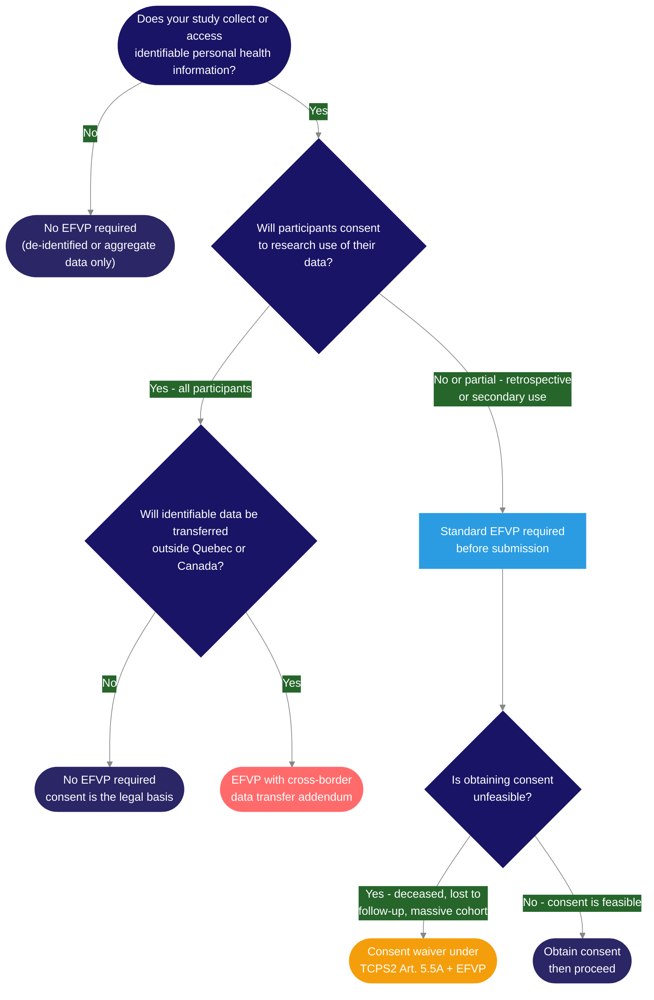

Privacy obligations in clinical research at the MUHC arise from four overlapping layers. The international and federal layers are addressed in <Tooltip tip="International standard for design, conduct, monitoring, recording, and reporting of clinical studies." headline="Good Clinical Practice (GCP)" cta="Full definition" href="/kb/foundations/glossary#gcp">GCP</Tooltip> training. This page covers the two that are not: Quebec provincial law and MUHC institutional policy.

## The Quebec legislative layer

Quebec has two pieces of legislation that directly affect how research data is handled at the MUHC. They apply on top of federal requirements — neither is a substitute for PIPEDA or TCPS2. Importantly, for health and social services data specifically, **Law 5 is the governing statute at the MUHC** — Law 25 does not separately apply to data already governed by Law 5. Law 25 applies to other personal information handled in the research context (administrative data, staff records, non-patient data not covered by Law 5).

<AccordionGroup>

<Accordion title="Law 25 — Act to Modernize Legislative Provisions Respecting the Protection of Personal Information (in force Sept. 2022–2023)">
Strengthened Quebec's privacy framework for all organizations. Requires that personal information be collected only for explicit, defined purposes. Individuals have rights to access and correct their information. Triggers an EFVP (privacy impact assessment) when technology products or services involving personal data are acquired, developed, or modified for a study, and when personal information is communicated outside Quebec. At the MUHC, Law 25 does not apply to health and social services data governed by Law 5, but it does apply to other personal information in the research context. Penalties: administrative monetary penalties up to \$10 million or 2% of worldwide turnover; penal fines up to \$25 million or 4% of worldwide turnover.
</Accordion>

<Accordion title="Law 5 — Act Respecting Health and Social Services Information">
Governs access to health and social services information held by public institutions, including the MUHC. A public body may not release nominative (identifiable) information without the person's consent, except in specific circumstances authorized by the Commission d'accès à l'information du Québec (CAI). In research, this is the legal basis for the EFVP requirement when participant consent cannot be obtained for data access.
</Accordion>

</AccordionGroup>

Together, these laws mean that any research study at the MUHC involving identifiable patient data — even data the researcher may feel they have legitimate clinical reasons to access — must follow a formal authorization process. The laws apply regardless of the study's scientific merit or the researcher's institutional affiliation.

## The EFVP — why it exists and when it applies

An _Évaluation des facteurs relatifs à la vie privée_ (EFVP) is a privacy impact assessment required under Quebec's Act respecting health and social services information. It exists because Quebec law requires that any use of identifiable health information by a public institution — without the person's explicit consent — be formally evaluated and, where applicable, authorized by the Commission d'accès à l'information (CAI). It is not a formality; it is the mechanism through which the institution demonstrates accountability for data use.

An EFVP is required in any of the following situations:

| # | Situation | What this looks like in practice |
|---|-----------|----------------------------------|
| 1 | Access to identifiable health information without consent | Records research, retrospective studies, chart reviews, or pre-screening using OACIS to identify potential participants before they have consented. Any situation where the study accesses MUHC-held data about individuals who have not yet agreed to participate. |
| 2 | Personal health data transferred outside Quebec | Transmitting participant-level data to a sponsor's servers, a CRO, a central lab, a cloud platform, or an academic collaborator located outside Quebec — including other Canadian provinces and international sites. |
| 3 | Technology involving personal data | Acquiring, developing, or modifying a technology product or service that will collect, use, or communicate personal data as part of the study — an app, wearable device, electronic data capture system, or any software platform that handles participant information. |

The EFVP is completed in French, signed by the <Tooltip tip="The physician responsible to the sponsor for the conduct of a clinical trial at the site. One QI per study per Canadian site." headline="Qualified Investigator (QI)" cta="Full definition" href="/kb/foundations/glossary#qi">QI</Tooltip>/PI, and submitted via <Tooltip tip="The RI-MUHC's electronic study submission and management platform. All studies requiring MUHC Authorization are submitted through Nagano." headline="Nagano (RI-MUHC)" cta="Full definition" href="/kb/foundations/glossary#nagano">Nagano</Tooltip> as part of the initial study submission — not as a separate process afterward. In Nagano it is submitted as Form F17 (pre-screening access before consent) or Form F18 (access without consent). It is reviewed by the MUHC Access to Information Officer, who forwards it to the CAI. For multi-centric studies, the lead site submits one EFVP for the entire project; participating sites do not submit separately.

Use the decision tree below to determine whether your study triggers an EFVP — and what type applies:

Cross-border transfers (including data going to a US-based sponsor or CRO) are the most commonly missed trigger. If in doubt, contact the Personne mandatée Office before finalizing the protocol: [efvp@muhc.mcgill.ca](mailto:efvp@muhc.mcgill.ca)

<Warning>
**The EFVP is a prerequisite, not a retrospective justification.** Accessing OACIS to identify potential participants before the EFVP is approved is a privacy violation under Quebec law, regardless of the intent. If pre-screening access is part of your study design, submit the EFVP with the initial F11 and wait for authorization before accessing records. Contact efvp@muhc.mcgill.ca with questions about scope.
</Warning>

## The MUHC Confidentiality and Security Agreement

Every member of a research team who will access MUHC systems, patient records, or any identifiable participant information must sign the MUHC Confidentiality and Security Agreement before doing so. This is an MUHC institutional requirement that exists separately from any sponsor confidentiality agreement — and separately from the GCP obligation to protect participant data.

The sponsor's confidentiality agreement governs information about the study itself (the protocol, the <Tooltip tip="Compilation of clinical and nonclinical data on the investigational product relevant to the study." headline="Investigator's Brochure (IB)" cta="Full definition" href="/kb/foundations/glossary#ib">IB</Tooltip>, proprietary data). The MUHC Confidentiality Agreement governs access to MUHC systems and MUHC-held patient information. They are not interchangeable.

The agreement is included as [Appendix 1 of SOP-CR-019](/sops/cr-019#appendices) ([download](https://portal.rimuhc.ca/pls/apex/MUHC2.download_my_file?p_file=105487170812722201)). It must be signed and submitted to MUHC Medical Records Services before that person is granted access to patient records. The requirement applies to everyone on the <Tooltip tip="Lists each team member, their qualifications, and specific trial tasks authorized by the QI." headline="Task Delegation Log (TDL)" cta="Full definition" href="/kb/foundations/glossary#tdl">Task Delegation Log</Tooltip> whose study tasks involve any access to identifiable participant information — including CRCs, research nurses, sub-investigators, and data entry staff.

<Note>
**Medical Records Services will not grant OACIS access without a signed confidentiality agreement on file.** Ensure agreements are signed and submitted before the <Tooltip tip="Monitoring visit to train the site team on the protocol and confirm site readiness, after REB approval and MUHC Authorization." headline="Site Initiation Visit (SIV)" cta="Full definition" href="/kb/foundations/glossary#siv">SIV</Tooltip>, not after, so team members are able to work from day one of study activation.
</Note>

## Handling participant data during a study

Quebec law and MUHC policy create several specific requirements for how participant data is handled day-to-day that go beyond what GCP training typically covers:

**Participant ID log confidentiality** — The Participant ID Log, which links a participant's name and MRN to their study number, must never be shared with the sponsor. The sponsor receives data coded by study number only. This is explicit in [SOP-CR-014](/sops/cr-014) and reflects the requirement that nominative information not leave the institution without CAI authorization.

**De-identification of source documents** — When source documents are copied for the sponsor or monitor, nominative information (name, MRN, date of birth) must be blacked out and replaced with the participant's study number. Best practice is for two team members to be involved: one de-identifies, one performs quality control to confirm the correct study number was recorded.

**Electronic devices** — Validated electronic devices used for study purposes — tablets, laptops, personal digital assistants — must not contain any nominative participant information. Study data on portable devices must be stored in coded form only.

**Data collected only for approved purposes** — Data may be collected and used only for the <Tooltip tip="The ethics committee that reviews and approves research involving human participants. Also called CER at French-language institutions." headline="Research Ethics Board (REB)" cta="Full definition" href="/kb/foundations/glossary#reb">REB</Tooltip>-approved study. Accessing participant records for purposes beyond the approved study scope is a privacy violation regardless of whether the researcher has clinical access to those records in their treating role.

**Certified copies for transmission** — When documents containing participant information must leave the institution — for example, source documents sent to a sponsor for an audit — a certified copy must be created. Identifying information must be removed, the copy must be clearly marked as a certified copy, and it must be signed and dated by the person who made it.

## OACIS access for monitors and third parties

Monitors, CROs, auditors, and other third parties who require access to OACIS as part of their role must be formally authorized before they are granted access. The QI/PI must submit a written letter to Medical Records Services requesting access, specifying the reason and the scope. This authorization is time-limited and specific to the study.

The monitoring plan described in [SOP-CR-013](/sops/cr-013) should account for OACIS access logistics. For remote monitoring visits, OACIS access may need to be coordinated differently than for on-site visits — the monitor cannot simply log in from outside the MUHC network without prior authorization from Medical Records and IT.

<Note>
**OACIS access is not automatic for monitors.** Industry sponsors often assume monitors have standard OACIS access. They do not. Arrange authorization before the first monitoring visit, not on the day of.
</Note>

## Conflict of interest as a trust obligation

Conflict of interest in research is most often thought of as a financial disclosure requirement. The TCPS2 framing is broader: investigators and research team members hold trust relationships with participants, sponsors, their institution, and society. These trust relationships can be compromised by conflicts of interest — whether financial, personal, or relational — that affect professional judgment or objectivity. A COI that is undisclosed is more damaging than one that is disclosed and managed.

At the MUHC, COI disclosure is required at the time of initial REB submission. Actual, perceived, or potential conflicts must be disclosed — including those of close relatives or partners. The REB determines how the conflict must be managed. Investigators must not participate in REB deliberations or vote on their own study. If a team member is uncertain whether a situation constitutes a COI, they must contact the REB Chair for guidance rather than making their own determination. The governing framework is TCPS2 Chapter 7 and [SOP-CR-007](/sops/cr-007).

## Health record retention

Two retention obligations apply in parallel at the MUHC, and they govern different documents held by different custodians.

MUHC Medical Records Services is responsible for the maintenance of, and access to, all information contained in the health records of research participants. Health records are retained for a minimum of 25 years of inactivity. This obligation rests with the institution, not the research team.

Separately, the research team is responsible for retaining the essential study documents in the <Tooltip tip="The QI's collection of documentation demonstrating compliance, study integrity, and participant safety." headline="Investigator Site File (ISF)" cta="Full definition" href="/kb/foundations/glossary#isf">ISF</Tooltip>/<Tooltip tip="The sponsor's collection of documentation demonstrating compliance across all study sites." headline="Trial Master File (TMF)" cta="Full definition" href="/kb/foundations/glossary#tmf">TMF</Tooltip> for a minimum of 15 years from study closure for Health Canada-regulated studies, or 7 years for non-regulated studies. This obligation rests with the QI/PI and is governed by [SOP-CR-015](/sops/cr-015).

These two retention periods apply to different documents and different custodians. They are not interchangeable, and meeting one does not satisfy the other. See [Data Integrity](/kb/conduct/data-documentation/data-integrity) for the full essential document retention framework.

---

## Related resources

- [SOP-CR-019](/sops/cr-019) — Confidentiality and Privacy
- [SOP-CR-014](/sops/cr-014) — Clinical Data Management
- [SOP-CR-013](/sops/cr-013) — Study Monitoring and Communication
- [SOP-CR-007](/sops/cr-007) — Initial REB Review, COI and Trial Registration
- [Data Integrity](/kb/conduct/data-documentation/data-integrity)
- [Study Conduct — Overview](/kb/conduct/conduct-overview)
- [Biological Specimens](/kb/conduct/study-operations/biological-specimens)
