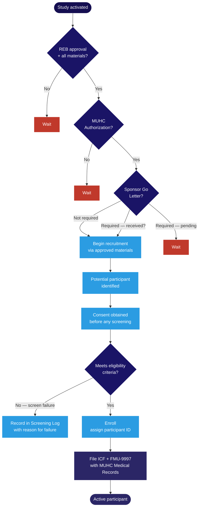

Recruitment is where the study moves from activation to having participants in the door. The phase is more structured than it might appear — who you can approach, how you approach them, and how you document every interaction are all governed by specific rules that protect participants and protect the integrity of your eligibility data.

## Before you can recruit

Recruitment cannot begin until three conditions are all in place simultaneously:

1. **<Tooltip tip="The ethics committee that reviews and approves research involving human participants. Also called CER at French-language institutions." headline="Research Ethics Board (REB)" cta="Full definition" href="/kb/foundations/glossary#reb">REB</Tooltip> approval** — including approval of all recruitment materials
2. **<Tooltip tip="Institutional authorization allowing a study to proceed at the RI-MUHC. Issued after ethics approval and feasibility review." headline="MUHC Authorization" cta="Full definition" href="/kb/foundations/glossary#muhc-auth">MUHC Authorization</Tooltip>** — confirmed via <Tooltip tip="The RI-MUHC's electronic study submission and management platform. All studies requiring MUHC Authorization are submitted through Nagano." headline="Nagano (RI-MUHC)" cta="Full definition" href="/kb/foundations/glossary#nagano">Nagano</Tooltip>
3. **Sponsor Go Letter** — if applicable for industry-sponsored studies

Receiving REB approval does not authorize recruitment if MUHC Authorization is still pending. The Go Letter from the Sponsor is the final gate for industry-sponsored studies. This sequence is not administrative formality — it is a <Tooltip tip="International standard for design, conduct, monitoring, recording, and reporting of clinical studies." headline="Good Clinical Practice (GCP)" cta="Full definition" href="/kb/foundations/glossary#gcp">GCP</Tooltip> requirement and a common finding in Health Canada inspections when not followed.

<Warning>
Trial registration must be confirmed before the first participant is enrolled. Under TCPS2 Article 11.10, all clinical trials must be registered in a publicly accessible registry before enrolment begins. The registration number must appear in the REB-approved <Tooltip tip="The written document providing the participant with information essential to making an informed decision. Both parties must sign." headline="Informed Consent Form (ICF)" cta="Full definition" href="/kb/foundations/glossary#icf">ICF</Tooltip>. The standard registry at the RI-MUHC is ClinicalTrials.gov. For industry-sponsored trials, confirm the Sponsor has registered and obtain the number before finalizing the ICF. For CIHR-funded trials, registration before first contact is a mandatory funding condition.
</Warning>

<Warning>
Pre-screening access to patient records requires EFVP authorization. If you need to identify potential participants by accessing OACIS or other MUHC health records before approaching them, an EFVP (privacy impact assessment) must be submitted and MUHC authorization for that access must be in place. This is requested as part of the initial Nagano submission. Accessing patient records without this authorization is a privacy violation under Quebec <Tooltip tip="Quebec's Act to modernize personal information protection law (in force Sept 2023). Requires EFVP before sharing personal data without consent." headline="Law 25 / Loi 25" cta="Full definition" href="/kb/foundations/glossary#law-25">Law 25</Tooltip> regardless of research intent.
</Warning>

## Recruitment materials and advertising

Any material that a potential participant might see — posters, flyers, social media text, email scripts, MUHC TV screen content, website copy — is a recruitment material and requires approval before use. The approval sequence is fixed:

<Steps>
  <Step title="Sponsor or Sponsor-Investigator approval">
    Required for industry-sponsored studies before submitting to the REB.
  </Step>
  <Step title="REB approval">
    Submit via Nagano with study materials. The REB reviews recruitment materials for undue influence, coercive tone, and accuracy of content.
  </Step>
  <Step title="MUHC Communications approval">
    Required for anything displayed at the MUHC — walls, screens, emails to MUHC patients, social media posted on MUHC channels. Contact communications@muhc.ca. Typically within 3 days. This step happens only after REB approval is confirmed — not in parallel.
  </Step>
</Steps>

Materials must be bilingual (French and English), use the RI-MUHC or MUHC logo correctly, be written in plain language accessible to laypersons, and identify a contact person for interested participants. Any amendment or revision to approved materials must go through the same approval sequence before use.

<Info>
Required on all recruitment materials: the <Tooltip tip="The physician responsible to the sponsor for the conduct of a clinical trial at the site. One QI per study per Canadian site." headline="Qualified Investigator (QI)" cta="Full definition" href="/kb/foundations/glossary#qi">QI</Tooltip>/PI's full name, title, and an MUHC or RI-MUHC phone number. Personal phone numbers and personal email addresses are not acceptable contact information on any recruitment material.
</Info>

## Screening

Screening is the formal process of determining whether a person meets the study's eligibility criteria. Every person who is assessed must be recorded — whether or not they ultimately enrol. The Screening Log is an essential document under ICH E6(R3) and ISO 14155 and must be in the <Tooltip tip="The QI's collection of documentation demonstrating compliance, study integrity, and participant safety." headline="Investigator Site File (ISF)" cta="Full definition" href="/kb/foundations/glossary#isf">ISF</Tooltip>.

### Consent before screening — no exceptions

Informed consent must be obtained **before** any protocol screening procedure is conducted. This sequence is mandatory. The only exception is where the REB has granted a written waiver of consent and an EFVP has been reviewed — both conditions must be met, and the waiver must be documented. There is no informal exception to this rule.

### Eligibility and QI/PI responsibility

Eligibility is determined against the inclusion and exclusion criteria in the most recently REB-approved protocol — not a previous version, not the Sponsor's master protocol if it differs from the approved version. The QI/PI is responsible for the final medical judgment on each participant's eligibility and must sign off on a source document inclusion/exclusion checklist for each participant. This is the documentation of medical oversight that monitors and inspectors will review.

## Enrollment and the three participant logs

Once a participant meets eligibility criteria and has consented, they are enrolled. Three logs must be maintained throughout the study and are all essential documents under GCP.

| Log | What it tracks | Key rules |
|---|---|---|
| Screening Log | Everyone assessed for eligibility — enrolled participants and screen failures | Must record the ICF date and the reason for each screen failure. Maintained throughout enrolment. |
| Enrollment Log | All enrolled participants, chronologically by study number, with visit dates | Uses study participant numbers only — no nominative data (no initials, no date of birth). |
| Participant ID Log | Confidential link between study number and participant identity | The only log containing nominative information. **Never share with the Sponsor.** Retain for the full retention period. Sponsor permission required before destruction. |

If the Sponsor has not provided log templates, RI-MUHC templates are available in the appendices of [SOP-CR-009](/sops/cr-009).

## Filing with Medical Records

For studies involving an <Tooltip tip="A drug, medical device, or natural health product being tested or used as a reference in a clinical trial." headline="Investigational Product (IP)" cta="Full definition" href="/kb/foundations/glossary#ip">investigational product</Tooltip> (drug, natural health product, or medical device), two steps are required at enrollment and again at end of participation.

**At enrollment:** the signed ICF and MUHC Form FMU-9997 (Confirmation of Participation in Research) must be sent to MUHC Medical Records Services to be filed in the Alert section of the participant's OACIS record. This ensures that any clinician treating the participant in an emergency knows they are on a study involving an IP and can contact the QI/PI before administering treatment that may interact with the investigational product.

**At end of participation:** the End of Participation form must also be submitted to Medical Records for each participant. Always apply the participant's bar code to the top right corner of paper forms — the bar code degrades when photocopied, so only originals should be sent for scanning.

## Participant compensation

Participants may be compensated for their time and out-of-pocket expenses. Compensation is appropriate; undue inducement is not. Under TCPS2 Article 3.1, if the payment is large enough that a reasonable person might discount or ignore the risks of the study in order to receive it, it has crossed from fair compensation into coercion.

Two conditions apply under the SOPs:

- Compensation must not constitute an undue inducement.
- Compensation must be paid on a **pro-rata basis** for actual participation — not as a lump sum that a participant forfeits if they withdraw. A lump sum contingent on completing the study creates pressure to continue that undermines the right to withdraw freely.

<Warning>
Under CCQ Art. 25, compensation in Quebec is limited to reimbursement of actual expenses. This is stricter than both TCPS2 and ICH GCP. Compensation must be calibrated to what a person actually lost by participating — not as an incentive to participate. If proposed compensation is unusual or the population is vulnerable, discuss with the REB coordinator before submitting.
</Warning>

TCPS2 does not set specific allowable amounts — that is the REB's determination based on study context, participant population, and risk profile. Reimbursement of actual expenses (transportation, parking, meals) is treated differently from compensation for participation and is not considered an incentive.

## Ongoing recruitment management

You are responsible for monitoring the recruitment rate throughout the study and ensuring the team maintains a rate consistent with the protocol's target and timeline. If recruitment is falling behind, the recruitment plan may need to be revised and, if the change involves new participant-facing outreach, resubmitted to the REB.

Any new recruitment materials added during the study must go through the same approval sequence as the originals: Sponsor or Sponsor-Investigator approval first (if applicable), then REB, then MUHC Communications for materials intended for display at the MUHC.

<Note>
For decentralized trials, recruitment may involve participants at remote locations. The same pre-screening EFVP authorization requirement applies. See the [Study conduct overview](/kb/conduct/conduct-overview) for the full regulatory context.
</Note>

## Recruitment realism

Recruitment projections submitted during feasibility and in grant applications are consistently and substantially optimistic. This is one of the most documented patterns in clinical trial literature — and one of the most consequential, because under-enrollment is the leading cause of trial failure.

**The halve-your-projection heuristic.** A widely cited rule of thumb among experienced trialists is that actual accrual rates average approximately half of what investigators initially project. This reflects the accumulated experience of sites that have run many studies, not a design limitation. The gap has multiple causes: investigator enthusiasm when committing to a study, failure to account for screen failure rates, the assumption that all eligible patients will be willing to enrol, and underestimating the impact of competing studies recruiting from the same patient population.

**The evidence.** A prospective study by Cuppone et al. (*PLOS ONE*, 2022) documented systematic PI overconfidence in accrual projections across multiple study types and institutions. PIs consistently over-projected accrual and under-projected screen failure rates, even when they had relevant prior experience. The pattern persisted regardless of whether investigators had access to local screening data from analogous studies.

**Screen failure rates.** Screen failure rates in many therapeutic areas exceed 50% — sometimes substantially. If the protocol has complex eligibility criteria (multiple inclusion/exclusion criteria, narrow age ranges, required washout periods, specific lab values), plan for a screen-to-enrol ratio well above 2:1. Map your eligibility criteria against your available patient population before committing to an accrual rate. A retrospective look at OACIS records for the relevant diagnostic codes is a reasonable starting point.

**Practical implications for feasibility responses and grant applications:**

<Steps>
  <Step title="Anchor your projection in data, not optimism">
    Count how many eligible patients you actually see per month — not how many potentially eligible patients exist in the system. Use OACIS searches, MUHC diagnostic databases, or clinic appointment volumes for the relevant population. Sponsor feasibility questionnaires will ask for this figure; give the real one.
  </Step>
  <Step title="Apply a realistic screen failure multiplier">
    Divide your projected enrolment target by your expected screen failure rate. If you expect to enrol 30 participants and your screen-to-enrol ratio is 3:1, you need to screen 90. Confirm you have access to that throughput.
  </Step>
  <Step title="Account for study-period availability">
    Clinical researchers do not recruit every week — clinical commitments, holidays, conference periods, and competing studies all reduce available recruitment time. Budget for 44 productive recruitment weeks per year, not 52.
  </Step>
  <Step title="Defend a conservative number">
    Sponsors sometimes push back on conservative projections because they prefer to believe sites will recruit faster. A conservative projection that you meet is more valuable than an optimistic one that triggers a performance conversation. When negotiating feasibility commitments, it is better to commit to a number you are confident in and exceed it than to commit high and fall short.
  </Step>
</Steps>

<Note>
Sponsors track enrollment performance against commitments and use this data in future site selection. Sites that consistently meet or exceed conservative projections receive preferential consideration over sites with histories of over-promising. Accurate projections protect the site's reputation and the study's timeline.
</Note>

<Tip>
Use the [Recruitment Realism Calculator](/kb/recruitment/recruitment-calculator) to translate your eligible-patient estimate into a defensible enrolment projection — with screen failure adjustment, productive-weeks correction, and the halve-your-projection sanity check built in.
</Tip>

---

## Related resources

- [Study Conduct Overview](/kb/conduct/conduct-overview) — lifecycle stages and regulatory context
- [Informed Consent in Quebec](/kb/recruitment/consent) — ICF requirements, consent process, vulnerable populations
- [Site Activation and Study Setup](/kb/site-activation/site-setup) — activation steps before enrollment can begin
- [Building Your Research Team](/kb/team/building-your-team) — delegation, training, and team composition
- [Pediatric Research Considerations](/kb/recruitment/pediatric-research) — consent, assent, parental authority, and recruitment safeguards for children
- [Vulnerable Populations](/kb/recruitment/vulnerable-populations) — additional protections for participants in vulnerable persons or contexts
- [SOP-CR-009 — Participant Recruitment, Screening and Enrollment](/sops/cr-009) — screening logs, enrollment logs, participation forms

  
  

    
<strong>Looking to go deeper?</strong> Canada's national clinical trials training platform offers free, self-paced courses for RI-MUHC investigators, staff, and trainees. You might be interested in these courses:

    <ul>
      <li><em>Participant Recruitment</em></li>
      <li><em>Strategies in Participant Recruitment</em></li>
    </ul>
  

