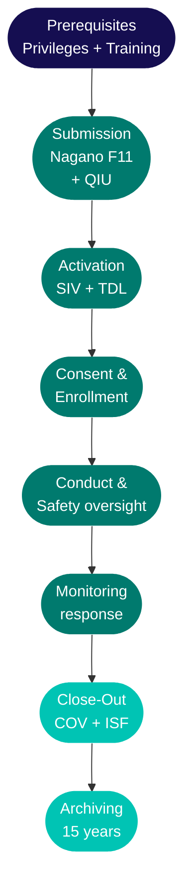

As <Tooltip tip="US equivalent of the Canadian Qualified Investigator (QI)." headline="Principal Investigator (PI)" cta="Full definition" href="/kb/glossary#pi">PI</Tooltip> or <Tooltip tip="The physician responsible to the sponsor for the conduct of a clinical trial at the site. One QI per study per Canadian site." headline="Qualified Investigator (QI)" cta="Full definition" href="/kb/glossary#qi">Qualified Investigator</Tooltip>, you carry ultimate legal and regulatory accountability for your study at the RI-MUHC site. Tasks can be delegated — accountability cannot. This page maps your obligations from prerequisites through close-out and links to the companion guides that give you the operational detail for your study type.

## Prerequisites

Two prerequisites must be in place before you can submit a study in <Tooltip tip="The RI-MUHC's electronic study submission and management platform. All studies requiring MUHC Authorization are submitted through Nagano." headline="Nagano (RI-MUHC)" cta="Full definition" href="/kb/glossary#nagano">Nagano</Tooltip>. <Tooltip tip="All planned and systematic actions to ensure trial data are generated, documented, and reported in compliance with GCP and SOPs." headline="Quality Assurance (QA)" cta="Full definition" href="/kb/glossary#qa">QA</Tooltip> verifies both at submission. If either is missing or within 90 days of expiry, the feasibility check fails and the <Tooltip tip="Individual formally authorized to issue the final written authorization for each research project at a Quebec RSSS institution." headline="Personne mandatée (PFM)" cta="Full definition" href="/kb/glossary#personne-mandatee">Personne mandatée</Tooltip> cannot issue <Tooltip tip="Institutional authorization allowing a study to proceed at the RI-MUHC. Issued after ethics approval and feasibility review." headline="MUHC Authorization" cta="Full definition" href="/kb/glossary#muhc-auth">MUHC Authorization</Tooltip>.

### Research Privileges or Researcher Status

<CardGroup cols={2}>
  <Card title="Human Research Privileges" icon="shield-check">
    For CPDP members (physicians and dentists) leading studies that require medical oversight — drug trials, device studies, NHP trials, or any protocol involving acts reserved to physicians. Apply via TalentLMS. Valid for 3 years. **Required for Levels I–III. Also valid for Levels IV–V.**
  </Card>
  <Card title="Human Researcher Status" icon="user-check">
    For non-CPDP researchers (PhDs, nurses, physiotherapists, psychologists, and others) leading studies that do not require medical oversight. Apply via TalentLMS. Valid for 3 years. **Limited to Levels IV–V — does not authorize studies requiring medical oversight.**
  </Card>
</CardGroup>

<Note>
  **Pharmacist exception:** although pharmacists are CPDP members, they are not eligible for Human Research Privileges under the MSSS and MUHC frameworks. Pharmacists acting as PI must obtain Human Researcher Status instead.
</Note>

<Warning>
  **The 90-day rule:** at submission, your Privileges or Status must be active and not within 90 days of expiry. Lapsed credentials prevent MUHC Authorization and may halt active studies mid-course.
</Warning>

### Institutional training by study level

<Tabs>
  <Tab title="Interventional I — Drug">
    **Level I** covers drug trials (biologics, vaccines, gene/cell therapies) under a <Tooltip tip="Application to Health Canada for authorization to conduct a drug trial under Division 5 of the Food and Drug Regulations." headline="Clinical Trial Application (CTA)" cta="Full definition" href="/kb/glossary#cta">Clinical Trial Application</Tooltip>.

    | Requirement | Details |
    |---|---|
    | SOP series | SOP-CR (31 SOPs) |
    | SOP renewal | Every 2 years |
    | <Tooltip tip="International standard for design, conduct, monitoring, recording, and reporting of clinical studies." headline="Good Clinical Practice (GCP)" cta="Full definition" href="/kb/glossary#gcp">GCP</Tooltip> | ICH-GCP required (CITI licence free for RI-MUHC staff) |
    | Health Canada Division 5 | Required |
    | Human Research Privileges | Required |
  </Tab>
  <Tab title="Interventional II — Device">
    **Level II** covers medical device and surgical studies under an <Tooltip tip="Health Canada authorization to conduct a clinical investigation of a medical device. The device equivalent of a CTA." headline="Investigational Testing Authorization (ITA)" cta="Full definition" href="/kb/glossary#ita">Investigational Testing Authorization</Tooltip>.

    | Requirement | Details |
    |---|---|
    | SOP series | SOP-CR (30 SOPs) |
    | SOP renewal | Every 2 years |
    | GCP | ICH-GCP required (satisfies ISO 14155 GCP component) |
    | ISO 14155 | Required |
    | Human Research Privileges | Required |
  </Tab>
  <Tab title="Interventional III — NHP">
    **Level III** covers natural health product studies.

    | Requirement | Details |
    |---|---|
    | SOP series | SOP-CR (30 SOPs) |
    | SOP renewal | Every 2 years |
    | GCP | Not required |
    | Human Research Privileges | Required |
  </Tab>
  <Tab title="Observational IV">
    **Level IV** covers prospective observational, educational, and non-invasive intervention studies. No QIU, no Health Canada submission.

    | Requirement | Details |
    |---|---|
    | SOP series | SOP-LR |
    | SOP renewal | Every 5 years |
    | GCP | Not required |
    | Privileges or Researcher Status | Either is valid |
  </Tab>
  <Tab title="Retrospective V">
    **Level V** covers retrospective chart reviews and studies using biobanked samples. Consent waiver decisions depend on the <Tooltip tip="Required under Quebec Law 25 before communicating personal information without consent for research. Non-compliance: up to $25M or 4% of worldwide turnover." headline="ÉFVP — Privacy Impact Assessment" cta="Full definition" href="/kb/glossary#efvp">ÉFVP</Tooltip> outcome.

    | Requirement | Details |
    |---|---|
    | SOP series | SOP-LR |
    | SOP renewal | Every 5 years |
    | GCP | Not required |
    | Privileges or Researcher Status | Either is valid |
  </Tab>
</Tabs>

<Info>
  Your training level is set by your **highest-risk active study** across all protocols. Use the [Study Type and Training Classifier](/training/compliance-requirements) to confirm which level applies to your study.
</Info>

## What only you sign

Delegation is appropriate for most operational tasks. The items below require your personal signature and cannot be delegated to anyone on your team.

<AccordionGroup>
  <Accordion title="QIU form (Level I drug trials only)">
    You sign the Qualified Investigator Undertaking before the study begins, confirming you will conduct the trial per Health Canada regulations and GCP. Do not sign FDA Form 1572 — use the RI-MUHC ICH GCP Attestation form ([SOP-CR-002](/sops/cr-002) Appendix 4) if a US Sponsor requires the equivalent.
  </Accordion>
  <Accordion title="Task Delegation Log — countersignature">
    You countersign every team member's entry, confirming they are qualified and trained. Required before any team member performs a single delegated task, and again whenever tasks or personnel change.
  </Accordion>
  <Accordion title="Medical oversight of safety documents">
    You review and initial all <Tooltip tip="Any untoward medical occurrence in a participant, whether or not related to the investigational product." headline="Adverse Event (AE)" cta="Full definition" href="/kb/glossary#ae">AE</Tooltip> documentation, <Tooltip tip="An adverse event meeting seriousness criteria: death, life-threatening, hospitalization, disability, or congenital anomaly." headline="Serious Adverse Event (SAE)" cta="Full definition" href="/kb/glossary#sae">SAE</Tooltip> reports, <Tooltip tip="Suspected Unexpected Serious Adverse Reaction — unexpected in nature, severity, or frequency; must be reported to Health Canada and the REB." headline="SUSAR" cta="Full definition" href="/kb/glossary#susar">SUSAR</Tooltip> reports, lab results, and any document requiring medical assessment. This is ongoing throughout the study and cannot be fully delegated — a qualified Sub-I may be delegated AE causality assessment, but that delegation must appear on the log.
  </Accordion>
  <Accordion title="Monitoring visit follow-up letters">
    Every monitoring letter from the Sponsor's CRA must be initialled and dated by you before filing in the <Tooltip tip="The QI's collection of documentation demonstrating compliance, study integrity, and participant safety." headline="Investigator Site File (ISF)" cta="Full definition" href="/kb/glossary#isf">ISF</Tooltip>. A missing initial on a monitoring letter is one of the most consistent findings at Health Canada inspections.
  </Accordion>
  <Accordion title="PI Commitment and Signature in Nagano">
    Your <Tooltip tip="The team member who handles day-to-day administration and coordination of the clinical trial." headline="Clinical Research Coordinator (CRC)" cta="Full definition" href="/kb/glossary#crc">CRC</Tooltip> can prepare the entire F11 submission — but it is not complete until you complete the final commitment and signature step in Nagano. The same applies to annual renewals and amendments.
  </Accordion>
</AccordionGroup>

The following items are prepared by your team but still require your review and sign-off before submission:

- **Annual <Tooltip tip="The ethics committee that reviews and approves research involving human participants. Also called CER at French-language institutions." headline="Research Ethics Board (REB)" cta="Full definition" href="/kb/glossary#reb">REB</Tooltip> renewal** — your CRC prepares the submission; you review and sign off in Nagano. Submit before approval lapses — a lapse halts the study.
- **Amendments (F1 form)** — protocol changes, team changes, and consent form updates. Your CRC prepares and submits via Nagano; you sign. Amendments must be approved before implementing any change.
- **SAE and deviation reports** — your CRC documents the event; you review, assess causality and seriousness, add your medical assessment, and sign. The report is only complete with your assessment.

## Building your team

Every person on the Task Delegation Log must hold current institutional training at the correct level before being added. Your countersignature confirms this.

<Steps>
  <Step title="Set up the Task Delegation Log before any study tasks begin">
    Name every team member, their role, their specific delegated tasks, and their start date. You countersign each entry. Team members sign to accept delegation. See [SOP-CR-002](/sops/cr-002) and [Building Your Research Team](/kb/planning/overview).
  </Step>
  <Step title="Appoint a Sub-Investigator as your backup">
    Your Sub-I backup must hold the same Privileges or Researcher Status as you. For interventional studies (Levels I–III), Researcher Status is not sufficient — the backup must hold Privileges. Fellows and rotating residents cannot serve as PI backup.
  </Step>
  <Step title="File CVs and training certificates in the ISF">
    Every team member's current CV (signed, dated within the past 2 years) and all training certificates must be filed before the <Tooltip tip="Monitoring visit to train the site team on the protocol and confirm site readiness, after REB approval and MUHC Authorization." headline="Site Initiation Visit (SIV)" cta="Full definition" href="/kb/glossary#siv">Site Initiation Visit</Tooltip>. Do not include personal information (home address, family details) in CVs filed in study documents.
  </Step>
  <Step title="Ensure your entire team trains at the same level">
    A CRC on a Level I drug trial needs Level I SOP Reader, Competency Assessment, GCP, and Division 5 — the training level is set by the study, not the role.
  </Step>
  <Step title="Monitor your team's training expiry dates">
    When a team member's training certificate lapses, they must come off the delegation log until renewed. If you or a team member are on leave for more than 6 months, training must be renewed before returning.
  </Step>
</Steps>

<Warning>
  **Staff changes during the study:** when a team member joins, confirm training, add to the log, countersign, and notify the Sponsor. When a team member leaves, record end date, countersign, notify the Sponsor, and submit a Nagano amendment (F1). If you leave the study, both you and the incoming PI must sign the delegation log, and the Sponsor and REB must be notified.
</Warning>

## Accountability areas

### Study submission

All studies are submitted through Nagano. The F11 triggers parallel reviews — scientific, ethics (REB), and institutional feasibility — that lead to MUHC Authorization from the Personne mandatée.

- **Confirm your credentials are current before opening Nagano.** Privileges/Status and training must not be within 90 days of expiry. QA checks this at submission.
- **Answer the F11 form accurately.** Underreporting which services are needed delays MUHC Authorization when the gap is discovered during feasibility review.
- **Start contracts and Health Canada filings early.** For drug studies: submit the CTA to Health Canada in parallel with Nagano. For device studies: obtain the ITA. All must be complete before MUHC Authorization.

<Warning>
  **MUHC Authorization is the green light — not REB approval alone.** The Personne mandatée reviews all three evaluations and decides whether to issue MUHC Authorization. Do not begin any study procedures until the Authorization letter is in your ISF.
</Warning>

See also: [Preparing Your Submission](/kb/submission/preparing) | [Submitting via Nagano](/kb/submission/submitting-via-nagano) | [Tracking Your Submission](/kb/submission/tracking-responding)

### Informed consent

You are accountable for ensuring informed consent is obtained from every participant before any study procedure. You can delegate the consent discussion, but you are accountable for ensuring the process was properly conducted and documented.

- **Document the consent process in the source record** — who conducted the discussion, when, that the participant had adequate time, and that questions were answered. The <Tooltip tip="The written document providing the participant with information essential to making an informed decision. Both parties must sign." headline="Informed Consent Form (ICF)" cta="Full definition" href="/kb/glossary#icf">ICF</Tooltip> signature alone is not sufficient.
- **Re-consent when amendments affect participant risk** — ensure enrolled participants are re-consented with the newly approved ICF before the change is implemented for them.
- **Incapacitated adults — Civil Code Art. 21** — requires substitute consent from the person with legal authority AND authorization from an MSSS-designated REB. If the incapacitated person understands and objects, they cannot be enrolled regardless of substitute consent.
- **French-language consent forms** — under Quebec's Charte de la langue française (Bill 96), consent forms at public institutions must be available in French. Always use the current REB-approved version.

### Safety and medical oversight

You retain medical oversight of all study activities even when tasks are delegated. For every AE and SAE, your team documents and reports to you — you assess causality, determine seriousness, and sign the report.

- **SAE reporting timelines are fixed** — initial reports to the Sponsor within 24 hours of awareness. REB timelines depend on the nature of the event.
- **SUSAR reports from the Sponsor** — review, initial, date, and file in the ISF to document your awareness.
- **Direct supervision means being reachable** — you must be contactable when a team member performs a task requiring medical oversight.

<Note>
  **Before extended absence:** appoint a Sub-I backup with Privileges or Researcher Status, update the delegation log and Nagano. [SOP-CR-002](/sops/cr-002) recommends writing a department-specific working instruction describing how QI/PI oversight is achieved for your team.
</Note>

### Protocol deviations

All deviations must be documented. Major or critical deviations must be reported to QA and the REB. Make it clear to your team that they should contact you when something is uncertain — not improvise.

Concerns about participant safety, informed consent, or undue risk should be reported to the MUHC REB immediately, even without a formal protocol deviation. Do not wait for the next reporting cycle.

### Monitoring and inspections

Health Canada inspects approximately 2% of Canadian clinical trial sites per year. Inspections can be announced or unannounced. As PI, you are present for the opening and closing meetings. QA leads coordination — notify QA as soon as an inspection notice is received.

The best preparation is a well-maintained ISF and a team that follows SOPs consistently — not a last-minute review.

### Privacy and data

Under Quebec's <Tooltip tip="Quebec's Act to modernize personal information protection law (in force Sept 2023). Requires EFVP before sharing personal data without consent." headline="Law 25 / Loi 25" cta="Full definition" href="/kb/glossary#law-25">Loi 25</Tooltip>, the ÉFVP (privacy impact assessment) may be required before data collection begins. This applies to most prospective studies and to any study where data is shared outside the MUHC. For retrospective studies, the ÉFVP outcome determines whether a consent waiver is granted.

You are responsible for ensuring your team handles identifiable data in compliance with institutional policy and Quebec law — de-identification, access controls, and data transfer agreements for cross-border sharing.

### Close-out and archiving

Review and sign off on the completed ISF before the Sponsor's <Tooltip tip="Final monitoring visit to verify all study closure requirements have been addressed before database lock." headline="Close-Out Visit (COV)" cta="Full definition" href="/kb/glossary#cov">Close-Out Visit</Tooltip>. Ensure all monitoring letters are initialled, all <Tooltip tip="Document designed to record all protocol-required information to be reported to the sponsor for each participant." headline="Case Report Form (CRF)" cta="Full definition" href="/kb/glossary#crf">CRF</Tooltip> corrections are complete, and the delegation log has end dates for all team members.

- **Submit Study Completion Report via Nagano** and update ClinicalTrials.gov to reflect study completion.
- **Conflict of interest declarations** are required at initial submission and every annual renewal. If a COI arises mid-study, disclose promptly via Nagano amendment — do not wait for renewal.
- **15-year retention for Division 5 studies (C.05.012)** — the ISF must remain complete, secure, and retrievable. Do not destroy any study documents without written authorization from you and the Sponsor. You retain personal accountability for the archived file even if you change institutions.

## Professional development

<CardGroup cols={3}>
  <Card title="CANTRAIN — Trialist stream" icon="graduation-cap">
    Stream 3 includes the Site Principal Investigator program and Clinical Fellows program. The Common Core Foundation (14 modules) provides a shared baseline. Free for RI-MUHC investigators, staff, and trainees.
  </Card>
  <Card title="Knowledge Base" icon="book-open">
    The Knowledge Base covers the full regulatory landscape, Quebec-specific topics (consent, privacy), and every operational domain in depth. See [Regulations and Guidelines](/kb/planning/regulations).
  </Card>
  <Card title="Community Connect" icon="users">
    Sessions hosted by the Research Facilitator covering practical topics in clinical research at the RI-MUHC. Open to all research staff and investigators.
  </Card>
</CardGroup>
