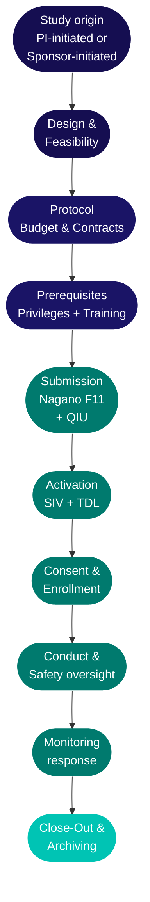
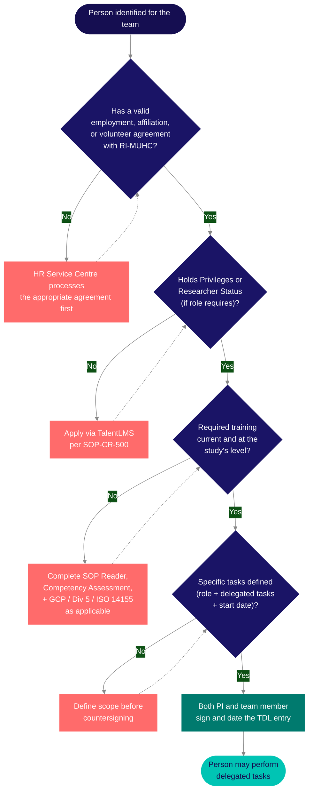

As <Tooltip tip="US equivalent of the Canadian Qualified Investigator (QI)." headline="Principal Investigator (PI)" cta="Full definition" href="/kb/glossary#pi">PI</Tooltip> or <Tooltip tip="The physician responsible to the sponsor for the conduct of a clinical trial at the site. One QI per study per Canadian site." headline="Qualified Investigator (QI)" cta="Full definition" href="/kb/glossary#qi">Qualified Investigator</Tooltip>, you carry ultimate legal and regulatory accountability for your study at the RI-MUHC site. Tasks can be delegated — accountability cannot. This page maps your obligations from prerequisites through close-out. The operational guides below give you the day-to-day detail for your study type.

### Operational guides — by study type

Each guide covers day-to-day operations for a specific study type — what happens at each lifecycle stage, who does what, and which SOPs apply. They complement this page, which focuses on your personal accountability as PI regardless of study type.

<CardGroup cols={3}>
  <Card title="Interventional (Levels I–III)" icon="flask" href="/kb/roles/pi-guide">
    Drug trials, medical device studies, NHP studies. Protocol oversight, delegation, consent, safety reporting, monitoring, IP accountability, close-out.
  </Card>
  <Card title="Observational (Level IV)" icon="eye" href="/kb/roles/pi-guide-iv">
    Prospective observational, educational, and non-invasive interventions. Simplified regulatory pathway — no Health Canada submission, no IP management.
  </Card>
  <Card title="Retrospective (Level V)" icon="file-lines" href="/kb/roles/pi-guide-v">
    Chart review, anonymized biobanked samples. ÉFVP-driven consent waiver decisions, data extraction, privacy compliance.
  </Card>
</CardGroup>

### Study lifecycle at a glance

The phases below trace the path from study initiation through archiving. Each maps to sections on this page and in the guides above.

## How your study begins

Studies at the RI-MUHC start from one of two places. How yours originates determines who owns the protocol, who holds regulatory responsibility, and what your first steps are.

<Tabs>
  <Tab title="PI-initiated study">
    You conceive the research question, develop the protocol, and lead the regulatory and funding strategy. Your team manages all study activities. If the study involves an investigational product (drug, device, NHP), you may be the **[Sponsor-Investigator](/kb/planning/sponsor-investigator)** — holding both QI and Sponsor obligations under Health Canada. Confirm with QA before committing to that role.

    **First steps:**
    - Frame the research question — engage the [Biostatistics Consulting Unit (BCU)](/kb/planning/bcu) for methodology and sample size, and [CORD](/kb/planning/cord) for data capture planning, before writing the protocol
    - Confirm feasibility: patient population, facilities, team capacity, enrollment timeline. Use the [Study Feasibility Checklist (SOP-CR-004, Appendix 1)](/sops/cr-004#appendices)
    - If your study may need clinical research infrastructure, nursing, or monitoring support, see [Consider CIM](#consider-the-centre-for-innovative-medicine-cim) below
    - Identify funding (CIHR, FRQS, foundation, departmental) and engage the Pre-Awards Office early — grant deadlines and study timelines rarely align
    - See [Design Stage Support](/kb/planning/study-design) for the full list of planning specialists
  </Tab>
  <Tab title="Sponsor-initiated study">
    A pharmaceutical, biotech, or device company (or their CRO) approaches you with an existing protocol. The sponsor owns the protocol and holds the Health Canada authorization. You join as **Qualified Investigator** for the MUHC site — responsible for conduct, consent, safety, and data integrity locally.

    **How sponsors find you:** Sponsors and CROs identify candidate sites based on access to the target patient population, PI expertise and publications in the disease area, prior enrollment performance, infrastructure and SOP readiness, and professional relationships formed at conferences or through previous studies. CROs maintain site databases — registering with major CROs signals your availability for new studies.

    **The selection process:** feasibility questionnaire → pre-study site visit → site selection → contract and budget negotiation → activation.

    Many industry-sponsored studies at the MUHC are operated through the [Centre for Innovative Medicine (CIM)](#consider-the-centre-for-innovative-medicine-cim) — if you are considering CIM, engage them before responding to the feasibility questionnaire.

    See [How Sponsored Trials Come to the RI-MUHC](/kb/planning/sponsored-trials) for the full picture.
  </Tab>
</Tabs>

### Consider the Centre for Innovative Medicine (CIM)

The CIM is the RI-MUHC's clinical research operations unit, providing dedicated infrastructure and specialized staffing at the Glen site and Montreal General Hospital. CIM services are available to any RI-MUHC researcher — no formal affiliation is required.

**CIM is typically a strong fit for:**
- Phase I drug studies — dedicated unit with negative pressure pods and overnight capacity
- Oncology trials — IV chemotherapy, biotherapy, immunotherapy with certified oncology nursing
- Industry-sponsored trials requiring IV administration or infusion
- Sponsor-Investigator studies needing independent monitoring

**CIM can also support:**
- Studies requiring functional testing (CPET, PFT, ECG, body composition, sleep studies, imaging)
- Studies requiring specimen processing or biobanking (Containment Level II lab)
- Paediatric studies
- Any study needing research nursing, coordination, regulatory, or budget support

CIM accepts studies based on feasibility assessment and available capacity — contact them early to confirm whether your study is a fit.

<Warning>
  CIM costs must be included in the study budget before the Site Agreement is signed. Adding CIM afterward requires a budget amendment, which delays activation. Phase I capacity is limited and pre-booking is common. Contact CIM at [clinical.research@muhc.mcgill.ca](mailto:clinical.research@muhc.mcgill.ca).
</Warning>

See also: [CIM Overview](/cim/overview) | [CIM Services](/cim/services) | [Planning Your Study with the CIM](/cim/planning)

### Building your research profile

For PIs who want to attract industry-sponsored studies, the factors sponsors evaluate are practical:

- **Publish in your disease area** — publications are how sponsors identify PIs with relevant clinical expertise
- **Deliver on enrollment commitments** — sponsors track whether sites meet enrollment targets across studies, and sites that consistently under-enroll are unlikely to be selected again
- **Maintain a clean study record** — a well-organized ISF, timely monitoring letter responses, and few unresolved findings signal a reliable site. CRAs report back to sponsors.
- **Build professional relationships** — attend specialty conferences, engage at investigator meetings, and participate in advisory boards where appropriate
- **Register with CRO site databases** — this signals availability and lets CROs find you when they have a study that matches your patient population
- **Invest in structured development** — the [CANTRAIN Site PI program](/kb/roles/pi-pathway#professional-development) and Clinical Fellows program build trial-specific competencies

<Tip>
  **Starting a new study?** Complete the [Study Intake Form](/kb/planning/study-intake) — it produces a personalized startup checklist based on your study type and connects you with the Research Facilitator for guidance. This is the recommended first step for both PI-initiated and sponsor-initiated studies.
</Tip>

See also: [Study Planning Overview](/kb/planning/overview) | [Study Feasibility](/kb/planning/feasibility) | [Design Stage Support](/kb/planning/study-design) | [Sponsored Trials](/kb/planning/sponsored-trials)

## Prerequisites

Once your study is designed and feasibility confirmed, two personal prerequisites must be in place before you can submit in <Tooltip tip="The RI-MUHC's electronic study submission and management platform. All studies requiring MUHC Authorization are submitted through Nagano." headline="Nagano (RI-MUHC)" cta="Full definition" href="/kb/glossary#nagano">Nagano</Tooltip>. <Tooltip tip="All planned and systematic actions to ensure trial data are generated, documented, and reported in compliance with GCP and SOPs." headline="Quality Assurance (QA)" cta="Full definition" href="/kb/glossary#qa">QA</Tooltip> verifies both at submission. If either is missing or within 90 days of expiry, the feasibility check fails and the <Tooltip tip="Individual formally authorized to issue the final written authorization for each research project at a Quebec RSSS institution." headline="Personne mandatée (PFM)" cta="Full definition" href="/kb/glossary#personne-mandatee">Personne mandatée</Tooltip> cannot issue <Tooltip tip="Institutional authorization allowing a study to proceed at the RI-MUHC. Issued after ethics approval and feasibility review." headline="MUHC Authorization" cta="Full definition" href="/kb/glossary#muhc-auth">MUHC Authorization</Tooltip>.

### Research Privileges or Researcher Status

<CardGroup cols={2}>
  <Card title="Human Research Privileges" icon="shield-check">
    For CPDP members (physicians and dentists) leading studies that require medical oversight — drug trials, device studies, NHP trials, or any protocol involving acts reserved to physicians. Apply via [TalentLMS](/apps/talentlms). Valid for 3 years. **Required for Levels I–III. Also valid for Levels IV–V.**
  </Card>
  <Card title="Human Researcher Status" icon="user-check">
    For non-CPDP researchers (PhDs, nurses, physiotherapists, psychologists, and others) leading studies that do not require medical oversight. Apply via [TalentLMS](/apps/talentlms). Valid for 3 years. **Limited to Levels IV–V — does not authorize studies requiring medical oversight.**
  </Card>
</CardGroup>

<Note>
  **Pharmacist exception:** although pharmacists are CPDP members, they are not eligible for Human Research Privileges under the MSSS and MUHC frameworks. Pharmacists acting as PI must obtain Human Researcher Status instead.
</Note>

<Warning>
  **The 90-day rule:** at submission, your Privileges or Status must be active and not within 90 days of expiry. Lapsed credentials prevent MUHC Authorization and may halt active studies mid-course.
</Warning>

### Institutional training by study level

<Tabs>
  <Tab title="Interventional I — Drug">
    **Level I** covers drug trials (biologics, vaccines, gene/cell therapies) under a <Tooltip tip="Application to Health Canada for authorization to conduct a drug trial under Division 5 of the Food and Drug Regulations." headline="Clinical Trial Application (CTA)" cta="Full definition" href="/kb/glossary#cta">Clinical Trial Application</Tooltip>.

    | Requirement | Details |
    |---|---|
    | SOP series | SOP-CR (31 SOPs) |
    | SOP renewal | Every 2 years |
    | <Tooltip tip="International standard for design, conduct, monitoring, recording, and reporting of clinical studies." headline="Good Clinical Practice (GCP)" cta="Full definition" href="/kb/glossary#gcp">GCP</Tooltip> | ICH-GCP required (CITI licence free for RI-MUHC staff) |
    | Health Canada Division 5 | Required |
    | Human Research Privileges | Required |
  </Tab>
  <Tab title="Interventional II — Device">
    **Level II** covers medical device and surgical studies under an <Tooltip tip="Health Canada authorization to conduct a clinical investigation of a medical device. The device equivalent of a CTA." headline="Investigational Testing Authorization (ITA)" cta="Full definition" href="/kb/glossary#ita">Investigational Testing Authorization</Tooltip>.

    | Requirement | Details |
    |---|---|
    | SOP series | SOP-CR (30 SOPs) |
    | SOP renewal | Every 2 years |
    | GCP | ICH-GCP required (satisfies ISO 14155 GCP component) |
    | ISO 14155 | Required |
    | Human Research Privileges | Required |
  </Tab>
  <Tab title="Interventional III — NHP">
    **Level III** covers natural health product studies.

    | Requirement | Details |
    |---|---|
    | SOP series | SOP-CR (30 SOPs) |
    | SOP renewal | Every 2 years |
    | GCP | Not required |
    | Human Research Privileges | Required |
  </Tab>
  <Tab title="Observational IV">
    **Level IV** covers prospective observational, educational, and non-invasive intervention studies. No QIU, no Health Canada submission.

    | Requirement | Details |
    |---|---|
    | SOP series | SOP-LR |
    | SOP renewal | Every 5 years |
    | GCP | Not required |
    | Privileges or Researcher Status | Either is valid |
  </Tab>
  <Tab title="Retrospective V">
    **Level V** covers retrospective chart reviews and studies using biobanked samples. Consent waiver decisions depend on the <Tooltip tip="Required under Quebec Law 25 before communicating personal information without consent for research. Non-compliance: up to $25M or 4% of worldwide turnover." headline="ÉFVP — Privacy Impact Assessment" cta="Full definition" href="/kb/glossary#efvp">ÉFVP</Tooltip> outcome.

    | Requirement | Details |
    |---|---|
    | SOP series | SOP-LR |
    | SOP renewal | Every 5 years |
    | GCP | Not required |
    | Privileges or Researcher Status | Either is valid |
  </Tab>
</Tabs>

<Info>
  Your training level is set by your **highest-risk active study** across all protocols. See [Training and Compliance Requirements](/training/compliance-requirements) to confirm which level applies to your study.
</Info>

## What only you sign

Delegation is appropriate for most operational tasks. The items below require your personal signature and cannot be delegated to anyone on your team.

<AccordionGroup>
  <Accordion title="QIU form (Level I drug trials only)">
    You sign the Qualified Investigator Undertaking before the study begins, confirming you will conduct the trial per Health Canada regulations and GCP. Do not sign FDA Form 1572 — use the RI-MUHC ICH GCP Attestation form ([SOP-CR-002](/sops/cr-002) Appendix 4) if a US Sponsor requires the equivalent.
  </Accordion>
  <Accordion title="Task Delegation Log — countersignature">
    You countersign every team member's entry, confirming they are qualified and trained. Required before any team member performs a single delegated task, and again whenever tasks or personnel change.
  </Accordion>
  <Accordion title="Medical oversight of safety documents">
    You review and initial all <Tooltip tip="Any untoward medical occurrence in a participant, whether or not related to the investigational product." headline="Adverse Event (AE)" cta="Full definition" href="/kb/glossary#ae">AE</Tooltip> documentation, <Tooltip tip="An adverse event meeting seriousness criteria: death, life-threatening, hospitalization, disability, or congenital anomaly." headline="Serious Adverse Event (SAE)" cta="Full definition" href="/kb/glossary#sae">SAE</Tooltip> reports, <Tooltip tip="Suspected Unexpected Serious Adverse Reaction — unexpected in nature, severity, or frequency; must be reported to Health Canada and the REB." headline="SUSAR" cta="Full definition" href="/kb/glossary#susar">SUSAR</Tooltip> reports, lab results, and any document requiring medical assessment. This is ongoing throughout the study and cannot be fully delegated — a qualified Sub-I may be delegated AE causality assessment, but that delegation must appear on the log.
  </Accordion>
  <Accordion title="Monitoring visit follow-up letters">
    Every monitoring letter from the Sponsor's CRA must be initialled and dated by you before filing in the <Tooltip tip="The QI's collection of documentation demonstrating compliance, study integrity, and participant safety." headline="Investigator Site File (ISF)" cta="Full definition" href="/kb/glossary#isf">ISF</Tooltip>. A missing initial on a monitoring letter is one of the most common findings at Health Canada inspections.
  </Accordion>
  <Accordion title="PI Commitment and Signature in Nagano">
    Your <Tooltip tip="The team member who handles day-to-day administration and coordination of the clinical trial." headline="Clinical Research Coordinator (CRC)" cta="Full definition" href="/kb/glossary#crc">CRC</Tooltip> can prepare the entire F11 submission — but it is not complete until you complete the final commitment and signature step in Nagano. The same applies to annual renewals and amendments.
  </Accordion>
</AccordionGroup>

The following items are prepared by your team but still require your review and sign-off before submission:

- **Annual <Tooltip tip="The ethics committee that reviews and approves research involving human participants. Also called CER at French-language institutions." headline="Research Ethics Board (REB)" cta="Full definition" href="/kb/glossary#reb">REB</Tooltip> renewal** — your CRC prepares the submission; you review and sign off in Nagano. Submit before approval lapses — a lapse halts the study.
- **Amendments (F1 form)** — protocol changes, team changes, and consent form updates. Your CRC prepares and submits via Nagano; you sign. Amendments must be approved before implementing any change.
- **SAE and deviation reports** — your CRC documents the event; you review, assess causality and seriousness, add your medical assessment, and sign. The report is only complete with your assessment.

The table below shows where your personal signature is required across the study lifecycle:

| Phase | What you personally sign |
|---|---|
| **Pre-submission** | QIU — Qualified Investigator Undertaking (drug Level I only) · F11 PI commitment in Nagano |
| **Activation** | Task Delegation Log countersignature · Protocol and Investigator's Brochure acknowledgement |
| **Conduct** | AE / SAE / SUSAR medical assessment · Monitoring follow-up letters · Amendment F1 form · Annual REB renewal |
| **Reportable events** | Deviation reports · CAPA sign-off |
| **Close-out** | Closure of Research Project form · Final study report and archiving confirmation |

## Regulatory and institutional context

Clinical research at the MUHC is governed by four overlapping layers of authority — international (ICH GCP, Declaration of Helsinki), federal (Health Canada, TCPS2), provincial (Quebec Civil Code, Loi 25, MSSS framework), and institutional (RI-MUHC SOPs, MUHC Authorization). Each layer has a different legal basis and enforcing body, and requirements from one layer are not satisfied by compliance with another — they stack.

<Warning>
  Standard GCP training covers the international and parts of the federal layer. **Quebec-specific requirements — consent rules under the Civil Code, the ÉFVP, the triple review, the Personne mandatée, pharmacist dispensing obligations — and institutional requirements like MUHC Authorization and RI-MUHC SOPs are not covered by GCP training.** These are learned through the SOP Reader, the Competency Assessment, and this site. See [Regulatory Framework](/kb/governance/regulatory-framework) for the full four-layer model.
</Warning>

The [RI-MUHC QA Department](/kb/governance/quality-assurance) is the institutional body responsible for confirming compliance with these layers. QA verifies your credentials and training at every Nagano submission, conducts the institutional feasibility review that feeds the Personne mandatée's authorization decision, maintains the SOP framework, manages CAPA processes for major and critical deviations, and coordinates Health Canada inspection readiness. Under ICH E6(R3), QA also supports quality-by-design — building quality into trial design from the outset rather than relying on retrospective detection. Contact QA proactively — before a deviation occurs, when a study's regulatory classification is uncertain, or before implementing a protocol change.

See also: [Institutional Structure](/kb/governance/institutional-structure) | [Quality Assurance](/kb/governance/quality-assurance)

## Building your team

Every person on the Task Delegation Log must hold current institutional training at the correct level before being added. Your countersignature confirms this.

<Steps>
  <Step title="Set up the Task Delegation Log before any study tasks begin">
    Name every team member, their role, their specific delegated tasks, and their start date. You countersign each entry. Team members sign to accept delegation. See [SOP-CR-002](/sops/cr-002) and [Building Your Research Team](/kb/planning/building-your-team).
  </Step>
  <Step title="Appoint a Sub-Investigator as your backup">
    Your Sub-I backup must hold the same Privileges or Researcher Status as you. For interventional studies (Levels I–III), Researcher Status is not sufficient — the backup must hold Privileges. Fellows and rotating residents cannot serve as PI backup.
  </Step>
  <Step title="File CVs and training certificates in the ISF">
    Every team member's current CV (signed, dated within the past 2 years) and all training certificates must be filed before the <Tooltip tip="Monitoring visit to train the site team on the protocol and confirm site readiness, after REB approval and MUHC Authorization." headline="Site Initiation Visit (SIV)" cta="Full definition" href="/kb/glossary#siv">Site Initiation Visit</Tooltip>. Do not include personal information (home address, family details) in CVs filed in study documents.
  </Step>
  <Step title="Ensure your entire team trains at the same level">
    A CRC on a Level I drug trial needs Level I SOP Reader, Competency Assessment, GCP, and Division 5 — the training level is set by the study, not the role.
  </Step>
  <Step title="Monitor your team's training expiry dates">
    When a team member's training certificate lapses, they must come off the delegation log until renewed. If you or a team member are on leave for more than 6 months, training must be renewed before returning.
  </Step>
</Steps>

<Warning>
  **Staff changes during the study:** when a team member joins, confirm training, add to the log, countersign, and notify the Sponsor. When a team member leaves, record end date, countersign, notify the Sponsor, and submit a Nagano amendment (F1). If you leave the study, both you and the incoming PI must sign the delegation log, and the Sponsor and REB must be notified.
</Warning>

<Tip>
  **Adding trainees, volunteers, or observers?** See [Trainees](/kb/roles/onboarding-trainees), [Volunteers](/kb/roles/onboarding-volunteers), and [Observers](/kb/roles/onboarding-observers) for eligibility, agreements, and scope limitations. **Temporary staff** (visiting fellows, co-op students, contractors) follow the same TDL process — specify their end date on the entry. If a team member fails the Competency Assessment, they cannot be added to the TDL until retrained and reassessed.
</Tip>

### Can this person be added to the Task Delegation Log?

Use this decision tree before countersigning anyone onto the TDL. A "no" answer at any gate means the person cannot perform delegated tasks until that gap is resolved.

## Accountability areas

<AccordionGroup>
  <Accordion title="Study submission">
    All studies are submitted through Nagano. The F11 triggers parallel reviews — scientific, ethics (REB), and [institutional feasibility](/kb/governance/institutional-structure) — that lead to MUHC Authorization from the Personne mandatée.

    - **Confirm your credentials are current before opening Nagano.** Privileges/Status and training must not be within 90 days of expiry. QA checks this at submission.
    - **Answer the F11 form accurately.** Underreporting which services are needed delays MUHC Authorization when the gap is discovered during feasibility review.
    - **Start contracts and Health Canada filings early.** For drug studies: submit the CTA to Health Canada in parallel with Nagano. For device studies: obtain the ITA. All must be complete before MUHC Authorization.
    - **Budget and contract requirements differ by funding model.** For industry-sponsored studies, the Sponsor proposes a Clinical Trial Agreement and budget — your responsibility is to ensure the budget covers all institutional costs (pharmacy, lab, nursing, overhead, archiving) and that the Research Agreements Office has reviewed the agreement. For investigator-initiated studies, you build the budget — use the [RI-MUHC Budget Tool](/kb/planning/budgets-contracts) and account for all costs including monitoring, data management, and REB billing fees if foundation-funded. Contracts must be fully executed via My Contracts before MUHC Authorization. See [Contracts, Budgets, and Agreements](/kb/planning/budgets-contracts).

    <Warning>
      **MUHC Authorization is the green light — not REB approval alone.** The Personne mandatée reviews all three evaluations and decides whether to issue MUHC Authorization. Do not begin any study procedures until the Authorization letter is in your ISF.
    </Warning>

    **Typical timeline:** REB review takes 3–6 weeks. Health Canada CTA/ITA review takes 30 calendar days. Nagano institutional review (feasibility, financial, QA) typically takes 2–4 weeks after REB approval. Submit CTA/ITA applications and sponsor contracts **in parallel** with Nagano to avoid sequential delays.

    <Note>
      **Sponsor-Investigator studies.** If you initiated and are funding the study, you hold Sponsor obligations *in addition to* your QI role — including CTA submission to Health Canada, independent monitoring, TMF maintenance, and SUSAR reporting directly to Health Canada. These obligations are distinct from QI responsibilities and involve additional SOPs (CR-100 series). See [Sponsor-Investigator Studies](/kb/planning/sponsor-investigator) before committing.
    </Note>

    **Multi-centric studies:** If your study spans multiple Quebec RSSS institutions, a single reviewing REB handles ethics review. Whether the MUHC is lead or participating site changes your Nagano submission type and coordination responsibilities. See [Multi-Centric Studies in Quebec](/kb/planning/multi-centric). CATALIS FAST TRACK may compress the authorization timeline for industry-sponsored multi-site trials.

    **Decentralized elements:** If your protocol includes virtual visits, home visits, remote monitoring, or electronic consent, confirm the regulatory requirements before submission — Health Canada's DCT guidance is evolving. See [Designing a Decentralized Trial](/kb/planning/dct-design).

    See also: [Preparing Your Submission](/kb/submission/preparing) | [Submitting via Nagano](/kb/submission/submitting-via-nagano) | [Tracking Your Submission](/kb/submission/tracking-responding)
  </Accordion>

  <Accordion title="Informed consent">
    You are accountable for ensuring informed consent is obtained from every participant before any study procedure. You can delegate the consent discussion, but you are accountable for ensuring the process was properly conducted and documented.

    - **Document the consent process in the source record** — who conducted the discussion, when, that the participant had adequate time, and that questions were answered. The <Tooltip tip="The written document providing the participant with information essential to making an informed decision. Both parties must sign." headline="Informed Consent Form (ICF)" cta="Full definition" href="/kb/glossary#icf">ICF</Tooltip> signature alone is not sufficient.
    - **Re-consent when amendments affect participant risk** — ensure enrolled participants are re-consented with the newly approved ICF before the change is implemented for them.
    - **Incapacitated adults — Civil Code Art. 21** — requires substitute consent from the person with legal authority AND authorization from an MSSS-designated REB. If the incapacitated person understands and objects, they cannot be enrolled regardless of substitute consent.
    - **French-language consent forms** — under Quebec's Charte de la langue française (Bill 96), consent forms at public institutions must be available in French. Always use the current REB-approved version.

    No study procedure — including screening blood draws, eligibility questionnaires, or medical record review for screening — may be performed before signed informed consent is obtained and documented in the source record. This is one of the most frequent observations at Health Canada inspections. If the protocol requires pre-screening activities before formal consent, confirm the scope of permissible pre-screening with the REB.

    See also: [Consent in Quebec](/kb/conduct/consent) | [SOP-CR-008](/sops/cr-008) | [SOP-CR-006](/sops/cr-006)
  </Accordion>

  <Accordion title="Safety and medical oversight">
    You retain medical oversight of all study activities even when tasks are delegated. For every AE and SAE, your team documents and reports to you — you assess causality, determine seriousness, and sign the report.

    - **SAE reporting timelines are fixed** — initial reports to the Sponsor within 24 hours of awareness. REB timelines depend on the nature of the event.
    - **SUSAR reports from the Sponsor** — review, initial, date, and file in the ISF to document your awareness.
    - **Direct supervision means being reachable** — you must be contactable when a team member performs a task requiring medical oversight.

    Establish a clear escalation protocol: who contacts you, by what channel (pager, cell, secure messaging), and within what timeframe you respond. Document this in a department work instruction or site-specific addendum to the TDL. If you will be unavailable (conference, leave), your Sub-Investigator backup must be reachable and the team must know to redirect to them. A CRC who cannot reach you or your backup for a safety concern has no safe course of action.

    <Note>
      **Before extended absence:** appoint a Sub-I backup with Privileges or Researcher Status, update the delegation log and Nagano. [SOP-CR-002](/sops/cr-002) recommends writing a department-specific working instruction describing how QI/PI oversight is achieved for your team.
    </Note>
  </Accordion>

  <Accordion title="Protocol deviations">
    All deviations must be documented on the Deviation Log and classified by impact:

    - **Minor** — unintended departure with no effect on participant safety or data integrity (e.g., visit window exceeded by 1 day). Document on the Deviation Log and review for trends. Report to the REB at annual Continuing Review.
    - **Major** — departure affecting safety, consent validity, or data quality (e.g., consent obtained after a study procedure, or a dose administered outside the protocol window). CAPA required. Report to QA and the REB within 15 days.
    - **Critical** — departure posing immediate risk to participant safety or study integrity (e.g., unauthorized unblinding, unreported SAE). CAPA required immediately. Report to QA and the REB within 7 days. May trigger study suspension.

    All deviations — including those initiated by participants (missed visits, non-compliance) — must be documented. Your team should report deviations to you within 24 hours. Make it clear that they should contact you when something is uncertain — not improvise.

    Concerns about participant safety, informed consent, or undue risk should be reported to the MUHC REB immediately, even without a formal protocol deviation. Do not wait for the next reporting cycle.

    See [Reportable Events and Protocol Deviations](/kb/conduct/reportable-events) for the full classification framework and [SOP-CR-026](/sops/cr-026#appendices) for the Deviation Log ([Appendix 1](https://portal.rimuhc.ca/pls/apex/MUHC2.download_my_file?p_file=249508821981851318)) and CAPA Form ([Appendix 2](https://portal.rimuhc.ca/pls/apex/MUHC2.download_my_file?p_file=249510176054892893)) templates.
  </Accordion>

  <Accordion title="Monitoring and inspections">
    Health Canada inspects approximately 2% of Canadian clinical trial sites per year. Inspections can be announced or unannounced. As PI, you are present for the opening and closing meetings. QA leads coordination — notify QA as soon as an inspection notice is received.

    Inspectors typically focus on: informed consent documentation and timing, adverse event assessment and reporting, the delegation log and team qualifications, monitoring letter follow-up, data integrity and source-to-CRF matching, and protocol deviation documentation. The practices that support good monitoring outcomes — a complete ISF, contemporaneous documentation, signed and dated corrections, and an intact audit trail — are what make an inspection manageable.

    See also: [Monitoring, Audits, and Inspections](/kb/conduct/monitoring-audits) | [Hosting a Health Canada Inspection](/kb/conduct/hc-inspection-guide) | [The Investigator Site File](/kb/conduct/isf)
  </Accordion>

  <Accordion title="Privacy and data">
    Under Quebec's <Tooltip tip="Quebec's Act to modernize personal information protection law (in force Sept 2023). Requires EFVP before sharing personal data without consent." headline="Law 25 / Loi 25" cta="Full definition" href="/kb/glossary#law-25">Loi 25</Tooltip>, the ÉFVP (privacy impact assessment) may be required before data collection begins. This applies to most prospective studies and to any study where data is shared outside the MUHC. For retrospective studies, the ÉFVP outcome determines whether a consent waiver is granted.

    You are responsible for ensuring your team handles identifiable data in compliance with institutional policy and Quebec law — de-identification, access controls, and data transfer agreements for cross-border sharing. See [Privacy and Confidentiality in Quebec](/kb/conduct/privacy) for the ÉFVP framework and data handling requirements.
  </Accordion>

  <Accordion title="Conflict of interest">
    A conflict of interest exists when your personal, financial, or professional interests could — or could be perceived to — influence how you design, conduct, report, or oversee a study. The obligation is to **disclose**, not to avoid all conflicts. Most disclosed conflicts are manageable.

    At the RI-MUHC, COI disclosure operates through **two independent tracks** — both are required:

    1. **McGill institutional track** — annual disclosure to your supervisor or dean of all ongoing financial and non-financial interests that could affect your university responsibilities. Use the McGill Statement of Conflict of Interest form.
    2. **REB study-level track** — disclosure at initial Nagano submission and whenever a new conflict arises during the study. Financial relationships with the Sponsor (consulting fees, equity, IP royalties, research funding) and any personal stake in the study outcome must be disclosed. The COI is also disclosed to participants in the ICF.

    If a COI arises mid-study, disclose promptly via Nagano amendment — do not wait for annual renewal. See [Conflict of Interest](/kb/governance/conflict-of-interest) for the full framework.
  </Accordion>

  <Accordion title="Research integrity">
    As PI, you are responsible for honest, rigorous, and transparent conduct by everyone on your team throughout the study lifecycle.

    Research misconduct — **fabrication, falsification, or plagiarism** in the design, execution, reporting, or review of research — is defined consistently across TCPS2, the Tri-Agency Framework, and McGill policy. Beyond the core three, serious departures from accepted standards may also constitute misconduct: failure to meet obligations to participants, improper authorship practices, inadequate supervision, and failure to report misconduct by others.

    <Tip>
      **Deviation vs. misconduct:** Not every protocol deviation or documentation error constitutes misconduct. The test is whether there was an intentional departure from accepted standards or a reckless disregard for them — not simply whether an error occurred. If you are unsure whether a situation involves misconduct, contact QA or the [McGill Research Integrity Office](https://www.mcgill.ca/research-integrity/).
    </Tip>

    If you become aware of suspected misconduct — by a team member, a collaborator, or anyone involved in the research — you have an obligation to report it. Allegations are handled through McGill's structures under the [Regulation on the Conduct of Research](https://www.mcgill.ca/research-integrity/policies). See [Research Integrity](/kb/governance/research-integrity) for the institutional framework and reporting process.
  </Accordion>

  <Accordion title="Close-out and archiving">
    Review and sign off on the completed ISF before the Sponsor's <Tooltip tip="Final monitoring visit to verify all study closure requirements have been addressed before database lock." headline="Close-Out Visit (COV)" cta="Full definition" href="/kb/glossary#cov">Close-Out Visit</Tooltip>. Ensure all monitoring letters are initialled, all <Tooltip tip="Document designed to record all protocol-required information to be reported to the sponsor for each participant." headline="Case Report Form (CRF)" cta="Full definition" href="/kb/glossary#crf">CRF</Tooltip> corrections are complete, and the delegation log has end dates for all team members.

    - **Submit Study Completion Report via Nagano** and update ClinicalTrials.gov to reflect study completion.
    - **15-year retention for Division 5 studies (C.05.012)** — the ISF must remain complete, secure, and retrievable. Do not destroy any study documents without written authorization from you and the Sponsor. You retain personal accountability for the archived file even if you change institutions.

    See also: [Study Close-Out](/kb/conduct/close-out) | [SOP-CR-016](/sops/cr-016)
  </Accordion>
</AccordionGroup>

## Planning and support services

Engage these services early — ideally during study design, before protocol finalization.

<CardGroup cols={3}>
  <Card title="Biostatistics (BCU)" icon="chart-line" href="/kb/planning/bcu">
    Sample size calculations, randomization plans, Statistical Analysis Plans, DSMB support. Consult at the design stage — statistical design decisions are costly to revise after enrollment begins.
  </Card>
  <Card title="Data Management (CORD)" icon="database" href="/kb/planning/cord">
    REDCap database builds, CRF review, data cleaning, and 21 CFR Part 11 compliance. Contact before finalizing your data collection plan.
  </Card>
  <Card title="Data Warehouse" icon="server" href="/kb/planning/data-warehouse">
    Access to MUHC clinical and administrative data from 18+ hospital systems. Essential for retrospective studies and feasibility assessments.
  </Card>
  <Card title="CIM — Clinical Research Infrastructure" icon="flask-vial" href="/cim/planning">
    Phase I, oncology, and IV/infusion studies. Turnkey or à la carte: nursing, coordination, monitoring, regulatory, lab, and imaging platforms. Engage early — availability is limited.
  </Card>
  <Card title="Hiring and HR Support" icon="user-plus" href="/kb/planning/hiring-hr-support">
    Recruitment, employment agreements, bilingual hiring, and workforce planning through People & Culture. All team members need an RI-MUHC affiliation before performing study tasks.
  </Card>
  <Card title="EDI in Research" icon="hand-holding-heart" href="/kb/planning/edi">
    GBA+ consultation, inclusive recruitment strategies, accessible consent materials, and funder EDI requirements (CIHR, FRQS, CFI).
  </Card>
</CardGroup>

See also: [Contracts, Budgets, and Agreements](/kb/planning/budgets-contracts) | [Sponsor-Investigator Studies](/kb/planning/sponsor-investigator) | [Industry-Sponsored Trials](/kb/planning/sponsored-trials)

## Trialist training

[CANTRAIN](https://wecantrain.ca) is a national clinical trials training platform funded by CIHR and headquartered at the RI-MUHC. Free for all RI-MUHC investigators, staff, and trainees. The **Common Core Foundation** (14 asynchronous modules) covers study design, drug development, ethics, consent, safety, data management, and GCP. **Stream 3 — Trialists and Investigators** includes the Site Principal Investigator program and Clinical Fellows program, building trial-specific competencies beyond institutional training requirements.

CANTRAIN supplements — but does not replace — the SOP Reader, Competency Assessment, and GCP certifications required for study activation. See [CANTRAIN at the RI-MUHC](/training/cantrain) for the full course list and access instructions.

---

## Related resources

- [PI Guide — Interventional (Levels I–III)](/kb/roles/pi-guide) — day-to-day operations for drug, device, and NHP studies
- [PI Guide — Observational (Level IV)](/kb/roles/pi-guide-iv) — operations for prospective observational and educational studies
- [PI Guide — Retrospective (Level V)](/kb/roles/pi-guide-v) — operations for chart review and biobanked sample studies
- [CRC Pathway](/kb/roles/crc-pathway) — your coordinator's parallel accountability map
- [Building Your Research Team](/kb/planning/building-your-team) — team structure, delegation rules, and role requirements
- [Training and Compliance Requirements](/training/compliance-requirements) — full training matrix by study type and role
- [Contracts, Budgets, and Agreements](/kb/planning/budgets-contracts) — CTA, budget tools, Research Agreements Office
- [SOP Appendices and Templates](/sops/appendices) — downloadable ISF templates, delegation logs, and inspection checklists
