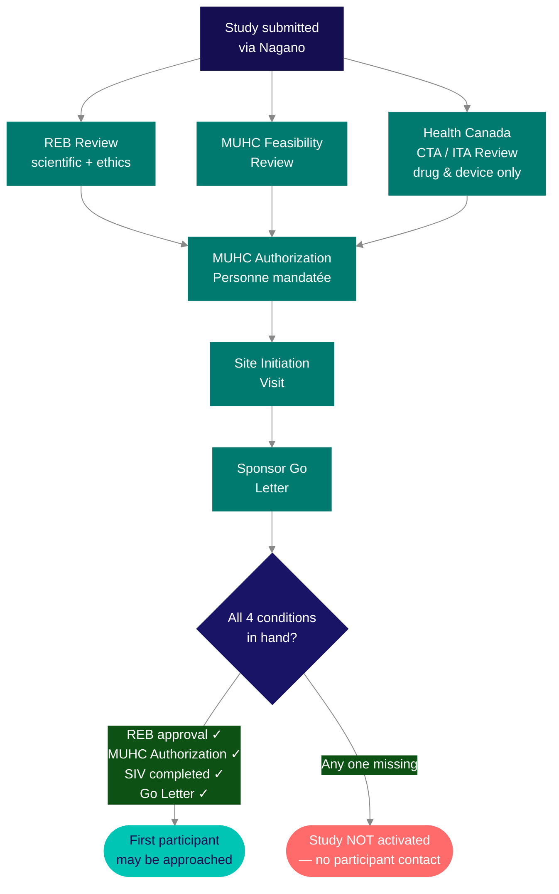

Approval is granted. Authorization is in hand. But a study is not running yet — it is authorized to run. There is a specific sequence of steps that must happen before the first participant can be approached, and a specific moment when the study activates. Understanding the sequence matters because each step depends on the previous one — and because several steps can run in parallel, which means delays in one track can hold up the whole timeline if not anticipated early.

## From site selection to Nagano submission

After the sponsor selects your site following the [feasibility assessment](/kb/feasibility), several things happen before the study can be formally submitted through <Tooltip tip="The RI-MUHC's electronic study submission and management platform. All studies requiring MUHC Authorization are submitted through Nagano." headline="Nagano (RI-MUHC)" cta="Full definition" href="/kb/glossary#nagano">Nagano</Tooltip>.

### The qualification visit

Some sponsors conduct a Site Qualification Visit (SQV) after the initial feasibility assessment but before committing to a Clinical Trial Agreement. The SQV is more detailed than the feasibility questionnaire — the sponsor's team (typically the CRA and a study manager) visits the site to verify that the infrastructure, personnel, and processes described during feasibility match reality.

During a qualification visit, sponsors typically assess:

| Area | What they look at |
|---|---|
| Facilities | Clinic space, pharmacy, lab, IP storage capacity, patient flow |
| Personnel | QI/PI and key staff availability, therapeutic area experience, GCP training currency |
| Regulatory readiness | Current REB workload and timelines, delegation and training documentation systems |
| Competing studies | Enrollment on similar protocols, participant pool overlap, team bandwidth |
| Infrastructure | Equipment, IT systems, data management capabilities |

<Tabs>
  <Tab title="Preparing for the visit">
    A well-prepared qualification visit signals to the sponsor that the site can handle the study.

    - Confirm GCP training is current for all team members who will be involved
    - Have up-to-date CVs available for the QI/PI and key staff
    - Know your current enrollment capacity and competing study load
    - Be ready to walk the sponsor through your facilities — equipment, IP storage, lab capabilities
    - If using CIM facilities, coordinate with CIM in advance so space and service availability can be confirmed during the visit
  </Tab>
  <Tab title="Common delays to anticipate">
    The period between site selection and first-patient-in is where most startup delays accumulate. Common causes:

    - **Contract negotiation** — budget and CTA negotiations can take weeks to months. Engage [Finance](/kb/budgets-contracts) early and flag complex indemnification or IP clauses to the Research Agreements Office.
    - **REB backlog** — submission timing matters. Check the REB meeting calendar and plan submissions to avoid holiday closures or peak periods.
    - **Health Canada review** — CTA/ITA review runs in parallel with Nagano but cannot be rushed. Submit early.
    - **Pharmacy and lab setup** — IP storage requirements, lab accreditation, and normal value ranges must be confirmed before the SIV. Start these early rather than treating them as post-authorization tasks.
    - **Staff availability** — if a key team member (QI/PI, CRC, research nurse) is unavailable for the SIV window, the entire timeline shifts.
  </Tab>
</Tabs>

Contract and budget negotiation runs in parallel or follows the qualification visit — see [Contracts, Budgets, and Agreements](/kb/budgets-contracts) and [Negotiating an Industry-Sponsored Budget](/kb/budget-negotiation). Contract execution is a prerequisite for MUHC Authorization.

Once the contract is in progress and the regulatory package is assembled, the study is submitted through Nagano and enters the activation sequence below.

## The activation sequence

<Steps>
  <Step title="Health Canada authorization (drug and device studies only)">
    <Tooltip tip="Letter from Health Canada confirming a CTA is satisfactory and authorizing the sponsor to proceed." headline="No Objection Letter (NOL)" cta="Full definition" href="/kb/glossary#nol">No Objection Letter</Tooltip> (NOL) for drug studies, Notice of Authorization (NOA) for natural health products, or <Tooltip tip="Health Canada authorization to conduct a clinical investigation of a medical device. The device equivalent of a CTA." headline="Investigational Testing Authorization (ITA)" cta="Full definition" href="/kb/glossary#ita">Investigational Testing Authorization</Tooltip> (ITA) for medical devices. Runs in parallel with <Tooltip tip="The RI-MUHC's electronic study submission and management platform. All studies requiring MUHC Authorization are submitted through Nagano." headline="Nagano (RI-MUHC)" cta="Full definition" href="/kb/glossary#nagano">Nagano</Tooltip> submission. Must be received before <Tooltip tip="Institutional authorization allowing a study to proceed at the RI-MUHC. Issued after ethics approval and feasibility review." headline="MUHC Authorization" cta="Full definition" href="/kb/glossary#muhc-auth">MUHC Authorization</Tooltip> can be granted.
  </Step>
  <Step title="REB review and institutional feasibility (parallel tracks via Nagano)">
    REB scientific and ethics review runs in parallel with the MUHC institutional feasibility review (<Tooltip tip="All planned and systematic actions to ensure trial data are generated, documented, and reported in compliance with GCP and SOPs." headline="Quality Assurance (QA)" cta="Full definition" href="/kb/glossary#qa">QA</Tooltip>, pharmacy, nursing, laboratory, contracts, Director of Professional Services). Both must be complete and satisfactory before the <Tooltip tip="Individual formally authorized to issue the final written authorization for each research project at a Quebec RSSS institution." headline="Personne mandatée (PFM)" cta="Full definition" href="/kb/glossary#personne-mandatee">Personne mandatée</Tooltip> can issue MUHC Authorization.
  </Step>
  <Step title="MUHC Authorization letter">
    Issued by the Personne mandatée once all review streams are satisfactory. The Authorization letter must be filed in the <Tooltip tip="The QI's collection of documentation demonstrating compliance, study integrity, and participant safety." headline="Investigator Site File (ISF)" cta="Full definition" href="/kb/glossary#isf">ISF</Tooltip>. It is the institution's formal confirmation that the study may proceed at the MUHC. REB approval alone is not sufficient — a study cannot begin without this letter.
  </Step>
  <Step title="Site Initiation Visit (SIV)">
    The Sponsor or Monitor conducts the SIV after MUHC Authorization is confirmed. The SIV provides protocol-specific training to the full research team and results in the <Tooltip tip="Lists each team member, their qualifications, and specific trial tasks authorized by the QI." headline="Task Delegation Log (TDL)" cta="Full definition" href="/kb/glossary#tdl">Task Delegation Log</Tooltip> being signed. No protocol activities — including screening — may begin before the SIV.
  </Step>
  <Step title="Sponsor's Go Letter → first participant may be approached">
    The Sponsor's Go Letter confirms that the site is ready to enrol. Once received and filed, the study is fully activated. For Sponsor-Investigator studies where the <Tooltip tip="The physician responsible to the sponsor for the conduct of a clinical trial at the site. One QI per study per Canadian site." headline="Qualified Investigator (QI)" cta="Full definition" href="/kb/glossary#qi">QI</Tooltip>/PI is also the Sponsor, a separate Go Letter may not be required.
  </Step>
</Steps>

## The Site Initiation Visit

The SIV is the Sponsor's or Monitor's final confirmation of site readiness. Its primary purpose is to train the entire research team on the specific protocol they will be executing — the moment when protocol knowledge is formally transferred from the Sponsor to the site.

Before the SIV can be scheduled, several prerequisite documents must be in place in the ISF and <Tooltip tip="The sponsor's collection of documentation demonstrating compliance across all study sites." headline="Trial Master File (TMF)" cta="Full definition" href="/kb/glossary#tmf">TMF</Tooltip>: the Health Canada authorization (where applicable), REB approval for the protocol and all participant-facing materials, the executed Clinical Trial Agreement, the signed protocol, the signed <Tooltip tip="Compilation of clinical and nonclinical data on the investigational product relevant to the study." headline="Investigator's Brochure (IB)" cta="Full definition" href="/kb/glossary#ib">Investigator's Brochure</Tooltip>, and CVs and licences for all team members who will be delegated tasks.

During the SIV, the Sponsor or Monitor reviews:

- Study protocol and objectives
- Participant eligibility criteria
- Consent and screening procedures
- <Tooltip tip="A drug, medical device, or natural health product being tested or used as a reference in a clinical trial." headline="Investigational Product (IP)" cta="Full definition" href="/kb/glossary#ip">IP</Tooltip> management, including pharmacy
- <Tooltip tip="Any untoward medical occurrence in a participant, whether or not related to the investigational product." headline="Adverse Event (AE)" cta="Full definition" href="/kb/glossary#ae">Adverse event</Tooltip> reporting
- <Tooltip tip="Document designed to record all protocol-required information to be reported to the sponsor for each participant." headline="Case Report Form (CRF)" cta="Full definition" href="/kb/glossary#crf">CRF</Tooltip> completion
- ISF management and document version control
- Monitoring activities and any protocol-specific procedures

The QI/PI and all team members who will be delegated protocol tasks should be present. When someone cannot attend, the reason must be documented and equivalent training must be provided and documented before that person can be added to the Task Delegation Log.

<Warning>
Pharmacy must be trained at the SIV or separately before being delegated tasks. For all drug studies, the MUHC Pharmacy must either attend the SIV or receive a separate dedicated SIV. The pharmacist must be trained and listed on the Task Delegation Log before any investigational product can be dispensed.
</Warning>

<Tabs>
  <Tab title="Virtual SIVs">
    SIVs may be conducted virtually. For virtual SIVs, the attendee list downloaded from the virtual meeting platform is acceptable in lieu of wet ink signatures on the Training Log. The SIV report and training log must still be filed in the ISF and TMF. All other SIV requirements apply equally to virtual and in-person formats.
  </Tab>
  <Tab title="After the SIV">
    After the SIV, the Sponsor or Monitor writes the SIV report confirming the site has been trained on all study aspects and <Tooltip tip="International standard for design, conduct, monitoring, recording, and reporting of clinical studies." headline="Good Clinical Practice (GCP)" cta="Full definition" href="/kb/glossary#gcp">GCP</Tooltip> requirements. The completed and signed SIV report is sent to the site for review and filing in the ISF. The site must file the SIV report, the Training Log, and all SIV training slides. All team members trained at the SIV are then added to the Task Delegation Log with the QI/PI's signature.
  </Tab>
</Tabs>

## The four conditions before first participant contact

[SOP-CR-006](/sops/cr-006) §5.3.8 is explicit: do not consent participants before all four of the following are confirmed in writing and filed in the ISF.

| # | Condition | Why it exists |
|---|---|---|
| 1 | REB written approval | Ethics and scientific review is complete. The REB has confirmed the study is ethical, the <Tooltip tip="The written document providing the participant with information essential to making an informed decision. Both parties must sign." headline="Informed Consent Form (ICF)" cta="Full definition" href="/kb/glossary#icf">ICF</Tooltip> is adequate, and participant rights will be protected. |
| 2 | MUHC Authorization letter | The institution has formally confirmed readiness. The Personne mandatée has reviewed QA, training, feasibility, resource agreements, and regulatory status. Without this, the MUHC has not authorized the research to take place here, regardless of what the REB has approved. |
| 3 | SIV completed and TDL signed | The team is trained and the site is operationally ready. Without this, no one can be on the Task Delegation Log, and no protocol activity — including screening — can begin. |
| 4 | Sponsor's Go Letter (if applicable) | The Sponsor has confirmed site readiness and authorized enrolment to begin at this specific site. When required, it must be received and filed before the first participant is approached. |

<Warning>
A consent obtained before any of these four conditions is met is a protocol deviation. It must be reported to the Sponsor and assessed for REB reporting. The deviation must be entered in the Deviation Log with a root cause analysis and corrective action.
</Warning>

## ISF setup

The Investigator Site File must be set up and organized before any study activities begin. It is a live record assembled from the moment the study is authorized — not a filing system built retroactively. The ISF structure is governed by [SOP-CR-015](/sops/cr-015), which maps to ICH GCP E6(R3) Appendix C.

<AccordionGroup>
  <Accordion title="Regulatory and approvals">
    - Signed protocol (and all amendments, as they occur)
    - Signed Investigator's Brochure or Product Monograph
    - Health Canada NOL / NOA / ITA (where applicable)
    - REB approval letter with all approved document versions listed
    - MUHC Authorization letter
    - Sponsor's Go Letter
    - Executed Clinical Trial Agreement
  </Accordion>
  <Accordion title="Consent and participant-facing materials">
    - REB-approved ICF (all language versions)
    - Approved recruitment materials
    - Approved participant-facing materials (questionnaires, diaries, etc.)
    - Translation certificates (if applicable)
  </Accordion>
  <Accordion title="Team qualifications">
    - CVs of all team members (initialled and dated within 2 years)
    - Licences of applicable staff
    - Training documentation (GCP, Division 5, ISO 14155 as applicable)
    - SOP Reader acknowledgements (TalentLMS)
    - Qualified Investigator Undertaking (QIU) — drug studies only
    - MUHC Confidentiality and Security Agreements
  </Accordion>
  <Accordion title="Study activation documents">
    - Task Delegation Log (signed by QI/PI after SIV)
    - SIV Training Log and SIV report
    - SIV training slides
    - Monitoring Log (signed by monitor and <Tooltip tip="The team member who handles day-to-day administration and coordination of the clinical trial." headline="Clinical Research Coordinator (CRC)" cta="Full definition" href="/kb/glossary#crc">CRC</Tooltip> at SIV)
    - Laboratory accreditation and normal values
    - Equipment calibration certificates
  </Accordion>
</AccordionGroup>

<Note>
Each document filed in the ISF must carry a clear version number and date. Documents without version control are an inspection finding. The ISF index in [SOP-CR-015](/sops/cr-015) Appendix 4 provides the filing structure that must be used at the MUHC.
</Note>

## Protocol and study documents

The protocol is the master plan for the study — everything the site does should be traceable back to a specific protocol requirement. The Investigator's Brochure (IB) provides the scientific context for the investigational product. Consent forms, recruitment materials, and Case Report Forms must all be maintained with current version numbers and dates.

<Warning>
Filing an updated IB without reviewing it for new safety signals is a compliance gap. New safety information in an IB update can trigger obligations such as a protocol amendment, consent form revision, or expedited adverse event report. The QI is responsible for ensuring relevant changes are assessed and acted on.
</Warning>

Amendments to the protocol, ICF, or IB must go through the same approval chain as the original document — Health Canada authorization (where required) and REB approval before the change takes effect at the site. Implementing a protocol amendment before REB approval has been received is a common and avoidable compliance error.

## Equipment calibration

Any equipment used to collect study-specific measurements — scales, blood pressure monitors, spirometers, ECG machines, centrifuges, temperature monitoring devices for IP storage — must have current calibration and maintenance records on file before the study begins. This is governed by [SOP-CR-025](/sops/cr-025).

Best practice is to create a study-specific equipment inventory list with corresponding calibration certificates, rather than relying on the general RI-MUHC inventory. For electronic data capture systems (REDCap, eCRF platforms), validation records must also be on file demonstrating compliance with 21 CFR Part 11 requirements for electronic records.

## Managing study funds

The Research Grants Office manages the financial administration of research projects at the RI-MUHC. For industry-sponsored clinical trials, the process typically begins once the Clinical Trial Agreement is executed — at that point, you request a new research account through the MyAccounts Application, and Research Grants opens the account and begins managing the fund flow.

<Info>
Account opening is your responsibility. Research Grants does not open accounts automatically upon contract execution. Delays in initiating the request can delay the release of study funds. The study account does not exist until after all approvals are in place — budget for startup personnel accordingly.
</Info>

All research projects at the RI-MUHC are subject to overhead. Industry-sponsored clinical trials carry a 30% overhead rate mandated by MSSS. Failure to include the applicable overhead does not exempt the study from payment.

| Funding source | Overhead rate |
|---|---|
| Industry-sponsored clinical trials | 30% |
| <Tooltip tip="US equivalent of the Canadian Qualified Investigator (QI)." headline="Principal Investigator (PI)" cta="Full definition" href="/kb/glossary#pi">PI</Tooltip>-initiated studies funded by industry | 30% |
| Charitable organizations and public foundations | 0% |
| Tri-Agency grants (CIHR, NSERC, SSHRC) | Partial federal coverage |
| Donations and departmental fund transfers | 15% |
| US government grants (NIH) | 8% of direct costs less equipment |

Contact Research Grants at researchgrants@muhc.mcgill.ca for post-award accounts, financial reporting, invoicing, and fund management. For new account requests, contact rimuhcaccountopenings@muhc.mcgill.ca.

---

## Related resources

- [Study Conduct Overview](/kb/conduct-overview) — lifecycle stages and regulatory context
- [Recruitment, Screening, and Enrollment](/kb/recruitment-enrollment) — recruitment planning, screening, enrollment procedures
- [Building Your Research Team](/kb/building-your-team) — delegation, training, and team composition
- [Study Planning Overview](/kb/planning-overview) — planning timeline, activation targets, regulatory tracks
- [SOP-CR-004 — Study Feasibility](/sops/cr-004) — feasibility assessment checklist and process
