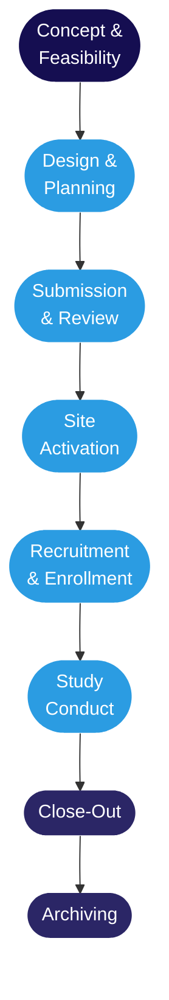

Most clinical studies at the RI-MUHC follow the same sequence of stages — from a Phase III drug trial to a prospective observational study. The regulatory requirements, timelines, and people involved differ significantly across study types, but the underlying structure is the same. Understanding that structure before reading any SOP or operational guide makes every subsequent step easier to locate and interpret.

Retrospective studies (chart reviews, database analyses) follow a compressed path: feasibility, submission and ethics review, conduct, and archiving — without site activation, sponsor monitoring, or clinical trial-specific close-out requirements.

<Note>
If you are new to clinical research — or new to the RI-MUHC — start here. Each stage below is explained in plain language, with links to the detailed guidance articles for when you are ready to act.
</Note>

## The eight stages

<Steps>
  <Step title="Stage 01 — Concept and Feasibility: Is this study worth doing here?">
    The study idea exists. The question at this stage is whether it can actually be executed at this site, by this team, with the available resources and patient population. Feasibility is not a formality — it is the earliest point at which serious problems can be caught before money and time are committed.

    The <Tooltip tip="US equivalent of the Canadian Qualified Investigator (QI)." headline="Principal Investigator (PI)" cta="Full definition" href="/kb/glossary#pi">principal investigator</Tooltip> identifies whether the patient population exists in sufficient numbers, whether the team has the required expertise, and whether the site infrastructure can support the protocol's demands.

    At the RI-MUHC, feasibility questions also include whether the investigator holds valid **Human Research Privileges** or **Researcher Status**, and whether CIM involvement should be considered for studies requiring specialized infrastructure.
  </Step>
  <Step title="Stage 02 — Design and Planning: How will the study be structured?">
    The protocol is the technical core of the study — it defines the research question, the study design, eligibility criteria, procedures, data management plan, and statistical analysis approach. It is developed by the investigator for investigator-initiated studies, or provided by the sponsor for industry-sponsored trials. A biostatistician should be involved before data collection begins, not after.

    Alongside the protocol, the team is assembled, roles are defined, the budget is developed, and funding is secured. For industry-sponsored studies, contract negotiations begin in parallel. The consent form is drafted at this stage — not as a final pre-submission task.
  </Step>
  <Step title="Stage 03 — Submission and Review: The triple evaluation">
    Before any participant can be approached, every study at a Quebec <Tooltip tip="Quebec's public health and social services network (Réseau de la santé et des services sociaux), including the RI-MUHC." headline="RSSS" cta="Full definition" href="/kb/glossary#rsss">RSSS</Tooltip> institution must pass through three parallel evaluations: scientific review, ethical review by the <Tooltip tip="The ethics committee that reviews and approves research involving human participants. Also called CER at French-language institutions." headline="Research Ethics Board (REB)" cta="Full definition" href="/kb/glossary#reb">REB</Tooltip>, and institutional feasibility review. These three streams run simultaneously and must all conclude favourably before the *<Tooltip tip="Individual formally authorized to issue the final written authorization for each research project at a Quebec RSSS institution." headline="Personne mandatée (PFM)" cta="Full definition" href="/kb/glossary#personne-mandatee">personne formellement mandatée</Tooltip>* can issue the authorization letter that permits the study to begin.

    For drug trials, Health Canada's <Tooltip tip="Application to Health Canada for authorization to conduct a drug trial under Division 5 of the Food and Drug Regulations." headline="Clinical Trial Application (CTA)" cta="Full definition" href="/kb/glossary#cta">CTA</Tooltip> review also runs in parallel — the 30-day default clock starts on receipt of a complete application. The study cannot be activated until the <Tooltip tip="Letter from Health Canada confirming a CTA is satisfactory and authorizing the sponsor to proceed." headline="No Objection Letter (NOL)" cta="Full definition" href="/kb/glossary#nol">No Objection Letter</Tooltip> is in hand alongside the three institutional approvals. All submissions at the RI-MUHC flow through the **<Tooltip tip="The RI-MUHC's electronic study submission and management platform. All studies requiring MUHC Authorization are submitted through Nagano." headline="Nagano (RI-MUHC)" cta="Full definition" href="/kb/glossary#nagano">Nagano</Tooltip>** platform.
  </Step>
  <Step title="Stage 04 — Site Activation: From authorization to first participant">
    Authorization is received, but the study is not ready to run. Site activation covers the preparatory work between the green light and the first participant: the <Tooltip tip="Monitoring visit to train the site team on the protocol and confirm site readiness, after REB approval and MUHC Authorization." headline="Site Initiation Visit (SIV)" cta="Full definition" href="/kb/glossary#siv">Site Initiation Visit</Tooltip> is conducted by the sponsor's monitor, the <Tooltip tip="Lists each team member, their qualifications, and specific trial tasks authorized by the QI." headline="Task Delegation Log (TDL)" cta="Full definition" href="/kb/glossary#tdl">delegation log</Tooltip> is finalized, the <Tooltip tip="The QI's collection of documentation demonstrating compliance, study integrity, and participant safety." headline="Investigator Site File (ISF)" cta="Full definition" href="/kb/glossary#isf">Investigator Site File</Tooltip> is set up, and all logistical elements — data capture systems, pharmacy setup, electronic data capture (EDC) access — are confirmed.

    No recruitment activity may begin before all activation requirements are met. The ISF and delegation log must be in place and the sponsor's monitor must verify site readiness before the first participant can be approached.
  </Step>
  <Step title="Stage 05 — Recruitment and Enrollment: Finding, screening, consenting">
    Recruitment is structured, not informal. All recruitment materials must have been approved by the REB before any outreach begins. Potential participants are identified through approved channels, screened against the protocol's inclusion and exclusion criteria, and — if eligible — invited to participate through a formal consent process.

    Informed consent is a process, not a signature. Under TCPS2 and Quebec's Civil Code, it must be documented, continuous, and designed to ensure participation remains voluntary throughout the study. Consent is not permanent — if new safety information emerges, re-consent is required. Once consent is obtained and eligibility confirmed, the participant is formally enrolled and assigned a participant ID.
  </Step>
  <Step title="Stage 06 — Study Conduct: Running the study according to protocol">
    Visits are conducted, data is collected and entered, and adverse events are assessed and reported. Protocol deviations are documented and the delegation log kept current as team membership changes. The sponsor's monitor visits the site regularly — on-site or remotely — to verify data accuracy and protocol compliance.

    The REB must be kept informed of any amendments, safety signals, or reportable events. Continuing review is required annually. Amendments to the protocol or consent form must receive prospective REB approval unless they are required to eliminate immediate risk.
  </Step>
  <Step title="Stage 07 — Close-Out: Ending the study formally">
    A study does not end when the last participant visit is complete. Close-out is a structured process: all data must be entered and verified, the close-out monitoring visit must be conducted, the REB must receive a final report, the sponsor and Health Canada must be notified, and the site must submit a close-out notification confirming completion. Financial close-out runs in parallel.

    For drug trials, any remaining <Tooltip tip="A drug, medical device, or natural health product being tested or used as a reference in a clinical trial." headline="Investigational Product (IP)" cta="Full definition" href="/kb/glossary#ip">investigational product</Tooltip> must be returned to the sponsor or destroyed according to documented procedures. Public study registries must be updated to reflect study completion. Results must be communicated to participants as required by the protocol and TCPS2.
  </Step>
  <Step title="Stage 08 — Archiving: Keeping the record intact">
    All study documents — the ISF, consent forms, source documents, <Tooltip tip="Any untoward medical occurrence in a participant, whether or not related to the investigational product." headline="Adverse Event (AE)" cta="Full definition" href="/kb/glossary#ae">adverse event</Tooltip> records, monitoring reports, correspondence — must be archived securely. Clinical trials under Health Canada Division 5 require a minimum of **15 years' retention** (25 years for trials subject to EMA oversight). For other study types, retention requirements are set by TCPS2, institutional policy, and applicable Quebec legislation.

    Archiving is not simply storing files. Documents must be organized, indexed, and accessible to authorized persons in the event of an inspection or audit, which may occur years after a study closes. The archiving responsibility belongs to the site; it does not transfer to the sponsor at close-out.
  </Step>
</Steps>

## What makes the RI-MUHC context distinct

The eight-stage structure above applies wherever clinical research is conducted. Three features of the Quebec and RI-MUHC context differ meaningfully from how research runs elsewhere in Canada.

<AccordionGroup>
  <Accordion title="The triple evaluation and the personne mandatée (Quebec-specific)">
    No study at a Quebec RSSS institution can begin without written authorization from the *personne formellement mandatée* — an individual formally designated by the institution's Board of Directors. This authorization can only issue after all three evaluations (scientific, ethical, institutional) are positive. **REB approval alone is not sufficient to begin**; the PFM letter is the final green light.
  </Accordion>
  <Accordion title="Nagano — the submission platform">
    All research submissions at the RI-MUHC flow through **Nagano** — a provincial platform deployed across more than 25 RSSS institutions. The F11 submission form triggers both ethics and institutional feasibility review simultaneously. REB correspondence, amendments, and renewal submissions are all managed through Nagano. There is no paper or email alternative.
  </Accordion>
  <Accordion title="CIM — the McConnell Centre for Innovative Medicine">
    The McConnell Centre for Innovative Medicine provides clinical trial management, research staff, and specialized infrastructure at both the Glen site and the Montreal General Hospital. For Phase I–IV studies and complex multicentre trials, CIM involvement can take significant operational responsibility off the investigator's team. CIM engagement is worth evaluating at the feasibility stage, before the protocol is finalized and the budget is set.
  </Accordion>
  <Accordion title="CATALIS FAST TRACK — accelerated authorization for industry-sponsored trials">
    For industry-sponsored trials, CATALIS Québec operates a FAST TRACK Evaluation Service targeting institutional authorization in eight weeks or less. The RI-MUHC participates in the program. Ask the Research Facilitator whether FAST TRACK eligibility applies to your study.
  </Accordion>
</AccordionGroup>

## How the stages connect

The lifecycle is sequential, but the most expensive mistakes happen when teams treat stages as isolated checkboxes rather than connected phases where early decisions constrain what is possible later.

<CardGroup cols={2}>
  <Card title="Feasibility → Submission" icon="arrow-right">
    The feasibility questions the investigator answers at Stage 1 become the data the institutional review team evaluates at Stage 3. A protocol submitted without a realistic feasibility assessment routinely generates questions during review that delay authorization by weeks.
  </Card>
  <Card title="Design → Close-Out" icon="arrow-right">
    Study design decisions made at Stage 2 — the data management plan, the statistical analysis approach, the source document templates — determine how straightforward or complicated close-out will be years later. A data management plan that isn't audit-ready from the start becomes an inspection problem at the end.
  </Card>
  <Card title="Activation → Conduct" icon="arrow-right">
    The quality of site activation — how thoroughly the SIV covers the protocol, how completely the ISF is assembled, how clearly the delegation log reflects actual responsibilities — shapes how many deviations occur during conduct.
  </Card>
  <Card title="Conduct → Archiving" icon="arrow-right">
    Health Canada inspects approximately 2% of Canadian trial sites per year — and inspections can arrive years after a study closes. Documents that are missing, unsigned, or contradicted by other records at close-out cannot be reconstructed after the fact.
  </Card>
</CardGroup>

<Warning>
**Amendments mid-study:** Protocol amendments are common. Each amendment re-enters the review process: the REB must approve prospectively (except to eliminate immediate risk), significant changes may require re-review at the institutional level, and Health Canada must be notified for changes affecting the CTA. **An amendment is not in effect until all required approvals are in hand.** Acting on an unapproved amendment is a protocol deviation.
</Warning>

<Tip>
The decisions that matter most are made before the first participant is enrolled. Everything after that is execution.
</Tip>
