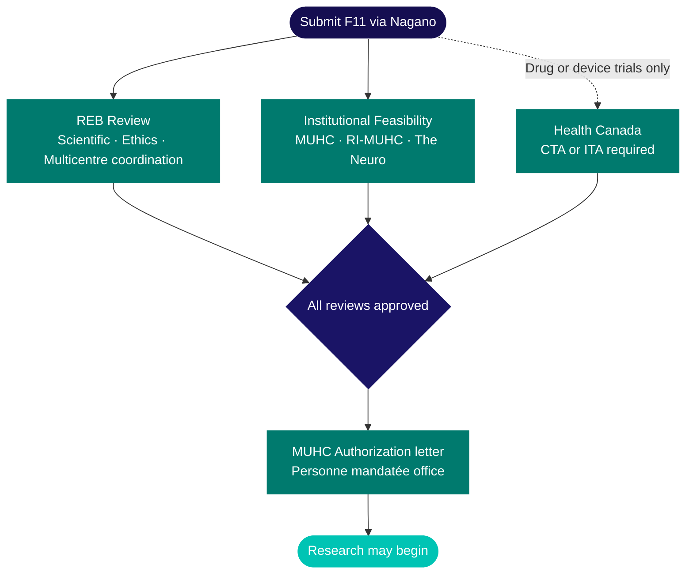
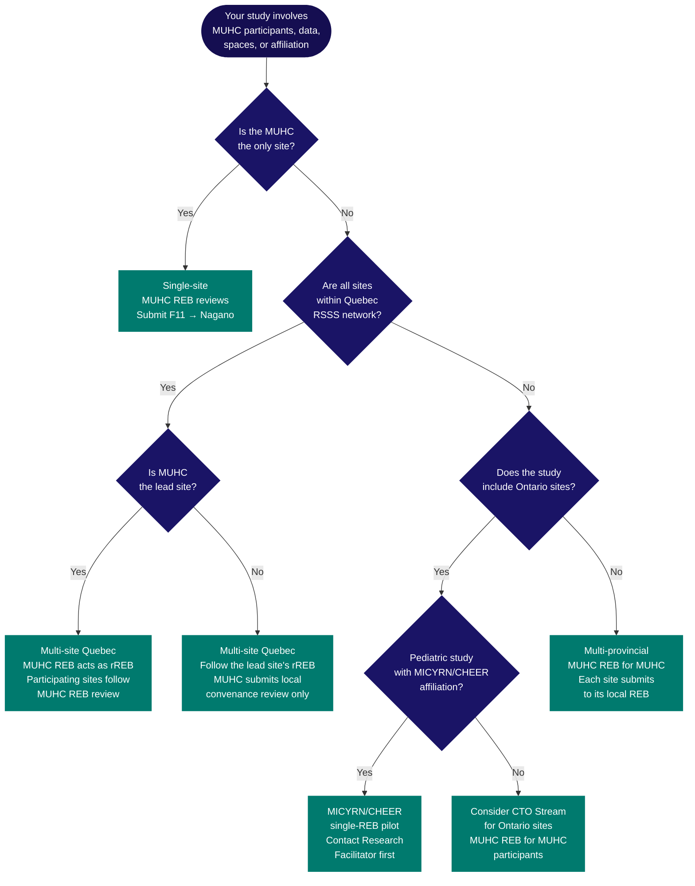

Before any clinical research can begin at the MUHC, studies must pass through a sequence of submissions and reviews. This is mandatory regardless of study size, methodology, or funding source. All study submissions are entered through <Tooltip tip="The RI-MUHC's electronic study submission and management platform. All studies requiring MUHC Authorization are submitted through Nagano." headline="Nagano (RI-MUHC)" cta="Full definition" href="/kb/glossary#nagano">Nagano</Tooltip>, the MUHC's research management platform, and both the ethics review and institutional feasibility review are initiated simultaneously when you submit the F11 form.

<Warning>
  **<Tooltip tip="The ethics committee that reviews and approves research involving human participants. Also called CER at French-language institutions." headline="Research Ethics Board (REB)" cta="Full definition" href="/kb/glossary#reb">REB</Tooltip> approval alone does not authorize research to begin.** <Tooltip tip="Institutional authorization allowing a study to proceed at the RI-MUHC. Issued after ethics approval and feasibility review." headline="MUHC Authorization" cta="Full definition" href="/kb/glossary#muhc-auth">MUHC Authorization</Tooltip> from the <Tooltip tip="Individual formally authorized to issue the final written authorization for each research project at a Quebec RSSS institution." headline="Personne mandatée (PFM)" cta="Full definition" href="/kb/glossary#personne-mandatee">Personne mandatée</Tooltip> is a separate and required step. Both must be in place before any research activities start — including recruitment, consent, and data collection.
</Warning>

## The review process

Every study submitted at the MUHC passes through two parallel review processes, with an additional Health Canada track for drug and device trials.

<Steps>
  <Step title="Submit via Nagano (F11)">
    The F11 form is the entry point for all studies. Submitting it simultaneously initiates REB review and institutional feasibility review. For studies involving access to identifiable personal health information without consent, an ÉFVP form (F17 or F18) must be submitted alongside F11.
  </Step>
  <Step title="REB review (parallel)">
    The MUHC REB conducts scientific and ethics review. For multicentre studies in Quebec, a single designated reviewing REB (rREB) conducts ethics review on behalf of all participating <Tooltip tip="Quebec's public health and social services network (Réseau de la santé et des services sociaux), including the RI-MUHC." headline="RSSS" cta="Full definition" href="/kb/glossary#rsss">RSSS</Tooltip> sites.
  </Step>
  <Step title="Institutional feasibility review (parallel)">
    Multiple MUHC and RI-MUHC departments review whether the study can be practically and safely conducted at the site. This covers pharmacy, nursing, laboratories, contracts, Human Research Privileges, training, and the ÉFVP when applicable.
  </Step>
  <Step title="Health Canada approval (drug and device trials only)">
    For studies involving investigational drugs (<Tooltip tip="Application to Health Canada for authorization to conduct a drug trial under Division 5 of the Food and Drug Regulations." headline="Clinical Trial Application (CTA)" cta="Full definition" href="/kb/glossary#cta">CTA</Tooltip>) or medical devices (<Tooltip tip="Health Canada authorization to conduct a clinical investigation of a medical device. The device equivalent of a CTA." headline="Investigational Testing Authorization (ITA)" cta="Full definition" href="/kb/glossary#ita">ITA</Tooltip>), Health Canada regulatory approval must be in hand before MUHC Authorization can be granted. This track runs in parallel with REB review and should be initiated during study design, not after submission.
  </Step>
  <Step title="MUHC Authorization issued by the Personne mandatée">
    Once all review tracks are complete and satisfactory — REB approval, all institutional feasibility reviews, and Health Canada approvals where applicable — the Personne mandatée issues MUHC Authorization. Only then may research activities begin.
  </Step>
</Steps>

## Which ethics route applies to your study?

Use this to identify the correct submission path before you start your F11.

<Note>
If your study spans multiple provinces or includes networks like MICYRN, CHEER, or CTO, contact the [Research Facilitator](mailto:Research.facilitator@muhc.mcgill.ca) before submitting. Multi-site routing decisions affect timelines and the documents required in Nagano.
</Note>

## Research Ethics Board (REB) review

The MUHC REB conducts scientific and ethics review for research under MUHC auspices. Its jurisdiction is established by Quebec's _Cadre de référence ministériel_ and the TCPS2. Reviews are also guided by the Declaration of Helsinki.

REB review applies when any of the following are true:

<CardGroup cols={2}>
  <Card title="Recruitment or data under MUHC responsibility" icon="user-check">
    Participants are recruited at the MUHC, or records and data under MUHC custody are used.
  </Card>
  <Card title="Databanks or biobanks" icon="database">
    The project involves a research database or biobank hosted at an RSSS institution or under the responsibility of an RSSS-affiliated researcher.
  </Card>
  <Card title="MUHC platforms or services" icon="building-columns">
    The study uses MUHC technical platforms (imaging, ORs, care units, exam rooms) or MUHC staff and services (nursing, pharmacy).
  </Card>
  <Card title="Institutional affiliation" icon="id-badge">
    The sponsor or researcher states or implies MUHC affiliation or MUHC participation in the study.
  </Card>
</CardGroup>

In short: if MUHC people, spaces, services, platforms, custody-held data, or MUHC affiliation are involved — REB review likely applies.

For privately-funded studies — including foundation-funded studies, not only industry — REB review and authorization services are subject to billing fees under Directive ministérielle 2023-016. See [Study Budgets and Agreements](/kb/budgets-contracts) for details on Sponsor obligations.

## Institutional feasibility review

Feasibility reviews confirm that the study can be practically and safely conducted at the MUHC. Three groups review distinct aspects, all running in parallel with the REB review from the moment of Nagano submission.

<Tabs>
  <Tab title="MUHC">
    - **Pharmacy** — <Tooltip tip="A drug, medical device, or natural health product being tested or used as a reference in a clinical trial." headline="Investigational Product (IP)" cta="Full definition" href="/kb/glossary#ip">Investigational product</Tooltip> storage, dispensing, and accountability procedures
    - **Nursing** — Staff availability and research-specific responsibilities
    - **Laboratory services** — Sample processing, storage, and shipping arrangements
    - **Department approvals** — Sign-off from all relevant clinical departments
    - **Privacy Impact Assessment (ÉFVP)** — F17/F18 in Nagano; compliance with Quebec's <Tooltip tip="Quebec's Act to modernize personal information protection law (in force Sept 2023). Requires ÉFVP before sharing personal data without consent." headline="Law 25 / Loi 25" cta="Full definition" href="/kb/glossary#law-25">Loi 25</Tooltip>
    - **Information security** — Any software, platforms, or databases used in the study
  </Tab>
  <Tab title="RI-MUHC">
    - **Contracts and agreements** — CDAs, sponsor contracts, collaboration agreements
    - **Human Research Privileges or Researcher Status** — Confirmed for the <Tooltip tip="US equivalent of the Canadian Qualified Investigator (QI)." headline="Principal Investigator (PI)" cta="Full definition" href="/kb/glossary#pi">PI</Tooltip> and all sub-investigators
    - **Training verification** — All <Tooltip tip="Lists each team member, their qualifications, and specific trial tasks authorized by the QI." headline="Task Delegation Log (TDL)" cta="Full definition" href="/kb/glossary#tdl">Task Delegation Log</Tooltip> members have completed required SOP, <Tooltip tip="International standard for design, conduct, monitoring, recording, and reporting of clinical studies." headline="Good Clinical Practice (GCP)" cta="Full definition" href="/kb/glossary#gcp">GCP</Tooltip>, and regulatory training before any activities begin
  </Tab>
  <Tab title="The Neuro">
    Applies when the study involves Montreal Neurological Institute-Hospital resources. Covers McGill University contracts, and Neuro-specific resources such as neuroimaging platforms, surgical suites, or other Neuro infrastructure.
  </Tab>
</Tabs>

## ÉFVP — Privacy impact assessment

An _Évaluation des facteurs relatifs à la vie privée_ (ÉFVP) is a component of the feasibility review. It is required when a study involves access to identifiable personal health information held by the MUHC without obtaining participant consent for part or all of that data access.

In Nagano, the ÉFVP is submitted as:
- **F17** — pre-screening access before consent (accessing OACIS or other MUHC health records to identify potential participants before approaching them)
- **F18** — access without consent (research using identifiable records where consent will not be obtained, e.g., chart reviews or registry linkages)

Both forms are submitted alongside the F11 as part of the initial submission. The ÉFVP is reviewed by the MUHC Access to Information Officer during feasibility review.

For guidance on which form applies, see [Submitting via Nagano](/kb/submitting-via-nagano). For questions about scope, contact the ÉFVP committee at [EFVP@muhc.mcgill.ca](mailto:EFVP@muhc.mcgill.ca).

## MUHC Authorization

MUHC Authorization is granted by the **Personne mandatée** once all review streams are complete and satisfactory — including REB approval and all departmental feasibility reviews. It is the final gate before any research activities may begin.

What must be in place before authorization is granted:

- Full REB approval — conditional approval is not sufficient
- Satisfactory completion of all institutional feasibility reviews (MUHC, RI-MUHC, and The Neuro if applicable)
- All applicable Health Canada approvals (CTA/ITA/<Tooltip tip="Letter from Health Canada confirming a CTA is satisfactory and authorizing the sponsor to proceed." headline="No Objection Letter (NOL)" cta="Full definition" href="/kb/glossary#nol">NOL</Tooltip>) for drug or device trials
- Confirmed Human Research Privileges or Researcher Status and training compliance for all Task Delegation Log members

The Statuses tab in your Nagano project workspace shows the current state of each review stream and will display an **Authorized** label when MUHC Authorization has been granted.

## What this section covers

<CardGroup cols={2}>
  <Card title="Preparing Your Submission" icon="clipboard-list" href="/kb/preparing">
    The complete document checklist, team readiness requirements, privileges and training prerequisites, and the 90-day rule for training certificates.
  </Card>
  <Card title="Submitting via Nagano" icon="upload" href="/kb/submitting-via-nagano">
    Choosing a project type, who to list as PI, ÉFVP form selection, and pre-submission decisions that shape everything downstream.
  </Card>
  <Card title="Tracking and Responding" icon="chart-line" href="/kb/tracking-responding">
    How to track your submission in Nagano, the three-month response deadline, responding to REB requests, and what each decision requires of you.
  </Card>
  <Card title="Study Review" icon="magnifying-glass" href="/kb/study-review">
    What scientific review, ethics review, and institutional feasibility review each assess, the role of the Personne mandatée, and Health Canada approvals when required.
  </Card>
</CardGroup>

## Related resources

- [Preparing Your Submission](/kb/preparing)
- [Submitting via Nagano](/kb/submitting-via-nagano)
- [Study Budgets and Agreements](/kb/budgets-contracts)
- [Study Planning Overview](/kb/planning-overview)
