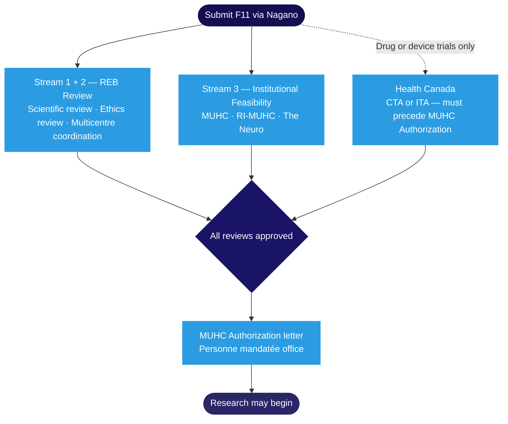
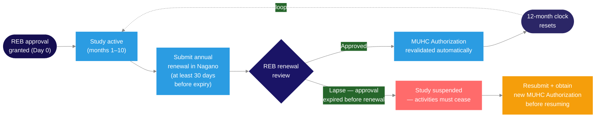
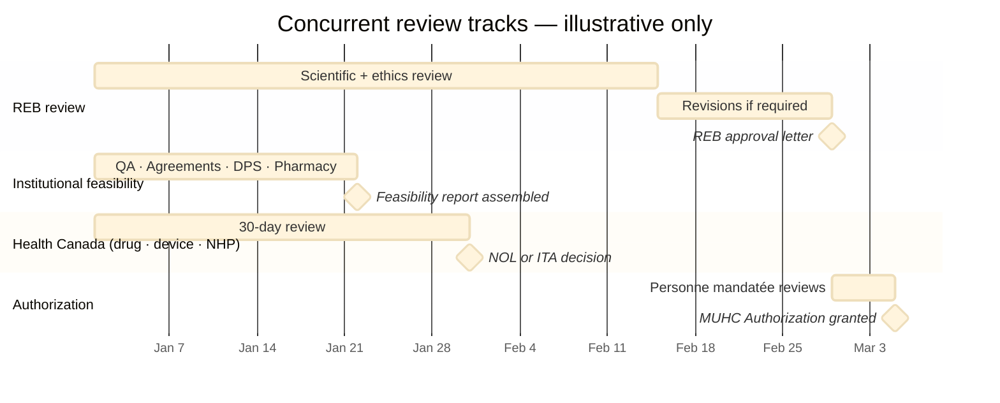

Before any research involving human participants can begin at the MUHC, studies must pass through three parallel review streams: scientific review, ethics review by the <Tooltip tip="The ethics committee that reviews and approves research involving human participants. Also called CER at French-language institutions." headline="Research Ethics Board (REB)" cta="Full definition" href="/kb/foundations/glossary#reb">REB</Tooltip>, and institutional feasibility. Drug and device trials require an additional Health Canada submission. Final authorization is issued by the <Tooltip tip="Individual formally authorized to issue the final written authorization for each research project at a Quebec RSSS institution." headline="Personne mandatée (PFM)" cta="Full definition" href="/kb/foundations/glossary#personne-mandatee">Personne mandatée</Tooltip> only once all streams are successfully completed.

## How the review process works

All studies are submitted through **<Tooltip tip="The RI-MUHC's electronic study submission and management platform. All studies requiring MUHC Authorization are submitted through Nagano." headline="Nagano (RI-MUHC)" cta="Full definition" href="/kb/foundations/glossary#nagano">Nagano</Tooltip>**, the MUHC's research management platform. The F11 form opens your study file and simultaneously initiates the feasibility review and the REB review — both tracks run in parallel from the moment of submission.

The Personne mandatée reviews all completed evaluations and, when satisfied, issues the <Tooltip tip="Institutional authorization allowing a study to proceed at the RI-MUHC. Issued after ethics approval and feasibility review." headline="MUHC Authorization" cta="Full definition" href="/kb/foundations/glossary#muhc-auth">MUHC Authorization</Tooltip> letter. Research may not begin — including recruitment, screening, or consent — until that letter is in your <Tooltip tip="The QI's collection of documentation demonstrating compliance, study integrity, and participant safety." headline="Investigator Site File (ISF)" cta="Full definition" href="/kb/foundations/glossary#isf">ISF</Tooltip>.

<Warning>
  REB approval is not the same as MUHC Authorization. Do not begin any research activity until the Personne mandatée has issued the MUHC Authorization letter.
</Warning>

## Stream 1: Scientific review

The scientific review ensures that your study is methodologically sound and scientifically valid. The REB evaluates:

- Study design and methodology
- Statistical validity and sample size justification
- Data collection instruments and endpoints
- Qualifications of the research team

**Peer review waiver:** if your project has already undergone peer review by a recognized scientific committee (CIHR, FRQS, or another tri-council body), submitting the reviewer comments and your responses may allow the REB to waive or expedite the local scientific review.

For multicentre studies within Quebec's <Tooltip tip="Quebec's public health and social services network (Réseau de la santé et des services sociaux), including the RI-MUHC." headline="RSSS" cta="Full definition" href="/kb/foundations/glossary#rsss">RSSS</Tooltip> network, a single reviewing REB (rREB) conducts the scientific and ethics review, and its decision is recognized at all participating sites. See [Multi-Centric Studies in Quebec](/kb/design/multi-centric) for details on the rREB framework.

## Stream 2: REB ethics review

The ethics review ensures your study protects participants and upholds research integrity. The REB evaluates compliance with **TCPS2 (2022)**, **ICH E6(R3) <Tooltip tip="International standard for design, conduct, monitoring, recording, and reporting of clinical studies." headline="Good Clinical Practice (GCP)" cta="Full definition" href="/kb/foundations/glossary#gcp">GCP</Tooltip>**, the **Declaration of Helsinki**, and Quebec's *Cadre de référence ministériel*.

| Area assessed | What the REB considers |
|---|---|
| Informed consent | Clarity, completeness, and voluntary nature (TCPS2 Ch. 3). French and English final versions required for MUHC studies. Waiver of consent available for retrospective or data-only studies under TCPS2 Article 3.7 conditions. |
| Risk–benefit ratio | Risks to participants are minimized and justified by potential benefits to participants or knowledge. |
| Participant safety | Monitoring plan, <Tooltip tip="Any untoward medical occurrence in a participant, whether or not related to the investigational product." headline="Adverse Event (AE)" cta="Full definition" href="/kb/foundations/glossary#ae">adverse event</Tooltip> reporting procedures, and stopping rules are adequate. |
| Data confidentiality | De-identification, storage controls, and compliance with Quebec's <Tooltip tip="Quebec's Act to modernize personal information protection law (in force Sept 2023). Requires EFVP before sharing personal data without consent." headline="Law 25 / Loi 25" cta="Full definition" href="/kb/foundations/glossary#law-25">Loi 25</Tooltip>. |
| Vulnerable populations | Enhanced protections in place per TCPS2 Chapters 4–9. |
| Equity and inclusion | Non-discriminatory participant selection; CIHR EDI requirements where applicable. |

### Annual renewal

REB approval is valid for up to one year. You must submit for renewal before the expiry date — a lapse halts the study and is a major compliance finding.

<Warning>
  **A lapse in REB approval is a major Health Canada inspection observation.** Submit for annual renewal at least one month before expiry. Track the date from the day the approval letter arrives and set an independent reminder. Renewal is not retroactive — any activities conducted during a lapse period were performed without ethics approval.
</Warning>

MUHC Authorization is automatically revalidated with each successful REB renewal. A lapse in REB approval means a new Authorization is required before the study can resume.

### REB review decisions

After review, the MUHC REB issues one of four decisions:

<AccordionGroup>
  <Accordion title="Approved">
    Your study is approved as submitted. Valid for up to one year — renewal must be submitted before expiry. All research activities must cease if the approval lapses. File the approval letter in the ISF the day you receive it and calendar your annual renewal immediately.
  </Accordion>
  <Accordion title="Approval with Modifications">
    The REB requests clarifications or modifications before granting final approval. This is **not approval** — the study cannot begin until all conditions have been addressed and the REB has issued final approval. Also shown as "Conditional approval" in Nagano status labels. You have three months to respond from the date of the last REB correspondence.
  </Accordion>
  <Accordion title="Deferral">
    The REB requires significant changes or additional information. The study will be reviewed again after resubmission. Deferral is not a refusal. The three-month response deadline applies.
  </Accordion>
  <Accordion title="Disapproval">
    The study does not meet ethical standards and revisions are unlikely to lead to approval. The study cannot proceed. You may request reconsideration or appeal to another REB within Quebec's RSSS network.
  </Accordion>
</AccordionGroup>

Researchers have the right to request reconsideration of any REB decision and to appeal to another REB within Quebec's health and social services network.

## Stream 3: Institutional feasibility

Feasibility reviews confirm that the study can be practically and safely conducted at the MUHC. Three groups review distinct aspects, all running in parallel with the REB review from the moment of Nagano submission.

<Tabs>
  <Tab title="MUHC departments">
    - **Pharmacy** — <Tooltip tip="A drug, medical device, or natural health product being tested or used as a reference in a clinical trial." headline="Investigational Product (IP)" cta="Full definition" href="/kb/foundations/glossary#ip">investigational product</Tooltip> storage, dispensing, and accountability procedures. Issues a pharmacy agreement that must be signed before the study begins.
    - **Nursing** — staff availability and research-specific responsibilities. Triggered when MUHC nursing resources are required.
    - **Laboratory services** — sample processing, storage, and shipping arrangements for OPTILAB-MUHC services.
    - **Department approvals** — sign-off from all relevant clinical departments.
    - **Privacy Impact Assessment (<Tooltip tip="Required under Quebec Law 25 before communicating personal information without consent for research. Non-compliance: up to $25M or 4% of worldwide turnover." headline="ÉFVP — Privacy Impact Assessment" cta="Full definition" href="/kb/foundations/glossary#efvp">ÉFVP</Tooltip>)** — F17/F18 in Nagano; compliance with Quebec's Loi 25.
    - **Information security** — any software, platforms, or databases used in the study.
  </Tab>
  <Tab title="RI-MUHC">
    - **Contracts and agreements** — CDAs, sponsor contracts, collaboration agreements managed via My Contracts on the Portal. The Research Agreements Office reviews all industry-sponsored agreements.
    - **Human Research Privileges or Researcher Status** — <Tooltip tip="All planned and systematic actions to ensure trial data are generated, documented, and reported in compliance with GCP and SOPs." headline="Quality Assurance (QA)" cta="Full definition" href="/kb/foundations/glossary#qa">QA</Tooltip> confirms these are current for the <Tooltip tip="US equivalent of the Canadian Qualified Investigator (QI)." headline="Principal Investigator (PI)" cta="Full definition" href="/kb/foundations/glossary#pi">PI</Tooltip> and all sub-investigators.
    - **Training verification** — QA confirms all <Tooltip tip="Lists each team member, their qualifications, and specific trial tasks authorized by the QI." headline="Task Delegation Log (TDL)" cta="Full definition" href="/kb/foundations/glossary#tdl">Task Delegation Log</Tooltip> members have completed required SOP, GCP, and regulatory training before any activities begin.
  </Tab>
  <Tab title="The Neuro">
    Applies when the study involves Montreal Neurological Institute-Hospital resources.

    - **McGill University contracts** — managed through McGill's contracting office.
    - **Neuro-specific resources** — neuroimaging platforms, surgical suites, or other Neuro infrastructure.
  </Tab>
</Tabs>

### The Personne mandatée's role and MUHC Authorization

The Personne mandatée reviews all completed evaluation streams — scientific, ethics, and institutional feasibility — and decides whether to issue MUHC Authorization. This is the decision that matters for study start.

**What must be in place before authorization is granted:**

- Full REB approval — conditional approval is not sufficient
- Satisfactory completion of all institutional feasibility reviews (MUHC, RI-MUHC, and The Neuro if applicable)
- All applicable Health Canada approvals (<Tooltip tip="Application to Health Canada for authorization to conduct a drug trial under Division 5 of the Food and Drug Regulations." headline="Clinical Trial Application (CTA)" cta="Full definition" href="/kb/foundations/glossary#cta">CTA</Tooltip>/<Tooltip tip="Letter from Health Canada confirming a CTA is satisfactory and authorizing the sponsor to proceed." headline="No Objection Letter (NOL)" cta="Full definition" href="/kb/foundations/glossary#nol">NOL</Tooltip> or <Tooltip tip="Health Canada authorization to conduct a clinical investigation of a medical device. The device equivalent of a CTA." headline="Investigational Testing Authorization (ITA)" cta="Full definition" href="/kb/foundations/glossary#ita">ITA</Tooltip>) for drug or device trials
- Confirmed Human Research Privileges or Researcher Status and training compliance for all Task Delegation Log members

### Typical timing of parallel review tracks

The reviews run concurrently, not sequentially. The chart below shows representative durations — actual timing depends on study complexity, completeness of submission, and any required revisions.

<Note>
  Durations shown are illustrative only. The only defined timeline is Health Canada's 30-day default review period. REB and feasibility durations vary by study and are not guaranteed.
</Note>

## Health Canada approval (drug and device trials)

Drug and device trials require regulatory approval from Health Canada in addition to REB and institutional reviews. This is not an alternative to REB review — all three tracks must be completed before MUHC Authorization is granted.

<Warning>
  Engage a Regulatory Affairs Specialist during study design, not after submission. The Health Canada review runs in parallel with Nagano — not sequentially after REB approval.
</Warning>

| Study type | Submission | HC response | Timeline |
|---|---|---|---|
| Investigational drug, biologic, or gene/cell therapy | Clinical Trial Application (CTA) | No Objection Letter (NOL) | 30-day default review period |
| Investigational medical device (Class II, III, IV) or IVDD | Investigational Testing Authorization (ITA) | ITA issued | For Class III and IV devices, approved REB application must be submitted to Health Canada before enrollment |

Key points:

- **Drug trials (Level I):** submit the CTA to Health Canada in parallel with Nagano. The NOL must be obtained before MUHC Authorization is granted. Do not wait for REB approval before filing the CTA.
- **Device trials (Level II):** obtain the ITA from Health Canada. For Class III and IV devices, the approved REB application must be submitted to Health Canada before enrolment begins.
- **Sponsor-Investigator studies:** if you are both Sponsor and <Tooltip tip="The physician responsible to the sponsor for the conduct of a clinical trial at the site. One QI per study per Canadian site." headline="Qualified Investigator (QI)" cta="Full definition" href="/kb/foundations/glossary#qi">QI</Tooltip>, you hold the obligation of filing the CTA or ITA. You cannot file on behalf of a commercial sponsor, but if you initiated the study, the filing responsibility is yours.

## After authorization is granted

Authorization is not permanent. Several events during the study lifecycle can affect its status.

| Event | What happens to authorization |
|---|---|
| Annual REB renewal | Authorization is automatically revalidated with each successful REB renewal. All activities must cease if renewal lapses. |
| Protocol amendment affecting feasibility | Reassessment by the Personne mandatée office required before implementing changes. |
| Institutional resource constraints or priorities | In rare circumstances, the Personne mandatée may reassess or withdraw authorization. |
| Study closure | Notify the REB and the Personne mandatée via the F10 form in Nagano upon completion, suspension, or termination. |
