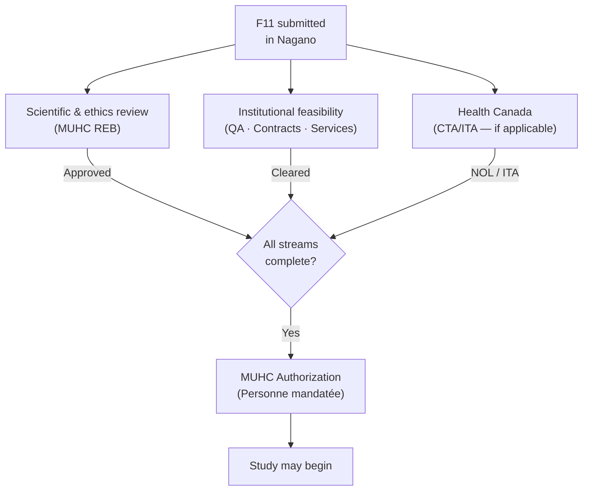

Once you submit, you are in a period of active review that requires attention, not passive waiting. Understanding what the status indicators mean, why response deadlines are consequential, and what to do when you receive a decision keeps authorization on track and avoids compliance problems that are difficult to undo.

## Tracking your submission in Nagano

Once your F11 is submitted, review happens in <Tooltip tip="The RI-MUHC's electronic study submission and management platform. All studies requiring MUHC Authorization are submitted through Nagano." headline="Nagano (RI-MUHC)" cta="Full definition" href="/kb/glossary#nagano">Nagano</Tooltip>. The platform does not send you a summary of what is pending — it is your responsibility to check in regularly and act when action is required.

Open your project from the navigation bar: **My Projects → My Active Projects → your study**. Use these two tabs:

- **Statuses** — your best at-a-glance view. You will see review elements (<Tooltip tip="The ethics committee that reviews and approves research involving human participants. Also called CER at French-language institutions." headline="Research Ethics Board (REB)" cta="Full definition" href="/kb/glossary#reb">REB</Tooltip>, feasibility) and an Authorized label once final <Tooltip tip="Institutional authorization allowing a study to proceed at the RI-MUHC. Issued after ethics approval and feasibility review." headline="MUHC Authorization" cta="Full definition" href="/kb/glossary#muhc-auth">MUHC Authorization</Tooltip> has been granted by the <Tooltip tip="Individual formally authorized to issue the final written authorization for each research project at a Quebec RSSS institution." headline="Personne mandatée (PFM)" cta="Full definition" href="/kb/glossary#personne-mandatee">Personne mandatée</Tooltip>.
- **Discussions** — project-specific messages sent during feasibility review and other workflow steps.

To monitor updates across all your projects at once, use the **Activities** feed — visible on your home screen when you log in, or accessible from the top navigation tabs.

<Note>
  Nagano can send email notifications about project activity, but these may not be fully enabled by default. In your Profile (top-right menu), look for **Select activities** and opt in to the notifications you want. Email is a supplement — verify progress directly using Statuses and Discussions.
</Note>

### Understanding Nagano status labels

Nagano uses two distinct types of status labels. Confusing them leads to missed action.

| Label type | Examples | What it means |
|---|---|---|
| **REB review decisions** | Approved, Approval with Modifications, Deferral, Disapproval | Formal decision by the ethics board — these are the terms used in [REB-SOP 401](https://muhc.ca/cae/muhc-research-ethics-board-reb-standard-operating-procedures-sops). In Nagano, "Approval with Modifications" appears as **Conditional approval**. |
| **Form workflow statuses** | Created, Submitted, Re-opened, Approved/Closed | What is currently happening to a form in the platform — whether it is waiting on you or waiting on reviewers. |

<Warning>
  A form showing **Re-opened** always requires action from your team. Do not mistake a form workflow status for a final REB decision.
</Warning>

## The three review streams running in parallel

Your submission triggers three review streams simultaneously. All three must be complete before the Personne mandatée can issue MUHC Authorization.

<CardGroup cols={3}>
  <Card title="Scientific and ethics review" icon="microscope">
    Conducted by the MUHC REB. Reviews study design, informed consent, risk-benefit ratio, data protections, and participant safety. Issues one of four formal decisions (Approved, Approval with Modifications, Deferral, Disapproval).
  </Card>
  <Card title="Institutional feasibility" icon="building-2">
    Run by <Tooltip tip="All planned and systematic actions to ensure trial data are generated, documented, and reported in compliance with GCP and SOPs." headline="Quality Assurance (QA)" cta="Full definition" href="/kb/glossary#qa">QA</Tooltip>, the Research Agreements Office, MUHC service departments (pharmacy, nursing, lab, DPS), and the Privacy/<Tooltip tip="Required under Quebec Law 25 before communicating personal information without consent for research. Non-compliance: up to $25M or 4% of worldwide turnover." headline="ÉFVP — Privacy Impact Assessment" cta="Full definition" href="/kb/glossary#efvp">ÉFVP</Tooltip> team. Verifies that Privileges and training are current and that the study can be practically conducted at the MUHC.
  </Card>
  <Card title="Health Canada (drug/device only)" icon="shield">
    For drug trials: the <Tooltip tip="Letter from Health Canada confirming a CTA is satisfactory and authorizing the sponsor to proceed." headline="No Objection Letter (NOL)" cta="Full definition" href="/kb/glossary#nol">No Objection Letter</Tooltip> (NOL) on the <Tooltip tip="Application to Health Canada for authorization to conduct a drug trial under Division 5 of the Food and Drug Regulations." headline="Clinical Trial Application (CTA)" cta="Full definition" href="/kb/glossary#cta">Clinical Trial Application</Tooltip>. For device trials: the <Tooltip tip="Health Canada authorization to conduct a clinical investigation of a medical device. The device equivalent of a CTA." headline="Investigational Testing Authorization (ITA)" cta="Full definition" href="/kb/glossary#ita">Investigational Testing Authorization</Tooltip> (ITA). Must be in hand before MUHC Authorization is granted.
  </Card>
</CardGroup>

<Info>
  REB approval alone does not authorize the study. MUHC Authorization from the Personne mandatée requires all three streams to be complete and satisfactory. Do not begin any research activity — including screening and consent — until the Authorization letter is in your <Tooltip tip="The QI's collection of documentation demonstrating compliance, study integrity, and participant safety." headline="Investigator Site File (ISF)" cta="Full definition" href="/kb/glossary#isf">ISF</Tooltip>.
</Info>

## The three-month response deadline

If the REB requests changes or additional information, you have three months to respond. The clock runs from the date of the last REB correspondence to you — excluding reminders.

<Warning>
  **If you miss the deadline, the REB file closes entirely.** The study is not paused or placed on hold — the file closes. Full resubmission from the beginning is required, as though the study had never been submitted. Any review progress made — including QA feasibility, contracts, and departmental reviews — does not carry forward automatically.
</Warning>

Nagano does not send a countdown reminder as the three-month deadline approaches. Note the date the REB request arrived and set your own reminder. If you anticipate difficulty responding in time, contact the REB coordinator early — do not wait until the deadline has passed.

## Responding to conditions and reviewer requests

When a reviewing body needs something from your team, they re-open the relevant form in Nagano. The form will show **Re-opened** status, and you will also receive a notification by email.

<Steps>
  <Step title="Open the re-activated form in Nagano">
    Navigate to your project and open the form showing Re-opened status.
  </Step>
  <Step title="Review each condition or comment listed by the reviewer">
    Read every condition carefully. Conditions are specific — each one requires a direct, specific response.
  </Step>
  <Step title="Make the required changes and upload revised documents">
    Upload revised documents to Project Files. Every revised document must carry a new version number and date in both the document footer and the file name before uploading.
  </Step>
  <Step title="Address each condition explicitly in your written response">
    Write a response that references each condition individually. A general acknowledgement without a specific response to each point will result in the form being re-opened again.
  </Step>
  <Step title="Re-submit the form">
    Once you have addressed every condition and uploaded all revised documents, re-submit the form.
  </Step>
</Steps>

<Note>
  Version numbering matters. Incorrect or inconsistent version numbering is one of the most common Health Canada inspection findings — it creates ambiguity about which version of the <Tooltip tip="The written document providing the participant with information essential to making an informed decision. Both parties must sign." headline="Informed Consent Form (ICF)" cta="Full definition" href="/kb/glossary#icf">ICF</Tooltip> or protocol the REB actually reviewed and approved.
</Note>

## What each decision requires of you

<AccordionGroup>
  <Accordion title="Approved — verify the letter, then wait for MUHC Authorization">
    REB approval alone does not authorize the study. MUHC Authorization from the Personne mandatée is still required before any research activity — including screening and consent — can begin.

    Check the approval letter carefully (see below), file it in the ISF the day you receive it, and monitor Nagano for the MUHC Authorization letter. Note the REB approval expiry date and calendar your annual renewal immediately.
  </Accordion>
  <Accordion title="Approval with Modifications — respond before the study can proceed">
    The REB's formal decision name is **Approval with Modifications** (shown as "Conditional approval" in Nagano). This is **not approval**. The study cannot begin — not even participant identification — until the conditions have been addressed and the REB has issued final approval.

    The F11 will be re-opened in Nagano. Respond to each condition directly and re-submit. The three-month response deadline applies from the date of the last REB correspondence.
  </Accordion>
  <Accordion title="Deferral — significant revision required">
    The REB requires substantial changes or additional information. The study will be reviewed again after resubmission. Deferral is not a refusal — it means the REB needs to see a materially revised submission. The three-month response deadline applies.
  </Accordion>
  <Accordion title="Disapproval — study cannot proceed as submitted">
    The study does not meet ethical standards and further revision is unlikely to lead to approval. The study cannot proceed. You have the right to request reconsideration or to appeal to another REB within Quebec's <Tooltip tip="Quebec's public health and social services network (Réseau de la santé et des services sociaux), including the RI-MUHC." headline="RSSS" cta="Full definition" href="/kb/glossary#rsss">RSSS</Tooltip> network.
  </Accordion>
</AccordionGroup>

## When you receive your approval letter

The REB approval letter is an essential document and a legal record of what was reviewed. Do not file it without reading it. Errors in approval letters are a known issue and must be caught before the letter is archived.

Verify that the letter contains all of the following:

- Protocol title and protocol number
- Name, version number, and version date of every document reviewed (protocol, ICF(s), <Tooltip tip="Compilation of clinical and nonclinical data on the investigational product relevant to the study." headline="Investigator's Brochure (IB)" cta="Full definition" href="/kb/glossary#ib">Investigator's Brochure</Tooltip>, participant materials, recruitment advertisements)
- Date of REB review
- Statement of full board or delegated review
- The REB's decision
- Date by which annual renewal is required
- REBA attestation statement

If you spot an error — for example, an incorrect ICF version number or a missing document — contact the REB coordinator immediately and request a corrected letter. File all related correspondence in the ISF alongside the corrected letter.

<Warning>
  File the approval letter in the ISF the day you receive it. Monitors verify its presence at every visit, and Health Canada inspectors expect it to be accessible. A missing or uncorrected approval letter is an inspection finding.
</Warning>

## If REB approval lapses

A lapse in REB approval is one of the most consequential compliance failures a study team can experience.

When approval lapses, **all study activities must be suspended** until renewed approval is granted. The one exception is where continuing a research-related medical treatment is necessary to protect participant safety — the REB must be notified immediately. No new participants may be enrolled for the duration of the lapse.

Renewal is **not retroactive**. When the REB grants renewed approval, it covers the period from the date of renewal forward. Any activities that occurred during the lapse were conducted without ethics approval — that gap exists in the study record permanently and constitutes a protocol deviation requiring documentation and reporting.

<Warning>
  **A lapse in REB approval is a major Health Canada inspection observation** — the same level as significant data integrity issues or ICF failures. Submit for annual renewal at least one month before expiry. A lapse exceeding 30 days may result in the REB terminating ethics approval entirely, not merely suspending it.
</Warning>

If a lapse does occur: submit a request for Continuing Review immediately, suspend all study activities except those required for participant safety, notify the REB if treatment continuation is necessary, and document the lapse and corrective steps on the deviation log.

## Reconsideration and appeal

You have the right to request reconsideration of any REB decision. Reconsideration means presenting arguments to the Full Board — you have the right to be heard at a Full Board meeting. If after reconsideration the REB maintains its decision to disapprove, the REB may offer a second hearing in front of a distinct quorum; the decision of that second quorum is final.

If you do not accept a hearing in front of a distinct quorum, an appeal may be launched for procedural or substantive reasons. The appeal takes place at another REB within Quebec's RSSS network. The appeals committee may approve, disapprove, or request modifications; its decision is final and must be communicated in writing.

Contact the REB coordinator as the first step for any reconsideration or appeal request.
