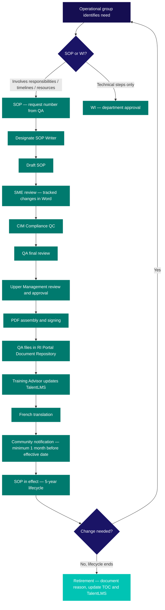

  

    <Badge color="gray">SOP-CR-001_08</Badge>
    <Badge color="gray">Version 08</Badge>
    <Badge color="green">Effective 19 Jun 2023</Badge>
    <Badge color="blue">All training levels</Badge>
  

  <button className="ri-print-btn" onClick={() => window.print()}>Print / Save PDF</button>

Reviewed by Dr. Louise Pilote, Director of Clinical Research, RI-MUHC.
Approved by Gilbert Tordjman, Chief Operating and Development Officer, RI-MUHC.
Signed copy on file — download the PDF for the approved version with signatures.

---

## 1 · Purpose {#purpose}

This Standard Operating Procedure (SOP) describes the process for the development/revision, Subject Matter Expert (SME) review, CIM Compliance review, RI-MUHC Management approval/authorization, RI-MUHC launch, maintenance and storage of written RI-MUHC SOPs intended for use by the clinical research community as well as the associated SOP reader, training & quiz revisions for RI-MUHC institutional training.

---

## 2 · Scope {#scope}

This procedure concerns the research community (employees, investigators, physicians, management, consultants, students, volunteers or other persons) who play a role in RI-MUHC SOP Management as well as Subject Matter Expert and Training Advisor contributions.

All human research processes should be documented in writing. Department-specific or protocol-specific SOPs or Working Instructions (WIs) fall outside the scope of this SOP as they are approved by their department/QI/PI/Sponsor-Investigator.

---

## 3 · Responsibilities {#responsibilities}

| Role | Responsibility |
|---|---|
| **Operational Group / Improver** | Identifies the need for process improvement and communicates it to <Tooltip tip="All planned and systematic actions to ensure trial data are generated, documented, and reported in compliance with GCP and SOPs." headline="Quality Assurance (QA)" cta="Full definition" href="/kb/glossary#qa">QA</Tooltip>. Delegates SOP writing to a qualified person. |
| **SOP Writer** | A person who knows the process well and possesses technical writing skills. Drafts the SOP or WI as delegated by the Operational Group. |
| **QA Process Controller** | Guides operational groups and SMEs, reviews SOPs for compliance, manages SOP numbering and the Table of Contents, issues the Effective Date, and files the approved SOP. Does not write or approve SOPs, in order to preserve independence between QA and Operations. |
| **Subject Matter Experts (SMEs)** | Qualified persons who use the process and contribute to writing and reviewing the SOP. |
| **Quality Control SOP Reviewer** | Reviews the SOP after SME input and interacts with QA to create a final draft. Typically the CIM Compliance Specialist. |

---

## SOP versus Work Instruction {#sop-versus-work-instruction}

An **SOP** must be used whenever the process involves responsibilities, timelines, communication, or resources. A **Work Instruction (WI)** is appropriate only when the document describes a sequence of technical steps and instructions without assigning responsibilities. SOPs may include technical steps as well as appendices.

Department-specific WIs must be compatible with and subordinate to the relevant RI-MUHC SOP — they cannot contradict or lower the standard set by the SOP.

---

## SOP lifecycle {#sop-lifecycle}

---

## 4 · Definitions {#definitions}

See [Glossary of Terms](/kb/glossary) for all term definitions.

---

## 5 · Procedure {#procedure}
### 5.1 Decision to create or revise a procedure

The RI-MUHC QA department is making a format transition from N2 copy-written SOPs with attached RI-MUHC addenda to RI-MUHC SOPs that combine N2 and RI-specific processes in a more user-friendly manner.

MUHC/RI-MUHC Human Research Operational groups should identify a need for new or revised procedures, which may originate from staff information, a need for more clinical research tools, specific study requirements, changes to administrative policy or processes, or changes in other departments. The need for a revision should be communicated to the QA department.

Additionally, the QA department conducts process audits across RI-MUHC human research groups to promote and facilitate process improvement. Process audits identify needs for improvement and provide recommendations for SOP revision. These recommendations are communicated to the Operational groups who participated in the audit.

### 5.2 Verify if the process belongs in an SOP or WI

It is important to determine whether the process should be documented as an SOP or a WI. As soon as the process involves detailing responsibilities, timelines, communication, or resources, the document should be an SOP. If the document only describes a sequence of technical steps, it should be a WI. SOPs can contain technical steps as well as helpful tools as appendices.

→ Appendix 1 — SOP template  
→ Appendix 2 — WI template

### 5.3 Designate an SOP writer

The Operational group who identifies the need should delegate writing to a qualified individual who uses and knows the process well. Other contributors may be brought in depending on the complexity of the process.

### 5.4 Request a new SOP number

If a new RI-MUHC SOP is needed for an RI-wide process, the SOP writer must request a new SOP number from the QA Process Controller by email (QAclinicalresearch@muhc.mcgill.ca).

### 5.5 Grant the SOP number

The QA Process Controller confirms the justification, determines where the process change belongs in the current SOP set, and issues a new SOP number where appropriate. The QA Process Controller tracks all SOP numbers in a revised Table of Contents (TOC). If the request does not warrant a new SOP, the QA Process Controller will identify which existing SOP can be revised or suggest a department-specific SOP/WI.

### 5.6 Draft a new or revised SOP

The SOP writer takes sufficient time to draft a process that all contributors will deem adequate. Terminology must be used carefully:

- **"Must," "will," "have to"** — mandatory actions. Any deviation must be documented as an SOP deviation.
- **"Should," "typically," "usually"** — expected by default, but the process may not apply to all situations. A comment on the record or a note-to-file is sufficient to justify a deviation.

### 5.7 Circulate for SME review

The SOP writer circulates the draft to SMEs who know the process and can contribute. For complex revisions, meetings may be held with the writer, SMEs, CIM Compliance, and RI-MUHC QA. Revisions are documented via tracked changes in Word. Best practice is to have one person (e.g. CIM Compliance Specialist) collect all SME contributions and then hold a meeting to review with QA and SMEs. All SME contributions are captured on the SOP Review and Approval Log (Appendix 4).

### 5.8 Quality Control and Quality Assurance

Once all SMEs have provided input, the final draft goes to CIM Compliance for QC of content. Once CIM Compliance is satisfied, the draft goes to QA for final review to ensure compliance with regulations, guidelines, and local policies. Both the CIM Compliance QC and QA reviews are documented on the SOP Review and Approval Log. Drafts are filed electronically by QA with the date at the end of the file name. The QA Process Controller inserts the Effective Date — this must be at least 2 months after the projected launch date to allow time for translation and training.

### 5.9 Review and approval by Upper Management

QA sends a tracked-changes version and a clean version to RI-MUHC Upper Management for review and approval, along with the SOP Review and Approval Log. Once Upper Management review is complete and each SOP and appendix has been assembled into PDF format, the final version is signed and returned to QA for electronic filing. Upper Management may conduct an annual review of RI-MUHC SOPs and submit recommendations to QA.

### 5.10 Secure filing of the final SOP

The signed paper copy is filed at the RI-MUHC in a QA binder stored at the administrative building. If electronically signed, only an electronic version is kept. The QA Process Controller electronically files the approved SOP and uploads it to the RI Portal Document Repository (Appendix 3).

### 5.11 Updating TalentLMS training and SOP Reader

QA communicates the revisions to the RI-MUHC Training and Learning Solutions Advisor and requests revisions to the TalentLMS SOP training where required. A draft of the revised training module is sent to QA for review and approval. The Training Advisor replaces the superseded SOP with the revised version in the SOP Reader on TalentLMS. QA and the Training Advisor prepare quiz questions related to the revised SOP(s).

Once approved and translated, the revised training with quiz and SOP Reader with quiz is made available to the research community via TalentLMS.

### 5.12 SOP translation

QA confirms the translation budget, contacts a translation vendor (e.g. Beyond Words, TransPerfect), provides the final SOP version with the required timeline, and files the French SOP electronically in the RI Portal Document Repository along with the updated TOC. QA then sends the French SOP to the Training Advisor for French SOP Reader and French SOP Training updating.

### 5.13 SOP Reader and training module launch

Once a new or revised SOP is uploaded into TalentLMS, an email is sent to notify the research community that a new/revised SOP should be read and a short quiz passed **prior to the SOP effective date**. Best practice is to ensure the SOP is uploaded at least one month before its effective date.

If a trainee's SOP training certificate has not yet expired, they may read the revised SOP(s) and correctly answer the SOP-related quiz questions in lieu of redoing the entire course. Note: this does not change the certificate expiry date. If the SOP is launched close to the trainee's certificate expiry date, best practice is to renew the training.

Once an SOP module has been revised, translated, and approved, the research community receives another TalentLMS notification for upcoming course renewal.

### 5.14 Maintenance of the effective SOP lifecycle

An SOP is effective at any time during its lifecycle. Typically a lifecycle is less than 5 years. Revision and re-approval can occur at any time during the 5-year period to adapt to required changes (regulatory, international guidance, MSSS requirements, organizational structure changes, RI policy, MUHC Regulatory Framework, software).

When an SOP is removed from circulation (e.g. the process is no longer used or is incorporated into another SOP), it is retired.

### 5.15 SOP retirement

The QA Process Controller verifies any request for SOP retirement and obtains clarifications. The reason for retirement is documented in a note-to-file and the SOP Table of Contents. The QA Process Controller notifies the Training Advisor, who ensures the SOP Reader is updated and that no references to the retired SOP remain in TalentLMS learning modules and quizzes. Once TalentLMS has been updated, the SOP is officially retired.

---

## Appendices {#appendices}

<Info>
Printable appendix templates are available for download below where linked. For the complete collection, see [SOP Appendices and Templates](/sops/appendices).
</Info>

- [Appendix 1 — SOP Template](https://portal.rimuhc.ca/pls/apex/MUHC2.download_my_file?p_file=51233282279301567)
- [Appendix 2 — Department-Specific WI Template](https://portal.rimuhc.ca/pls/apex/MUHC2.download_my_file?p_file=51233503712310171)
- Appendix 3 — IT WI on RI Portal Document Repository (instructions for uploading and linking documents in the RI Portal)
- Appendix 4 — SOP Review and Approval Log

---

## References {#references}

- N2 Network SOP001 version 9
- ICH-<Tooltip tip="International standard for design, conduct, monitoring, recording, and reporting of clinical studies." headline="Good Clinical Practice (GCP)" cta="Full definition" href="/kb/glossary#gcp">GCP</Tooltip> E6 R2 (09-Nov-2016)
- Health Canada, Food and Drug Regulations, Part C, Division 5 (GUI-0100, August 2019)
- ISO 14155:2020
- TCPS2 (2022)

---

<h2>Revision history</h2>

| Version | Date | Summary |
|---|---|---|
| SOP-CR-001_08 | 19 Jun 2023 | N2 SOP version 09 and the RI-MUHC Addendum combined. QA process audit recommendations for SOPs, SME and CIM Compliance review added. RI-MUHC Training Advisor communication added. Reference to TalentLMS SOP Reader added. 5-year lifecycle added. Four appendices added. |
| SOP-CR-001_07 | 01 Sep 2018 | SOP001_06 renamed to SOP-CR-001_07. Location of obsolete SOPs (1.2.1) and SME collaboration (1.2.2) updated. Approver changed from Associate Director to Executive Director and CSO. RI-MUHC subject matter experts included. Addition of SOP Implementation (1.5) and definitions (4.0). |
| SOP001_06 | 24 May 2016 | All RI-MUHC SOPs completely revised toward N2 SOPs. Combination of N2 SOP001_06 and RI-MUHC SOPRC001_EN04. SOPs review and approval process revised to include Legal review and remove MUHC Board review section. New specification added for departmental SOPs. SOP template appendix removed. |
