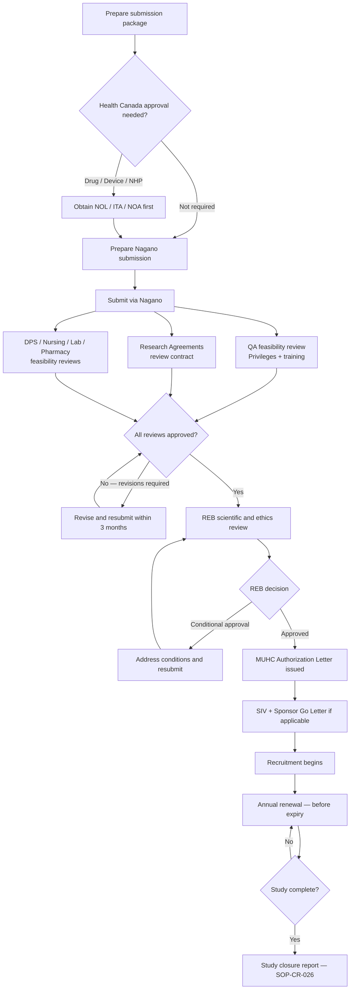

  

    <Badge color="gray">SOP-CR-007_08</Badge>
    <Badge color="gray">Version 08</Badge>
    <Badge color="green">Effective 01 May 2025</Badge>
    <Badge color="blue">Levels I–IV</Badge>
  

  <button className="ri-print-btn" onClick={() => window.print()}>Print / Save PDF</button>

Reviewed by Dr. Louise Pilote, Director of Clinical Research, RI-MUHC.
Approved by Gilbert Tordjman, Chief Operating and Development Officer, RI-MUHC.
Signed copy on file — download the PDF for the approved version with signatures.

---

## Purpose and scope

This SOP describes the required documentation and communication for initial study submission between the Sponsor-Investigator or <Tooltip tip="The physician responsible to the sponsor for the conduct of a clinical trial at the site. One QI per study per Canadian site." headline="Qualified Investigator (QI)" cta="Full definition" href="/kb/glossary#qi">QI</Tooltip>/PI and the MUHC <Tooltip tip="The ethics committee that reviews and approves research involving human participants. Also called CER at French-language institutions." headline="Research Ethics Board (REB)" cta="Full definition" href="/kb/glossary#reb">Research Ethics Board</Tooltip> (REB)/Scientific Review. It also describes the institutional feasibility review to obtain <Tooltip tip="Institutional authorization allowing a study to proceed at the RI-MUHC. Issued after ethics approval and feasibility review." headline="MUHC Authorization" cta="Full definition" href="/kb/glossary#muhc-auth">MUHC Authorization</Tooltip>, requirements for Annual Continuing REB approval, Conflict of Interest (COI) reporting, and clinical trial registration on clinicaltrials.gov.

This SOP applies to research community members involved in the initial study submission and annual renewal processes for studies not already reviewed by an REB from a different <Tooltip tip="Quebec's public health and social services network (Réseau de la santé et des services sociaux), including the RI-MUHC." headline="RSSS" cta="Full definition" href="/kb/glossary#rsss">RSSS</Tooltip> site. For ongoing review of amendments and reportable events, see [SOP-CR-026](/sops/cr-026).

---

## Responsibilities

| Role | Responsibility |
|---|---|
| **Sponsor / Sponsor-Investigator** | Ensure Health Canada approval (if required) is obtained before study start. Register the clinical trial before recruiting the first participant. Secure agreements and ensure direct access to <Tooltip tip="The sponsor's collection of documentation demonstrating compliance across all study sites." headline="Trial Master File (TMF)" cta="Full definition" href="/kb/glossary#tmf">TMF</Tooltip>/<Tooltip tip="The QI's collection of documentation demonstrating compliance, study integrity, and participant safety." headline="Investigator Site File (ISF)" cta="Full definition" href="/kb/glossary#isf">ISF</Tooltip> for monitoring. |
| **Sponsor-Investigator** | Responsible for both Sponsor and QI/PI responsibilities. Sets up both a TMF (regulatory documents) and ISF. For monocentric studies, one TMF/ISF file is required. |
| **QI/PI / REB Lead** | Submit all required documents in <Tooltip tip="The RI-MUHC's electronic study submission and management platform. All studies requiring MUHC Authorization are submitted through Nagano." headline="Nagano (RI-MUHC)" cta="Full definition" href="/kb/glossary#nagano">Nagano</Tooltip>. Ensure Privileges/Researcher Status and institutional training are obtained. Ensure the study does not begin before all required approvals are in hand. Submit annual renewals before approval expires. |
| **MUHC REB** | Conduct scientific and ethical review of the study. Approve or refuse. Issue an REB approval letter. |
| **<Tooltip tip="Individual formally authorized to issue the final written authorization for each research project at a Quebec RSSS institution." headline="Personne mandatée (PFM)" cta="Full definition" href="/kb/glossary#personne-mandatee">Personne mandatée</Tooltip> (MUHC Authorization)** | Formally attest through an authorization letter that the project has undergone scientific review, ethics review, and site-specific assessment with positive results. |

---

## Study submission and review cycle

---

## Procedure

### 5.1 Sponsor responsibilities

**5.1.1 Health Canada approval:** For any human research trial involving an investigational new drug (Phase I, II, III, or IV with conditions), natural health product, or Class II/III/IV new medical device, the Sponsor must obtain Health Canada approval before conducting human research. → [SOP-CR-018](/sops/cr-018) (drugs), [SOP-CR-023](/sops/cr-023) (NHPs), [SOP-CR-024](/sops/cr-024) (medical devices). The <Tooltip tip="Letter from Health Canada confirming a CTA is satisfactory and authorizing the sponsor to proceed." headline="No Objection Letter (NOL)" cta="Full definition" href="/kb/glossary#nol">NOL</Tooltip>/NOA/<Tooltip tip="Health Canada authorization to conduct a clinical investigation of a medical device. The device equivalent of a CTA." headline="Investigational Testing Authorization (ITA)" cta="Full definition" href="/kb/glossary#ita">ITA</Tooltip> must be forwarded to Investigators for filing in the ISF and submitted to the REB.

**5.1.2 Research agreements:** All agreements for studies at the MUHC/RI-MUHC must be drafted by the RI-MUHC Research Agreements Office. Submit all contract/agreement requests via My Contracts on the RI-MUHC portal. Key requirements:
- For Sponsor-Investigator studies: the RI-MUHC should be indicated as "Sponsor" on agreements and regulatory documents to ensure insurance coverage (MDs are covered by CMPA)
- Document all duties transferred to CROs or third parties vs. duties retained by the Sponsor — the Sponsor retains responsibility for data quality and integrity regardless
- Never sign a binding contract without Research Agreements Office review

**5.1.3** Obtain the Investigator's REB membership list and address, plus initial conditional and final REB approval letters (which must include the list of reviewed documents, review date, and decision).

**5.1.4** No Investigator may begin recruiting participants before REB approval and institutional authorization. Best practice: ship materials and conduct the <Tooltip tip="Monitoring visit to train the site team on the protocol and confirm site readiness, after REB approval and MUHC Authorization." headline="Site Initiation Visit (SIV)" cta="Full definition" href="/kb/glossary#siv">SIV</Tooltip> after initial REB approval and MUHC Authorization.

**5.1.5** At SIV, ensure only appropriately qualified and trained team members are delegated tasks on the <Tooltip tip="Lists each team member, their qualifications, and specific trial tasks authorized by the QI." headline="Task Delegation Log (TDL)" cta="Full definition" href="/kb/glossary#tdl">Task Delegation Log</Tooltip>.

**5.1.6** Conduct QC and file all essential documents in the Trial Master File (TMF) — per ICH-<Tooltip tip="International standard for design, conduct, monitoring, recording, and reporting of clinical studies." headline="Good Clinical Practice (GCP)" cta="Full definition" href="/kb/glossary#gcp">GCP</Tooltip> section 8 for drug/NHP studies, or ISO-GCP Annex E for medical device studies.

**5.1.7** Register the clinical trial in a publicly accessible registry before participant recruitment begins. → Section 5.8

### 5.2 Investigator responsibilities for initial submission

**5.2.1** Before submitting in Nagano, the investigator must:
- Obtain Privileges or Researcher Status (→ [SOP-CR-500](/sops/cr-500)) and the appropriate level of institutional training (→ [SOP-CR-003](/sops/cr-003))
- Obtain Nagano training and document it
- Ensure the protocol and <Tooltip tip="Compilation of clinical and nonclinical data on the investigational product relevant to the study." headline="Investigator's Brochure (IB)" cta="Full definition" href="/kb/glossary#ib">Investigator Brochure</Tooltip> are the most recent versions
- Prepare ICFs and recruitment materials per [SOP-CR-006](/sops/cr-006)
- Submit the site-specific <Tooltip tip="The written document providing the participant with information essential to making an informed decision. Both parties must sign." headline="Informed Consent Form (ICF)" cta="Full definition" href="/kb/glossary#icf">ICF</Tooltip> to the Sponsor/Sponsor-Investigator for approval before REB submission

**5.2.2** Refer to the MUHC REB webpages for submission platform access and appropriate forms.

**5.2.3** The REB Lead/Investigator creates an account in Nagano and completes the initial study submission. Depending on the study type, additional forms may be triggered (Department Head signature, nursing, laboratory, pharmacy agreement, EFVP form for privacy). When a delegate submits on behalf of the Investigator, the "<Tooltip tip="US equivalent of the Canadian Qualified Investigator (QI)." headline="Principal Investigator (PI)" cta="Full definition" href="/kb/glossary#pi">Principal Investigator</Tooltip>'s Commitment and Signature" form must be completed.

**5.2.4** After submission:
- Submit contract/agreement requests via My Contracts
- Ensure a signed copy of the agreement is filed in the confidential investigator file

**5.2.5** Full submission requirements:

| Document category | Required elements |
|---|---|
| Regulatory | Privileges/Researcher Status + institutional training confirmed; all contracts executed via Research Agreements Office |
| Protocol package | Current protocol, IB/Product Monograph (if applicable), NOL/NOA/ITA (if applicable) |
| Participant-facing | ICF (EN + FR), all participant-facing materials (EN + FR), recruitment materials (EN + FR) |
| Administrative | Budget and financial information; Department Head authorizing signatures; EFVP form (if accessing health records) |
| Supplementary | Recruitment plan, investigator CV, participant compensation information |

Respond to all REB questions within **3 months** — studies may be closed after that period.

**5.2.6** Submit all research advertisements to the **MUHC Communications Department** (outside Nagano) at communications@muhc.mcgill.ca.

**5.2.7** File all REB submissions, approvals, acknowledgments, and correspondence in the ISF/TMF. → [SOP-CR-015](/sops/cr-015)

**5.2.8** Track when initial approval expires. Obtain continuing review annually or as directed by the REB.

### 5.3 Categories of research requiring MUHC REB approval

All research involving living human participants and/or personal data, cadavers, human remains, tissues, body fluids, embryos, foetuses, reproductive materials, or stem cells must receive written REB approval before initiation. This includes:
- Studies recruiting participants from within the MUHC or via MUHC technological tools
- Studies using health records stored at the MUHC
- Studies conducted entirely or in part at the MUHC (including by MUHC-affiliated researchers abroad)
- Studies relying on MUHC staff services (nursing, pharmacy)
- Studies using MUHC technical platforms (imaging, OR, examination rooms)
- Data repositories and tissue banks for potential human research

Research based on publicly available data does not require REB review when the data is legally accessible and there is no reasonable expectation of privacy.

### 5.4 Initial REB and institutional review

**5.4.1 General:** All submissions must be via Nagano. The REB reviews confidentiality and privacy of participant information throughout the study. If requesting access to patient medical information without informed consent, an EFVP (Évaluation des facteurs relatifs à la vie privée) form is required.

**5.4.2 <Tooltip tip="All planned and systematic actions to ensure trial data are generated, documented, and reported in compliance with GCP and SOPs." headline="Quality Assurance (QA)" cta="Full definition" href="/kb/glossary#qa">QA</Tooltip> feasibility review (Privileges and training):** QA confirms the QI/PI holds valid RI-MUHC Privileges or Researcher Status (→ [SOP-CR-500](/sops/cr-500)) and the appropriate level of institutional training (→ [SOP-CR-003](/sops/cr-003)). If training is insufficient, the personne mandatée will not provide MUHC Authorization.

**5.4.3 Access to medical records:** If accessing participant information (OACIS, databases) before informed consent, or if consent is impracticable (e.g. deceased participants), the Investigator must obtain MUHC authorization through Nagano. The EFVP form (French) must be completed by the QI/PI and sent to the Commission d'accès à l'information du Québec (CAI). Contact efvp@muhc.mcgill.ca.

**5.4.4 Pharmacy review:** All drugs and some NHPs must be managed by pharmacy. Triggering the pharmacy section in Nagano initiates a pharmacy feasibility evaluation; a pharmacy agreement will then be sent to the Investigator for signature.

**5.4.5 Laboratory review:** If OPTILAB-MUHC laboratory services are required, trigger the laboratory feasibility review in Nagano. Contact: clinicallaboratoryresearchinquiries@muhc.mcgill.ca

**5.4.6 Research agreements:** All agreements must be uploaded into both Nagano and My Contracts. An agreement is required whenever there is collaboration with external parties (including McGill researchers), receipt/transfer of human samples or data, receipt/transfer of funds, or use of third-party services. Contracts are retained for 15 years (Health Canada regulated) or 7 years (non-regulated).

**5.4.7 Scientific review:** Peer-reviewed funded projects are not re-reviewed if documentation is provided. The scientific review request is part of the initial Nagano application.

**5.4.8 Ethics review:** The REB reviews participant safety, rights, and well-being. Key quality control points for the initial approval letter:
- Human study identification, protocol title and number
- Clear document names, version numbers, and dates
- Date of REB review; statement of full board or delegated review
- Decision/opinion; procedures for appealing
- Date of required renewal (usually one year from review date)
- Research Ethics Board Attestation (REBA)

**5.4.9 Nursing resources review:** Complete the nursing feasibility form in Nagano if MUHC nursing services are required. If using CIM services or a dedicated research nurse, answer "No" in Nagano.

**5.4.10 MUHC Communications review:** After REB approval of recruitment materials, submit advertisements to MUHC Communications at communications@muhc.mcgill.ca. Materials must include the MUHC/RI-MUHC PI name, the RI-MUHC or MUHC logo, and be in both official languages.

**5.4.11 MUHC Authorization:** Participant recruitment may begin only after all of the following have been received:
1. Health Canada approval (if applicable)
2. Written REB approval letter
3. **MUHC Authorization Letter**
4. SIV conducted and documented
5. Task delegation documented
6. Sponsor's Go Letter/confirmation (if applicable)

### 5.5 Annual renewal (continuing review)

Annual renewal is a complete review of the entire study and must occur before the previous approval expires. It continues until all data collection is complete, all participant contact has ended, and closure has been acknowledged by the REB.

- Submit the Annual Renewal form at **least one month** before approval expires
- A lapse in REB approval is a major regulatory finding — enrollment must stop, research-related medical treatment of current participants may continue only if the REB is notified of patient safety needs
- Renewal is **never retroactive** — the lapse period will have no ethics approval
- A lapse should be documented on the Protocol/GCP/SOP Deviation Log → [SOP-CR-026](/sops/cr-026)

### 5.6 Multi-centrique research in Quebec

A study with more than one Quebec site within the Québec public healthcare network is "multi-centrique" and is reviewed by one evaluating REB. This is distinct from a multicenter study with sites in multiple provinces (where each site submits to its own REB).

For multi-centrique trials: the REB Lead site submits on behalf of all participating Quebec RSSS sites. Participating sites that are Nagano users submit directly; non-Nagano sites send submissions to the RI-MUHC <Tooltip tip="The team member who handles day-to-day administration and coordination of the clinical trial." headline="Clinical Research Coordinator (CRC)" cta="Full definition" href="/kb/glossary#crc">CRC</Tooltip> for the study. All requests to add sites must be submitted via Nagano.

### 5.7 Conflict of Interest (COI)

Investigators hold trust relationships with participants, Sponsors, institutions, and society. COI can occur when activities or situations place a real, potential, or perceived conflict between research duties and personal, institutional, or other interests.

- If any team member is unclear whether a COI exists, they must contact the REB Chair and follow the REB's directives
- Investigators and team members shall disclose all actual, perceived, or potential COIs to the REB at submission and throughout the study
- The Investigator should not participate in REB deliberations or vote on their own study
- If required by the REB, disclose COI details to participants in the ICF
- For studies subject to US regulations, a "Financial Disclosure Form" must be completed by the Investigator and each Sub-Investigator and kept with essential study documentation

Participant compensation must not constitute an undue inducement and must be paid on a pro-rata basis for actual participation.

### 5.8 Clinical trial registration

TCPS2 (Article 11.10) requires registration of all clinical trials before recruiting the first participant in a recognized, publicly accessible registry. Clinical trial is defined broadly to include any investigation evaluating health-related interventions — including drugs, devices, surgical procedures, NHPs, psychotherapies, and process-of-care changes.

- The Sponsor or Sponsor-Investigator is responsible for registering the trial. For investigator-initiated studies, verify that registration has occurred; for funded studies, verify if the funding agency has registered it.
- The MUHC has set up an Organization Account with clinicaltrials.gov. Contact QAClinicalResearch@MUHC.MCGILL.CA to access registration. When setting up: indicate MUHC-RIMUHC as "Sponsor" and select "Principal Investigator" as "Responsible Party" for insurance purposes.
- The registry name, URL, and unique registration code must appear in the REB-approved ICF and be disclosed to potential participants.
- The Nagano "Data" tab also provides an option to register in the Quebec Registry (requires clinicaltrials.gov number).

---

## Appendices

- [Appendix 1 — Study Document/Amendment REB Approval Tracking Log](https://portal.rimuhc.ca/pls/apex/MUHC2.download_my_file?p_file=249041588157044407) _(tracks document version, rationale for changes, REB submission date, approval date, departments advised, and effective date at site)_

---

## References

- N2 Network SOP007_10
- MUHC Centre of Applied Ethics (CAE) SOPs
- ICH-GCP E6 R2 and draft R3
- ISO 14155:2020
- Health Canada, Good Clinical Practice: Consolidated Guideline (ICH Topic E6)
- TCPS2 (2022)
- Policy on the Research Ethics Board of the MUHC REB
- MSSS Framework for Public Health and Social Services Institutions to Authorize Research Conducted at More Than One Institution (01-Apr-2016)
- Quebec <Tooltip tip="Quebec's Act to modernize personal information protection law (in force Sept 2023). Requires EFVP before sharing personal data without consent." headline="Law 25 / Loi 25" cta="Full definition" href="/kb/glossary#law-25">Law 25</Tooltip> (Act to modernize legislative provisions regarding protection of personal information)
- Quebec <Tooltip tip="Quebec's Act respecting health and social services information (key provisions July 2024). Governs researcher access to health data through RSSS institutions." headline="Law 5 / Loi 5" cta="Full definition" href="/kb/glossary#law-5">Law 5</Tooltip> (Act respecting health and social services information)
- Fonds de Recherche du Québec — Santé (FRQS)

---

## Revision history

<Update label="SOP-CR-007_08" description="01 May 2025">
  N2 SOP-CR-007_10 and RI-MUHC Addendum combined and clarified. SOP-CR-007 split into SOP-CR-007 (initial submission and annual renewal) and [SOP-CR-026](/sops/cr-026) (ongoing review and reportable events). Revision/addition to sections 5.1.1, 5.1.2, 5.1.6, 5.1.7, 5.2, 5.3.2, 5.4.1, 5.4.2–5.4.12, 5.5.4, 5.6, 5.7.2, 5.7.3, and 5.8.
</Update>

<Update label="SOP-CR-007_07" description="01 Sep 2018">
  QI must adhere to REB timelines (timelines defined, 1.1.2). Additions to 1.4.2, 1.4.3, and 1.4.4 including reference to REB SOP406. Multicentric ongoing information submission revised (1.5.1). REB SOP405 reference added (1.9.2). CAE flowchart for MSSS process added (1.11). Definitions section (4.0) added. SOP007_06 renamed to SOP-CR-007_07.
</Update>

<Update label="SOP007_06" description="24 May 2016">
  Combined RI-MUHC–specific information from multiple prior SOPs. eReviews system replaced by Nagano. Study review fees appendix removed (refer to RI-MUHC Portal). Various additions and revisions to sections 1.4.4, 1.6, 1.7.3, 1.9.2, 1.10, and 1.11.
</Update>
