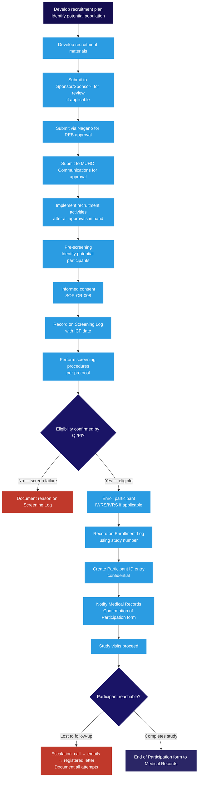

  

    <Badge color="gray">SOP-CR-009_08</Badge>
    <Badge color="gray">Version 08</Badge>
    <Badge color="green">Effective 01 May 2025</Badge>
    <Badge color="blue">Levels I–IV</Badge>
  

  <button className="ri-print-btn" onClick={() => window.print()}>Print / Save PDF</button>

Reviewed by Dr. Louise Pilote, Director of Clinical Research, RI-MUHC.
Approved by Gilbert Tordjman, Chief Operating and Development Officer, RI-MUHC.
Signed copy on file — download the PDF for the approved version with signatures.

---

<Warning>
**Controlled document.** Always refer to this page for the current version. Do not rely on downloaded or printed copies. Reading this page does not fulfil the SOP training requirement — use the SOP Reader on TalentLMS.
</Warning>

## Key points

- Written informed consent must be obtained from every participant **before** starting any screening activities — unless a written <Tooltip tip="The ethics committee that reviews and approves research involving human participants. Also called CER at French-language institutions." headline="Research Ethics Board (REB)" cta="Full definition" href="/kb/foundations/glossary#reb">REB</Tooltip> waiver has been obtained and an EFVP form reviewed. → [SOP-CR-008](/sops/cr-008)
- Obtain **both REB approval and MUHC Communications approval** of all recruitment materials before use. Submit to REB via <Tooltip tip="The RI-MUHC's electronic study submission and management platform. All studies requiring MUHC Authorization are submitted through Nagano." headline="Nagano (RI-MUHC)" cta="Full definition" href="/kb/foundations/glossary#nagano">Nagano</Tooltip> first, then to MUHC Communications at communications@muhc.mcgill.ca. Do not use any advertisement before both approvals are in hand.
- Three GCP-required logs must be created for every study: a **Screening Log** (<Tooltip tip="The written document providing the participant with information essential to making an informed decision. Both parties must sign." headline="Informed Consent Form (ICF)" cta="Full definition" href="/kb/foundations/glossary#icf">ICF</Tooltip> dates, screen failure reasons), an **Enrollment Log** (study numbers, visit dates), and a **Participant Identification Log** (nominative contact information for emergencies). The Identification Log is confidential and must never be provided to external Sponsors.
- Only participants who meet the inclusion/exclusion criteria of the **most recently REB-approved protocol** may be enrolled. The <Tooltip tip="The physician responsible to the sponsor for the conduct of a clinical trial at the site. One QI per study per Canadian site." headline="Qualified Investigator (QI)" cta="Full definition" href="/kb/foundations/glossary#qi">QI</Tooltip>/PI must sign off on eligibility for each participant.
- All MUHC research participants must have an **MUHC hospital card**.
- For studies involving investigational products, submit a **Confirmation of Participation in Research form** (Appendix 1) to Medical Records at enrollment and an **End of Participation form** (Appendix 2) at study exit.
- Lost-to-follow-up: follow a defined escalation process — call/text, then 3 emails/letters at 5-day intervals, then a registered letter. If the registered letter is returned with no response, document as lost to follow-up.

## 1 · Purpose {#purpose}

This Standard Operating Procedure (SOP) describes the process of recruitment,
screening and enrollment of participants for a human research study, within the
framework of Good Clinical Practice (GCP) principles, published by the
International Council for Harmonisation (ICH) and the International Standards
Organization (ISO) as well as all other applicable guidelines and regulations.

---

## 2 · Scope {#scope}

This procedure concerns the research community (employees, investigators,
physicians, management, consultants, students, volunteers or other persons)
involved in conducting, reviewing, and/or approving the recruitment, screening
and enrollment processes of human research participants at the MUHC/RI-
MUHC.

---

## 3 · Responsibilities {#responsibilities}

The Sponsor/Sponsor-Investigator and <Tooltip tip="The physician responsible to the sponsor for the conduct of a clinical trial at the site. One QI per study per Canadian site." headline="Qualified Investigator (QI)" cta="Full definition" href="/kb/foundations/glossary#qi">QI</Tooltip>/PI are responsible for ensuring that the participant recruitment, screening, and enrollment processes meet all applicable regulatory, ICH-GCP, ISO-GCP, Sponsor, Health Canada, and local requirements, including:
- Ensuring all recruitment tools and advertisements in any medium are <Tooltip tip="The ethics committee that reviews and approves research involving human participants. Also called CER at French-language institutions." headline="Research Ethics Board (REB)" cta="Full definition" href="/kb/foundations/glossary#reb">REB</Tooltip> approved before use; patient-facing advertisements must also be approved by MUHC Communications before use
- Ensuring informed consent is obtained from every participant before screening (unless an REB consent waiver and EFVP review are in place) → [SOP-CR-008](/sops/cr-008)
- Ensuring only participants meeting the inclusion/exclusion criteria of the most recently REB-approved protocol are enrolled
- Ensuring screening and enrollment are captured confidentially using study participant numbers
- Ensuring participant contact information is captured on a separate, confidential Participant Identification Log

Any or all parts may be delegated, but remain the ultimate responsibility of the Sponsor/Sponsor-Investigator or QI/PI.

---

## Recruitment and enrollment process {#recruitment-and-enrollment-process}

---

## 4 · Definitions {#definitions}

See [Glossary of Terms](/kb/foundations/glossary) for all term definitions.

---

## 5 · Procedure {#procedure}
### 5.1 Developing a recruitment plan

**5.1.1** The Sponsor, QI/PI, <Tooltip tip="The team member who handles day-to-day administration and coordination of the clinical trial." headline="Clinical Research Coordinator (CRC)" cta="Full definition" href="/kb/foundations/glossary#crc">CRC</Tooltip>, or delegate develops a study-specific recruitment plan before study initiation.

**5.1.2–5.1.3** Select the most appropriate activities for each recruitment stage: baseline, target, reviewed, identified, approached, screened, and eligible. Consider the most effective strategies for each potential participant group.

**5.1.4** The plan should address potential issues including:
- Ethical, financial, and regulatory considerations
- Privacy, timelines, and clinic staffing/resources
- Trial design and health emergency restrictions (if applicable)

**5.1.5** Use several recruitment methods rather than depending on a single method — hospital TV monitors, websites, social media, posters, flyers, radio, newspapers.

**5.1.6** Formalize and document the recruitment plan and strategies, including timelines.

**5.1.7–5.1.8** Develop recruitment materials and submit to the Sponsor or Sponsor-Investigator, then the REB (via <Tooltip tip="The RI-MUHC's electronic study submission and management platform. All studies requiring MUHC Authorization are submitted through Nagano." headline="Nagano (RI-MUHC)" cta="Full definition" href="/kb/foundations/glossary#nagano">Nagano</Tooltip>), and then MUHC Communications. All advertisements in any medium must meet the following requirements:
- Include the RI-MUHC or MUHC logo (correct use required)
- Be bilingual (French and English)
- Be free of grammar and spelling issues
- Use layperson's terms; avoid complex scientific terminology
- Specify the full name, title, and affiliation of the QI/PI
- Specify the CRC name with an MUHC/RI-MUHC phone number — do not use personal phones or email addresses (Hotmail, Yahoo, Gmail)

### 5.2 REB approval of recruitment materials

**5.2.1–5.2.2** Submit all recruitment materials that a patient may see — including social media text — to the REB via Nagano. After REB approval, submit to MUHC Communications to streamline the process. The REB reviews for undue influence or coercive tone.

**5.2.3** File REB approval of recruitment materials in the <Tooltip tip="The QI's collection of documentation demonstrating compliance, study integrity, and participant safety." headline="Investigator Site File (ISF)" cta="Full definition" href="/kb/foundations/glossary#isf">ISF</Tooltip>. Implement recruitment only after REB approval, <Tooltip tip="Institutional authorization allowing a study to proceed at the RI-MUHC. Issued after ethics approval and feasibility review." headline="MUHC Authorization" cta="Full definition" href="/kb/foundations/glossary#muhc-auth">MUHC Authorization</Tooltip>, and the Sponsor/Sponsor-Investigator's Go Letter/email have been received.

**5.2.4** Submit any amendments to recruitment materials to the REB per [SOP-CR-026](/sops/cr-026). Ensure version numbers are on all documents and file names. Obtain approvals before use and document on the REB Approval Tracking Log.

### 5.3 MUHC Communications approval

After REB approval, submit recruitment materials (formatted text) in English and French to MUHC Communications at communications@muhc.mcgill.ca. Once approved by MUHC Communications (usually within 3 days), the text may be adapted for use in any medium.

### 5.4 Access to participant medical records

If MUHC health records (e.g. OACIS) will be accessed before informed consent, written informed consent must first be obtained or approval from the MUHC Director of Professional Services (DPS) must be obtained via Nagano. The authorization is granted for a limited period and may be subject to conditions.

All MUHC research participants must have an **MUHC hospital card**. If a participant is referred from outside the MUHC patient population (including the JGH), obtain certified copies of relevant source documents from the external institution.

### 5.5 GCP-required participant logs

Three logs are required as essential documents per ICH-GCP E6 R2 section 8 and ISO 14155 Annex E:

| Log | Purpose | Key content | Confidentiality |
|---|---|---|---|
| **Screening Log** (Appendix 3) | Identifies all screened participants | Screening number, <Tooltip tip="The written document providing the participant with information essential to making an informed decision. Both parties must sign." headline="Informed Consent Form (ICF)" cta="Full definition" href="/kb/foundations/glossary#icf">ICF</Tooltip> date, reason for screen failure | Participant IDs only — no nominative information |
| **Enrollment Log** (Appendix 4) | Lists all enrolled participants chronologically | Study participant number, visit dates | No nominative information (no initials or DOB unless required) |
| **Participant Identification Log** (Appendix 5) | Permits rapid identification for urgent follow-up | Full name, MRN, address, phone, email | **Highly confidential — must never be provided to external Sponsors** |

If the Sponsor has not provided these logs, use the RI-MUHC templates (Appendices 3, 4, 5).

### 5.6 Participant screening

**5.6.1** Create the Screening Log using Appendix 3 template.

**5.6.2** Obtain written informed consent from every participant before starting any screening activities, using the latest REB-approved ICF. → [SOP-CR-008](/sops/cr-008)

**5.6.3** Document participants to be screened on the Screening Log using sequential screening numbers in chronological order. Record the ICF signature date (or reason it was not signed) at the time of screening.

**5.6.4** Schedule and perform study-specific screening procedures in the protocol-specified order and timeline.

**5.6.5** Review baseline screening test results and have the QI/PI **initial and date results** to document medical oversight.

**5.6.6** Confirm participant eligibility with the QI/PI, who holds ultimate responsibility for the final medical decision on eligibility and must sign off on a source document inclusion/exclusion checklist for each participant. Eligibility is based on multiple source documents (study assessments, OACIS, pharmacy records, external records).

**5.6.7** Indicate on the Screening Log which participants screen-failed (with reasons) and which were enrolled.

### 5.7 Participant enrollment

**5.7.1** Create the Enrollment Log using Appendix 4 template.

**5.7.2** The QI/PI must ensure the participant has met all inclusion criteria, none of the exclusion criteria, and that eligibility is documented in source documents (signed inclusion/exclusion checklist in the participant's file).

**5.7.3** Enroll eligible participants using protocol-specified enrollment procedures. This may use a validated Interactive Web/Voice Response System (IWRS/IVRS), which may be delegated to trained team members.

**5.7.4** Document enrollment on the Enrollment Log using approved study participant identifiers only — no nominative information (no initials or date of birth unless required by protocol and approved by REB). The Enrollment Log tracks participant visit dates and provides an overview of study visit completion.

### 5.8 Participant identification

**5.8.1–5.8.2** Create the confidential Participant Identification Log (Appendix 5) to track all enrolled participants along with nominative information (address, MRN, phone, email of all enrolled participants and legally appointed representatives, if applicable).

**5.8.3** The purpose is rapid access to all participants in the event urgent follow-up is needed (e.g. drug/device recall, notification of important safety information).

**5.8.4–5.8.6** This log is one of very few documents containing nominative information and must be kept confidential:
- If a participant moves, obtain updated contact information and document all contact attempts
- If the QI/PI leaves the institution, transfer the log to the newly appointed QI/PI or department director/head. Notify the Sponsor and REB
- Under no circumstances may the log be provided to an external Sponsor
- Obtain the Sponsor's approval before destroying the log (typically kept at least one year after study closure)

### 5.9 Participants lost to follow-up

Follow this escalation sequence when a participant is unreachable:

<Steps>
  <Step title="Within 30 days of unattended scheduled visit">
    Leave a text (if cell available) and/or call and leave a message.
  </Step>
  <Step title="Within 5 calendar days if still unreachable">
    Send an email or letter via regular mail.
  </Step>
  <Step title="5 days later if still unreachable">
    Send another email or letter via regular mail.
  </Step>
  <Step title="5 days later if still unreachable">
    Repeat the email or letter attempt.
  </Step>
  <Step title="After third email/letter attempt">
    Send a registered letter with confirmation of receipt.
  </Step>
  <Step title="If registered letter is returned with no response">
    Designate as Lost to Follow-up. Document on the Enrollment Log and source document. File all documentation (including the registered letter and envelope) with essential documents.
  </Step>
</Steps>

If a participant is found after designation as Lost to Follow-up, notify the Sponsor without delay and document the discussion with essential documents.

### 5.10 Notification to Medical Records

For studies involving an <Tooltip tip="A drug, medical device, or natural health product being tested or used as a reference in a clinical trial." headline="Investigational Product (IP)" cta="Full definition" href="/kb/foundations/glossary#ip">Investigational Product</Tooltip> (drug, NHP, or medical device):
- Submit the **Confirmation of Participation in Research form** (Appendix 1) to Medical Records for every participant at enrollment
- Submit the **End of Participation in Research form** (Appendix 2) at the end of each participant's study involvement
- Apply the patient-specific bar code to the top right corner of the form if not completing it electronically in OACIS
- Send only **original copies** to Medical Records (not photocopies, as the bar code degrades when photocopied)

### 5.11 Ongoing evaluation of the recruitment plan

- Review recruitment goals and strategies periodically during the study
- Track site recruitment and request multi-site data from the Sponsor if not already in newsletters
- QI/PI must **initial and date** Sponsor newsletters that contain medically important information, to document medical oversight
- Assess likelihood of study completing within projected timelines
- Keep the Monitor/Sponsor contact informed of study progress and recruitment adherence
- Motivate team members to maintain acceptable recruitment rates
- Modify the recruitment plan/strategy as necessary
- Ensure any new or revised recruitment materials are approved by the Sponsor, REB, and MUHC Communications before use

---

## Appendices {#appendices}

<Info>
Printable appendix templates are available for download below where linked. For the complete collection, see [SOP Appendices and Templates](/sops/appendices).
</Info>

- [Appendix 1 — Confirmation of Participation in Research](https://portal.rimuhc.ca/pls/apex/MUHC2.download_my_file?p_file=249499197200540642) (bilingual — form for Medical Records at enrollment)
- [Appendix 2 — End of Participation in Research](https://portal.rimuhc.ca/pls/apex/MUHC2.download_my_file?p_file=249499386344557857) (bilingual — form for Medical Records at exit)
- [Appendix 3 — Screening Log](https://portal.rimuhc.ca/pls/apex/MUHC2.download_my_file?p_file=249500524351571493)
- [Appendix 4 — Enrollment Log](https://portal.rimuhc.ca/pls/apex/MUHC2.download_my_file?p_file=249502240515650676)
- [Appendix 5 — Participant Identification Log](https://portal.rimuhc.ca/pls/apex/MUHC2.download_my_file?p_file=249502501119672459)
- [Appendix 6 — Telephone and VC Contact Log](https://portal.rimuhc.ca/pls/apex/MUHC2.download_my_file?p_file=249504149620700010)

---

## References {#references}

- N2 Network SOP009_10
- ICH-GCP E6 R2 and draft R3
- ISO 14155:2020
- Health Canada, Good Clinical Practice: Consolidated Guideline (ICH Topic E6)
- Health Canada GUI-0100: Part C, Division 5
- TCPS2 (2022)

---

<h2>Revision history</h2>

| Version | Date | Summary |
|---|---|---|
| SOP-CR-009_08 | 01 May 2025 | Conversion to RI-MUHC SOP format. Addition/revision to sections 5.1.7, 5.1.8, 5.2.2–5.4.1, 5.4.4, 5.6.5, 5.6.6, 5.7.2, 5.7.4, 5.8.6, and 5.11.8. Reference to [SOP-CR-026](/sops/cr-026) added. |
| SOP-CR-009_07 | 01 Sep 2018 | Screening Log description updated (ICF date and screen failure reasons added). Enrollment Log description updated (visit dates added). Participant Identification Log: addition of Sponsor destruction permission requirement. Sections 1.1.2–1.1.5 revised. Appendix 3 updated (ICF date moved to left of form). Subject ID Log description updated. Definitions section (4.0) added. Appendix 7 removed (obsolete). |
| SOP009_06 | 24 May 2016 | Combination of N2 SOP009_06, RI-MUHC SOP-CR006_EN04, and SOP-CR002_EN04 Appendix 4. Hospital card requirement added. Appendices 1 and 2 modified. |
