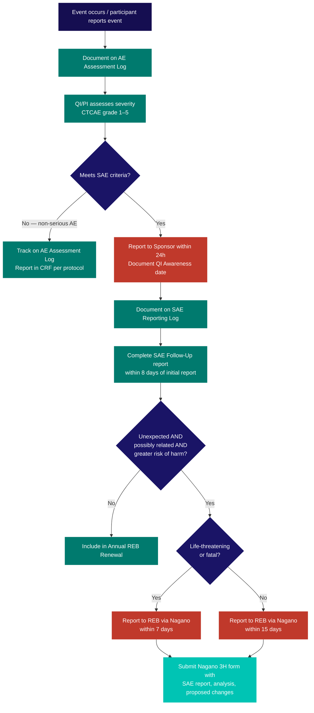

  

    <Badge color="gray">SOP-CR-012_08</Badge>
    <Badge color="gray">Version 08</Badge>
    <Badge color="green">Effective 19 Jun 2023</Badge>
    <Badge color="blue">Levels I–IV</Badge>
  

  <button className="ri-print-btn" onClick={() => window.print()}>Print / Save PDF</button>

Reviewed by Dr. Louise Pilote, Director of Clinical Research, RI-MUHC.
Approved by Gilbert Tordjman, Chief Operating and Development Officer, RI-MUHC.
Signed copy on file — download the PDF for the approved version with signatures.

---

## 1 · Purpose {#purpose}
This SOP describes the process for assessing, documenting, and reporting adverse events (AEs), serious adverse events (SAEs), and Suspected Unexpected Serious Adverse Reactions (SUSARs) in clinical research studies at the RI-MUHC/MUHC, in compliance with ICH-<Tooltip tip="International standard for design, conduct, monitoring, recording, and reporting of clinical studies." headline="Good Clinical Practice (GCP)" cta="Full definition" href="/kb/glossary#gcp">GCP</Tooltip>, Health Canada regulations, and <Tooltip tip="The ethics committee that reviews and approves research involving human participants. Also called CER at French-language institutions." headline="Research Ethics Board (REB)" cta="Full definition" href="/kb/glossary#reb">REB</Tooltip> requirements.

---

## 2 · Scope {#scope}
This SOP applies to all clinical research studies at the RI-MUHC involving investigational products, as well as studies without investigational products. For medical device incidents, refer to the Health Canada mandatory reporting requirements. This SOP should be read in conjunction with [SOP-CR-026](/sops/cr-026) for ongoing REB reporting of deviations and reportable events.

---

## 3 · Responsibilities {#responsibilities}
The **Sponsor or Sponsor-Investigator** is responsible for collecting all AEs and SAEs, expediting reporting of SAEs to regulatory authorities (Health Canada, FDA, EMA), and informing all involved investigators of all SUSARs.

The **<Tooltip tip="The physician responsible to the sponsor for the conduct of a clinical trial at the site. One QI per study per Canadian site." headline="Qualified Investigator (QI)" cta="Full definition" href="/kb/glossary#qi">Qualified Investigator</Tooltip> (QI)/<Tooltip tip="US equivalent of the Canadian Qualified Investigator (QI)." headline="Principal Investigator (PI)" cta="Full definition" href="/kb/glossary#pi">Principal Investigator</Tooltip> (PI)** is responsible for assessing all AEs and ensuring that local <Tooltip tip="Any untoward medical occurrence in a participant, whether or not related to the investigational product." headline="Adverse Event (AE)" cta="Full definition" href="/kb/glossary#ae">AE</Tooltip>, <Tooltip tip="An adverse event meeting seriousness criteria: death, life-threatening, hospitalization, disability, or congenital anomaly." headline="Serious Adverse Event (SAE)" cta="Full definition" href="/kb/glossary#sae">SAE</Tooltip>, and external <Tooltip tip="Suspected Unexpected Serious Adverse Reaction — unexpected in nature, severity, or frequency; must be reported to Health Canada and the REB." headline="SUSAR" cta="Full definition" href="/kb/glossary#susar">SUSAR</Tooltip> reporting meets all applicable regulatory, ICH-GCP, Sponsor, REB, and local requirements.

Unless otherwise indicated, any or all parts may be delegated to appropriately trained site personnel, but remain the ultimate responsibility of the Sponsor-Investigator and/or QI/PI.

---

## AE/SAE decision flowchart {#ae-sae-decision-flowchart}

---

## 4 · Definitions {#definitions}

| Term | Definition |
|---|---|
| **SAE Site Awareness Date** | The date that the QI/PI or any delegated research team members become aware of the serious adverse event. |

See [Glossary of Terms](/kb/glossary) for all other term definitions.

---

## 5 · Procedure {#procedure}
### 5.1 General requirements

**5.1.1** Ensure all study investigators who will be assessing AEs, SAEs, and SUSARs hold RI-MUHC Privileges. → [SOP-CR-500](/sops/cr-500)

**5.1.2** Ensure all investigators and team members obtain the appropriate level of institutional training on GCP, Health Canada Division 5 (where applicable), and SOPs. → [SOP-CR-003](/sops/cr-003)

**5.1.3** Delegate safety reporting tasks appropriately on the <Tooltip tip="Lists each team member, their qualifications, and specific trial tasks authorized by the QI." headline="Task Delegation Log (TDL)" cta="Full definition" href="/kb/glossary#tdl">Task Delegation Log</Tooltip>: QI/PI and Sub-Investigators (MDs) are delegated AE/SAE assessment and SUSAR review; CRCs and nurses are delegated AE/SAE/SUSAR collection and reporting.

**5.1.4** Educate participants about AEs, adverse drug reactions (ADRs), SAEs, and the importance of reporting any event — whether believed to be related to <Tooltip tip="A drug, medical device, or natural health product being tested or used as a reference in a clinical trial." headline="Investigational Product (IP)" cta="Full definition" href="/kb/glossary#ip">IP</Tooltip> or not — to the site as soon as possible (via email, at study visits, or during telephone/virtual contact). All AE discussions must be documented; all AEs must be recorded on the AE Assessment Log.

**5.1.5** For participants who are not competent or are minors (under 18 years), collect all AE/SAE data from the legal representative.

**5.1.6** Team members should discuss all AEs/SAEs with the QI/PI and obtain assessment on the AE Assessment Log on the same day or within 5 days of receipt, and document the discussion in the <Tooltip tip="The QI's collection of documentation demonstrating compliance, study integrity, and participant safety." headline="Investigator Site File (ISF)" cta="Full definition" href="/kb/glossary#isf">ISF</Tooltip>.

**5.1.7** AEs include all events related and not related to the investigational product. Non-related AEs are not considered ADRs and are not reportable to the REB or regulatory authorities; however, all AEs must be assessed and captured in source documents and CRFs as described in the protocol.

**5.1.8** Abnormal laboratory or test results must be reported to the QI/PI on the same day or within 5 days for assessment. The QI/PI must indicate abnormalities as clinically significant (c.s.) or not clinically significant (n.c.s.) and initial and date results promptly.

**5.1.9** Ensure the protocol outlines recording and reporting requirements for AEs, SAEs, reportable SAEs, reportable medically important events, and SUSARs.

**5.1.10** For post-marketing (Phase IV) studies or studies involving a marketed product: report to the Sponsor/Market Authorization Holder (MAH) as per the Health Canada guidance on reporting adverse reactions to marketed health products (effective 23-May-2018).

### 5.2 Documenting AEs in source documents for QI/PI assessment

**5.2.1** Throughout the clinical trial, all AE details must be collected at each study visit/telephone/virtual contact and reported in clinical notes and on the AE Assessment Log, from the time of the participant's <Tooltip tip="The written document providing the participant with information essential to making an informed decision. Both parties must sign." headline="Informed Consent Form (ICF)" cta="Full definition" href="/kb/glossary#icf">ICF</Tooltip> signature date to end of study as per the REB-approved protocol.

**5.2.2** All AEs must be reported to the QI/PI for documented assessment on the AE Assessment Log.

**5.2.3** Any change from the Medical History Events Log (→ [SOP-CR-014](/sops/cr-014), Appendix 2) must be captured on the AE Assessment Log.

**5.2.4** The QI/PI must assess each event using CTCAE severity grades:

| Grade | Description |
|---|---|
| 1 | Mild — asymptomatic or mild symptoms; clinical/diagnostic observations only; no intervention indicated |
| 2 | Moderate — minimal, local or non-invasive intervention indicated; limits age-appropriate ADLs |
| 3 | Severe or medically significant but not immediately life-threatening; hospitalization indicated; limits self-care/ADLs |
| 4 | Life-threatening; urgent intervention indicated |
| 5 | Death related to AE |

**5.2.5** The QI/PI must assess relationship to (A) IP(s)/study procedure individually, or (B) study procedures overall: 1 — Not Related; 2 — Unlikely Related; 3 — Possibly Related; 4 — Definitely Related. Part of Health Canada reporting criteria is that the AE be at least possibly related to the IP; REB reporting criteria include relatedness to the study as a whole.

**5.2.6** The QI/PI must assess seriousness using Health Canada criteria. If any one criterion is met, the AE is upgraded to an SAE:

1. Hospitalization or prolonged hospitalization
2. Congenital malformation
3. Persistent or significant disability or incapacity
4. Life-threatening or death
5. Medically important event as per the REB-approved protocol

**5.2.7** Additional elements to document: AE description, date started, date of change (resolved, improved, or worsened), action taken with study drug/procedure, and outcome. Action taken and outcome should correlate with the Concomitant Medication Log dates (→ [SOP-CR-014](/sops/cr-014), Appendix 4).

**5.2.8** The <Tooltip tip="The team member who handles day-to-day administration and coordination of the clinical trial." headline="Clinical Research Coordinator (CRC)" cta="Full definition" href="/kb/glossary#crc">CRC</Tooltip> who completed the AE Assessment Log and the QI/PI providing medical oversight must both initial and date the log.

**5.2.9** The CRC must report any AE grade change to SAE (e.g. hospitalization) on the AE Assessment Log, report to the QI/PI, and document the QI Awareness date in source and on the SAE Reporting Log.

**5.2.10** If no sponsor-provided AE Assessment Log template exists, use the RI-MUHC AE Assessment Log template (Appendix 1).

### 5.3 Documenting SAEs in source documents and report tracking

**5.3.1** Any AE meeting SAE criteria on the AE Assessment Log must be reported to the Sponsor within 24 hours of the QI/PI Awareness date.

**5.3.2** Document the SAE on the SAE Reporting Log (Appendix 2). All supporting documentation must be filed.

**5.3.3** The SAE Reporting Log documents: QI/PI Awareness date; SAE Report and Reporting date (initial and follow-up); REB criteria met; REB submission date; and (for Sponsor-Investigators) Health Canada reporting column.

**5.3.4** The expectedness of the event (per protocol, <Tooltip tip="Compilation of clinical and nonclinical data on the investigational product relevant to the study." headline="Investigator's Brochure (IB)" cta="Full definition" href="/kb/glossary#ib">IB</Tooltip>, or product monograph) is required to determine if the SAE is reportable to the REB and Health Canada.

**5.3.5** A column may be added to track SAE reporting to the <Tooltip tip="Independent committee that reviews interim safety and efficacy data and recommends whether to continue, modify, or stop the study." headline="Data Safety Monitoring Board (DSMB)" cta="Full definition" href="/kb/glossary#dsmb">DSMB</Tooltip> per the DSMB charter, if applicable.

### 5.4 Reporting all SAEs to the Sponsor within 24 hours

**5.4.1** All SAEs must be reported to the Sponsor or Sponsor-Investigator within 24 hours of the QI/PI Awareness date using the appropriate forms (even if only partially complete). Follow up with additional information as soon as available. A complete SAE Follow-Up report must be sent within 8 calendar days of the initial report.

**5.4.2** Ensure the SAE is on the AE Assessment Log with QI/PI Awareness date, assessment of expectedness, and initial reporting date documented.

**5.4.3** Most Sponsors provide an SAE reporting form to be filled out, signed by the QI/PI, and emailed or faxed to the Sponsor's pharmacovigilance team. For electronic reporting, use the RI-MUHC SAE Report template (Appendix 4) first, then transcribe into the Sponsor's eCRF. Print and file proof of SAE reporting with date of Sponsor receipt in the ISF.

**5.4.4** If the QI/PI determines it necessary to break the blinding code for participant safety, document the need and communicate to the Sponsor. Refer to the protocol for the unblinding procedure.

**5.4.5** If a participant becomes pregnant, collect and follow prospective and retrospective Exposure in Utero (EIU) reports, including outcome information. The absence of an AE does not preclude collection of this data.

**5.4.6** Document and retain all correspondence with the Sponsor's Medical Monitor in the ISF.

**5.4.7** If no Sponsor SAE Report form was provided, use the SAE Report Form template (Appendix 4).

### 5.5 Reporting unexpected, possibly related SAEs to the REB

**5.5.1** The QI/PI must report to the REB any local SAE that is simultaneously:
- **Unexpected** — in terms of nature, severity, or frequency given the REB-approved protocol, IB, or other relevant sources; and not associated with the expected natural progression of the participant's underlying condition; **AND**
- **Related or possibly related** — there is a reasonable possibility the event was caused by the IP or study procedures; **AND**
- **Suggests greater risk of harm** — physical, psychological, economic, or social harm — than was previously known.

**5.5.2** If the reportable SAE is life-threatening or fatal: report to the REB within **7 days** of the QI/PI Awareness date.

**5.5.3** If the reportable SAE is non-life-threatening or not fatal: report to the REB within **15 days** of the QI/PI Awareness date.

**5.5.4** Submit reportable SAEs via the <Tooltip tip="The RI-MUHC's electronic study submission and management platform. All studies requiring MUHC Authorization are submitted through Nagano." headline="Nagano (RI-MUHC)" cta="Full definition" href="/kb/glossary#nagano">Nagano</Tooltip> system using Form 3H (the 2021 Nagano SAE reporting form). Any SAE Report form must be uploaded and appended to the Nagano form.

**5.5.5** The Nagano 3H form must include: participant study number; description of the unexpected, at least possibly related SAE; previous similar safety reports (if available); analysis of the significance of the event; proposed research changes (protocol, IB, and/or ICF); a copy of the current SAE report sent to the Sponsor; and DSMB meeting information (if applicable).

**5.5.6** Update the REB as soon as additional information is available by appending Follow-Up SAE reports.

**5.5.7** SAEs not meeting the above criteria for expedited reporting should be submitted with the Annual Continuing REB Review.

**5.5.8** For studies reviewed by an external Quebec Multi-centrique REB, submit an SAE notification to the MUHC <Tooltip tip="Individual formally authorized to issue the final written authorization for each research project at a Quebec RSSS institution." headline="Personne mandatée (PFM)" cta="Full definition" href="/kb/glossary#personne-mandatee">personne mandatée</Tooltip> via Form 3H, as well as to the external reviewing REB via their designated form.

### 5.6 Sponsor-Investigator reporting of SUSARs to Health Canada and the DSMB

**5.6.1** The Sponsor or Sponsor-Investigator must comply with Health Canada requirements for expedited reporting of individual cases of unexpected serious adverse reactions (for which a causal relationship with the IP cannot be ruled out). "Seriousness," not "Severity," guides regulatory reporting obligations (e.g. a severe headache is not serious).

**5.6.2** Medical and scientific judgement should be used to determine if expedited reporting is justified for other important medical events that may not result in hospitalization, death, or immediate life-threat, but alter the risk-benefit assessment (e.g. lack of efficacy for a life-threatening disease; anaphylaxis requiring ER treatment; significant increase in frequency of an expected serious <Tooltip tip="A noxious, unintended response to a drug where a causal relationship is at least reasonably possible." headline="Adverse Drug Reaction (ADR)" cta="Full definition" href="/kb/glossary#adr">ADR</Tooltip>; major new animal safety data).

**5.6.3** Minimum information for a regulatory report: one identifiable patient, one identifiable reporter, at least one suspect medicinal product, and one event assessed as serious, unexpected, with a suspected relationship to the product.

**5.6.4** Prepare a CIOMS-I form (or MedWatch for US reports) for submission to national health authorities. Unblind unexpected and related SAE reports for expedited reporting purposes. → Appendix 5.

**5.6.5** Submit preliminary information on fatal and life-threatening reactions within **7 calendar days** following Sponsor/Sponsor-Investigator/CRO awareness (verbally if appropriate); complete written follow-up within another **8 calendar days**.

**5.6.6** Submit all other unexpected and related SAE reports (non-life-threatening, not fatal) within **15 calendar days**.

**5.6.7** For blinded studies, it is recommended to break the blind for the individual participant experiencing the expedited SADR, while maintaining the blind for biometrics personnel responsible for study analysis. For studies where serious or fatal outcomes are primary endpoints, unblinding could compromise study integrity — confirm approach with health authorities in advance.

**5.6.8** The Sponsor/Sponsor-Investigator must amend the IB to update safety information as required by regulations.

**5.6.9** Submit periodic, quarterly, or annual reports as per national regulations.

**5.6.10** For post-marketing studies, submit reports as per applicable national regulations.

**5.6.11** The Sponsor/Sponsor-Investigator must report all reportable SAEs to the DSMB per the DSMB charter, if applicable.

### 5.7 Sponsor or Sponsor-Investigator distribution of external SUSARs to QI/PIs

**5.7.1** The Sponsor or Sponsor-Investigator is responsible for distributing expedited external SAE reports (SUSARs) to each investigator of a multi-centre trial. Each investigator receives blinded serious adverse reaction reports.

**5.7.2** It is the QI/PI's responsibility to document their medical oversight of SUSARs.

**5.7.3** The QI/PI should establish a written procedure (e.g. a Working Instruction) for receiving and processing safety reports from the Sponsor.

### 5.8 QI/PI reporting of external SUSARs to the REB

**5.8.1** The QI/PI must report to the REB via Nagano any external SAE meeting all criteria in section 5.5.1 **plus** an additional criterion: **AND requires a change to the research** (amendment of protocol, IB, and/or ICF) and/or requires immediate notification to participants for safety reasons.

**5.8.2** The QI/PI must submit all qualifying SUSARs/summaries and follow-up information to the REB via Nagano within **15 days** of receipt/awareness. Retain all documentation in the ISF.

**5.8.3** Maintain all SUSAR reports and associated REB correspondence in the study files. → Appendix 3, External SUSAR Reporting Log.

### 5.9 AEs and SAEs in studies without investigational products

**5.9.1** For studies without an investigational product, the same procedures for collecting AE/SAE data, assessing, and reporting to the REB apply. Note: part of the REB reporting criterion is that the SAE be at least possibly related to the study (not necessarily to an IP).

**5.9.2** For investigational device trials, use the Mandatory Medical Device Problem Reporting form on the Health Canada website.

**5.9.3** For SAE submission in the Quebec MSSS Multi-centrique process, refer to the most recent MUHC REB information on the MUHC CAE website.

---

## Appendices {#appendices}
- Appendix 1 — AE Assessment Log template
- Appendix 2 — Local SAE Reporting Log template
- Appendix 3 — External SUSAR Reporting Log template
- Appendix 4 — SAE Report Form template
- Appendix 5 — Official Health Canada CIOMS Report Form
- Appendix 6 — SAE Process Flowchart

---

## References {#references}
- N2 Network SOP012_09
- ICH-GCP E6 R2
- Health Canada Food and Drug Regulations, Part C, Division 5
- Health Canada GUI-0100
- Health Canada Guidance — Clinical Safety Data Management: Definitions and Standards for Expedited Reporting (ICH Topic E2A), 1995
- Government of Canada, Natural Health Products Regulations, Part 4, SOR/2003-196
- Health Canada, Reporting Adverse Reactions to Marketed Health Products (March 2011)
- TCPS2 (2022)
- PIPEDA

---

<h2>Revision history</h2>

| Version | Date | Summary |
|---|---|---|
| SOP-CR-012_08 | 19 Jun 2023 | Merge of N2 v09 SOP and RI-MUHC Addendum. Standardization of nomenclature throughout. Scope: addition of reference to device reporting forms. Responsibilities: addition of Sponsor/Sponsor-Investigator responsibilities. General: addition of sections 5.1.1, 5.1.2, and note in 5.1.7. Additions of sections 5.2, 5.3, and 5.4. Additions of 5.5.4, 5.5.5, 5.6.2, 5.6.8, 5.6.10, and 5.7.2. New/revised Appendices 1–5. Reference to Health Canada GUI-0100 added. |
| SOP-CR-012_07 | 01 Sep 2018 | Addition/revisions to 1.1.1, 1.1.2, 1.1.3, 1.2.3, 1.3.2, 1.3.3, and 4.0. Renamed from SOP012_06. |
| SOP012_06 | 24 May 2016 | Combination of N2 SOP012_06 and RI-MUHC SOP-CR-008_EN04. Added reporting criterion for non-local SAEs: "AND requires a change to the research and/or ICF and/or requires immediate notification to participants for safety reasons." |
