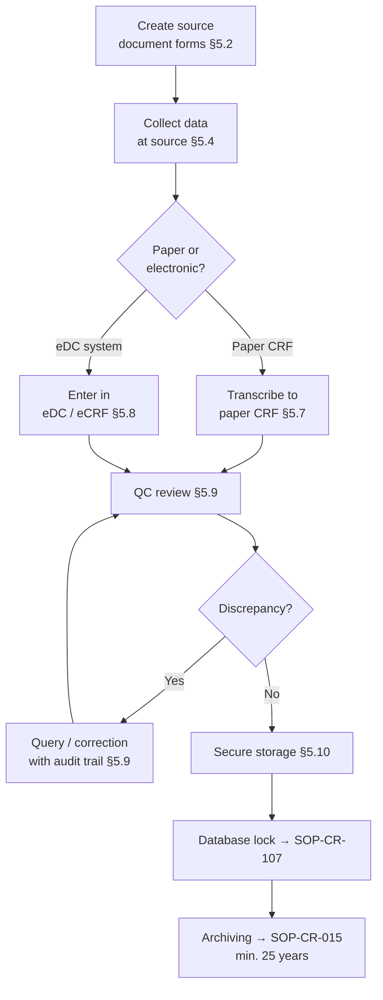

  

    <Badge color="gray">SOP-CR-014_08</Badge>
    <Badge color="gray">Version 08</Badge>
    <Badge color="green">Effective 01 May 2025</Badge>
    <Badge color="blue">All levels</Badge>
  

  <button className="ri-print-btn" onClick={() => window.print()}>Print / Save PDF</button>

Reviewed by Dr. Louise Pilote, Director of Clinical Research, RI-MUHC.
Approved by Gilbert Tordjman, Chief Operating and Development Officer, RI-MUHC.
Signed copy on file — download the PDF for the approved version with signatures.

---

<Warning>
**Controlled document.** Always refer to this page for the current version. Do not rely on downloaded or printed copies. Reading this page does not fulfil the SOP training requirement — use the SOP Reader on TalentLMS.
</Warning>

## Key points

- The <Tooltip tip="The physician responsible to the sponsor for the conduct of a clinical trial at the site. One QI per study per Canadian site." headline="Qualified Investigator (QI)" cta="Full definition" href="/kb/foundations/glossary#qi">QI</Tooltip>/PI must create visit-specific source document worksheets for every study visit, capturing all data required by the protocol. Every source form must include a standardized header and footer (protocol number, QI/PI name, visit type, visit date, participant number, and QC information).
- All data must follow **ALCOA+ principles**: Attributable, Legible, Contemporaneous, Original, Accurate, Complete, Consistent, Enduring, and Available. Never backdate entries; use "late entry" notation with explanation, initials, and date for data recorded after the visit.
- Corrections must never obscure original entries — draw a single line through incorrect data, initial, date, and explain. Never use liquid corrector, scribble, blackout, or overwrite.
- Participant nominative information (name, MRN) must never be shared with the external Sponsor. De-identify all source documents using study identification codes. Two team members should be involved: one to de-identify, one to QC.
- The RI-MUHC supports **REDCap** for investigator-initiated eCRFs of low to moderate complexity (ideally ≤1000 variables). REDCap is not fit for use as an electronic <Tooltip tip="The written document providing the participant with information essential to making an informed decision. Both parties must sign." headline="Informed Consent Form (ICF)" cta="Full definition" href="/kb/foundations/glossary#icf">ICF</Tooltip>.
- Electronic source data documents must be printed, signed, and dated by the QI/PI to confirm content, unless obtained from the Sponsor's validated equipment with direct upload.
- Retain all essential documents for a minimum of **15 years** for Health Canada-regulated studies, or **7 years from publication date** for non-regulated studies. All tracking systems for data modifications must remain accessible for monitors, auditors, and regulatory inspectors.
- QI/PI must initial and date all test results (indicating c.s. or n.c.s.) and all documents requiring medical oversight. Thermal paper test results (e.g. ECGs) must be photocopied promptly; both copies are initialled and dated by the QI/PI.

## 1 · Purpose {#purpose}

This Standard Operating Procedure (SOP) describes the creation of protocol
visit-specific source document forms and logs, quality control (by site and
Sponsor) and management of clinical study data at the Investigator’s/Sponsor-
Investigator’s site, whether paper or electronic, to ensure that the data collection
and data transcription follows the REB-approved study documents as well as
GCP, the ALCOA Plus principles, Health Canada regulations and 21 CFR Part
11 for electronic records (referenced in Health Canada GUI 0100).

---

## 2 · Scope {#scope}

This procedure concerns the research community (employees, investigators,
physicians, management, consultants, students, volunteers or other persons)
involved in collection and management of human research data obtained from
human participants at the MUHC/RI-MUHC.

---

## 3 · Responsibilities {#responsibilities}

The **Sponsor-Investigator or <Tooltip tip="The physician responsible to the sponsor for the conduct of a clinical trial at the site. One QI per study per Canadian site." headline="Qualified Investigator (QI)" cta="Full definition" href="/kb/foundations/glossary#qi">QI</Tooltip>/PI** is responsible for ensuring that clinical data management activities at the site meet all applicable Health Canada regulatory, ICH-GCP E6/ISO 14155 GCP, Sponsor, and local requirements.

The **Sponsor/Sponsor-Investigator** is responsible for conducting quality control to ensure all data required by the REB-approved protocol is recorded in source documents using Good Documentation Practices (GDPs), and conducting source data verification to ensure <Tooltip tip="Document designed to record all protocol-required information to be reported to the sponsor for each participant." headline="Case Report Form (CRF)" cta="Full definition" href="/kb/foundations/glossary#crf">CRF</Tooltip> data accurately reflects source documents. → [SOP-CR-013](/sops/cr-013)

The **QI/PI** is responsible for ensuring study source document forms are created to capture all protocol-required data using GDPs, and for ensuring data is accurately and securely transcribed into CRFs.

Per ICH-GCP (for drug studies), all parts may be delegated to appropriately trained team members but remain the QI/PI's ultimate responsibility. Per ISO-GCP (for medical device studies), responsibility is delegated with tasks.

---

## 4 · Definitions {#definitions}

See [Glossary of Terms](/kb/foundations/glossary) for all term definitions.

---

## 5 · Procedure {#procedure}

### 5.1 General considerations

**5.1.1** Prepare a study-specific <Tooltip tip="The QI's collection of documentation demonstrating compliance, study integrity, and participant safety." headline="Investigator Site File (ISF)" cta="Full definition" href="/kb/foundations/glossary#isf">Investigator Site File</Tooltip> (ISF) per [SOP-CR-015](/sops/cr-015) and store all essential documents in the ISF in a timely, ongoing fashion throughout the study.

**5.1.2** Ensure all team members delegated clinical data management tasks have valid institutional training (→ [SOP-CR-003](/sops/cr-003)) and have been trained on study documents, source document forms, and CRFs before signing the <Tooltip tip="Lists each team member, their qualifications, and specific trial tasks authorized by the QI." headline="Task Delegation Log (TDL)" cta="Full definition" href="/kb/foundations/glossary#tdl">Task Delegation Log</Tooltip>.

**5.1.3** Establish and maintain appropriate authorizations for access to human research data. For blinded studies, ensure that blinded team members never see unblinded data.

**5.1.4** Ensure the integrity and tracking of all human research data through procedures for collecting, capturing, controlling, verifying, correcting, and processing data (maintaining blinding where applicable — e.g. use separate source data forms for unblinded team members).

**5.1.5** Protect and secure study participant data and Sponsor proprietary information. Never share nominative participant information with the external Sponsor (note: sharing with the Sponsor's monitor who has signed an MUHC confidentiality agreement is expected). Keep data in a locked area protected from fire or water damage. Ensure electronic data is filed in a validated system compliant with 21 CFR Part 11 per [SOP-CR-015](/sops/cr-015); otherwise use paper.

### 5.2 Creation of visit-specific source document forms and logs

**5.2.1** Source documents are the first place study data is recorded and must be retained at the site in original state (paper or validated electronic system compliant with 21 CFR Part 11).

**5.2.2** Although some Sponsors may provide source logs, the site must create visit worksheets to capture all data required per protocol visit, and any additional data the QI/PI deems necessary for participant safety. Design paginated worksheets specific to complete protocol visits (e.g. Screening Visit forms p.1–10, Visit 1 forms p.1–7). Every source form must include the following in the header and footer:
- Protocol number
- QI/PI name
- Visit type (e.g. Screening/End of Study) and/or visit number
- Visit date
- Participant number and initials
- Site number (if applicable)
- Name and date of person who QC'd the blank form
- Name and date of person completing the form

**5.2.3** Only source data (first-time recorded) should be entered into visit-specific worksheets. Track all other source data (lab reports, ECG, imaging, concomitant medications, AEs) in a separate checklist or procedure-specific check built into the worksheet. Attach or file supporting source documents (e.g. OACIS printouts). If data must be obtained from another department or hospital, obtain original documents or certified copies.

**5.2.4** Source document worksheets should have documented QC (include the QC'd person in the footer). A manager, supervisor, or staff member independent from the study should ideally QC the blank worksheet prior to use, and QC again after source data is recorded to ensure GDPs.

**5.2.5** Create a Training Log (→ [SOP-CR-003](/sops/cr-003)) and Task Delegation Log (→ [SOP-CR-002](/sops/cr-002)) as the first logs in the ISF. All other essential document logs are listed in [SOP-CR-015](/sops/cr-015).

**5.2.6** Create an Informed Consent Process checklist per [SOP-CR-008](/sops/cr-008) to document compliance of the consent process for each participant and each <Tooltip tip="The written document providing the participant with information essential to making an informed decision. Both parties must sign." headline="Informed Consent Form (ICF)" cta="Full definition" href="/kb/foundations/glossary#icf">ICF</Tooltip> version signed.

**5.2.7** Create and maintain the following participant-specific GCP-required logs (→ [SOP-CR-009](/sops/cr-009)):
- **Screening Log** — all screened participants by sequential screening number, ICF signature dates, and screen failure reasons
- **Enrollment Log** — all enrolled participants by enrollment number, tracking all study visit dates
- **Participant Identification Code List** — confidential; the only log with nominative information; never shared with the Sponsor; used for emergency contact only

**5.2.8** Create additional study conduct tools:
- **<Tooltip tip="A drug, medical device, or natural health product being tested or used as a reference in a clinical trial." headline="Investigational Product (IP)" cta="Full definition" href="/kb/foundations/glossary#ip">IP</Tooltip> wallet cards** (REB-approved) for participants on IP studies → [SOP-CR-008](/sops/cr-008)
- **Medical History Events Log** (Appendix 2) — medical events prior to/ongoing at ICF signature
- **Medical History Medication Log** (Appendix 3) — relevant medications prior to consent; tracks washout periods (optional, for protocols requiring washout)
- **<Tooltip tip="Any untoward medical occurrence in a participant, whether or not related to the investigational product." headline="Adverse Event (AE)" cta="Full definition" href="/kb/foundations/glossary#ae">AE</Tooltip> Assessment Log** (→ [SOP-CR-012](/sops/cr-012)) — all AEs from ICF date to end of study; changes from AE to <Tooltip tip="An adverse event meeting seriousness criteria: death, life-threatening, hospitalization, disability, or congenital anomaly." headline="Serious Adverse Event (SAE)" cta="Full definition" href="/kb/foundations/glossary#sae">SAE</Tooltip> documented here and on the SAE Reporting Log
- **Local SAE Reporting Log** (→ [SOP-CR-012](/sops/cr-012)) — QI/PI SAE awareness date, report date, REB and Health Canada reporting criteria
- **External <Tooltip tip="Suspected Unexpected Serious Adverse Reaction — unexpected in nature, severity, or frequency; must be reported to Health Canada and the REB." headline="SUSAR" cta="Full definition" href="/kb/foundations/glossary#susar">SUSAR</Tooltip> Reporting Log** (→ [SOP-CR-012](/sops/cr-012)) — SUSAR receipt date, REB reporting criteria and date
- **Concomitant Medication Log** (Appendix 4) — all treatments (other than IP); must be consistent with the AE Assessment Log for required medication dates and outcomes
- **Human Sample Collection, Processing and Shipping Log** (if applicable) → [SOP-CR-011](/sops/cr-011)
- **Protocol/GCP/SOP Deviation Log** and <Tooltip tip="Actions taken to resolve a compliance issue and prevent recurrence: identify, correct, prevent." headline="Corrective and Preventive Action (CAPA)" cta="Full definition" href="/kb/foundations/glossary#capa">CAPA</Tooltip> form(s) for major/critical deviations → [SOP-CR-026](/sops/cr-026)
- **Monitoring Visit Log** (if applicable) → [SOP-CR-013](/sops/cr-013)

Other available logs: Telephone/VC Contact Log, Temperature Log, Confirmation and End of Participation forms.

All source document templates are available in Word format on the RI Portal (Clinical Research SOP Appendix section) for building the ISF or <Tooltip tip="The sponsor's collection of documentation demonstrating compliance across all study sites." headline="Trial Master File (TMF)" cta="Full definition" href="/kb/foundations/glossary#tmf">TMF</Tooltip> per [SOP-CR-015](/sops/cr-015). The MUHC Research Pharmacy maintains its own IP accountability logs → [SOP-CR-010](/sops/cr-010). For medical device accountability → [SOP-CR-024](/sops/cr-024).

### 5.3 Confidentiality and direct access to clinical data

**5.3.1** Participants authorize access to their data through informed consent, expecting all information to be kept confidential by the Sponsor, QI/PI, authorized representatives, auditors, and regulatory inspectors.

**5.3.2** Conduct data management respecting privacy and confidentiality per Quebec <Tooltip tip="Quebec's Act respecting health and social services information (key provisions July 2024). Governs researcher access to health data through RSSS institutions." headline="Law 5 / Loi 5" cta="Full definition" href="/kb/foundations/glossary#law-5">Law 5</Tooltip>, TCPS2, RI-MUHC institutional policies, the confidentiality agreement, and the Clinical Study Agreement.

**5.3.3** Protect participant privacy and confidentiality:
- Ensure the Task Delegation Log identifies those authorized to access, record, or correct source data
- Participant ID Log and signed ICFs must never be shared with the external Sponsor
- Identify participant source data by unambiguous study identification codes (Screening and Enrollment numbers); best practice is to print and de-identify source data by blacking out nominative information (China marker) and replacing with study number — two team members involved (one de-identifies, one QCs)
- Collect data only for the REB-approved study
- Ensure validated electronic devices used for study purposes contain no nominative participant information
- Do not allow identifying information to leave the institution unless REB-approved and in accordance with institutional policies

**5.3.4** → [SOP-CR-019](/sops/cr-019) for additional confidentiality and privacy requirements.

### 5.4 Source data collection

**5.4.1** Do not collect any study-specific data until all required approvals have been obtained (Health Canada if applicable, REB, <Tooltip tip="Institutional authorization allowing a study to proceed at the RI-MUHC. Issued after ethics approval and feasibility review." headline="MUHC Authorization" cta="Full definition" href="/kb/foundations/glossary#muhc-auth">MUHC Authorization</Tooltip>, and Sponsor's Go Letter) and the participant has provided informed consent (or REB has provided a waiver of consent).

**5.4.2** Record, process, and store all study information following ALCOA+ principles: **A**ttributable, **L**egible, **C**ontemporaneous, **O**riginal, **A**ccurate, **C**omplete, **C**onsistent, **E**nduring, **A**vailable.

**5.4.3** Use unambiguous identification codes for confidential participant identifiers on all study source forms and logs.

**5.4.4** Collect source data using Good Documentation Practices (GDPs) per section 5.6 and in the procedure timelines and sequence required by the REB-approved protocol.

**5.4.5** Test results:
- Thermal paper results (e.g. ECG) must be photocopied promptly; both the thermal copy and photocopy are initialled and dated by the QI/PI. Note: thermal paper degrades faster than a photocopy.
- Any abnormal test result must be assessed promptly by the QI/PI indicating clinical significance as "n.c.s." or "c.s.", initialling and dating each entry. If the QI/PI consistently reviews results online and subsequently initials printed results, a Work Instruction (WI) must document this process (subsequent documentation ideally within 14 days). For isolated cases, a Note to File can explain late medical oversight.

**5.4.6** Per Health Canada GUI-0100, any source document (created by the <Tooltip tip="The team member who handles day-to-day administration and coordination of the clinical trial." headline="Clinical Research Coordinator (CRC)" cta="Full definition" href="/kb/foundations/glossary#crc">CRC</Tooltip> or printed from OACIS) must be signed and dated by the person collecting, recording, reviewing, and/or assessing the information to ensure traceability.

### 5.5 Case Report Forms

**5.5.1** Case Report Forms (CRFs) are printed, optical, or electronic documents designed to collect protocol-defined data transcribed from source documents. Only data defined in the REB-approved protocol should be entered into the CRF.

**5.5.2** CRFs (paper or electronic) are created by the Sponsor/Sponsor-Investigator, completed by the CRC (transcribing de-identified source data), and shared with the Sponsor/Sponsor-Investigator. → [SOP-CR-100](/sops/cr-100) for CRF design (Sponsor-Investigators). The Sponsor/Sponsor-Investigator must create a CRF Data Entry Manual/guideline for sites.

**5.5.3** Ensure appropriate team members are trained on the CRF/eCRF, with training documented (<Tooltip tip="Monitoring visit to train the site team on the protocol and confirm site readiness, after REB approval and MUHC Authorization." headline="Site Initiation Visit (SIV)" cta="Full definition" href="/kb/foundations/glossary#siv">SIV</Tooltip> training log, self-training, or other) and the task delegated on the Task Delegation Log.

### 5.6 Good Documentation Practices (GDPs)

**5.6.1** Observe the following data entry practices on source document forms and CRFs:

- No data can ever be discarded. If a document was replaced or is no longer used, mark as "Superseded" or "Obsolete" with initials, date, and a diagonal line.
- Use permanent black or blue ink; entries must remain legible for up to 15 years.
- Enter data sequentially with no empty spaces.
- Initial and date all entries (authorized persons on the Task Delegation Log only).
- Include both data collection and data entry dates for data obtained after a visit (late data). Never backdate. Do not insert late data between existing lines or in the margin — record following other entries with the notation "late entry," explanation, initials, and date.
- If data is entered by several team members, each person signs and dates their entry.
- Clearly report missing elements; document the source of retrieved information in a footnote with initials and date. If an entire paper record is missing, write a Note to File (NTF) → Appendix 1.
- Blank fields must be marked "Not Applicable" (N/Ap), "Not Available" (N/Av), or "Unknown" with explanation, initials, and date.
- No information may be voided without supporting documentation. Draw a single line through voided information, mark as "VOID," explain, sign, and date.
- Direct entries into eCRFs are source data; ensure eCRF software is validated and 21 CFR Part 11 compliant; ensure the protocol describes these direct entries and the protocol has been REB-approved.

**5.6.2** Make corrections to source data and CRF data as follows:
- Ensure changes are traceable. Do not obscure initial entries. Do not use liquid corrector or correcting material. Do not scribble, blackout, or overwrite.
- Draw a single line through incorrect data without obscuring the original; initial, date, and explain. Changes must be made by the person who made the initial entry, or others authorized on the Task Delegation Log.
- When space is limited for proper explanation, write a NTF (Appendix 1) and file with the source document or NTF section of essential documents.
- Any correction must include a clear justification.
- When a copy replaces an original document, mark the copy "True and Exact Copy," initial and date; attach the original (never destroy source documents).
- Best practice: the QI/PI signs and dates the CRF only after the correction process is complete and before monitor retrieval of paper CRFs. After retrieval, corrections are captured on a Data Clarification Form (DCF) provided by the Sponsor/Sponsor-Investigator.

### 5.7 Transcription of source data to paper CRFs

**5.7.1** Only authorized persons on the Task Delegation Log may transcribe data from source documents to CRFs.

**5.7.2** Ensure source data is documented and on file for all protocol-required data before transcription.

**5.7.3** Transcribe data into the CRF as soon as possible after collection, using GDPs.

**5.7.4** De-identify test results, specimens, or reports that accompany CRF data: black out nominative information and identify participants by study identification code only (unless specifically required/permitted and REB-approved). De-identify all source documents prior to archiving (best done on an ongoing basis). Do not keep copies of clinical records, consents, printouts, discharge summaries, or any identifiable clinical reports in CRF files.

**5.7.5** Ensure CRF entries contain only protocol-defined data.

**5.7.6** The QI/PI should sign and date the CRF where indicated, after the final entry. If the CRF is revised after QI/PI sign-off, the QI/PI should sign again.

**5.7.7** Complete and review CRFs on a timely basis, respecting the Sponsor's timelines.

### 5.8 Electronic data capture systems / electronic CRFs

**5.8.1** Sponsors and Sponsor-Investigators must validate any EDC system for reliability, precision, performance, and 21 CFR Part 11 compliance. For MUHC Sponsor-Investigators, the RI-MUHC supports **REDCap** for investigator-initiated eCRFs of low to moderate complexity (ideally ≤1000 variables). REDCap is not fit for use as an electronic ICF (it only allows one signature per form). Source data must be filed separately from the eCRF.

**5.8.2** Ensure authorized staff obtain documented EDC system training as required by the protocol. Retain CRF guidelines and training records with essential study documents.

**5.8.3** Permit EDC access only to authorized persons with authenticated identification and Task Delegation Log delegation. Ensure protection, detection, and correction measures are in place (secure electronic signature with audit trail).

**5.8.4** Ensure clinical data transfer to another system (e.g. SAS, if required by protocol) is validated and secure.

**5.8.5** Electronic source data documents must be printed, signed, and dated by the QI/PI to confirm content (unless obtained from the Sponsor's validated equipment/labs with direct upload into the Sponsor's validated eCRF). File with other study source documents.

**5.8.6** If the protocol requires direct entry of source data into an eCRF, this must first be REB-approved. Employ a track-change system for the duration of document storage per applicable regulations (15 years for Health Canada-regulated; 7 years from publication for non-regulated).

**5.8.7** Retain the original or certified copy of the electronic data backup and audit trail.

### 5.9 Quality control and modifications to clinical data

**5.9.1** Best practice: conduct site QC of source data prior to CRF/eCRF transcription. After transcription, conduct QC to capture/clarify missed deviations, transcription errors, omissions, or ambiguities. Per [SOP-CR-026](/sops/cr-026), major or critical deviations must be detailed on the CAPA form; all deviations recorded on the Protocol/GCP/SOP Deviation Log. The site must not rely solely on the Sponsor for QC.

**5.9.2** The Sponsor/Sponsor-Investigator should establish QC systems (monitoring, eCRF entry specifications) to ensure consistency across all participating sites.

**5.9.3** Apply QC to each stage of data handling to ensure reliability, source document verifiability, and correct processing (ICH-GCP 5.1.3).

**5.9.4–5.9.5** Apply quality controls for coherence within the CRF after data capture; for paper or electronic systems, establish interactive QC (single or double entry) to decrease data capture errors.

**5.9.6** The control, verification, and correction process must allow comparison with source data and indicate who, when, and why modifications were made. Delegation to the persons making modifications must be documented on the Task Delegation Log (→ [SOP-CR-002](/sops/cr-002)).

**5.9.7** Receive data modification requests from the Sponsor's Monitor, CRO, or team members on a Data Clarification Form (DCF) or equivalent (print emails and file with source data). Justify and document all required modifications to the CRF. Review and sign the DCF. Return the original to the Sponsor/Sponsor-Investigator; retain a copy in the ISF.

**5.9.8** Retain all data modification tracking systems for a minimum of **15 years** for Health Canada-regulated studies, or **7 years from publication date** for non-regulated studies. Ensure accessibility for monitors, auditors, and regulatory inspectors.

### 5.10 Clinical data storage

**5.10.1** Store clinical study information to permit preparation of complete, accurate reports, as well as their interpretation and verification.

**5.10.2** Per [SOP-CR-015](/sops/cr-015), retain all essential study documents for a minimum of 15 years (Health Canada-regulated) or 7 years from publication date (non-regulated).

**5.10.3** Clearly identify source documents (including medical/hospital chart documents), CRFs, and other essential documents for archiving. Ensure nominative participant information is redacted before archiving.

**5.10.4** Protect all paper and/or electronic data from deterioration, accidental damage, or destruction for the full retention period. The RI-MUHC can open an account at Iron Mountain (→ [SOP-CR-015](/sops/cr-015)).

**5.10.5** Store completed CRFs separate from participant identifying information in a secure area accessible only to study personnel.

**5.10.6** Ensure all essential documents are accessible and audit/inspection-ready. Regulatory inspectors (Health Canada, FDA) or funding agencies may require access without notice. → [SOP-CR-017](/sops/cr-017).

---

## Appendices {#appendices}

<Info>
Printable appendix templates are available for download below where linked. For the complete collection, see [SOP Appendices and Templates](/sops/appendices).
</Info>

- [Appendix 1 — Note to File Template](https://portal.rimuhc.ca/pls/apex/MUHC2.download_my_file?p_file=249504742714731935) (complete electronically or manually)
- [Appendix 2 — Medical History Events Log](https://portal.rimuhc.ca/pls/apex/MUHC2.download_my_file?p_file=249506134524766068)
- [Appendix 3 — Medical History Medication Log](https://portal.rimuhc.ca/pls/apex/MUHC2.download_my_file?p_file=249507045033815956)
- [Appendix 4 — Concomitant Medication Log](https://portal.rimuhc.ca/pls/apex/MUHC2.download_my_file?p_file=249507109142831750)

---

## References {#references}

- N2 Network SOP014_10
- ICH-GCP E6 R2 and draft R3
- ICH-GCP E8
- ISO 14155:2020
- Health Canada, Good Clinical Practice: Consolidated Guideline (ICH Topic E6)
- Health Canada GUI-0100: Part C, Division 5
- TCPS2 (2022)
- Quebec Law 5 — Act respecting health and social services information
- US FDA 21 CFR Part 11 (Electronic Records; Electronic Signatures) — referenced by Health Canada GUI-0100

---

<h2>Revision history</h2>

| Version | Date | Summary |
|---|---|---|
| SOP-CR-014_08 | 01 May 2025 | Combination of N2 SOP014_10 and RI-MUHC SOP-CR-014_07 Addendum with clarifications. Addition/revision to 5.1.1, 5.1.3, 5.1.5, 5.2, 5.3.4, 5.4.2, 5.4.4, 5.4.5, 5.5, 5.6.1 (last point), 5.6.2 (3rd point), 5.7.4, 5.8.1, 5.9.1, and 5.10.3. Revision of Appendix 1; addition of Appendices 2, 3, and 4. Added Health Canada GUI-0100 and 21 CFR Part 11 to references. |
| SOP-CR-014_07 | 01 Sep 2018 | Section 1.1.3: specifying use of N/Ap and N/Av. Section 1.1.6: addition of justification requirement for corrections. Section 1.2.1: documentation of QC. Section 1.2.5: addition of Task Delegation Log requirement. Added Definitions section (4.0). Renamed from SOP014_06. |
| SOP014_06 | 24 May 2016 | Combination of N2 SOP014_06 and RI-MUHC SOP-CR-009_EN04. |
