  

    <Badge color="gray">SOP-CR-017_08</Badge>
    <Badge color="gray">Version 08</Badge>
    <Badge color="green">Effective 01 May 2025</Badge>
    <Badge color="blue">All levels</Badge>
  

  <button className="ri-print-btn" onClick={() => window.print()}>Print / Save PDF</button>

Reviewed by Dr. Louise Pilote, Director of Clinical Research, RI-MUHC.
Approved by Gilbert Tordjman, Chief Operating and Development Officer, RI-MUHC.
Signed copy on file — download the PDF for the approved version with signatures.

---

## 1 · Purpose {#purpose}

This Standard Operating Procedure (SOP) describes the processes to be
followed prior to, during, and following audits and regulatory inspections.

---

## 2 · Scope {#scope}

This procedure concerns the research community (employees, investigators,
sponsor-investigators, physicians, management, consultants, students,
volunteers or other persons) involved in the study conduct and/or preparing for,
hosting and responding to audits and regulatory inspections of a Health Canada
regulated clinical trial at the MUHC/RI-MUHC.

Regulated parties that may be subject to a clinical trial inspection by Health
Canada include the Sponsor/Sponsor-Investigator, the Qualified Investigator (QI)
and if applicable, a contract Clinical Research Organization (CRO) and/or Site
Management Organization (SMO).

Note that Health Canada regulations do not differentiate between a commercial
and a non-commercial sponsor (e.g., Sponsor-Investigator) and as such, all
ICH/ISO GCP Sponsor responsibilities apply.

Foreign clinical trials (e.g., regulated by the FDA or EMA) that are conducted in
Canada are also subject to Health Canada regulations.

Health Canada’s site selection for inspection is on a risk-based approach taking
into consideration many criteria and spans all levels of the regulatory process.

SOP-CR-017_08_Audits and Inspections
  Page 1 of 14

In preparation for a Health Canada Inspection, sponsors may conduct on site
audits.

The RI-MUHC Quality Assurance department also conducts process audits
across MUHC/RI-MUHC sites and may conduct study-specific requested or for-
cause investigations or audits.

---

## 3 · Responsibilities {#responsibilities}

The **Sponsor or Sponsor-Investigator** and **QI/PI** are responsible for ensuring the study is in compliance and that all research team members are prepared to receive audits or inspections per regulatory, ICH-GCP/ISO-GCP, Sponsor, and local requirements.

For drugs (ICH-GCP), ultimate responsibility remains with the Sponsor/Sponsor-Investigator and QI/PI. For medical device studies (ISO-GCP), responsibility is delegated with tasks.

<Warning>
Per Health Canada POL-0030 (Nov 2021), obstruction of inspectors is not tolerated. Knowingly providing false or misleading information (verbally or in writing) is a violation of the Food and Drug Act and subject to fines from $500 to $5,000,000 and/or imprisonment of 3 months to 2 years.
</Warning>

---

## Audit and inspection process {#audit-and-inspection-process}

```mermaid
flowchart TD
    A[Inspection/audit notification received] --> B[Notify QA within 24h\nqaclinicalresearch@muhc.mcgill.ca]
    B --> C[Review notification details\nPurpose, scope, personnel, dates]
    C --> D[Arrange pre-audit meeting\nwith Sponsor/CRO/QA]
    D --> E[Prepare documentation\nISF, CRFs, source data, logs]
    E --> F[Reserve confidential workspace\nNotify relevant departments and staff]
    F --> G[Opening meeting with inspector]
    G --> H[Conduct of audit/inspection\nDocument reviews, facility tour, interviews]
    H --> I[End-of-day meetings with inspector\nResolve observations immediately where possible]
    I --> J{Final day exit meeting}
    J --> K[Receive Final Inspection Exit Notice\nor Audit Report with observations]
    K --> L[Classify observations\nCritical / Major / Minor]
    L --> M{Overall rating}
    M -->|C — Compliant| N[Respond to observations with CAPA\nSubmit within required timeframe]
    M -->|NC — Non-compliant| O[Implement urgent CAPA\nRisk of CTA suspension]
    O --> N
    N --> P[Forward report + response to QA and REB\nClose out all CAPA items]

    style A fill:#150e51,color:#fff,stroke:none
    style B fill:#007a6e,color:#fff,stroke:none
    style C fill:#007a6e,color:#fff,stroke:none
    style D fill:#007a6e,color:#fff,stroke:none
    style E fill:#007a6e,color:#fff,stroke:none
    style F fill:#007a6e,color:#fff,stroke:none
    style G fill:#007a6e,color:#fff,stroke:none
    style H fill:#007a6e,color:#fff,stroke:none
    style I fill:#007a6e,color:#fff,stroke:none
    style J fill:#1a1466,color:#fff,stroke:none
    style K fill:#007a6e,color:#fff,stroke:none
    style L fill:#007a6e,color:#fff,stroke:none
    style M fill:#1a1466,color:#fff,stroke:none
    style N fill:#007a6e,color:#fff,stroke:none
    style O fill:#c0392b,color:#fff,stroke:none
    style P fill:#00c4b4,color:#fff,stroke:none
```

---

## 4 · Definitions {#definitions}

See [Glossary of Terms](/kb/glossary) for all term definitions.

---

## 5 · Procedure {#procedure}
### 5.1 Regulatory background

**5.1.1** The Clinical Trial Compliance Program (CTCP) of Health Canada's Regulatory Operations and Enforcement Branch (ROEB) has authority to inspect Canadian Sponsor/Sponsor-Investigator/CRO/SMO and QI/PI sites in Health Canada-approved studies to assess compliance with the protocol, regulatory requirements, international guidelines, and SOPs.

**Sponsor/Sponsor-Investigator system-based inspections** assess the systems and procedures for conducting, monitoring, and reporting clinical trials, including: organization and personnel, project management, quality systems, training, <Tooltip tip="The sponsor's collection of documentation demonstrating compliance across all study sites." headline="Trial Master File (TMF)" cta="Full definition" href="/kb/glossary#tmf">TMF</Tooltip>/archiving, regulatory and ethics approvals, contracts and agreements, pharmacovigilance/safety, <Tooltip tip="A drug, medical device, or natural health product being tested or used as a reference in a clinical trial." headline="Investigational Product (IP)" cta="Full definition" href="/kb/glossary#ip">IP</Tooltip> management, computer system validation, data management and statistics, monitoring, and GCP compliance. Sponsor inspections may trigger site-level inspections.

**Clinical trial site inspections at the QI/PI's site** verify the <Tooltip tip="The QI's collection of documentation demonstrating compliance, study integrity, and participant safety." headline="Investigator Site File (ISF)" cta="Full definition" href="/kb/glossary#isf">ISF</Tooltip> regulatory documents, source documents, eCRF transcription, training and delegation logs, informed consent, medical records, data integrity, <Tooltip tip="Any untoward medical occurrence in a participant, whether or not related to the investigational product." headline="Adverse Event (AE)" cta="Full definition" href="/kb/glossary#ae">AE</Tooltip> reporting, drug accountability and storage, monitoring activities, <Tooltip tip="Actions taken to resolve a compliance issue and prevent recurrence: identify, correct, prevent." headline="Corrective and Preventive Action (CAPA)" cta="Full definition" href="/kb/glossary#capa">CAPA</Tooltip> adequacy, electronic system validation, and compliance with site SOPs.

For routine inspections, a Notice of Inspection is sent approximately 4 weeks in advance. For for-cause inspections (immediate participant risk), no advance notice may be given.

**5.1.2** The US FDA may inspect Canadian sites involved in studies under a US-held IND or IDE application. The site receives FDA Form #482 "Notice of Inspection." For suspected fraud, FDA inspectors may arrive without notice.

**5.1.3** Investigator sites may also undergo audits by Sponsors, inspections by other regulatory authorities (e.g. EMA), or be inspected by Health Canada following delegation/partnership with another country's regulatory authority.

**5.1.4** The QI/PI generally receives advance written notice of routine audits/inspections; however, auditors or inspectors may arrive with minimal or no notice, especially for cause. Immediately inform the Sponsor/Sponsor-Investigator, the research team, and (for inspections) the <Tooltip tip="All planned and systematic actions to ensure trial data are generated, documented, and reported in compliance with GCP and SOPs." headline="Quality Assurance (QA)" cta="Full definition" href="/kb/glossary#qa">Quality Assurance</Tooltip> Department.

**5.1.5** Retain documentation of all communications concerning audit/inspection requests with the essential study documents.

**5.1.6** The Sponsor/Sponsor-Investigator/CRO/SMO may assist the clinical research team to prepare for QI site regulatory inspections. In many cases, the Sponsor/Sponsor-Investigator will conduct a pre-inspection audit/verification.

**5.1.7** Drug clinical trials are inspected for compliance with Health Canada Division 5 and ICH-GCP. Medical device trials are inspected for compliance with Medical Device Regulations SOR/98-282, Part 3 and ISO 14155.

**5.1.8** For Health Canada inspections, refer to Appendix 1 (Health Canada Inspection Guide) for information and templates.

### 5.2 Sponsor/Sponsor-Investigator audit — routine or for cause

**5.2.1** CROs and QI/PIs may be audited by the Sponsor/Sponsor-Investigator. A routine audit ensures: compliance with applicable standards; accurate, high-quality data; and maintenance of participant safety. An audit can be conducted at any point in the study — beginning, middle, or end. The Sponsor/Sponsor-Investigator appoints monitors independent of the study's conduct, with documented qualifications, per the Monitoring Plan.

**5.2.2** A for-cause audit is triggered when there is reason to believe there are problems with a site's data, procedures, and/or GCP compliance — for example, weak protocol compliance, an unusually low or high AE rate compared to other sites, or an unusually high recruitment rate.

### 5.3 Regulatory inspection — routine or for cause

**5.3.1** Routine inspections by Health Canada or the FDA may be part of a surveillance program or a pre-approval inspection (PAI). The inspection is an official review of documents, facilities, records, and resources related to the clinical trial, which may be located at the trial site, Sponsor's/CRO's facilities, or other establishments (e.g. third-party laboratories).

**5.3.2** A for-cause inspection is a specific response to known or suspected non-compliance or misconduct/fraud, typically triggered by product quality complaints, reports from other regulatory authorities, or increased adverse reaction reports.

**5.3.3** Inspections by Health Canada, FDA, or other regulatory agencies can extend from a few days to a week or more; remote inspections may take two weeks or more. An FDA inspection may occur at the time of the New Drug Application (NDA) review.

### 5.4 RI-MUHC Quality Assurance audits

**5.4.1** As part of Continuous Process Improvement (CPI), RI-MUHC QA conducts process audits across the RI-MUHC/MUHC to assess the need for process improvement, facilitate SOP revisions, and create tools/templates for the research community.

**5.4.2** QA may conduct for-cause audits or investigations when non-compliance is reported. The resulting audit report is communicated to RI-MUHC upper management. → [SOP-CR-026](/sops/cr-026) for CAPA form and reporting of major/critical deviations to QA.

**5.4.3** A QI/PI may also request that an audit be conducted by QA.

### 5.5 Preparation for an audit or inspection

**5.5.1** The notification letter and/or pre-inspection package is typically addressed to the QI. Share with appropriate research team members and verify (if not covered in the notification letter):
- Purpose of the audit/inspection
- Whether in-person, virtual, or hybrid
- Documents requested pre-audit/inspection
- Audit/inspection plan and procedures
- Auditor's/Inspector's name(s) and expected duration
- Proposed agenda (document access, system access, facility tour)
- List of study personnel required
- Audit/inspection reporting process
- Follow-up requirements and procedures for non-compliance

**5.5.2** Confirm agreed dates and times for the opening meeting and exit interview with the Sponsor/Sponsor-Investigator and/or regulatory agency.

**5.5.3** Arrange a pre-audit/inspection meeting with the Sponsor or Sponsor-Investigator to review audit/inspection procedures and determine required study personnel.

**5.5.4** Contact RI-MUHC QA (QAclinicalresearch@muhc.mcgill.ca) **within 24 hours** of a Health Canada inspection notice. This ensures QA has sufficient time to review documentation, help identify issues, and support the site with pre-inspection corrective actions. QA is also available throughout the inspection and can assist with CAPA responses to the Health Canada Inspection Report.

**5.5.5** Determine areas/facilities the auditor/inspector will want to visit; ensure appropriate personnel are available to accompany them.

**5.5.6** Identify representatives (potential interviewees) involved in the project and departments likely to be covered during the inspection.

**5.5.7** Notify all relevant team members and potential interviewees of the audit/inspection.

**5.5.8** Review audit/inspection procedures with study personnel; conduct a thorough review of study procedures, protocol, CRFs, source data, and study documentation.

**5.5.9** Ensure all study files are up-to-date and available for review:
- Written agreements with Sponsors and/or third parties
- Validation documentation for any electronic systems used at the site (EDC, electronic <Tooltip tip="The written document providing the participant with information essential to making an informed decision. Both parties must sign." headline="Informed Consent Form (ICF)" cta="Full definition" href="/kb/glossary#icf">ICF</Tooltip>, electronic participant diaries)
- ISF essential documentation (regulatory binders/files)
- CRFs and all participant-specific source documentation
- Signed and dated ICFs and documentation of the consent process for all participants
- All <Tooltip tip="The ethics committee that reviews and approves research involving human participants. Also called CER at French-language institutions." headline="Research Ethics Board (REB)" cta="Full definition" href="/kb/glossary#reb">REB</Tooltip> approval letters (Initial, Continuous, and Ongoing)
- CVs, licenses, and training records of research team members
- Printed medical records and source documents with QI/PI documented oversight (all test results initialled and dated, including <Tooltip tip="An adverse event meeting seriousness criteria: death, life-threatening, hospitalization, disability, or congenital anomaly." headline="Serious Adverse Event (SAE)" cta="Full definition" href="/kb/glossary#sae">SAE</Tooltip>/MDI reporting documentation)
- All study logs: Training, Task Delegation, Screening, Enrollment, Participant ID, IP Accountability, AE, SAE, MDI, Biological Samples, Equipment Inventory, Protocol Deviation
- Monitoring log and QI/PI initialled and dated monitoring letters
- QI/PI initialled and dated safety reports, and a WI for <Tooltip tip="Suspected Unexpected Serious Adverse Reaction — unexpected in nature, severity, or frequency; must be reported to Health Canada and the REB." headline="SUSAR" cta="Full definition" href="/kb/glossary#susar">SUSAR</Tooltip> distribution (if applicable)
- Pharmacy files (IP management), if applicable

**5.5.10** Ensure all documents are complete, up-to-date, and consistent with source documents. Retrospective (late) entries or corrections must be dated and initialled with current date, reason indicated as "late entry" — no backdating.

**5.5.11** Prepare logistical aspects:
- Reserve a confidential, limited-access office/workspace with washroom access, away from patient care areas and files of other studies; wifi and required equipment available; block interior window views if needed for confidentiality
- Arrange computer(s) and access to source documents and eCRF entries as required; have a team member available to assist with electronic access for the inspector
- For virtual audits or inspections, agree on the virtual meeting platform and a secure file-sharing platform
- Clinical research site personnel, Monitor, and QA personnel should be available to assist inspectors; note that Health Canada inspectors do not sign confidentiality agreements and will not have their own OACIS access — access records for them
- Ensure an interpreter will be available if required
- Review facilities likely to be inspected; address any potential issues proactively
- Ensure all study documentation likely to be requested is accessible
- Ensure de-identified certified copies can be prepared (have a china marker, "Certified Copy" stamp, pen, and photocopier); no participant personal data leaves the institution
- Instruct the research team on their responsibilities and best practices for handling an inspection. Team members must answer questions only in relation to their job function or direct involvement in the study. The optional TalentLMS course "Hosting a Health Canada Inspection" is highly recommended for the entire team
- Determine if a pre-inspection review of documentation is required; prepare and coordinate an action plan
- Confirm the QI/PI and relevant team members will be available for interviews during the visit
- Ensure other departments (REB, pharmacy, laboratory, IT/REDCap) are available to answer questions if needed
- Prepare answers to anticipated inspector questions; brief staff before interviews
- Ensure a tracking system will be employed for certified copies provided to the inspector (QA is available to track on-site); retain this documentation with essential study documents
- Arrange for translation of documents or communication during the visit if needed

### 5.6 Additional preparation for remote audit/inspection

**5.6.1** Health Canada may conduct remote or hybrid inspections, including shorter remote Compliance Readiness Inspections (CRIs) earlier in the study. A checklist of required documentation may be requested prior to the inspection. Health Canada has also begun conducting remote inspections of medical device studies.

**5.6.2** The inspectors may specify which software(s) they wish to use. Different software may be used for different purposes (e.g. Teams for communication and facility walkthroughs — note Teams is not considered secure for confidential document sharing).

**5.6.3** Determine whether document sharing will occur on a Health Canada platform or an MUHC-approved platform (e.g. NextCloud).

**5.6.4** Ensure the electronic platform(s) used for confidential documents is 21 CFR Part 11-compliant, validated, with supporting documentation. Ensure the platform does not fall under the US Cloud Act.

**5.6.5** Ensure the computer used for remote document sharing is in a closed, confidential area.

### 5.7 Facilitate audit or inspection

**5.7.1** The inspection starts with the inspector's credentials and an introductory meeting. The QI/PI will typically be asked about their experience, current and past research, number of studies, GCP training, and Health Canada Division 5 training (for drug studies). Ensure training is current per [SOP-CR-003](/sops/cr-003). For medical device inspections, the QI/PI and team are expected to have completed the Medical Device course on TalentLMS and self-training on ISO 14155.

**5.7.2** The opening meeting is followed by an evaluation of study conduct, usually over a 5-day period. Auditors/inspectors determine whom they wish to interview on an as-needed basis. Typical questions include:
- What are the individual research staff roles?
- How has staff training been documented?
- Are delegations appropriate and clearly documented?
- Is there sufficient documented medical oversight?
- What written process is in place for SUSAR/MDI distribution?
- How are study document versions tracked?
- What equipment is used and how is it maintained?
- Who collects and enters data? Who QCs <Tooltip tip="Document designed to record all protocol-required information to be reported to the sponsor for each participant." headline="Case Report Form (CRF)" cta="Full definition" href="/kb/glossary#crf">CRF</Tooltip> entries?
- Is there active communication with the Sponsor/CRO?
- Do SOPs and working instructions exist?

**5.7.3** Take detailed notes throughout the audit/inspection to guide CAPA. Appoint a scribe to take notes.

**5.7.4** Delegate a team member to act as "runner" during the inspection, collecting documents requested by the inspector.

**5.7.5** If the inspector requests OACIS access, do not leave the inspector logged in unattended — they may access confidential information. Unlike monitors (who sign confidentiality agreements and receive restricted access), inspectors will not have their own access.

**5.7.6** Ensure no participant personal data (original or copy) leaves the institution to the extent permitted by law. Black out required information on copies.

**5.7.7** Track all de-identified certified copies before providing them to the inspector (e.g. create a log). → Appendix 1.

**5.7.8** Accompany the inspector to all areas of the facility, including directing them to the washroom.

**5.7.9** Never argue or have controversial conversations in the presence of the inspector. Step out of the room to discuss internally, reach a consensus, and then return to answer the inspector.

**5.7.10** The auditor/inspector may hold end-of-day meetings with key personnel on each inspection day. Take notes and respond promptly to all requests. Resolving observations during the visit reduces report content and the CAPA required afterward.

**5.7.11** On the final day, the auditor/inspector conducts an exit meeting with the Sponsor, CRO (if applicable), RI-MUHC QA (for inspections), and the site — providing a summary of observations and deficiencies. Use this opportunity to seek clarifications before the report is finalized.

### 5.8 Health Canada Initial Inspection Deficiencies report

**5.8.1** Shortly after the inspection and before the Final Inspection Exit Notice is issued, Health Canada posts an Initial Inspection Deficiencies (IID) report.

**5.8.2** After the Exit Notice, Health Canada posts the Inspection Report Card (IRC) summarizing observations and ratings, available on the Drug and health products inspections database (DHPID).

### 5.9 Final Health Canada Inspection Exit Notice

**5.9.1** Inspectors note all deficiencies as observations in the Final Inspection Exit Notice. For remote CRIs, observations may be communicated verbally only.

**5.9.2** Each observation is assigned a risk classification based on severity:
- **Critical (risk 1)** — directly impacts participant safety or data integrity
- **Major (risk 2)** — significant deviation from regulations
- **Minor (risk 3)** — minor deviation from regulations

**5.9.3** The overall rating is assigned as:
- **C (Compliant)** — in compliance with the Food and Drugs Act and Division 5 regulations. Does not mean there are no observations or CAPA required.
- **NC (Non-compliant)** — study conduct or documentation not in compliance with regulations. An NC rating may result in immediate suspension or "intent to suspend" the authorization to sell or import the investigational drug, either for the entire trial or at the clinical trial site.

**5.9.4** The Final Inspection Exit Notice is submitted to the Sponsor/Sponsor-Investigator (and CRO if applicable), who communicates it to the site(s).

**5.9.5** Forward a copy of the inspection report to RI-MUHC QA and the MUHC REB.

**5.9.6** With help from the Sponsor/CRO and the QA department, address deficiencies by describing intended corrective actions and projected timelines. If significant non-compliance is discovered, the Sponsor/Sponsor-Investigator must perform a root cause analysis, implement CAPA, and — if required by applicable law — inform the REB and regulatory authorities of a serious breach.

**5.9.7** Prepare a site response document. If no response form is provided, use the Health Canada Inspection Response form (Appendix 2).

**5.9.8** Submit the site response to the Sponsor/CRO or regulatory agency within the specified timeframe.

**5.9.9** Ensure all promised CAPA are completed. Follow up as required.

**5.9.10** The Sponsor/Sponsor-Investigator responds to all Inspection Exit Notice observations in writing to Health Canada (covering both Sponsor/CRO and site observations). Observations remain open until all requests have been met. Request to be copied on the final response from the Sponsor/CRO.

**5.9.11** For observations from a remote CRI: document all observations and implement CAPA to ensure compliance before any subsequent full inspection.

### 5.10 Repeat inspection observations

**5.10.1** At re-inspection, a repeat observation may be assigned a higher risk level than in the previous Final Inspection Notice if deficiencies were not adequately addressed or CAPA was not implemented.

**5.10.2** Repetition of most major observations from a previous inspection would most likely result in an "NC" rating.

**5.10.3** If serious or persistent non-compliance is associated with a particular QI/institution, the Sponsor/Sponsor-Investigator will be asked to end the QI/institution's participation in the study. When participation is terminated for non-compliance, the Sponsor/Sponsor-Investigator must — within 15 days — inform the regulatory authorities (HC C.05.015; ICH 5.202) and the approving REB (ICH 4.12).

**5.10.4** In cases of repeated disregard for legislative and regulatory requirements, Health Canada may refer its investigation results to the Public Prosecution Service of Canada, recommending prosecution under the Act and Criminal Code of Canada.

---

## Appendices {#appendices}

<Info>
Printable appendix templates are available for download below where linked. For the complete collection, see [SOP Appendices and Templates](/sops/appendices#hc-inspection).
</Info>

- Appendix 1 — [Health Canada Inspection Guide](/sops/appendices#hc-inspection) (9 downloadable templates: preparation checklist, information request form, document checklist, plan checklist, room sign, contact list, document release log, attendance record, daily report)
- [Appendix 2 — Health Canada Inspection Response Form](https://portal.rimuhc.ca/pls/apex/MUHC2.download_my_file?p_file=238949004178343582)

---

## References {#references}

- N2 Network SOP017_10
- ICH-GCP E6 R2 and draft R3
- ISO 14155:2020
- Health Canada, Good Clinical Practice: Consolidated Guideline (ICH Topic E6)
- Health Canada GUI-0100: Part C, Division 5
- Health Canada Guide 0043 — Risk classification guide for clinical trial inspection observations
- Health Canada POL-0030: Compliance and Enforcement Approach and Inspection Strategy for Clinical Trials of Drugs, v3 (Nov 2021)
- TCPS2 (2022)

---

<h2>Revision history</h2>

| Version | Date | Summary |
|---|---|---|
| SOP-CR-017_08 | 01 May 2025 | Conversion to RI-MUHC SOP format. Added ISO 14155 reference. Added sections on remote audits/inspections (5.6), RI-MUHC QA audits (5.4), and detailed OACIS access guidance. Updated inspection preparation checklist (5.5.9–5.5.11). Added reference to TalentLMS "Hosting a Health Canada Inspection" course. |
| SOP-CR-017_07 | 01 Sep 2018 | Section 1.1.1: added "(someone within the research team who knows the study well, e.g., Study Coordinator or Manager)." Section 1.1.2: added "The RI-MUHC QA Auditor will offer to conduct a pre-inspection audit." Section 1.1.3: added note that Health Canada inspectors do not sign confidentiality forms. Various additions to 1.1.1–1.2.1. Renamed from SOP017_06. |
| SOP017_06 | 24 May 2016 | Combination of N2 SOP017_006 and RI-MUHC SOP-CR-017_EN04. |
