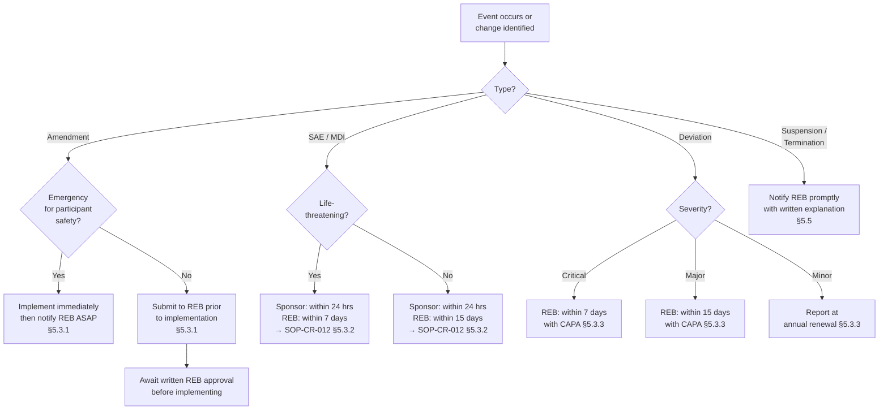

  

    <Badge color="gray">SOP-CR-026_01</Badge>
    <Badge color="gray">Version 01</Badge>
    <Badge color="green">Effective 01 May 2025</Badge>
    <Badge color="blue">All levels</Badge>
  

  <button className="ri-print-btn" onClick={() => window.print()}>Print / Save PDF</button>

Reviewed by Dr. Louise Pilote, Director of Clinical Research, RI-MUHC.
Approved by Gilbert Tordjman, Chief Operating and Development Officer, RI-MUHC.
Signed copy on file — download the PDF for the approved version with signatures.

---

<Warning>
**Controlled document.** Always refer to this page for the current version. Do not rely on downloaded or printed copies. Reading this page does not fulfil the SOP training requirement — use the SOP Reader on TalentLMS.
</Warning>

## Key points

- Submit **amendments** to the MUHC REB via <Tooltip tip="The RI-MUHC's electronic study submission and management platform. All studies requiring MUHC Authorization are submitted through Nagano." headline="Nagano (RI-MUHC)" cta="Full definition" href="/kb/glossary#nagano">Nagano</Tooltip> **before** implementing any changes, except for emergency deviations to protect participant safety (implement immediately, then notify REB ASAP). Do not implement until written REB approval **and** Sponsor's Go Letter are received.
- **Protocol deviations** are categorized as Minor (no immediate risk, may be reported annually at Continuing Review), Major (may result in health risk or data invalidity — report within 15 days), or Critical (fatal/life-threatening/unsafe conditions — report within 7 days). All major and critical deviations require a <Tooltip tip="Actions taken to resolve a compliance issue and prevent recurrence: identify, correct, prevent." headline="Corrective and Preventive Action (CAPA)" cta="Full definition" href="/kb/glossary#capa">CAPA</Tooltip> and must be sent to QAclinicalresearch@muhc.mcgill.ca.
- **SAEs and MDIs** that are unexpected, possibly related to <Tooltip tip="A drug, medical device, or natural health product being tested or used as a reference in a clinical trial." headline="Investigational Product (IP)" cta="Full definition" href="/kb/glossary#ip">IP</Tooltip> or study conduct, and pose greater risk of harm must be reported to the REB within **7 days** (life-threatening) or **15 days** (all other). Always remove participant nominative information; use participant study number only → [SOP-CR-012](/sops/cr-012), [SOP-CR-024](/sops/cr-024).
- **Other reportable events** include: interim analysis results, unexpected <Tooltip tip="Any untoward medical occurrence in a participant, whether or not related to the investigational product." headline="Adverse Event (AE)" cta="Full definition" href="/kb/glossary#ae">AE</Tooltip> frequency/severity, regulatory labeling changes, unanticipated problems, privacy breaches, <Tooltip tip="Independent committee that reviews interim safety and efficacy data and recommends whether to continue, modify, or stop the study." headline="Data Safety Monitoring Board (DSMB)" cta="Full definition" href="/kb/glossary#dsmb">DSMB</Tooltip> reports, and audit/inspection findings relevant to participant safety.
- Report **study completion** to the REB within 30 days of the <Tooltip tip="Final monitoring visit to verify all study closure requirements have been addressed before database lock." headline="Close-Out Visit (COV)" cta="Full definition" href="/kb/glossary#cov">Close-Out visit</Tooltip>. Once the study status is "Closed" in Nagano, no further submissions are permitted; use the Discussion feature for any subsequent documents.
- If the REB **suspends or terminates** ethics approval, no further study activities can take place (other than submission of amendments or reportable events) until corrective actions are completed to the REB's satisfaction.
- Sponsor-Investigators are responsible for maintaining public trial registry records (e.g., clinicaltrials.gov) throughout the study. Ensure MUHC-RIMUHC is entered as "Sponsor" for insurance purposes; the Sponsor-Investigator is the "Responsible Party."
- **Multi-centrique studies:** each Quebec site reports its own events to the MUHC REB (if lead) via Nagano. For sites without Nagano access, the MUHC Sponsor-Investigator submits on their behalf.

## 1 · Purpose {#purpose}

This Standard Operating Procedure (SOP) describes the required
communication for Ongoing Study Submission between the Sponsor-Investigator
or Qualified Investigator (QI) / Principal Investigator (PI) and the MUHC
Research Ethics Board (REB) and feasibility reviewers throughout the duration of
human research studies. It also describes the upkeep of the web-accessible
registration of the study. For Initial and Annual Continuing Review and initial
study registration, refer to SOP-CR-007.

---

## 2 · Scope {#scope}

This procedure concerns the research community (employees, investigators,
sponsor-investigators, physicians, management, consultants, students,
volunteers or other persons) involved in the ongoing study submission process.
Ongoing REB review must continue after Initial REB review (and between annual
Continuing Reviews) to obtain approval/acknowledgment of any new information
that might affect the rights, safety and well-being of research participants and/or
for which a preventative or corrective action is possible. This includes
amendments, reportable events and relevant reports during the course of a
human research study. This ongoing review ensures participant rights, safety and
well-being.

             SOP-CR-026_01_Ongoing REB Review, Reportable Events, Suspension/Termination and Registry Updating Page 1 of 17

This procedure also concerns research team members who are updating their
publicly accessible study registration.

---

## 3 · Responsibilities {#responsibilities}

The **Sponsor** or **Sponsor-Investigator** is responsible for ensuring that all study document amendments and safety information are promptly distributed to investigators for REB approval prior to implementation, and that all reportable events have been reported by the QI/PI to the REB.

The **Sponsor-Investigator or QI/PI** is responsible for ensuring that all updated information required for ongoing study approval is forwarded to the REB in a timely manner, and that all reportable events (including reportable deviations and SAEs) are submitted to the REB within applicable timelines.

Tasks required for effective communication may be delegated, but the responsibility to ensure compliance with this SOP and the REB policies and procedures rests with the Sponsor-Investigator or QI/PI.

The **Sponsor-Investigator** is responsible for both Sponsor and QI/PI responsibilities, as well as upkeep of study registration records (e.g., on clinicaltrials.gov).

---

## 4 · Definitions {#definitions}

| Term | Definition |
|---|---|
| **Investigator** | Used throughout this document to refer to Sponsor-Investigator, QI, or PI. |
| **Sponsor** | Used throughout this document to refer to Sponsor or Sponsor-Investigator. |

---

## 5 · Procedure {#procedure}

### 5.1 Sponsor responsibilities regarding ongoing study submissions

**5.1.1** Sponsor responsibilities regarding ongoing regulatory submissions to Health Canada:
- Provide regulatory agencies (e.g., Health Canada) with <Tooltip tip="Application to Health Canada for authorization to conduct a drug trial under Division 5 of the Food and Drug Regulations." headline="Clinical Trial Application (CTA)" cta="Full definition" href="/kb/glossary#cta">CTA</Tooltip>-amendments or notifications where applicable → [SOP-CR-018](/sops/cr-018), [SOP-CR-023](/sops/cr-023), [SOP-CR-024](/sops/cr-024). Obtain written approval from Health Canada, file in the <Tooltip tip="The sponsor's collection of documentation demonstrating compliance across all study sites." headline="Trial Master File (TMF)" cta="Full definition" href="/kb/glossary#tmf">TMF</Tooltip>, and forward a copy of the <Tooltip tip="Letter from Health Canada confirming a CTA is satisfactory and authorizing the sponsor to proceed." headline="No Objection Letter (NOL)" cta="Full definition" href="/kb/glossary#nol">NOL</Tooltip>/NOA/<Tooltip tip="Health Canada authorization to conduct a clinical investigation of a medical device. The device equivalent of a CTA." headline="Investigational Testing Authorization (ITA)" cta="Full definition" href="/kb/glossary#ita">ITA</Tooltip> to investigators to file in their ISFs.
- Provide regulatory agencies with all reportable SAEs and reportable Medical Device Incidents within required timelines → [SOP-CR-012](/sops/cr-012).

**5.1.2** Sponsor responsibilities regarding oversight of ongoing REB submissions:
- Provide investigators with all amendments/revisions to study documents in a timely fashion and request that the Investigator sign/date the amendments and obtain REB approval/acknowledgment within 30 days of receipt. Where applicable, provide the site with a Go Letter for an amendment.
- Provide investigators with all external SUSARs or MDI reports in a timely fashion and request that the Investigator document their review and distribution to team members and to the REB (where applicable) within the required timelines → [SOP-CR-012](/sops/cr-012).
- Ensure that all reportable protocol/<Tooltip tip="International standard for design, conduct, monitoring, recording, and reporting of clinical studies." headline="Good Clinical Practice (GCP)" cta="Full definition" href="/kb/glossary#gcp">GCP</Tooltip> deviations are reported to the REB by the site in a timely fashion per REB SOPs.

**5.1.3** Collect documentation of Investigator oversight and file in the Trial Master File (TMF):
- Documentation of Investigator's amendment review (e.g., protocol or <Tooltip tip="Compilation of clinical and nonclinical data on the investigational product relevant to the study." headline="Investigator's Brochure (IB)" cta="Full definition" href="/kb/glossary#ib">IB</Tooltip> amendment signature page)
- Documented and dated REB approvals of any amendments and submission forms
- Copy of modifications requested by the REB before approval and the date approval was given
- Documentation and dates of any REB re-approvals and any withdrawals or suspensions of study approval

**5.1.4** Provide investigators with an <Tooltip tip="An adverse event meeting seriousness criteria: death, life-threatening, hospitalization, disability, or congenital anomaly." headline="Serious Adverse Event (SAE)" cta="Full definition" href="/kb/glossary#sae">SAE</Tooltip> reporting process and tools (e.g., SAE report templates). Collect all SAEs from sites → [SOP-CR-012](/sops/cr-012) for a report template.

**5.1.5** Expedite <Tooltip tip="Suspected Unexpected Serious Adverse Reaction — unexpected in nature, severity, or frequency; must be reported to Health Canada and the REB." headline="SUSAR" cta="Full definition" href="/kb/glossary#susar">SUSAR</Tooltip>/MDI reports and document Investigator oversight throughout the study:
- Expedite reporting to all concerned investigators and regulatory authorities of all adverse events/incidents that are serious, unexpected, and possibly/probably/definitely related to the <Tooltip tip="A drug, medical device, or natural health product being tested or used as a reference in a clinical trial." headline="Investigational Product (IP)" cta="Full definition" href="/kb/glossary#ip">IP</Tooltip>, in compliance with ICH Guidelines for Clinical Safety Data Management or ISO 14155 GCP.
- Ensure that investigators report all reportable SUSARs or MDIs to their respective REBs per their institutional guidelines.
- Ensure that the Investigator has a written process to review and distribute SUSAR/MDI reports to study team members.

**5.1.6** Document any revisions to study agreements (e.g., changes in duties transferred to/from a CRO or ARO).

**5.1.7** Throughout the trial, demonstrate overall study oversight with emphasis on quality control measures per ICH-GCP/ISO-GCP:
- Conduct QC of all amended and added documents; file all essential documents in the TMF per ICH-GCP section 8 / ISO-GCP annex E.
- Ensure the study is monitored to confirm all investigators conduct the trial in strict compliance with the most recent REB-approved protocol.
- Update study information on the publicly accessible registry (e.g., clinicaltrials.gov).

### 5.2 Investigator responsibilities regarding ongoing REB submissions

**5.2.1** If the study is regulated by Health Canada, obtain any amendments and revisions to study documents as well as the associated HC NOL/NOA/ITA approval letter from the Sponsor. For each protocol amendment, there should be an NOL/NOA/ITA approval for the CTA-A or documentation of a CTA-N notification, filed in the <Tooltip tip="The QI's collection of documentation demonstrating compliance, study integrity, and participant safety." headline="Investigator Site File (ISF)" cta="Full definition" href="/kb/glossary#isf">ISF</Tooltip>.

**5.2.2** For any human research study (regulated by HC or not), submit any revisions/amendments to a previously approved study to the MUHC REB (e.g., revised protocol, IB/PM) and to the appropriate MUHC/RI-MUHC department where applicable (e.g., pharmacy, laboratory). If applicable, submit an addendum to the Pharmacy Agreement or Laboratory Agreement for approval.

**5.2.3** Do not implement any deviation from the approved protocol without prior agreement by the Sponsor and REB approval, except:
- Where necessary to eliminate immediate hazard(s) to participants; or
- For administrative/logistical changes (minor grammar, rephrasing, punctuation, small editorial changes).

All protocol deviations (minor, major, and critical) must be assessed, addressed, and documented on the Protocol/GCP/SOP Deviation Log (Appendix 1). In the event of a public health emergency where protocol deviation is necessary, follow the most recent MUHC and RI-MUHC guidelines.

**5.2.4** Submit to the Sponsor and REB all updates and information that impact or may impact the conduct of the study, including changes significantly affecting research efficacy, data integrity, or the rights, safety, and well-being of participants. File all approvals/acknowledgments in the ISF.

**5.2.5** Inform the Sponsor and REB of study completion, suspension, or termination:
- Inform the REB if the Sponsor completes, terminates, or suspends a trial; provide a detailed written explanation. File all communication in the ISF.
- Inform the Sponsor if the REB terminates or suspends a trial; provide a detailed written explanation. Document and file suspensions of recruitment in the ISF.
- → [SOP-CR-016](/sops/cr-016) for Study Close-Out.

**5.2.6** Update the ISF with printed copies of regulatory and REB approvals, acknowledgments, and correspondence until the MUHC/RI-MUHC has obtained a compliant electronic document management system.

### 5.3 Ongoing study submission review of an approved study

**5.3.1** Over the course of the study, the Investigator must inform the REB about the following events via the appropriate <Tooltip tip="The RI-MUHC's electronic study submission and management platform. All studies requiring MUHC Authorization are submitted through Nagano." headline="Nagano (RI-MUHC)" cta="Full definition" href="/kb/glossary#nagano">Nagano</Tooltip> forms, **prior to their implementation**:
- Any significant protocol changes or deviations (e.g., deliberate action to avert immediate hazard, post-facto dosing error): major and critical deviations report immediately; minor deviations report annually
- Amendments to an approved study: modifications to consent forms/participant materials/advertising, IB/PM modifications, change of QI/PI or Sponsor (requiring revised contract), other revisions (procedural changes affecting participant risk, sample size changes, dropping of a study arm, change in IP exposure, other changes affecting scientific validity)
- Newly translated study documents (e.g., revised ICFs, participant materials)
- SAE or MDI that is unexpected and at least possibly related to IP or study conduct and poses greater risk of harm to participants → [SOP-CR-012](/sops/cr-012), [SOP-CR-024](/sops/cr-024)
- Premature participant withdrawal from the study
- <Tooltip tip="Independent committee that reviews interim safety and efficacy data and recommends whether to continue, modify, or stop the study." headline="Data Safety Monitoring Board (DSMB)" cta="Full definition" href="/kb/glossary#dsmb">DSMB</Tooltip> reports
- Privacy breaches involving participants
- Complaints regarding study conduct
- Change in study status (e.g., Sponsor or Investigator places study on hold)
- Additional information and/or miscellaneous communications
- Study completion/suspension/termination
- Request to convert to a Quebec multi-centrique study or add a new <Tooltip tip="Quebec's public health and social services network (Réseau de la santé et des services sociaux), including the RI-MUHC." headline="RSSS" cta="Full definition" href="/kb/glossary#rsss">RSSS</Tooltip> site
- Changes to a multi-centrique study reported by an external site

**Do not implement any changes** until REB written approval and the Sponsor's Go Letter/confirmation (if applicable) are received, unless under emergency circumstances for participant safety. Notify the Sponsor-Investigator and REB ASAP afterwards.

**5.3.2** SAE/MDI reporting to the MUHC REB:

The Investigator must report to the REB:
- Any serious and unexpected adverse reaction or MDI involving an MUHC/RI-MUHC participant that is at least possibly related to participation in the study and poses greater risk of harm. Always remove all participant identifiers — use participant enrollment number only. Report to the Sponsor within 24 hours and to the REB within 7 days (life-threatening) or 15 days of becoming aware → [SOP-CR-012](/sops/cr-012), [SOP-CR-024](/sops/cr-024).
- For multi-centrique Quebec studies where MUHC is the lead REB: any SUSAR or MDI report involving a participant at any Quebec site, at least possibly related to study participation and posing greater risk. Each participating site with Nagano access submits their own SAEs directly. For external sites without Nagano access, the MUHC research team submits on their behalf.
- For multicentre studies (other provinces/countries): any external SUSAR or MDI that is at least possibly related to participation and would require a protocol amendment.
- Any new information affecting participant safety or their willingness to continue — also reflected in an amended <Tooltip tip="The written document providing the participant with information essential to making an informed decision. Both parties must sign." headline="Informed Consent Form (ICF)" cta="Full definition" href="/kb/glossary#icf">ICF</Tooltip>.

The Investigator must maintain a written process describing how documents requiring medical oversight (e.g., SUSARs) are reviewed by the Investigator and distributed to team members.

**5.3.3** Protocol and SOP/GCP deviations:

Any excursion from the current REB-approved study documents, RI-MUHC SOPs, ICH-GCP, or ISO-GCP is considered a deviation. Deviations are categorized as:

| Category | Definition |
|---|---|
| **Minor** | A deviation indicating a deficiency not classified as critical or major. Does not present immediate health risk. Report at annual Continuing Review. |
| **Major** | A marked deviation or deficiency that may result in undue health risks to participants or others, or could invalidate data. Report within 15 days. |
| **Critical** | Situation resulting in fatal, life-threatening, or unsafe conditions for enrolled participants, or presenting an immediate/latent undue risk to participant rights, health, and safety. Also includes unauthorized trials, adulteration, misrepresentation, and falsification of records. Report within 7 days. |

All protocol deviations observed by the site (intentional or not) or detected by a monitor, auditor, or inspector must be documented on the Protocol/GCP/SOP Deviation Log (Appendix 1), assessed for trends, and addressed with <Tooltip tip="Actions taken to resolve a compliance issue and prevent recurrence: identify, correct, prevent." headline="Corrective and Preventive Action (CAPA)" cta="Full definition" href="/kb/glossary#capa">corrective and preventive action</Tooltip> as applicable.

All major and critical deviations must have a CAPA implemented and captured on the CAPA Form (Appendix 2). The CAPA number must be entered on both the Deviation Log and the CAPA Form.

For major and critical deviations:
- Report to the evaluating REB within 7 days (life-threatening) or 15 days of becoming aware of the event, along with CAPA implemented. Ensure no participant nominative information appears (study number only).
- Submit the appropriate form to the REB via Nagano.
- Send the CAPA form to **QAclinicalresearch@muhc.mcgill.ca** for trend tracking.
- Inform the Sponsor/Sponsor-Investigator of all deviations.

If the deviation introduces new information that may affect a participant's willingness to continue, all participants must be informed and the REB may require renewed informed consent → MUHC REB SOP 405.

All minor deviations may be collected and submitted to the REB at the time of annual Continuing Review → [SOP-CR-007](/sops/cr-007).

**5.3.4** Other reportable events and information:

The Investigator must report to the REB any change in risks or benefits to participants, including:
- An interim analysis indicating an unexpected rate of response to treatment
- Data indicating a particular <Tooltip tip="Any untoward medical occurrence in a participant, whether or not related to the investigational product." headline="Adverse Event (AE)" cta="Full definition" href="/kb/glossary#ae">AE</Tooltip> is more severe or more frequent than expected
- Other published research indicating that an arm of the research is of no therapeutic value
- A change in Health Canada or FDA safety labeling, approval status, or withdrawal from market of a drug, device, NHP, genetic therapy, or biologic used in the project
- Any unanticipated problem or other event significantly impacting the conduct of research at the site (e.g., non-compliance concerns, institutional feasibility issues)
- Inspection or audit report observations relevant to the safety and well-being of participants (including findings from HC inspections, FDA audits, Sponsor audits, or internal RI-MUHC <Tooltip tip="All planned and systematic actions to ensure trial data are generated, documented, and reported in compliance with GCP and SOPs." headline="Quality Assurance (QA)" cta="Full definition" href="/kb/glossary#qa">QA</Tooltip> audits)

**5.3.5** Under certain circumstances, **delegated REB review** may be conducted in lieu of full Board review → MUHC REB SOP 402.

### 5.4 Multi-centrique research in Quebec and multi-center research across Canada

**5.4.1** Multi-centrique research involves more than one QI/PI from the Quebec public health care network conducting the study under the same Sponsor/Sponsor-Investigator. For REB reporting flowchart, refer to the [MUHC CAE multicentre study page](https://muhc.ca/cae/multicentre-study).

**5.4.2** Each QI/PI is responsible for submissions of reportable events to the evaluating REB per this SOP.

**5.4.3** Requests to convert a study into a multi-centrique project or to add at least one site must be done via Nagano using the appropriate form.

**5.4.4** If an external multi-centrique QI/PI does not have Nagano access, they must complete the relevant PDF form (available on the [CAE multicentre study page](https://muhc.ca/cae/multicentre-study)), and the MUHC research team must submit these through Nagano. This applies to:
- Amendment requests for external sites
- Other notifications from external sites
- SAEs/SUSARs/MDIs occurring at external sites under MUHC REB jurisdiction
- Deviations, breaches of confidentiality, complaints at external sites
- Annual renewal requests for external sites
- Notification of study closure, suspension, termination, or interruption at external sites

**5.4.5** Multi-centrique reportable events — Quebec sites under MUHC REB study review:
- Each Quebec site enters the reportable event on their individual log (SAE log, Deviation log)
- Each site notifies the Sponsor/Sponsor-Investigator ASAP (within 24 hrs for SAE/serious MDI or protocol violation)
- Sponsor/Sponsor-Investigator confirms the reportable event (correspondence filed in ISF and TMF)
- All external Quebec sites with Nagano access report directly to the MUHC REB (if lead)
- For external Quebec sites without Nagano access, the lead MUHC Sponsor-Investigator reports on their behalf within 7 days (life-threatening) or 15 days of becoming aware

**5.4.6** MUHC Sponsor-Investigator studies with multi-center reportable events — Canadian sites other than Quebec:
- Each Canadian site enters the reportable event on their individual log
- Each site notifies the Sponsor/Sponsor-Investigator ASAP (within 24 hrs for SAE/serious MDI or protocol violation)
- Sponsor/Sponsor-Investigator confirms the event (correspondence filed in ISF and TMF)
- Each Canadian site reports their individual reportable event to their local REB

**5.4.7** The Sponsor/Sponsor-Investigator must conduct a risk analysis for each deviation identified and rate them according to impact on the study and probability of reoccurrence. Track the number and type of deviations across all sites to identify trends that may trigger a protocol amendment.

### 5.5 Suspension or termination of REB-approved studies

**5.5.1** The Investigator must promptly notify the REB and the organization of any suspensions or terminations by the Sponsor, the Investigator, or health authorities, and provide a detailed written explanation. File all correspondence in the ISF/TMF.

**5.5.2** The REB may suspend or terminate a study (or suspend recruitment) if any of the following concerns are raised:
- Continuation does not permit an acceptable potential risk/benefit ratio
- Research is not being conducted per the REB-approved protocol or REB requirements
- Research is associated with unexpected serious harm to participants
- Falsification of research records or data
- Failure to comply with prior conditions imposed by the REB
- Failure to apply for annual renewal prior to expiry (entails de facto suspension); failure to submit within 30 days following expiry may result in termination
- Repeated or deliberate failure to properly obtain or document informed consent
- Repeated or deliberate failure to limit IP administration to participants under the researcher's supervision
- Repeated or deliberate failure to comply with conditions placed by the REB, Sponsor, or regulatory agencies
- Repeated or deliberate failure to obtain prior REB review and approval of amendments
- Repeated or deliberate failure to maintain accurate research records or submit required reportable events

**5.5.3** When the REB suspends or terminates ethics approval, no further study activities can take place other than submission of amendments or reportable events.

**5.5.4** If REB approval has been suspended, the suspension may be lifted after corrective and preventive actions are completed to the satisfaction of the REB and other third parties involved → MUHC REB SOP 407.

### 5.6 Completion of a clinical study

**5.6.1** Once study close-out has occurred per [SOP-CR-016](/sops/cr-016), submit a Closure of Research Project form to the REB when: there are no further participants on study, all data collection is complete, and the Sponsor's Close-Out report has been completed.

**5.6.2** The QI/PI must report the change in study status to the REB in a timely fashion (ideally within 30 days of the <Tooltip tip="Final monitoring visit to verify all study closure requirements have been addressed before database lock." headline="Close-Out Visit (COV)" cta="Full definition" href="/kb/glossary#cov">Close-Out visit</Tooltip>).

**5.6.3** Once the REB has reviewed the submission, the QI/PI will receive a letter of acknowledgement from the REB.

**5.6.4** Once the study status is changed to "Closed" in Nagano, no further submissions are permitted. Additional relevant documents may still be submitted after study closure through the Nagano Discussion feature.

### 5.7 REB notification timelines

| REB notification of… | Time delay (calendar days) | Follow-up required |
|---|---|---|
| **Amendments — undertaken immediately to protect participants** | Immediately | Submit and obtain REB review and approval of amendments. File approvals and documentation in the ISF. |
| **All other amendments** | Prior to introducing any change | Submit and obtain REB review and approval prior to initiation. File approvals in the ISF and implement amendment at next participant visit. |
| **Reportable events — death and/or life-threatening reactions** | Within 7 days of becoming aware | Submit a detailed report containing an analysis of the event, consequences, and corrective measures taken within 8 days of the first report. File all correspondence and acknowledgments in the ISF. |
| **All other reportable events** | Within 15 days of becoming aware | Submit and file all correspondence and acknowledgments in the ISF. |
| **New information adversely affecting participant safety or study conduct** | Within 15 days of becoming aware | Submit and file all correspondence and acknowledgments in the ISF. |
| **Scheduled, routine, or random reports without identified impact on participant safety or required changes** | At time of annual renewal | Submit and file REB acknowledgement letter in the ISF. |

<Note>
REB-SOP 501 addresses REB review during publicly declared emergencies.
</Note>

### 5.8 Submission of complaints or breaches of privacy to the REB

**5.8.1** The QI/PI is responsible for notifying the REB of any complaints related to research for which they are responsible, including those under investigation by the MUHC ombudsman.

**5.8.2** The QI/PI is responsible for notifying the REB of any unauthorized collection, use, or disclosure of personal information.

**5.8.3** For additional information on submitting complaints or breaches of privacy to the REB → MUHC REB SOP 405 and [SOP-CR-019](/sops/cr-019).

### 5.9 Informing the REB of inspections and audits

**5.9.1** In addition to internal RI-MUHC QA audits, external bodies (Health Canada, FDA, EMA, Sponsor, or funding agencies such as CIHR) may conduct inspections or audits. The Sponsor-Investigator or Investigator is responsible for notifying the REB of any planned audits or inspections of research projects overseen by the REB → MUHC REB SOP 701. See also [SOP-CR-017](/sops/cr-017).

### 5.10 Public clinical trial registration updating by Sponsor-Investigators

**5.10.1** All approved public web-based registries (e.g., clinicaltrials.gov) require appropriate updating for the duration of the study. The Sponsor-Investigator (named Principal Investigator on the US DHHS site) responsible for registering the study is also responsible for the upkeep and all approvals of the record.

**5.10.2** For insurance purposes, in the clinicaltrials.gov record, **MUHC-RIMUHC** must be entered for "Sponsor" → [SOP-CR-007](/sops/cr-007).

**5.10.3** Only one account is opened per Sponsor-Investigator. If a Sponsor-Investigator is unable to approve their own record in clinicaltrials.gov, the set-up was not completed correctly. Revise the set-up and indicate that the PI is the "Responsible Party" (not the Sponsor/MUHC-RIMUHC).

**5.10.4** Other requirements:
- To publish the results of an RCT in member journals of the International Committee of Medical Journal Editors (ICMJE), the trial must be registered with an ICMJE-approved electronic registry.
- The WHO requires RCTs (Phase I to Phase IV) to be registered.
- CIHR requires registration of clinical trials as a condition of funding.

---

## Appendices {#appendices}

<Info>
Printable appendix templates are available for download below where linked. For the complete collection, see [SOP Appendices and Templates](/sops/appendices).
</Info>

- [Appendix 1 — Protocol/GCP/SOP Deviation Log](https://portal.rimuhc.ca/pls/apex/MUHC2.download_my_file?p_file=249508821981851318)
- [Appendix 2 — Corrective and Preventive Action (CAPA) Form](https://portal.rimuhc.ca/pls/apex/MUHC2.download_my_file?p_file=249510176054892893)

---

## References {#references}

- N2 Network SOP007_10
- MUHC Centre of Applied Ethics (CAE) SOPs
- TCPS2 (2022)
- ICH-GCP E6(R2)
- ICH Guideline for Clinical Safety Data Management: Definitions and Standards for Expedited Reporting
- ICH E8(R1), General Considerations for Clinical Studies (October 2021)
- ISO 14155:2020 GCP
- Health Canada, Good Clinical Practice: Consolidated Guideline (ICH Topic E6)
- Government of Canada, Medical Device Regulations, SOR/98-282 (as amended)
- Government of Canada, Natural Health Products Regulations, SOR/2003-196 (as amended)
- Health Canada, Food and Drug Regulations, Part C, Division 5
- Health Canada GUI-0100: Part C, Division 5
- MUHC REB Policy on the Research Ethics Board

---

<h2>Revision history</h2>

| Version | Date | Summary |
|---|---|---|
| SOP-CR-026_01 | 01 May 2025 | New SOP. Content split from [SOP-CR-007](/sops/cr-007) and updated with N2 SOP007_10 information. Clarifications and additions include sections 5.1.1–5.1.3, 5.1.5, 5.1.7, 5.2.1–5.2.5, 5.3.1–5.4.3, 5.5.2–5.6.4, 5.7, 5.9, and 5.10. Added Appendix 2 (CAPA Form). |
