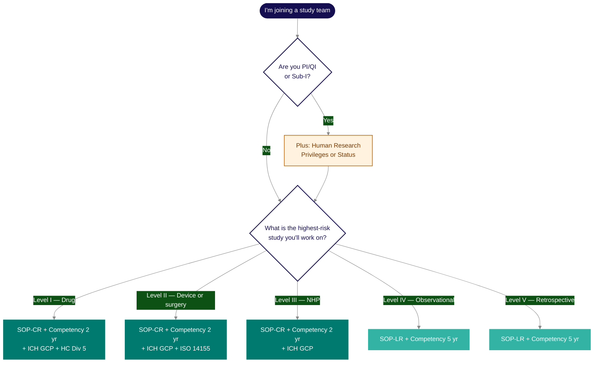

Everyone involved in clinical research at the RI-MUHC must hold current compliance credentials before a study can be activated. The specific training you need depends on the risk level of your highest-risk study — and all credentials must remain valid for the foreseeable duration of the study. This page covers who must comply, what each study level requires, how the two institutional compliance components work, and where to find your records.

## Who must comply — and who cannot participate

All individuals listed on a study's **Task Delegation Log** must hold current compliance credentials appropriate to their role and the risk level of the study. This includes the PI, QI, Sub-Investigators, research coordinators, research nurses, and any other team member performing study activities.

<Note>
  **The 90-day rule.** At the time of study submission, no certificate or status may be within 90 days of expiry. Credentials must also remain valid for the foreseeable duration of the study. A credential nearing expiration must be renewed before submission to be eligible for feasibility review.
</Note>

**Who cannot perform study tasks.** The following individuals may not perform clinical research procedures involving study participants or participate in study submission at the RI-MUHC:

- **Volunteers**
- **Students without valid academic insurance** (i.e. not covered under a nursing or medical program's institutional policy)
- **Non-affiliated individuals** not employed by or appointed at the RI-MUHC or the MUHC

Students covered by academic insurance may participate, including participant interaction, provided they meet training requirements.

For researchers acting as PI, QI, or Sub-Investigator, there is an additional prerequisite beyond training: **Human Research Privileges or Human Researcher Status**. See [Human Research Privileges and Researcher Status](#human-research-privileges-and-researcher-status) below for details.

## Training requirements by study level

The table below shows all mandatory training for each level. Your training level is determined by the highest-risk study you are involved in — higher-level certification covers all lower levels.

### What training do I need?

Use this decision tree to self-route. Refer to the full matrix below for the complete picture.

### Full requirements matrix

| Requirement | Level I — Drug studies | Level II — Medical device & surgery | Level III — Natural health products | Level IV — Prospective observational | Level V — Retrospective |
|---|---|---|---|---|---|
| **SOP Reader** (TalentLMS) — No expiry; only resets when that SOP is revised | Required | Required | Required | Required | Required |
| **Competency Assessment** (TalentLMS) — 2 yr (Levels I–III) · 5 yr (Levels IV–V) | 2 yr | 2 yr | 2 yr | 5 yr | 5 yr |
| **ICH E6(R3) GCP** — every 2 years | Required | Required | — | — | — |
| **Health Canada Division 5** — every 2 years | Required | — | — | — | — |
| **ISO 14155 GCP for Medical Devices** — self-train via ISO, every 2 years | — | Required | — | — | — |
| SOPs covered | 33 SOPs (excl. CR-023, CR-024) | 33 SOPs (excl. CR-018, CR-010, CR-023) | 33 SOPs (excl. CR-018, CR-010, CR-024) | 18 LR SOPs | 9 LR SOPs |

_Drug studies (Level I) includes biologics, gene/cell therapies, blood products, vaccines, and radiopharmaceuticals. Level IV includes educational and non-invasive interventions (psychotherapy, physiotherapy, diet, exercise, massage). Level V includes studies using previously anonymized biobanked samples._

## Compliance paths

The certification cycle differs based on study risk level.

<CardGroup cols={2}>
  <Card title="SOP-CR Path — Levels I, II, III" icon="flask">
    For higher-risk interventional studies (drug, device, NHP trials).

    **Cycle:** Competency Assessment → Certificate valid **2 years** → new Competency Assessment draw → repeat

    Requires Human Research Privileges or Researcher Status.
  </Card>
  <Card title="SOP-LR Path — Levels IV, V" icon="clipboard">
    For lower-risk observational studies (prospective observational, retrospective, secondary data analysis).

    **Cycle:** Competency Assessment → Certificate valid **5 years** → new Competency Assessment draw → repeat

    Human Research Privileges or Researcher Status accepted.
  </Card>
</CardGroup>

## SOP Reader

The SOP Reader is the first component of institutional compliance training. In TalentLMS, each SOP is a separate unit within the Reader course for your training level. You open the unit, read the SOP, and click to acknowledge completion. TalentLMS records the date and marks the unit complete. There is no quiz and no minimum reading time — the Reader is a reading acknowledgement record, not an assessment.

<Card title="Open TalentLMS to start the SOP Reader" icon="arrow-right-to-bracket" href="/apps/talentlms">
  Log in, find your SOP Reader course in the catalog, and begin reading and acknowledging SOPs for your training level.
</Card>

**No expiry.** Reader completion does not expire on a calendar schedule. Once you have read and acknowledged a unit, it stays complete indefinitely — unless that specific SOP is updated. When an SOP is revised, only the unit for that SOP resets. You re-read the updated version and re-acknowledge. All other units remain complete.

**Reading SOPs on the Clinical Research Hub does not satisfy the TalentLMS requirement.** The SOP hub on this site is a reference tool for day-to-day use. Your compliance record is tracked in TalentLMS only.

**The Reader is a prerequisite for the Competency Assessment.** All units for your level must be acknowledged before you can access the Assessment. If a unit has been reset due to an SOP update and not yet re-acknowledged, the Assessment will not be accessible.

## Competency Assessment

The Competency Assessment is the second component of institutional compliance training. It is a scenario-based quiz drawn from a shared question pool, testing practical application of SOP knowledge. Questions are organized by SOP and topic — each draw covers all major areas, but no two assessments are identical. Passing generates a compliance certificate valid for 2 or 5 years depending on your study level.

At renewal, you complete the Competency Assessment again — same format, new randomized draw from the same pool. There is no separate renewal quiz.

<Card title="Open TalentLMS to take the Competency Assessment" icon="arrow-right-to-bracket" href="/apps/talentlms">
  Log in and find the Competency Assessment for your training level. You must complete the SOP Reader first.
</Card>

There are two certification paths:

<CardGroup cols={2}>
  <Card title="SOP-CR Path — Levels I, II, III" icon="shield-check">
    For higher-risk interventional studies (drug, biologic, medical device, surgical intervention, natural health product trials).

    - Certificate valid **2 years**
    - Renewal: same assessment, new randomized draw
    - Requires Human Research Privileges for PI/QI/Sub-I roles
  </Card>
  <Card title="SOP-LR Path — Levels IV, V" icon="clipboard-check">
    For lower-risk observational studies (prospective observational, non-invasive interventions, educational studies, retrospective data analysis).

    - Certificate valid **5 years**
    - Renewal: same assessment, new randomized draw
    - Human Research Privileges or Researcher Status accepted
  </Card>
</CardGroup>

**Training level is based on your highest-risk study.** If you are conducting both a Level I drug study and a Level IV observational study, you must hold Level I certification. Higher-level certification covers all lower levels — you do not need separate certificates for each study type.

### Level transitions

**Upgrading** (e.g. from Level IV to Level I): you complete a new Competency Assessment at the higher level. The certification clock restarts at the full CR duration of 2 years. Your previous LR certificate is superseded.

**Downgrading** (e.g. from Level I to Level IV when you no longer conduct drug trials): your current CR certificate remains valid until its expiry date. At your next renewal, you are reassigned to the LR path and the clock restarts at the full LR duration of 5 years.

## External certifications

In addition to the SOP Reader and Competency Assessment, certain study levels require external certifications. These run on their own 2-year schedules and are not managed within TalentLMS.

<AccordionGroup>
  <Accordion title="ICH E6(R3) GCP — required for Levels I and II">
    The RI-MUHC holds an institutional licence with the CITI Program, giving affiliated researchers free access to GCP training.

    - **New to GCP:** Take the full course — _Good Clinical Practice (GCP) — Canada_
    - **Renewing:** Take the refresher — _Good Clinical Practice (GCP) — Canada Refresher_
    - **Renewal:** Every 2 years

    Health Canada adopted ICH E6(R3) effective April 1, 2026. If you completed GCP before October 27, 2025, your R2 certificate has been reset — you must complete the R3 version. If you completed GCP after October 27, 2025, you have already completed R3.

    See [External Certifications](/training/external-certifications) for CITI registration instructions.
  </Accordion>
  <Accordion title="Health Canada Division 5 — required for Level I only">
    Required for drug, biologic, vaccine, and advanced therapy studies. Available via the RI-MUHC CITI institutional licence at no cost.

    - **Course:** _Health Canada Part C Division 5 — Drugs for Clinical Trials_
    - **Renewal:** Every 2 years

    Based on GUI-0100. Covers Health Canada's regulations for clinical trials involving drugs under Part C, Division 5 of the Food and Drug Regulations.
  </Accordion>
  <Accordion title="ISO 14155:2020 GCP for Medical Devices — required for Level II only">
    Required for investigational medical device and surgical studies. ISO 14155 training is not available through CITI — teams must self-train on the copy-controlled ISO document purchased via iso.org.

    - **Provider:** Self-train via ISO (iso.org)
    - **Renewal:** Every 2 years

    CITI ICH-GCP is accepted in lieu of ISO-GCP where ISO training is unavailable. Health Canada inspectors expect ISO-GCP training for device studies.
  </Accordion>
</AccordionGroup>

GCP and Health Canada Division 5 certificates from providers other than CITI are accepted if the provider appears on the **TransCelerate list of recognized providers**. Contact QA to confirm equivalency before submitting: [QAClinicalResearch@muhc.mcgill.ca](mailto:QAClinicalResearch@muhc.mcgill.ca). Note: even if your certificate is valid for 3 years, the RI-MUHC will recognize it for 2 years only.

## Accessing and downloading your training records

Training records are stored in three places depending on the credential type:

- **SOP Reader, Competency Assessment, and Privileges/Status** — stored in TalentLMS. Certificates can be downloaded directly from your profile.
- **Researcher Administrative Profile** — the RI-MUHC Portal displays your Privileges/Status and SOP records (view only — certificates cannot be downloaded here).
- **GCP and Health Canada Division 5** — stored by your external training provider (e.g., CITI). These certificates are not in TalentLMS.

<Card title="TalentLMS — Access, Certificates, and Training Records" icon="laptop" href="/apps/talentlms">
  How to log in, find your courses, download compliance certificates, and view your training record.
</Card>

## Human Research Privileges and Researcher Status

Before you can lead or co-lead a clinical research study at the RI-MUHC, you must hold either Human Research Privileges or Human Researcher Status at the MUHC. This is an MSSS requirement for all Quebec hospitals — it is not specific to the RI-MUHC. Holding an RI-MUHC appointment as a Scientist or Investigator does not satisfy this requirement.

### Which credential do you need?

<CardGroup cols={2}>
  <Card title="Human Research Privileges" icon="user-doctor">
    **For CPDP members** — physicians and dentists (members of the Conseil des médecins, dentistes et pharmaciens).

    Required to lead research involving medical oversight:

    - Drug and biologic clinical trials — Qualified Investigator role under Health Canada
    - Protocols involving acts reserved to physicians under Quebec's _Loi médicale_ (prescribing, invasive procedures, medical diagnosis)
    - Any study requiring a physician-as-QI under federal law
  </Card>
  <Card title="Human Researcher Status" icon="flask">
    **For non-CPDP researchers** — PhDs, nurses, physiotherapists, psychologists, radiotherapists, and others without medical prescribing authority.

    For research that does not require medical oversight:

    - Prospective observational studies, surveys, and questionnaire-based research
    - Retrospective and secondary data analysis
    - Behavioural and educational interventions
    - NHP studies not involving reserved medical acts
  </Card>
</CardGroup>

**Pharmacist exception.** Although pharmacists are CPDP members, they are not eligible for Human Research Privileges under MSSS and MUHC frameworks. Pharmacists acting as PI or Sub-Investigator backup must obtain Human Researcher Status instead.

**Research personnel.** Team members on the Task Delegation Log — including fellows, residents, and medical students — cannot obtain Privileges or Researcher Status. These credentials are for independent study leadership (PI, QI, Sub-I as PI backup) only. Training is required for all team members regardless of eligibility for Privileges or Status.

### Validity and the 90-day rule

Privileges and Researcher Status are valid for **3 years**. The [90-day rule](#who-must-comply--and-who-cannot-participate) applies: at the time of study submission, your credential must not be within 90 days of expiry. A renewal reminder is sent three months before expiry — if you have active studies in Nagano, renew promptly. Lapsed credentials will prevent the Personne mandatée from issuing MUHC Authorization and may halt active studies.

QA requires that Privileges and Researcher Status remain valid for the foreseeable duration of the study, not only at the point of submission.

### How to apply

Submit your request through TalentLMS using the appropriate form. Requests are typically processed within **1–5 business days**.

<Steps>
  <Step title="Select the correct form in TalentLMS">
    Choose the form that matches your credential type:

    - [**Request Research Privileges**](https://english-rimuhc.talentlms.com/plus/catalog/courses/236) (course #236) — for CPDP members (physicians and dentists)
    - [**Request Researcher Status**](https://english-rimuhc.talentlms.com/plus/catalog/courses/235) (course #235) — for non-CPDP researchers
  </Step>
  <Step title="Complete and submit the form">
    Fill in the required information and submit. The Performance Office reviews your request and issues the credential.
  </Step>
  <Step title="Confirm your record">
    Once processed, your Privileges or Status will appear in your TalentLMS profile and in your Researcher Administrative Profile in the RI-MUHC Portal.
  </Step>
</Steps>

For questions about Privileges or Status, contact the Performance Office: [riprograms@muhc.mcgill.ca](mailto:riprograms@muhc.mcgill.ca)

<Warning>
  Do not wait until submission to apply. Processing takes 1–5 business days, and your credential must be active and outside the 90-day window at the time of submission. Privileges or Status must be in place before you submit your study in Nagano — QA verifies this during feasibility review.
</Warning>
